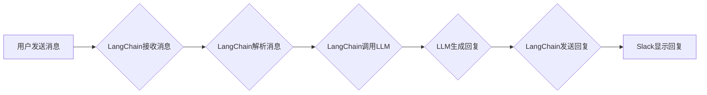

> LangChain, Slack, 应用配置, 聊天机器人, 自然语言处理, API

## 1. 背景介绍

在当今数字化时代，企业沟通和协作效率日益受到重视。Slack作为一款流行的企业即时通讯平台，为团队提供了便捷的沟通和协作工具。然而，传统的文本沟通方式有时难以满足复杂的需求，例如需要快速获取信息、进行智能化回复等。

LangChain是一个强大的开源框架，旨在简化开发基于大型语言模型（LLM）的应用程序的过程。它提供了一系列工具和组件，可以帮助开发者将LLM与其他数据源和应用程序集成，构建更智能、更强大的应用。

结合LangChain和Slack的优势，我们可以开发出功能强大的聊天机器人，为企业用户提供更智能、更便捷的沟通体验。例如，可以利用聊天机器人自动回复常见问题、整理会议纪要、生成工作报告等，从而提高工作效率和协作效率。

## 2. 核心概念与联系

### 2.1 LangChain

LangChain是一个开源框架，旨在简化开发基于大型语言模型（LLM）的应用程序的过程。它提供了一系列工具和组件，可以帮助开发者将LLM与其他数据源和应用程序集成，构建更智能、更强大的应用。

LangChain的核心概念包括：

* **模型（Model）：** 指的是用于处理自然语言的预训练模型，例如GPT-3、BERT等。
* **提示（Prompt）：** 指的是向模型输入的文本指令，用于引导模型生成特定类型的输出。
* **链（Chain）：** 指的是将多个组件组合在一起，形成一个完整的应用程序流程。
* **内存（Memory）：** 指的是用于存储和管理对话历史记录的组件，可以帮助模型理解上下文信息。
* **工具（Tool）：** 指的是可以与模型交互的外部应用程序，例如搜索引擎、数据库等。

### 2.2 Slack

Slack是一个流行的企业即时通讯平台，提供文本聊天、语音通话、视频会议等功能。Slack的API允许开发者将应用程序集成到Slack平台中，从而扩展Slack的功能。

### 2.3 LangChain与Slack的集成

通过LangChain和Slack的API，我们可以将LLM集成到Slack平台中，构建功能强大的聊天机器人。

**Mermaid 流程图**



## 3. 核心算法原理 & 具体操作步骤

### 3.1 算法原理概述

LangChain与Slack的集成主要基于以下算法原理：

* **自然语言理解（NLU）：** LangChain使用NLU模型解析用户发送的消息，识别出关键信息和意图。
* **对话管理（Dialogue Management）：** LangChain使用对话管理算法跟踪对话上下文，并根据用户意图生成相应的回复。
* **文本生成（Text Generation）：** LangChain使用LLM生成自然流畅的文本回复。

### 3.2 算法步骤详解

1. **用户发送消息：** 用户在Slack中发送消息给聊天机器人。
2. **LangChain接收消息：** LangChain接收用户发送的消息，并将其发送到NLU模型进行解析。
3. **LangChain解析消息：** NLU模型解析用户消息，识别出关键信息和意图。
4. **LangChain调用LLM：** LangChain根据NLU模型的解析结果，调用LLM生成相应的回复。
5. **LLM生成回复：** LLM根据提示和上下文信息，生成自然流畅的文本回复。
6. **LangChain发送回复：** LangChain将LLM生成的回复发送回Slack平台。
7. **Slack显示回复：** Slack平台将回复显示给用户。

### 3.3 算法优缺点

**优点：**

* **智能化回复：** 利用LLM的强大能力，可以生成更智能、更自然、更符合语境的回复。
* **自动化工作流程：** 可以自动化一些重复性的工作任务，例如回复常见问题、整理会议纪要等。
* **提高效率：** 可以帮助用户更快地获取信息、完成任务，提高工作效率。

**缺点：**

* **模型训练成本高：** 训练大型语言模型需要大量的计算资源和数据。
* **数据安全问题：** 需要谨慎处理用户数据，避免泄露隐私信息。
* **伦理问题：** 需要考虑LLM可能带来的伦理问题，例如生成虚假信息、歧视性回复等。

### 3.4 算法应用领域

* **客服机器人：** 自动回复用户常见问题，提高客服效率。
* **会议助手：** 自动记录会议纪要，生成会议总结报告。
* **项目管理工具：** 自动跟踪项目进度，提醒任务截止日期。
* **教育平台：** 提供个性化学习辅导，解答学生疑问。

## 4. 数学模型和公式 & 详细讲解 & 举例说明

### 4.1 数学模型构建

在LangChain中，LLM的输出可以看作是一个概率分布，表示每个单词出现的可能性。我们可以使用softmax函数将模型输出转换为概率分布：

$$
P(w_i | context) = \frac{exp(score(w_i, context))}{\sum_{j=1}^{V} exp(score(w_j, context))}
$$

其中：

* $P(w_i | context)$ 表示给定上下文信息 $context$ 时，单词 $w_i$ 出现在下一个位置的概率。
* $score(w_i, context)$ 表示单词 $w_i$ 与上下文信息 $context$ 的相似度得分。
* $V$ 表示词汇表的大小。

### 4.2 公式推导过程

softmax函数的推导过程如下：

1. 首先，我们需要将模型输出转换为一个实数向量，每个元素代表一个单词的得分。
2. 然后，我们使用指数函数将每个得分转换为正数，使得所有得分都大于0。
3. 最后，我们对所有得分进行归一化，使得所有概率之和等于1。

### 4.3 案例分析与讲解

假设我们有一个上下文信息为“今天天气真好”，我们需要预测下一个单词是什么。

如果模型输出的得分向量为：[0.2, 0.5, 0.3]，分别对应单词“阳光”、“晴朗”、“凉爽”，那么使用softmax函数计算出的概率分布为：

* $P(阳光 | 今天天气真好) = \frac{exp(0.2)}{exp(0.2) + exp(0.5) + exp(0.3)} \approx 0.25$
* $P(晴朗 | 今天天气真好) = \frac{exp(0.5)}{exp(0.2) + exp(0.5) + exp(0.3)} \approx 0.45$
* $P(凉爽 | 今天天气真好) = \frac{exp(0.3)}{exp(0.2) + exp(0.5) + exp(0.3)} \approx 0.30$

因此，根据概率分布，模型预测下一个单词为“晴朗”。

## 5. 项目实践：代码实例和详细解释说明

### 5.1 开发环境搭建

* Python 3.8+
* LangChain 0.0.20+
* Slack API Token
* OpenAI API Key (可选)

### 5.2 源代码详细实现

```python
from langchain.llms import OpenAI
from langchain.chains import ConversationChain
from langchain.memory import ConversationBufferMemory
from slack_sdk import WebClient

# 初始化 OpenAI LLM
llm = OpenAI(temperature=0.7)

# 初始化对话记忆
memory = ConversationBufferMemory()

# 初始化对话链
conversation = ConversationChain(llm=llm, memory=memory)

# 初始化 Slack 客户端
slack_client = WebClient(token="YOUR_SLACK_API_TOKEN")

# 定义事件处理函数
async def handle_message(event):
    # 获取消息内容
    message = event["text"]

    # 使用对话链生成回复
    response = await conversation.run(message)

    # 发送回复到 Slack
    slack_client.chat_postMessage(channel=event["channel"], text=response)

# 监听 Slack 事件
@slack_client.on("message")
async def on_message(event):
    await handle_message(event)

# 启动 Slack 事件监听器
slack_client.start()
```

### 5.3 代码解读与分析

* **初始化 LLM 和对话记忆：** 代码首先初始化了OpenAI LLM和对话记忆组件，用于存储对话上下文信息。
* **初始化对话链：** 代码创建了一个对话链，将LLM和对话记忆组件组合在一起。
* **初始化 Slack 客户端：** 代码初始化了Slack客户端，用于与Slack平台进行交互。
* **定义事件处理函数：** `handle_message`函数用于处理Slack平台发送的消息事件。
* **使用对话链生成回复：** 当接收到消息事件时，`handle_message`函数会使用对话链生成相应的回复。
* **发送回复到 Slack：** 代码使用Slack客户端将生成的回复发送回Slack平台。
* **监听 Slack 事件：** 代码使用`@slack_client.on("message")`装饰器监听Slack平台发送的消息事件。

### 5.4 运行结果展示

当用户在Slack中发送消息给聊天机器人时，聊天机器人会使用LLM生成相应的回复，并发送回Slack平台。

## 6. 实际应用场景

### 6.1 客服机器人

LangChain可以帮助企业构建智能客服机器人，自动回复用户常见问题，例如产品信息、订单查询、退换货流程等。

### 6.2 会议助手

LangChain可以帮助企业构建会议助手，自动记录会议纪要，生成会议总结报告，并提醒用户后续行动。

### 6.3 项目管理工具

LangChain可以帮助企业构建项目管理工具，自动跟踪项目进度，提醒任务截止日期，并生成项目进度报告。

### 6.4 未来应用展望

随着LLM技术的不断发展，LangChain在Slack平台上的应用场景将更加广泛，例如：

* **个性化学习辅导：** 为学生提供个性化的学习辅导，解答学生疑问，提供学习建议。
* **创意写作助手：** 帮助用户进行创意写作，例如生成故事梗概、诗歌、剧本等。
* **代码生成助手：** 帮助程序员生成代码片段，提高开发效率。

## 7. 工具和资源推荐

### 7.1 学习资源推荐

* **LangChain官方文档：** https://python.langchain.com/docs/
* **LangChain GitHub仓库：** https://github.com/langchain-org/langchain
* **OpenAI文档：** https://platform.openai.com/docs/

### 7.2 开发工具推荐

* **Python：** https://www.python.org/
* **Slack API：** https://api.slack.com/
* **OpenAI API：** https://platform.openai.com/docs/api-reference

### 7.3 相关论文推荐

* **Attention Is All You Need：** https://arxiv.org/abs/1706.03762
* **BERT: Pre-training of Deep Bidirectional Transformers for Language Understanding：** https://arxiv.org/abs/1810.04805

## 8. 总结：未来发展趋势与挑战

### 8.1 研究成果总结

LangChain为开发基于LLM的应用程序提供了强大的工具和框架，使得LLM技术更易于应用于实际场景。

### 8.2 未来发展趋势

* **更强大的LLM模型：** 未来LLM模型的规模和能力将不断提升，带来更智能、更强大的应用。
* **更丰富的应用场景：** LangChain将应用于更多领域，例如教育、医疗、金融等。
* **更易于使用的开发工具：** LangChain将提供更易于