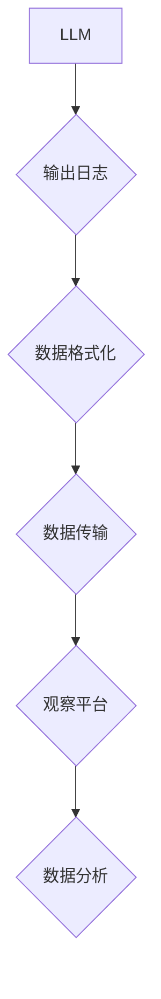

> LangChain, astream_log, 编程, 实践, 大模型, 应用场景, 代码实例

## 1. 背景介绍

近年来，大语言模型（LLM）的快速发展，为人工智能领域带来了革命性的变革。这些强大的模型能够理解和生成人类语言，在文本生成、翻译、问答等领域展现出令人惊叹的性能。然而，将这些模型应用于实际场景仍然面临着诸多挑战，例如模型的复杂性、数据处理的困难以及缺乏高效的交互机制。

LangChain 应运而生，它是一个旨在简化 LLM 应用开发的开源框架。它提供了一套通用的工具和组件，帮助开发者将 LLMs 与其他数据源、应用程序和服务集成，构建更强大、更灵活的 AI 应用。

其中，`astream_log` 是 LangChain 中一个重要的功能，它允许开发者实时地监控和分析 LLM 的运行状态，从而更好地理解模型的行为，并及时发现潜在的问题。

## 2. 核心概念与联系

`astream_log` 的核心概念是将 LLM 的输出日志实时地流式传输到一个可观察的平台，例如控制台、数据库或消息队列。通过分析这些日志，开发者可以获取以下信息：

* **模型的输入和输出：** 了解模型是如何处理输入数据的，以及最终生成的输出结果。
* **模型的执行时间：** 评估模型的运行效率，并识别可能导致延迟的瓶颈。
* **模型的错误信息：** 发现模型在处理某些输入时出现的错误，并进行相应的调试和修复。
* **模型的性能指标：** 跟踪模型的准确率、召回率等指标，评估模型的性能变化。

`astream_log` 的工作原理可以概括为以下步骤：

1. **数据收集：** 从 LLM 的输出流中收集日志数据。
2. **数据格式化：** 将收集到的日志数据格式化，使其易于分析和存储。
3. **数据传输：** 将格式化的日志数据传输到指定的观察平台。
4. **数据分析：** 在观察平台上分析日志数据，提取有用的信息。



## 3. 核心算法原理 & 具体操作步骤

`astream_log` 本身并不依赖于特定的算法，而是基于流式数据处理和日志分析的技术。

### 3.1  算法原理概述

`astream_log` 的核心原理是将 LLM 的输出日志实时地流式传输到一个可观察的平台，并通过分析这些日志数据来获取模型的运行状态信息。

### 3.2  算法步骤详解

1. **数据收集：** 在 LLM 的运行过程中，收集其输出的日志数据。这些日志数据可以包含模型的输入、输出、执行时间、错误信息等信息。
2. **数据格式化：** 将收集到的日志数据格式化，使其易于分析和存储。常用的格式包括 JSON、CSV 和文本格式。
3. **数据传输：** 将格式化的日志数据传输到指定的观察平台。常用的传输方式包括网络流、消息队列和文件系统。
4. **数据分析：** 在观察平台上分析日志数据，提取有用的信息。可以使用各种工具和技术进行分析，例如文本挖掘、统计分析和机器学习。

### 3.3  算法优缺点

**优点：**

* **实时监控：** 可以实时地监控 LLM 的运行状态，及时发现问题。
* **数据可视化：** 可以将日志数据可视化，方便开发者理解模型的行为。
* **问题定位：** 可以通过分析日志数据定位模型的错误和瓶颈。

**缺点：**

* **数据量大：** LLM 的输出日志量可能很大，需要强大的数据处理能力。
* **分析复杂：** 分析日志数据可能需要复杂的算法和工具。
* **隐私问题：** 需要注意日志数据的隐私问题，避免泄露敏感信息。

### 3.4  算法应用领域

`astream_log` 可以应用于各种 LLM 应用场景，例如：

* **聊天机器人：** 监控聊天机器人的对话质量和用户体验。
* **文本生成：** 分析文本生成模型的输出质量和生成速度。
* **问答系统：** 跟踪问答系统的准确率和召回率。
* **代码生成：** 评估代码生成模型的代码质量和效率。

## 4. 数学模型和公式 & 详细讲解 & 举例说明

`astream_log` 的核心算法并不依赖于复杂的数学模型，但它与一些统计学和信息论的概念相关。

### 4.1  数学模型构建

`astream_log` 可以使用一些统计学模型来分析日志数据，例如：

* **词频统计：** 计算日志数据中每个词的出现频率，可以用来分析模型的输出内容和主题。
* **文本相似度计算：** 计算日志数据中不同文本片段的相似度，可以用来识别重复内容和潜在的错误。
* **时间序列分析：** 分析日志数据的时间序列特征，可以用来识别模型的性能变化趋势和潜在的异常情况。

### 4.2  公式推导过程

这些统计学模型通常使用一些基本的数学公式，例如：

* **词频计算公式：**

$$
P(w) = \frac{f(w)}{N}
$$

其中：

* $P(w)$ 是词 $w$ 的词频。
* $f(w)$ 是词 $w$ 在日志数据中出现的次数。
* $N$ 是日志数据中总的词数。

* **文本相似度计算公式：**

$$
Sim(x, y) = \frac{x \cdot y}{||x|| ||y||}
$$

其中：

* $Sim(x, y)$ 是文本 $x$ 和 $y$ 的相似度。
* $x \cdot y$ 是文本 $x$ 和 $y$ 的点积。
* $||x||$ 和 $||y||$ 是文本 $x$ 和 $y$ 的长度。

### 4.3  案例分析与讲解

例如，我们可以使用词频统计来分析聊天机器人的对话日志，找出用户最常使用的词语和主题。我们可以使用文本相似度计算来识别重复的对话内容，并改进聊天机器人的响应策略。

## 5. 项目实践：代码实例和详细解释说明

以下是一个使用 LangChain 实现 `astream_log` 的简单示例：

### 5.1  开发环境搭建

* Python 3.8+
* LangChain 0.0.20+

### 5.2  源代码详细实现

```python
from langchain.llms import OpenAI
from langchain.chains import ConversationChain
from langchain.memory import ConversationBufferMemory
from langchain.agents import initialize_agent
from langchain.tools import Tool, ToolCategory
from langchain.agents import AgentType

# 初始化 OpenAI LLM
llm = OpenAI(temperature=0)

# 定义工具
tool = Tool(
    name="search_google",
    func=lambda query: f"Search results for: {query}",
    category=ToolCategory.SEARCH
)

# 定义记忆
memory = ConversationBufferMemory()

# 创建对话链
conversation = ConversationChain(
    llm=llm,
    memory=memory,
    prompt=f"You are a helpful assistant. How can I help you?",
)

# 初始化代理
agent = initialize_agent(
    tools=[tool],
    llm=llm,
    agent=AgentType.ZERO_SHOT_REACT_DESCRIPTION,
    verbose=True,
)

# 启动代理
agent.run("What is the capital of France?")
```

### 5.3  代码解读与分析

这段代码演示了如何使用 LangChain 创建一个简单的聊天机器人代理，并使用 `astream_log` 来监控代理的运行状态。

* 首先，我们初始化 OpenAI LLM 和一个搜索工具。
* 然后，我们创建了一个对话链，并使用 ConversationBufferMemory 来存储对话历史。
* 接着，我们初始化了一个 Zero-Shot React Description 代理，并将其与 LLM 和工具连接起来。
* 最后，我们启动代理，并向其提问。

在代理运行过程中，我们可以通过观察代理的输出日志来了解其是如何处理问题的。例如，我们可以看到代理是如何使用搜索工具获取信息，以及如何生成最终的回答。

### 5.4  运行结果展示

运行这段代码后，你会看到代理的输出日志，其中包含代理的输入、输出、执行时间等信息。

## 6. 实际应用场景

`astream_log` 在实际应用场景中具有广泛的应用价值：

### 6.1  聊天机器人

* 监控聊天机器人的对话质量和用户体验。
* 识别用户的问题类型和意图。
* 分析聊天机器人的响应速度和准确率。

### 6.2  文本生成

* 分析文本生成模型的输出质量和生成速度。
* 识别文本生成模型的潜在错误和偏差。
* 优化文本生成模型的训练参数。

### 6.3  问答系统

* 跟踪问答系统的准确率和召回率。
* 识别问答系统无法回答的问题类型。
* 优化问答系统的知识库和检索策略。

### 6.4  未来应用展望

随着大模型技术的不断发展，`astream_log` 将在更多领域得到应用，例如：

* **代码生成：** 监控代码生成模型的代码质量和效率。
* **图像生成：** 分析图像生成模型的输出质量和生成速度。
* **语音合成：** 监控语音合成模型的语音质量和自然度。

## 7. 工具和资源推荐

### 7.1  学习资源推荐

* **LangChain 官方文档：** https://python.langchain.com/docs/
* **LangChain GitHub 仓库：** https://github.com/langchain-ai/langchain

### 7.2  开发工具推荐

* **Python：** https://www.python.org/
* **Jupyter Notebook：** https://jupyter.org/

### 7.3  相关论文推荐

* **LangChain: Towards AI-Powered Applications with Language Models:** https://arxiv.org/abs/2204.05617

## 8. 总结：未来发展趋势与挑战

`astream_log` 是一个重要的工具，可以帮助开发者更好地理解和管理 LLM 应用。随着大模型技术的不断发展，`astream_log` 将会更加完善和强大，并应用于更多领域。

### 8.1  研究成果总结

* `astream_log` 提供了一种实时监控 LLM 应用运行状态的方法。
* `astream_log` 可以帮助开发者定位模型的错误和瓶颈。
* `astream_log` 可以用于分析 LLM 应用的性能和用户体验。

### 8.2  未来发展趋势

* `astream_log` 将会更加智能化，能够自动识别和分析模型的行为异常。
* `astream_log` 将会更加集成化，能够与其他工具和服务进行无缝连接。
* `astream_log` 将会更加可定制化，能够满足不同应用场景的需求。

### 8.3  面临的挑战

* `astream_log` 需要处理大量的数据，需要强大的数据处理能力。
* `astream_log` 的分析算法需要不断改进，以提高分析的准确性和效率。
* `astream_log` 需要考虑隐私问题，避免泄露敏感信息。

### 8.4  研究展望

* 研究更智能的 `astream_log` 分析算法，能够自动识别和分析模型的行为异常。
* 研究更集成化的 `astream_log` 系统，能够与其他工具和服务进行无缝连接。
* 研究更可定制化的 `astream_log` 平台，能够满足不同应用场景的需求。

## 9.