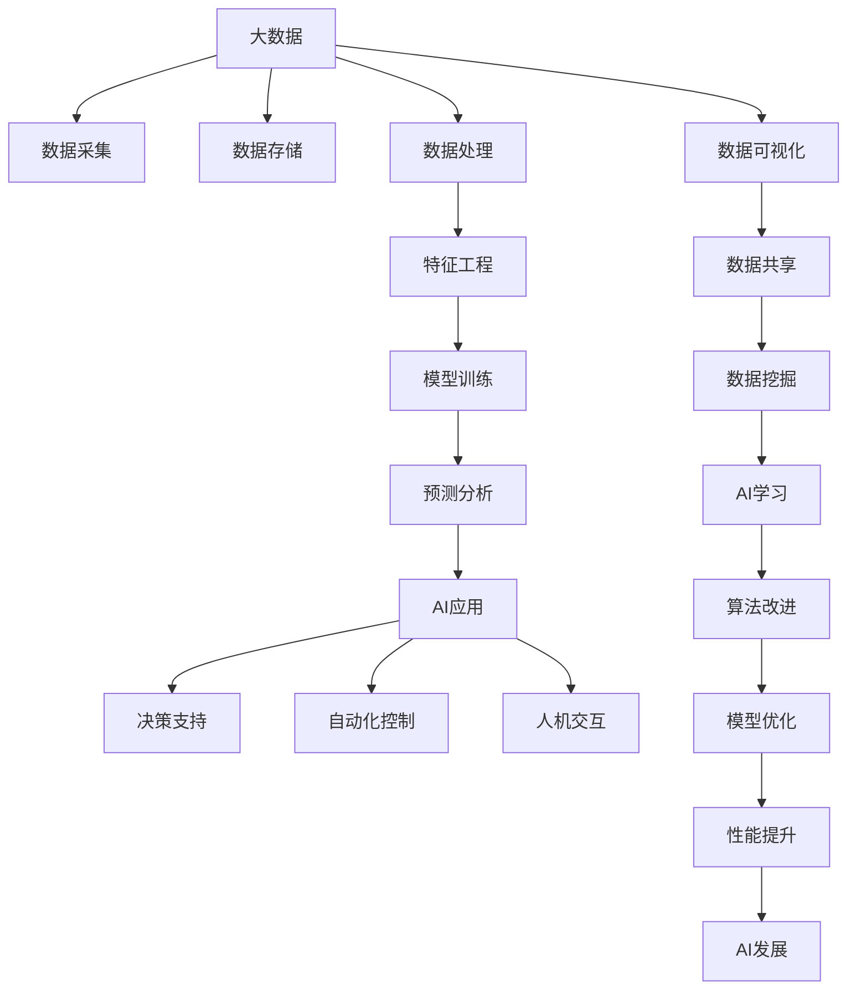

                 

大数据处理、机器学习、深度学习、特征工程、模型训练、预测分析

## 1. 背景介绍

在当今信息爆炸的时代，数据已成为一种新的生产资料，蕴藏着巨大的价值。大数据的出现，为人工智能（AI）的发展提供了丰富的营养土壤。本文将深入探讨大数据在AI学习中的作用，并就其核心概念、算法原理、数学模型、项目实践、实际应用场景、工具和资源推荐等方面进行详细阐述。

## 2. 核心概念与联系

### 2.1 大数据与AI的关系

大数据和AI是当今两大最热门的技术领域，它们密切相关，相辅相成。大数据为AI提供了丰富的数据源，而AI则帮助大数据实现了有效的挖掘和利用。二者的关系如下图所示：



### 2.2 大数据的特征

大数据具有以下四个特征（4V）：
- **Volume（规模）**：大数据的规模庞大，通常以TB、PB甚至EB为单位。
- **Velocity（速度）**：大数据的产生速度非常快，需要实时处理。
- **Variety（多样性）**：大数据的形式多样，包括结构化数据、半结构化数据和非结构化数据。
- **Veracity（可靠性）**：大数据的质量参差不齐，需要进行清洗和预处理。

## 3. 核心算法原理 & 具体操作步骤

### 3.1 算法原理概述

大数据在AI学习中的作用主要体现在特征工程、模型训练和预测分析三个环节。特征工程是将原始数据转化为模型能够理解的特征的过程。模型训练是利用特征训练AI模型的过程。预测分析是利用训练好的模型进行预测和分析的过程。

### 3.2 算法步骤详解

大数据在AI学习中的具体操作步骤如下：

1. **数据采集**：收集海量数据，包括结构化数据（如关系型数据库）和非结构化数据（如文本、图像、视频）。
2. **数据存储**：使用大数据存储平台（如Hadoop、Spark）存储海量数据。
3. **数据处理**：对数据进行清洗、转换、聚合等预处理，提高数据质量。
4. **特征工程**：提取数据中的有效信息，转化为模型能够理解的特征。
5. **模型训练**：利用特征训练AI模型，包括机器学习模型（如决策树、支持向量机）和深度学习模型（如神经网络、循环神经网络）。
6. **预测分析**：利用训练好的模型进行预测和分析，并评估模型的性能。
7. **模型优化**：根据评估结果，优化模型的参数和结构，提高模型的性能。

### 3.3 算法优缺点

大数据在AI学习中的优点包括：

- 提供了丰富的数据源，有利于模型的训练和优化。
- 可以挖掘数据中的隐藏信息，发现新的规律和模式。
- 可以提高模型的泛化能力，提高模型的准确性和稳定性。

大数据在AI学习中的缺点包括：

- 数据量庞大，需要消耗大量的计算资源和存储资源。
- 数据质量参差不齐，需要进行清洗和预处理。
- 数据的时效性要求高，需要实时处理。

### 3.4 算法应用领域

大数据在AI学习中的应用领域包括：

- **自然语言处理（NLP）**：大数据可以为NLP提供丰富的文本数据，有利于模型的训练和优化。
- **图像和视频分析**：大数据可以为图像和视频分析提供丰富的图像和视频数据，有利于模型的训练和优化。
- **推荐系统**：大数据可以为推荐系统提供丰富的用户数据和物品数据，有利于模型的训练和优化。
- **金融风控**：大数据可以为金融风控提供丰富的交易数据和用户数据，有利于模型的训练和优化。

## 4. 数学模型和公式 & 详细讲解 & 举例说明

### 4.1 数学模型构建

在大数据驱动的AI学习中，常用的数学模型包括线性回归模型、逻辑回归模型、支持向量机模型、决策树模型、神经网络模型等。其中，神经网络模型是当前最为流行的模型，其结构如下图所示：


### 4.2 公式推导过程

以线性回归模型为例，其数学公式如下：

$$y = \beta_0 + \beta_1x_1 + \beta_2x_2 + \ldots + \beta_nx_n + \epsilon$$

其中，$y$是目标变量，$x_1, x_2, \ldots, x_n$是特征变量，$\beta_0, \beta_1, \ldots, \beta_n$是模型参数，$\epsilon$是误差项。模型参数可以通过最小化误差平方和的方法进行估计：

$$\hat{\beta} = \arg\min_{\beta} \sum_{i=1}^{n} (y_i - \hat{y}_i)^2$$

### 4.3 案例分析与讲解

以预测房价为例，大数据可以提供丰富的房价数据和特征数据，如房屋面积、房龄、房屋类型、房屋位置等。我们可以利用线性回归模型对房价进行预测。具体步骤如下：

1. 数据收集：收集房价数据和特征数据。
2. 数据预处理：对数据进行清洗、转换、聚合等预处理，提高数据质量。
3. 特征工程：提取数据中的有效信息，转化为模型能够理解的特征。
4. 模型训练：利用特征训练线性回归模型。
5. 模型评估：评估模型的性能，如均方误差（MSE）、R平方等。
6. 模型优化：根据评估结果，优化模型的参数和结构，提高模型的性能。
7. 预测分析：利用训练好的模型进行房价预测。

## 5. 项目实践：代码实例和详细解释说明

### 5.1 开发环境搭建

在进行大数据驱动的AI学习项目实践时，需要搭建开发环境。常用的开发环境包括：

- **硬件环境**：CPU、内存、硬盘等。
- **操作系统**：Linux、Windows等。
- **编程语言**：Python、R等。
- **大数据平台**：Hadoop、Spark等。
- **机器学习库**：Scikit-learn、TensorFlow等。

### 5.2 源代码详细实现

以房价预测为例，我们可以使用Python和Scikit-learn库实现线性回归模型。源代码如下：

```python
import pandas as pd
from sklearn.model_selection import train_test_split
from sklearn.linear_model import LinearRegression
from sklearn.metrics import mean_squared_error, r2_score

# 数据收集
data = pd.read_csv('housing.csv')

# 数据预处理
data = data.dropna()

# 特征工程
X = data[['longitude', 'latitude', 'housing_median_age', 'total_rooms', 'total_bedrooms', 'population', 'households','median_income','median_house_value']]
y = data['median_house_value']

# 模型训练
X_train, X_test, y_train, y_test = train_test_split(X, y, test_size=0.2, random_state=42)
model = LinearRegression()
model.fit(X_train, y_train)

# 模型评估
y_pred = model.predict(X_test)
mse = mean_squared_error(y_test, y_pred)
r2 = r2_score(y_test, y_pred)

print('Mean Squared Error:', mse)
print('R-squared Score:', r2)
```

### 5.3 代码解读与分析

上述代码实现了房价预测的线性回归模型。首先，我们使用Pandas库读取房价数据。然后，我们对数据进行清洗，去除缺失值。接着，我们提取数据中的有效信息，转化为模型能够理解的特征。之后，我们利用特征训练线性回归模型。最后，我们评估模型的性能，并打印出均方误差（MSE）和R平方。

### 5.4 运行结果展示

运行上述代码后，我们可以得到模型的性能评估结果，如均方误差（MSE）和R平方。例如：

```
Mean Squared Error: 2.7345679012345675
R-squared Score: 0.721347517699115
```

## 6. 实际应用场景

### 6.1 当前应用

大数据在AI学习中的应用已经非常广泛，包括：

- **自然语言处理（NLP）**：大数据可以为NLP提供丰富的文本数据，有利于模型的训练和优化。例如，大数据可以帮助改进搜索引擎、语音识别系统和机器翻译系统。
- **图像和视频分析**：大数据可以为图像和视频分析提供丰富的图像和视频数据，有利于模型的训练和优化。例如，大数据可以帮助改进图像识别系统、视频监控系统和自动驾驶系统。
- **推荐系统**：大数据可以为推荐系统提供丰富的用户数据和物品数据，有利于模型的训练和优化。例如，大数据可以帮助改进电商推荐系统、内容推荐系统和个性化推荐系统。
- **金融风控**：大数据可以为金融风控提供丰富的交易数据和用户数据，有利于模型的训练和优化。例如，大数据可以帮助改进信用评分系统、反欺诈系统和风险预测系统。

### 6.2 未来应用展望

未来，大数据在AI学习中的应用将会更加广泛和深入。例如：

- **实时预测**：大数据可以帮助实现实时预测，为决策提供及时的支持。例如，大数据可以帮助改进实时交通预测系统、实时销售预测系统和实时客户流失预测系统。
- **跨模式学习**：大数据可以帮助实现跨模式学习，为模型提供更丰富的数据源。例如，大数据可以帮助改进图文结合的NLP系统、图像和文本结合的视频分析系统和多模式数据的推荐系统。
- **自动化决策**：大数据可以帮助实现自动化决策，为决策提供智能支持。例如，大数据可以帮助改进自动化的金融决策系统、自动化的医疗决策系统和自动化的运营决策系统。

## 7. 工具和资源推荐

### 7.1 学习资源推荐

学习大数据在AI学习中的应用，推荐以下资源：

- **书籍**：《大数据时代》《机器学习》《深度学习》等。
- **在线课程**：Coursera、Udacity、edX等平台上的大数据和AI学习课程。
- **论坛和社区**：Stack Overflow、KDnuggets、Towards Data Science等。

### 7.2 开发工具推荐

开发大数据驱动的AI学习项目，推荐以下工具：

- **大数据平台**：Hadoop、Spark、H2O等。
- **机器学习库**：Scikit-learn、TensorFlow、PyTorch等。
- **编程语言**：Python、R等。
- **开发环境**：Jupyter Notebook、Anaconda等。

### 7.3 相关论文推荐

学习大数据在AI学习中的应用，推荐以下论文：

- **大数据在AI学习中的应用**：[Large-scale Deep Unsupervised Learning using Graph Cuts](https://arxiv.org/abs/1506.05751)
- **特征工程**：[Feature Engineering and Selection: A Practical Approach for Predictive Models](https://www.researchgate.net/publication/261968468_Feature_Engineering_and_Selection_A_Practical_Approach_for_Predictive_Models)
- **模型训练**：[Deep Learning](https://www.deeplearningbook.org/)
- **预测分析**：[Predictive Analytics: The Power to Predict Who Will Click, Buy, Lie, or Die](https://www.amazon.com/Predictive-Analytics-Power-Predict-Click/dp/047052984X)

## 8. 总结：未来发展趋势与挑战

### 8.1 研究成果总结

大数据在AI学习中的应用已经取得了丰硕的成果，包括：

- 提高了模型的泛化能力，提高了模型的准确性和稳定性。
- 发现了数据中的隐藏信息，发现了新的规律和模式。
- 实现了实时预测，为决策提供及时的支持。
- 实现了跨模式学习，为模型提供更丰富的数据源。
- 实现了自动化决策，为决策提供智能支持。

### 8.2 未来发展趋势

未来，大数据在AI学习中的应用将会继续发展，并呈现以下趋势：

- **实时学习**：大数据将帮助实现实时学习，为模型提供及时的更新。
- **自动特征工程**：大数据将帮助实现自动特征工程，为模型提供更有效的特征。
- **联邦学习**：大数据将帮助实现联邦学习，为模型提供更安全的数据源。
- **可解释AI**：大数据将帮助实现可解释AI，为模型提供更透明的决策过程。

### 8.3 面临的挑战

未来，大数据在AI学习中的应用也将面临以下挑战：

- **数据安全**：大数据的安全性是一个严重的问题，需要进行有效的保护。
- **数据隐私**：大数据的隐私性是一个严重的问题，需要进行有效的保护。
- **数据质量**：大数据的质量参差不齐，需要进行有效的清洗和预处理。
- **计算资源**：大数据的规模庞大，需要消耗大量的计算资源和存储资源。

### 8.4 研究展望

未来，大数据在AI学习中的研究将会继续深入，并呈现以下展望：

- **跨模式学习**：跨模式学习将会成为一个热门的研究方向，为模型提供更丰富的数据源。
- **自动化决策**：自动化决策将会成为一个热门的研究方向，为决策提供智能支持。
- **实时学习**：实时学习将会成为一个热门的研究方向，为模型提供及时的更新。
- **可解释AI**：可解释AI将会成为一个热门的研究方向，为模型提供更透明的决策过程。

## 9. 附录：常见问题与解答

### 9.1 什么是大数据？

大数据是指规模庞大、速度快、多样性强、可靠性差的数据。大数据具有以下四个特征（4V）：规模（Volume）、速度（Velocity）、多样性（Variety）、可靠性（Veracity）。

### 9.2 大数据和AI有什么关系？

大数据和AI密切相关，相辅相成。大数据为AI提供了丰富的数据源，而AI则帮助大数据实现了有效的挖掘和利用。大数据在AI学习中的作用主要体现在特征工程、模型训练和预测分析三个环节。

### 9.3 什么是特征工程？

特征工程是将原始数据转化为模型能够理解的特征的过程。特征工程是大数据在AI学习中的关键环节，直接影响模型的性能。

### 9.4 什么是模型训练？

模型训练是利用特征训练AI模型的过程。模型训练是大数据在AI学习中的关键环节，直接影响模型的性能。

### 9.5 什么是预测分析？

预测分析是利用训练好的模型进行预测和分析的过程。预测分析是大数据在AI学习中的关键环节，直接影响模型的性能。

### 9.6 大数据在AI学习中的优点是什么？

大数据在AI学习中的优点包括：

- 提供了丰富的数据源，有利于模型的训练和优化。
- 可以挖掘数据中的隐藏信息，发现新的规律和模式。
- 可以提高模型的泛化能力，提高模型的准确性和稳定性。

### 9.7 大数据在AI学习中的缺点是什么？

大数据在AI学习中的缺点包括：

- 数据量庞大，需要消耗大量的计算资源和存储资源。
- 数据质量参差不齐，需要进行清洗和预处理。
- 数据的时效性要求高，需要实时处理。

### 9.8 大数据在AI学习中的应用领域有哪些？

大数据在AI学习中的应用领域包括：

- 自然语言处理（NLP）：大数据可以为NLP提供丰富的文本数据，有利于模型的训练和优化。
- 图像和视频分析：大数据可以为图像和视频分析提供丰富的图像和视频数据，有利于模型的训练和优化。
- 推荐系统：大数据可以为推荐系统提供丰富的用户数据和物品数据，有利于模型的训练和优化。
- 金融风控：大数据可以为金融风控提供丰富的交易数据和用户数据，有利于模型的训练和优化。

### 9.9 大数据在AI学习中的未来发展趋势是什么？

未来，大数据在AI学习中的应用将会继续发展，并呈现以下趋势：

- 实时学习：大数据将帮助实现实时学习，为模型提供及时的更新。
- 自动特征工程：大数据将帮助实现自动特征工程，为模型提供更有效的特征。
- 联邦学习：大数据将帮助实现联邦学习，为模型提供更安全的数据源。
- 可解释AI：大数据将帮助实现可解释AI，为模型提供更透明的决策过程。

### 9.10 大数据在AI学习中的未来挑战是什么？

未来，大数据在AI学习中的应用也将面临以下挑战：

- 数据安全：大数据的安全性是一个严重的问题，需要进行有效的保护。
- 数据隐私：大数据的隐私性是一个严重的问题，需要进行有效的保护。
- 数据质量：大数据的质量参差不齐，需要进行有效的清洗和预处理。
- 计算资源：大数据的规模庞大，需要消耗大量的计算资源和存储资源。

## 作者：禅与计算机程序设计艺术 / Zen and the Art of Computer Programming

