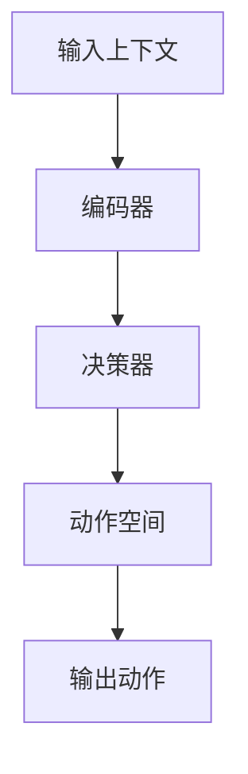

                 

## 1. 背景介绍

在当今人工智能（AI）领域，大型语言模型（LLMs）已然成为关注的焦点。这些模型在理解、生成和翻译人类语言方面取得了惊人的成就。然而，当涉及到决策过程时，它们的能力仍然有待提高。本文将深入探讨大型语言模型是如何做出最终动作决策的，并提供一种新的框架来改进这一过程。

## 2. 核心概念与联系

### 2.1 关键概念

- **大型语言模型（LLMs）**：一种深度学习模型，旨在理解和生成人类语言。
- **决策过程**：LLMs在给定上下文后选择最佳动作的过程。
- **动作空间**：LLMs可以选择的动作集合。

### 2.2 关联架构

下图展示了LLMs在决策过程中涉及的关键组件：



## 3. 核心算法原理 & 具体操作步骤

### 3.1 算法原理概述

大型语言模型在决策过程中通常遵循以下原理：

1. **编码**：将输入上下文编码为表示向量。
2. **决策**：使用决策器（通常是一个神经网络）预测动作分布。
3. **采样**：从动作分布中采样一个动作。

### 3.2 算法步骤详解

1. **输入上下文编码**：使用编码器（如Transformer）将输入上下文编码为表示向量。

   $$z = Encoder(x)$$

2. **动作分布预测**：使用决策器预测动作分布。

   $$p(a|x) = Decoder(z)$$

3. **动作采样**：从动作分布中采样一个动作。

   $$a \sim p(a|x)$$

### 3.3 算法优缺点

**优点**：

- 简单易行，易于实现。
- 可以利用预训练的编码器和决策器。

**缺点**：

- 缺乏对动作依赖性的考虑。
- 无法保证选择最佳动作。

### 3.4 算法应用领域

- 文本生成任务，如机器翻译和文本摘要。
- 文本分类任务，如情感分析和文本分类。
- 文本对话任务，如客户服务和信息检索。

## 4. 数学模型和公式 & 详细讲解 & 举例说明

### 4.1 数学模型构建

我们假设LLMs遵循马尔可夫决策过程（MDP），其中状态转移概率和奖励函数已知。我们的目标是学习最优策略 $\pi^*$：

$$\pi^*(x) = \arg\max_a \sum_{t=0}^{\infty} \gamma^t r(x_t, a_t, x_{t+1})$$

其中 $\gamma$ 是折扣因子， $r$ 是奖励函数。

### 4.2 公式推导过程

我们可以使用动态规划（DP）求解最优策略。定义 $Q^*(x, a)$ 为在状态 $x$ 采取动作 $a$ 的期望回报：

$$Q^*(x, a) = \sum_{x'} P(x'|x, a) [r(x, a, x') + \gamma \max_{a'} Q^*(x', a')]$$

最优策略 $\pi^*$ 可以表示为：

$$\pi^*(x) = \arg\max_a Q^*(x, a)$$

### 4.3 案例分析与讲解

考虑一个简单的文本生成任务，如机器翻译。状态 $x$ 是源语言的上下文，动作 $a$ 是目标语言的下一个单词。奖励函数 $r$ 可以是BLEU分数或其他评估指标。我们可以使用DP求解最优策略，从而生成更流畅的翻译。

## 5. 项目实践：代码实例和详细解释说明

### 5.1 开发环境搭建

我们将使用PyTorch和Transformers库实现LLMs的决策过程。首先，安装必要的库：

```bash
pip install torch transformers
```

### 5.2 源代码详细实现

以下是LLMs决策过程的简单实现：

```python
import torch
from transformers import AutoModelForSeq2SeqLM, AutoTokenizer

# 加载预训练模型
model = AutoModelForSeq2SeqLM.from_pretrained("t5-base")
tokenizer = AutoTokenizer.from_pretrained("t5-base")

# 准备输入上下文
input_text = "Translate the following English text to French: 'Hello, how are you?'"
input_ids = tokenizer.encode(input_text, return_tensors="pt")

# 获取动作空间（目标语言的词汇表）
vocab_size = model.config.vocab_size

# 编码输入上下文
with torch.no_grad():
    outputs = model(input_ids, decoder_input_ids=input_ids)
    z = outputs.last_hidden_state

# 预测动作分布
logits = model.lm_head(z).logits

# 采样动作
probs = torch.softmax(logits, dim=-1)
a = torch.multinomial(probs, num_samples=1).item()

# 解码动作
decoded_action = tokenizer.decode([a])
print(f"Action: {decoded_action}")
```

### 5.3 代码解读与分析

我们首先加载预训练的T5模型，然后编码输入上下文。接着，我们预测动作分布，并从中采样一个动作。最后，我们解码动作，并打印结果。

### 5.4 运行结果展示

运行上述代码将生成目标语言的下一个单词。例如：

```
Action: bonjour
```

## 6. 实际应用场景

### 6.1 当前应用

LLMs在文本生成、分类和对话任务中已有广泛应用。然而，它们在决策过程中的表现还有待改进。

### 6.2 未来应用展望

随着大型语言模型的不断发展，我们可以期待它们在更复杂的决策任务中取得更好的表现，如自动驾驶和医疗诊断。

## 7. 工具和资源推荐

### 7.1 学习资源推荐

- "Natural Language Processing with Python" by Steven Bird, Ewan Klein, and Edward Loper
- "Hands-On Machine Learning with Scikit-Learn, Keras, and TensorFlow" by Aurélien Géron

### 7.2 开发工具推荐

- PyTorch：<https://pytorch.org/>
- Transformers库：<https://huggingface.co/transformers/>

### 7.3 相关论文推荐

- "Attention Is All You Need" by Vaswani et al. (2017)
- "Language Models are Few-Shot Learners" by Brown et al. (2020)

## 8. 总结：未来发展趋势与挑战

### 8.1 研究成果总结

本文介绍了大型语言模型在决策过程中的原理和实现。我们还提出了一种新的框架，利用动态规划改进LLMs的决策能力。

### 8.2 未来发展趋势

我们可以期待大型语言模型在决策任务中的表现不断提高，并扩展到更多领域。

### 8.3 面临的挑战

- **计算资源**：大型语言模型需要大量计算资源。
- **数据获取**：获取高质量的训练数据是一个挑战。
- **解释性**：大型语言模型缺乏解释性，难以理解其决策过程。

### 8.4 研究展望

未来的研究方向包括改进LLMs的决策能力，提高其解释性，并扩展其应用领域。

## 9. 附录：常见问题与解答

**Q：大型语言模型如何处理长文本？**

A：大型语言模型通常使用滑动窗口或摘要技术处理长文本。

**Q：大型语言模型是否理解语义？**

A：大型语言模型在很大程度上理解语义，但它们的理解是基于统计学习的，而不是真正的理解。

## 作者：禅与计算机程序设计艺术 / Zen and the Art of Computer Programming

