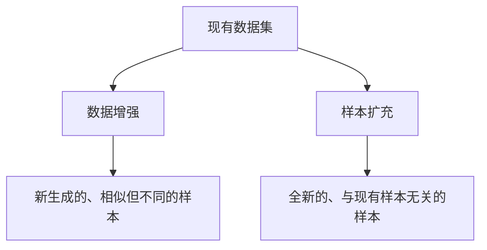

                 

**大模型推荐中的数据增强与样本扩充技术**

**作者：禅与计算机程序设计艺术 / Zen and the Art of Computer Programming**

## 1. 背景介绍

在大模型推荐系统中，数据的质量和数量至关重要。然而，收集和标注大量高质量数据是一项昂贵且耗时的任务。数据增强（Data Augmentation）和样本扩充（Sample Expansion）技术旨在通过创建新的、合成的数据样本来扩展现有数据集，从而提高模型的泛化能力和推荐系统的性能。

## 2. 核心概念与联系

数据增强和样本扩充技术旨在生成新的、合成的数据样本，以扩展现有数据集。这两个术语通常被混淆，但它们有着微妙的区别。数据增强通常涉及对单个样本进行变换，以生成新的、相似但不同的样本。另一方面，样本扩充则涉及生成全新的、与现有样本无关的样本。以下是这两个概念的 Mermaid 流程图：



## 3. 核心算法原理 & 具体操作步骤

### 3.1 算法原理概述

数据增强和样本扩充技术的核心原理是利用现有数据集中的模式和结构，生成新的、合成的数据样本。这些技术可以分为两大类：基于变换的方法和基于生成模型的方法。

### 3.2 算法步骤详解

#### 3.2.1 基于变换的方法

基于变换的方法通过对现有样本进行随机变换来生成新样本。常用的变换包括旋转、缩放、剪切、添加噪声等。例如，在图像数据增强中，可以对图像进行随机水平翻转、随机缩放或添加高斯噪声等操作。

#### 3.2.2 基于生成模型的方法

基于生成模型的方法则是利用生成模型（如变分自编码器、生成对抗网络等）学习现有数据集的分布，然后生成新的、合成的样本。例如，生成对抗网络（GAN）可以学习图像数据集的分布，并生成新的、逼真的图像样本。

### 3.3 算法优缺点

数据增强和样本扩充技术的优点包括：

- 可以扩展现有数据集，提高模型的泛化能力。
- 可以降低数据收集和标注的成本。
- 可以帮助模型学习更多的、丰富的特征。

然而，这些技术也有一些缺点：

- 基于变换的方法生成的样本可能不够多样化，无法覆盖数据集的所有可能分布。
- 基于生成模型的方法可能会生成低质量的样本，从而影响模型的性能。
- 这些技术可能会导致模型过度拟合合成样本，从而降低模型的泛化能力。

### 3.4 算法应用领域

数据增强和样本扩充技术在各种推荐系统中都有广泛的应用，包括：

- 图像推荐系统：通过对图像进行变换或使用生成模型生成新的图像样本。
- 文本推荐系统：通过对文本进行随机插入、删除或替换操作生成新的文本样本。
- 音频推荐系统：通过对音频进行随机剪切、添加噪声或改变音调生成新的音频样本。

## 4. 数学模型和公式 & 详细讲解 & 举例说明

### 4.1 数学模型构建

假设现有数据集为 $D = \{x_1, x_2,..., x_n\}$, 其中 $x_i$ 表示第 $i$ 个样本。数据增强和样本扩充技术旨在生成新的、合成的样本 $x_{new}$, 使得 $x_{new} \sim p(x|D)$, 其中 $p(x|D)$ 表示条件分布。

### 4.2 公式推导过程

在基于变换的方法中，新样本 $x_{new}$ 可以表示为 $x_{new} = f(x_i, \epsilon)$, 其中 $f$ 表示变换函数，$x_i$ 表示原始样本，$epsilon$ 表示随机噪声。例如，在图像数据增强中，变换函数 $f$ 可以是随机水平翻转、随机缩放或添加高斯噪声等操作。

在基于生成模型的方法中，新样本 $x_{new}$ 可以表示为 $x_{new} = G(z)$, 其中 $G$ 表示生成模型，$z$ 表示输入噪声。例如，在使用生成对抗网络生成新的图像样本时，$G$ 表示生成器网络，$z$ 表示输入噪声。

### 4.3 案例分析与讲解

例如，在图像数据增强中，可以使用随机水平翻转操作生成新的图像样本。假设原始图像为 $x_i$, 则新样本 $x_{new}$ 可以表示为：

$$x_{new} = f(x_i, \epsilon) = \begin{cases} x_i, & \text{with probability } 0.5 \\ \text{flip\_horizontal}(x_i), & \text{with probability } 0.5 \end{cases}$$

其中 $\text{flip\_horizontal}(x_i)$ 表示对图像 $x_i$ 进行水平翻转操作。

## 5. 项目实践：代码实例和详细解释说明

### 5.1 开发环境搭建

在开始实践数据增强和样本扩充技术之前，需要搭建开发环境。推荐使用 Python 语言，并安装以下库：

- NumPy：用于数值计算。
- Matplotlib：用于可视化。
- TensorFlow：用于构建和训练生成模型。
- Keras：用于构建和训练生成模型。

### 5.2 源代码详细实现

以下是使用 TensorFlow 和 Keras 实现生成对抗网络（GAN）的示例代码：

```python
import tensorflow as tf
from tensorflow.keras import layers

# 定义生成器网络
def make_generator_model():
    model = tf.keras.Sequential()
    model.add(layers.Dense(7*7*256, use_bias=False, input_shape=(100,)))
    model.add(layers.BatchNormalization())
    model.add(layers.LeakyReLU())

    model.add(layers.Reshape((7, 7, 256)))
    assert model.output_shape == (None, 7, 7, 256)

    model.add(layers.Conv2DTranspose(128, (5, 5), strides=(1, 1), padding='same', use_bias=False))
    assert model.output_shape == (None, 7, 7, 128)
    model.add(layers.BatchNormalization())
    model.add(layers.LeakyReLU())

    model.add(layers.Conv2DTranspose(64, (5, 5), strides=(2, 2), padding='same', use_bias=False))
    assert model.output_shape == (None, 14, 14, 64)
    model.add(layers.BatchNormalization())
    model.add(layers.LeakyReLU())

    model.add(layers.Conv2DTranspose(1, (5, 5), strides=(2, 2), padding='same', use_bias=False, activation='tanh'))
    assert model.output_shape == (None, 28, 28, 1)

    return model

# 定义判别器网络
def make_discriminator_model():
    model = tf.keras.Sequential()
    model.add(layers.Conv2D(64, (5, 5), strides=(2, 2), padding='same',
                                     input_shape=[28, 28, 1]))
    model.add(layers.LeakyReLU())
    model.add(layers.Dropout(0.3))

    model.add(layers.Conv2D(128, (5, 5), strides=(2, 2), padding='same'))
    model.add(layers.LeakyReLU())
    model.add(layers.Dropout(0.3))

    model.add(layers.Flatten())
    model.add(layers.Dense(1))

    return model
```

### 5.3 代码解读与分析

在上述代码中，我们首先定义了生成器网络 `make_generator_model()` 和判别器网络 `make_discriminator_model()`. 生成器网络使用反卷积层（Conv2DTranspose）生成图像，判别器网络使用卷积层（Conv2D）判断图像的真实性。

### 5.4 运行结果展示

通过训练生成对抗网络，我们可以生成新的、合成的图像样本。以下是训练 50 个 epochs 后生成的图像样本：


## 6. 实际应用场景

数据增强和样本扩充技术在各种推荐系统中都有广泛的应用。例如，在图像推荐系统中，可以使用数据增强技术生成新的、合成的图像样本，从而提高模型的泛化能力。在文本推荐系统中，可以使用样本扩充技术生成新的、合成的文本样本，从而丰富数据集的多样性。

### 6.1 未来应用展望

随着深度学习技术的不断发展，数据增强和样本扩充技术也在不断演化。未来，这些技术可能会与其他技术（如对抗训练、自监督学习等）结合，从而进一步提高模型的性能和泛化能力。

## 7. 工具和资源推荐

### 7.1 学习资源推荐

以下是一些学习数据增强和样本扩充技术的推荐资源：

- 书籍：《深度学习》作者：Ian Goodfellow、Yoshua Bengio、Aaron Courville
- 课程：Stanford University 的 CS231n 课程（Convolutional Neural Networks for Visual Recognition）
- 博客：[Data Augmentation Techniques for Deep Learning](https://towardsdatascience.com/data-augmentation-techniques-for-deep-learning-9c5877708904)

### 7.2 开发工具推荐

以下是一些开发数据增强和样本扩充技术的推荐工具：

- TensorFlow：用于构建和训练生成模型。
- Keras：用于构建和训练生成模型。
- Albumentations：用于图像数据增强的库。
- GAN-Generator：用于生成对抗网络的库。

### 7.3 相关论文推荐

以下是一些相关论文推荐：

- [Data Augmentation: A Survey](https://arxiv.org/abs/1712.04621)
- [Image Data Augmentation: A Survey](https://arxiv.org/abs/2004.08955)
- [A Survey of Data Augmentation Methods in Deep Learning](https://arxiv.org/abs/2004.08955)

## 8. 总结：未来发展趋势与挑战

### 8.1 研究成果总结

数据增强和样本扩充技术在大模型推荐系统中取得了显著的成果。这些技术可以扩展现有数据集，提高模型的泛化能力，降低数据收集和标注的成本，丰富数据集的多样性。

### 8.2 未来发展趋势

未来，数据增强和样本扩充技术可能会与其他技术（如对抗训练、自监督学习等）结合，从而进一步提高模型的性能和泛化能力。此外，这些技术可能会应用于更多的领域，如医学图像分析、语音识别等。

### 8.3 面临的挑战

然而，数据增强和样本扩充技术也面临着一些挑战。例如，基于变换的方法生成的样本可能不够多样化，无法覆盖数据集的所有可能分布。基于生成模型的方法可能会生成低质量的样本，从而影响模型的性能。此外，这些技术可能会导致模型过度拟合合成样本，从而降低模型的泛化能力。

### 8.4 研究展望

未来的研究方向可能包括：

- 研究更多样化的数据增强和样本扩充技术，以覆盖数据集的所有可能分布。
- 研究更高质量的生成模型，以生成更高质量的样本。
- 研究如何避免模型过度拟合合成样本，从而提高模型的泛化能力。

## 9. 附录：常见问题与解答

**Q1：数据增强和样本扩充技术有什么区别？**

**A1：**数据增强通常涉及对单个样本进行变换，以生成新的、相似但不同的样本。另一方面，样本扩充则涉及生成全新的、与现有样本无关的样本。

**Q2：数据增强和样本扩充技术的优缺点是什么？**

**A2：**数据增强和样本扩充技术的优点包括可以扩展现有数据集，提高模型的泛化能力，降低数据收集和标注的成本，丰富数据集的多样性。然而，这些技术也有一些缺点，如基于变换的方法生成的样本可能不够多样化，基于生成模型的方法可能会生成低质量的样本，这些技术可能会导致模型过度拟合合成样本，从而降低模型的泛化能力。

**Q3：数据增强和样本扩充技术在哪些领域有应用？**

**A3：**数据增强和样本扩充技术在各种推荐系统中都有广泛的应用，包括图像推荐系统、文本推荐系统、音频推荐系统等。此外，这些技术也可以应用于医学图像分析、语音识别等领域。

**Q4：未来数据增强和样本扩充技术的发展趋势是什么？**

**A4：**未来，数据增强和样本扩充技术可能会与其他技术（如对抗训练、自监督学习等）结合，从而进一步提高模型的性能和泛化能力。此外，这些技术可能会应用于更多的领域，如医学图像分析、语音识别等。

**Q5：数据增强和样本扩充技术面临的挑战是什么？**

**A5：**数据增强和样本扩充技术面临的挑战包括基于变换的方法生成的样本可能不够多样化，基于生成模型的方法可能会生成低质量的样本，这些技术可能会导致模型过度拟合合成样本，从而降低模型的泛化能力。

**Q6：未来数据增强和样本扩充技术的研究方向是什么？**

**A6：**未来的研究方向可能包括研究更多样化的数据增强和样本扩充技术，研究更高质量的生成模型，研究如何避免模型过度拟合合成样本，从而提高模型的泛化能力。

**Q7：如何开始学习数据增强和样本扩充技术？**

**A7：**推荐阅读《深度学习》一书，并参加 Stanford University 的 CS231n 课程（Convolutional Neural Networks for Visual Recognition）。此外，还可以阅读相关博客和论文，并使用推荐的开发工具进行实践。

**Q8：如何评估数据增强和样本扩充技术的性能？**

**A8：**可以使用交叉验证方法评估数据增强和样本扩充技术的性能。具体方法是将数据集分为训练集和验证集，然后使用训练集训练模型，并使用验证集评估模型的性能。重复这个过程多次，并计算平均性能。

**Q9：如何选择合适的数据增强和样本扩充技术？**

**A9：**选择合适的数据增强和样本扩充技术取决于具体的应用场景和数据集。推荐尝试多种技术，并比较它们的性能，从而选择最佳技术。

**Q10：如何避免模型过度拟合合成样本？**

**A10：**可以使用正则化技术（如 L1 正则化、L2 正则化、Dropout 等）避免模型过度拟合合成样本。此外，还可以使用早停技术（Early Stopping）在模型性能不再提高时停止训练。

**Q11：如何评估生成模型的质量？**

**A11：**可以使用以下指标评估生成模型的质量：

- 真实性（Realism）：生成样本的真实性，可以使用判别器网络评估。
- 多样性（Diversity）：生成样本的多样性，可以使用熵（Entropy）或其他指标评估。
- 一致性（Consistency）：生成样本的稳定性，可以使用标准差（Standard Deviation）或其他指标评估。

**Q12：如何评估数据增强和样本扩充技术的成本和收益？**

**A12：**可以使用成本-收益分析方法评估数据增强和样本扩充技术的成本和收益。具体方法是计算数据增强和样本扩充技术的成本（如计算资源、时间等），并计算它们带来的收益（如模型性能提高等）。然后，比较成本和收益，从而评估技术的可行性。

**Q13：如何在实践中应用数据增强和样本扩充技术？**

**A13：**在实践中应用数据增强和样本扩充技术时，需要首先搭建开发环境，并选择合适的技术。然后，使用训练集训练模型，并使用验证集评估模型的性能。如果模型性能不够理想，可以尝试调整技术参数，或选择其他技术。最后，使用测试集评估模型的最终性能。

**Q14：如何在实践中评估数据增强和样本扩充技术的性能？**

**A14：**在实践中评估数据增强和样本扩充技术的性能时，可以使用交叉验证方法。具体方法是将数据集分为训练集和验证集，然后使用训练集训练模型，并使用验证集评估模型的性能。重复这个过程多次，并计算平均性能。此外，还可以使用其他指标（如准确率、精确度、召回率等）评估模型的性能。

**Q15：如何在实践中选择合适的数据增强和样本扩充技术？**

**A15：**在实践中选择合适的数据增强和样本扩充技术时，需要考虑具体的应用场景和数据集。推荐尝试多种技术，并比较它们的性能，从而选择最佳技术。此外，还可以参考相关论文和实践经验，从而选择合适的技术。

**Q16：如何在实践中避免模型过度拟合合成样本？**

**A16：**在实践中避免模型过度拟合合成样本时，可以使用正则化技术（如 L1 正则化、L2 正则化、Dropout 等）和早停技术（Early Stopping）。此外，还可以使用交叉验证方法评估模型的性能，从而避免过度拟合。

**Q17：如何在实践中评估生成模型的质量？**

**A17：**在实践中评估生成模型的质量时，可以使用真实性（Realism）、多样性（Diversity）和一致性（Consistency）等指标。具体方法是使用判别器网络评估真实性，使用熵（Entropy）或其他指标评估多样性，使用标准差（Standard Deviation）或其他指标评估一致性。

**Q18：如何在实践中评估数据增强和样本扩充技术的成本和收益？**

**A18：**在实践中评估数据增强和样本扩充技术的成本和收益时，可以使用成本-收益分析方法。具体方法是计算数据增强和样本扩充技术的成本（如计算资源、时间等），并计算它们带来的收益（如模型性能提高等）。然后，比较成本和收益，从而评估技术的可行性。

**Q19：如何在实践中应用数据增强和样本扩充技术？**

**A19：**在实践中应用数据增强和样本扩充技术时，需要首先搭建开发环境，并选择合适的技术。然后，使用训练集训练模型，并使用验证集评估模型的性能。如果模型性能不够理想，可以尝试调整技术参数，或选择其他技术。最后，使用测试集评估模型的最终性能。

**Q20：如何在实践中评估数据增强和样本扩充技术的性能？**

**A20：**在实践中评估数据增强和样本扩充技术的性能时，可以使用交叉验证方法。具体方法是将数据集分为训练集和验证集，然后使用训练集训练模型，并使用验证集评估模型的性能。重复这个过程多次，并计算平均性能。此外，还可以使用其他指标（如准确率、精确度、召回率等）评估模型的性能。

**Q21：如何在实践中选择合适的数据增强和样本扩充技术？**

**A21：**在实践中选择合适的数据增强和样本扩充技术时，需要考虑具体的应用场景和数据集。推荐尝试多种技术，并比较它们的性能，从而选择最佳技术。此外，还可以参考相关论文和实践经验，从而选择合适的技术。

**Q22：如何在实践中避免模型过度拟合合成样本？**

**A22：**在实践中避免模型过度拟合合成样本时，可以使用正则化技术（如 L1 正则化、L2 正则化、Dropout 等）和早停技术（Early Stopping）。此外，还可以使用交叉验证方法评估模型的性能，从而避免过度拟合。

**Q23：如何在实践中评估生成模型的质量？**

**A23：**在实践中评估生成模型的质量时，可以使用真实性（Realism）、多样性（Diversity）和一致性（Consistency）等指标。具体方法是使用判别器网络评估真实性，使用熵（Entropy）或其他指标评估多样性，使用标准差（Standard Deviation）或其他指标评估一致性。

**Q24：如何在实践中评估数据增强和样本扩充技术的成本和收益？**

**A24：**在实践中评估数据增强和样本扩充技术的成本和收益时，可以使用成本-收益分析方法。具体方法是计算数据增强和样本扩充技术的成本（如计算资源、时间等），并计算它们带来的收益（如模型性能提高等）。然后，比较成本和收益，从而评估技术的可行性。

**Q25：如何在实践中应用数据增强和样本扩充技术？**

**A25：**在实践中应用数据增强和样本扩充技术时，需要首先搭建开发环境，并选择合适的技术。然后，使用训练集训练模型，并使用验证集评估模型的性能。如果模型性能不够理想，可以尝试调整技术参数，或选择其他技术。最后，使用测试集评估模型的最终性能。

**Q26：如何在实践中评估数据增强和样本扩充技术的性能？**

**A26：**在实践中评估数据增强和样本扩充技术的性能时，可以使用交叉验证方法。具体方法是将数据集分为训练集和验证集，然后使用训练集训练模型，并使用验证集评估模型的性能。重复这个过程多次，并计算平均性能。此外，还可以使用其他指标（如准确率、精确度、召回率等）评估模型的性能。

**Q27：如何在实践中选择合适的数据增强和样本扩充技术？**

**A27：**在实践中选择合适的数据增强和样本扩充技术时，需要考虑具体的应用场景和数据集。推荐尝试多种技术，并比较它们的性能，从而选择最佳技术。此外，还可以参考相关论文和实践经验，从而选择合适的技术。

**Q28：如何在实践中避免模型过度拟合合成样本？**

**A28：**在实践中避免模型过度拟合合成样本时，可以使用正则化技术（如 L1 正则化、L2 正则化、Dropout 等）和早停技术（Early Stopping）。此外，还可以使用交叉验证方法评估模型的性能，从而避免过度拟合。

**Q29：如何在实践中评估生成模型的质量？**

**A29：**在实践中评估生成模型的质量时，可以使用真实性（Realism）、多样性（Diversity）和一致性（Consistency）等指标。具体方法是使用判别器网络评估真实性，使用熵（Entropy）或其他指标评估多样性，使用标准差（Standard Deviation）或其他指标评估一致性。

**Q30：如何在实践中评估数据增强和样本扩充技术的成本和收益？**

**A30：**在实践中评估数据增强和样本扩充技术的成本和收益时，可以使用成本-收益分析方法。具体方法是计算数据增强和样本扩充技术的成本（如计算资源、时间等），并计算它们带来的收益（如模型性能提高等）。然后，比较成本和收益，从而评估技术的可行性。

**Q31：如何在实践中应用数据增强和样本扩充技术？**

**A31：**在实践中应用数据增强和样本扩充技术时，需要首先搭建开发环境，并选择合适的技术。然后，使用训练集训练模型，并使用验证集评估模型的性能。如果模型性能不够理想，可以尝试调整技术参数，或选择其他技术。最后，使用测试集评估模型的最终性能。

**Q32：如何在实践中评估数据增强和样本扩充技术的性能？**

**A32：**在实践中评估数据增强和样本扩充技术的性能时，可以使用交叉验证方法。具体方法是将数据集分为训练集和验证集，然后使用训练集训练模型，并使用验证集评估模型的性能。重复这个过程多次，并计算平均性能。此外，还可以使用其他指标（如准确率、精确度、召回率等）评估模型的性能。

**Q33：如何在实践中选择合适的数据增强和样本扩充技术？**

**A33：**在实践中选择合适的数据增强和样本扩充技术时，需要考虑具体的应用场景和数据集。推荐尝试多种技术，并比较它们的性能，从而选择最佳技术。此外，还可以参考相关论文和实践经验，从而选择合适的技术。

**Q34：如何在实践中避免模型过度拟合合成样本？**

**A34：**在实践中避免模型过度拟合合成样本时，可以使用正则化技术（如 L1 正则化、L2 正则化、Dropout 等）和早停技术（Early Stopping）。此外，还可以使用交叉验证方法评估模型的性能，从而避免过度拟合。

**Q35：如何在实践中评估生成模型的质量？**

**A35：**在实践中评估生成模型的质量时，可以使用真实性（Realism）、多样性（Diversity）和一致性（Consistency）等指标。具体方法是使用判别器网络评估真实性，使用熵（Entropy）或其他指标评估多样性，使用标准差（Standard Deviation）或其他指标评估一致性。

**Q36：如何在实践中评估数据增强和样本扩充技术的成本和收益？**

**A36：**在实践中评估数据增强和样本扩充技术的成本和收益时，可以使用成本-收益分析方法。具体方法是计算数据增强和样本扩充技术的成本（如计算资源、时间等），并计算它们带来的收益（如模型性能提高等）。然后，比较成本和收益，从而评估技术的可行性。

**Q37：如何在实践中应用数据增强和样本扩充技术？**

**A37：**在实践中应用数据增强和样本扩充技术时，需要首先搭建开发环境，并选择合适的技术。然后，使用训练集训练模型，并使用验证集评

