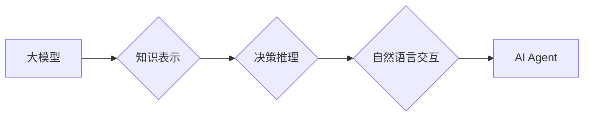

> 大模型、AI Agent、应用开发、实践指南、挑战与机遇

## 1. 背景介绍

近年来，大模型技术蓬勃发展，其强大的泛化能力和知识表示能力为人工智能领域带来了革命性的变革。大模型的出现，使得构建智能代理（AI Agent）成为可能，并为我们提供了一种全新的视角去理解和构建智能系统。

AI Agent是指能够感知环境、做出决策并与环境交互的智能体。传统的AI Agent通常依赖于领域特定知识和规则，而大模型则能够通过学习海量数据，自动提取知识和构建决策模型，从而实现更灵活、更智能的交互。

大模型应用开发，特别是AI Agent的开发，正处于一个充满机遇和挑战的阶段。一方面，大模型的强大能力为我们提供了无限的可能性，另一方面，其复杂性、训练成本和伦理问题也需要我们认真思考和解决。

## 2. 核心概念与联系

### 2.1 大模型

大模型是指参数量巨大、训练数据海量的人工智能模型。其强大的学习能力使其能够在各种任务中表现出色，例如自然语言处理、图像识别、代码生成等。

### 2.2 AI Agent

AI Agent是指能够感知环境、做出决策并与环境交互的智能体。它通常由以下几个部分组成：

* **感知模块:** 用于获取环境信息，例如传感器数据、文本信息、图像信息等。
* **决策模块:** 用于根据环境信息做出决策，例如选择行动、制定策略等。
* **执行模块:** 用于执行决策，例如控制机器人运动、生成文本、发送指令等。

### 2.3 大模型与AI Agent的联系

大模型可以为AI Agent提供强大的能力，例如：

* **知识表示:** 大模型能够学习和表示丰富的知识，为AI Agent提供更深层的理解能力。
* **决策推理:** 大模型可以学习复杂的决策规则，帮助AI Agent做出更智能的决策。
* **自然语言交互:** 大模型可以理解和生成自然语言，使AI Agent能够与人类进行更自然的交互。

**Mermaid 流程图**



## 3. 核心算法原理 & 具体操作步骤

### 3.1 算法原理概述

大模型训练通常采用深度学习算法，例如Transformer模型。Transformer模型通过自注意力机制学习文本序列之间的关系，并能够捕捉长距离依赖关系。

### 3.2 算法步骤详解

1. **数据预处理:** 将原始数据清洗、格式化和转换为模型可理解的格式。
2. **模型构建:** 根据任务需求选择合适的模型架构，例如BERT、GPT、T5等。
3. **模型训练:** 使用训练数据训练模型，并通过优化算法调整模型参数，使模型在训练数据上达到最佳性能。
4. **模型评估:** 使用测试数据评估模型性能，并根据评估结果进行模型调优。
5. **模型部署:** 将训练好的模型部署到生产环境中，用于实际应用。

### 3.3 算法优缺点

**优点:**

* 强大的泛化能力
* 能够学习复杂的模式
* 适用于多种任务

**缺点:**

* 训练成本高
* 需要海量数据
* 容易出现过拟合问题

### 3.4 算法应用领域

* 自然语言处理：文本分类、情感分析、机器翻译、文本生成等
* 图像识别：物体检测、图像分类、图像分割等
* 代码生成：自动生成代码、代码修复等
* 药物研发：药物发现、药物设计等

## 4. 数学模型和公式 & 详细讲解 & 举例说明

### 4.1 数学模型构建

大模型的训练过程可以看作是一个优化问题，目标是找到一个模型参数向量，使得模型在训练数据上的损失函数最小。

损失函数通常采用交叉熵损失函数，用于衡量模型预测结果与真实标签之间的差异。

### 4.2 公式推导过程

交叉熵损失函数的公式如下：

$$
L = -\sum_{i=1}^{N} y_i \log(\hat{y}_i)
$$

其中：

* $N$ 是样本数量
* $y_i$ 是真实标签
* $\hat{y}_i$ 是模型预测结果

### 4.3 案例分析与讲解

假设我们训练一个文本分类模型，目标是将文本分类为正类或负类。

训练数据包含100个样本，每个样本包含一个文本和一个标签（正类或负类）。

模型预测结果如下：

* 样本1：预测结果为正类，真实标签为正类
* 样本2：预测结果为负类，真实标签为负类
* ...
* 样本100：预测结果为正类，真实标签为负类

使用交叉熵损失函数计算损失值，并根据损失值更新模型参数。

## 5. 项目实践：代码实例和详细解释说明

### 5.1 开发环境搭建

* Python 3.7+
* TensorFlow 2.x 或 PyTorch 1.x
* CUDA 和 cuDNN (可选，用于GPU加速)

### 5.2 源代码详细实现

```python
import tensorflow as tf

# 定义模型架构
model = tf.keras.Sequential([
    tf.keras.layers.Embedding(input_dim=vocab_size, output_dim=embedding_dim),
    tf.keras.layers.LSTM(units=128),
    tf.keras.layers.Dense(units=1, activation='sigmoid')
])

# 编译模型
model.compile(optimizer='adam', loss='binary_crossentropy', metrics=['accuracy'])

# 训练模型
model.fit(x_train, y_train, epochs=10, batch_size=32)

# 评估模型
loss, accuracy = model.evaluate(x_test, y_test)
print('Loss:', loss)
print('Accuracy:', accuracy)
```

### 5.3 代码解读与分析

* **模型架构:** 使用了嵌入层、LSTM层和全连接层构建模型。嵌入层将单词映射到低维向量空间，LSTM层捕捉文本序列中的长距离依赖关系，全连接层输出预测结果。
* **编译模型:** 使用Adam优化器、交叉熵损失函数和准确率作为评估指标。
* **训练模型:** 使用训练数据训练模型，设置训练轮数和批处理大小。
* **评估模型:** 使用测试数据评估模型性能，输出损失值和准确率。

### 5.4 运行结果展示

训练完成后，可以将模型部署到生产环境中，用于实际应用。例如，可以将模型部署到聊天机器人中，使聊天机器人能够理解用户自然语言输入并做出相应的回复。

## 6. 实际应用场景

### 6.1 聊天机器人

大模型可以用于构建更智能、更自然的聊天机器人，能够理解用户意图，并提供更准确、更相关的回复。

### 6.2 文本生成

大模型可以用于生成各种类型的文本，例如文章、故事、诗歌等。

### 6.3 机器翻译

大模型可以用于机器翻译，能够将文本从一种语言翻译成另一种语言。

### 6.4 代码生成

大模型可以用于自动生成代码，提高开发效率。

### 6.5 未来应用展望

大模型的应用场景还在不断扩展，未来将应用于更多领域，例如：

* 教育：个性化学习、智能辅导
* 医疗：疾病诊断、药物研发
* 金融：风险评估、欺诈检测
* 娱乐：游戏开发、内容创作

## 7. 工具和资源推荐

### 7.1 学习资源推荐

* **书籍:**
    * 《深度学习》
    * 《自然语言处理》
    * 《机器学习》
* **在线课程:**
    * Coursera
    * edX
    * Udacity

### 7.2 开发工具推荐

* **TensorFlow:** 开源深度学习框架
* **PyTorch:** 开源深度学习框架
* **Hugging Face Transformers:** 大模型库

### 7.3 相关论文推荐

* **BERT: Pre-training of Deep Bidirectional Transformers for Language Understanding**
* **GPT-3: Language Models are Few-Shot Learners**
* **T5: Text-to-Text Transfer Transformer**

## 8. 总结：未来发展趋势与挑战

### 8.1 研究成果总结

大模型技术取得了显著进展，在自然语言处理、图像识别等领域取得了突破性成果。

### 8.2 未来发展趋势

* **模型规模进一步扩大:** 随着计算能力的提升，大模型的规模将继续扩大，模型能力将进一步提升。
* **多模态学习:** 大模型将融合文本、图像、音频等多模态数据，实现更全面的理解和交互。
* **可解释性增强:** 研究人员将致力于提高大模型的可解释性，使模型决策更加透明和可理解。

### 8.3 面临的挑战

* **训练成本高:** 大模型的训练成本非常高，需要大量的计算资源和数据。
* **数据安全和隐私:** 大模型的训练需要大量数据，如何保证数据安全和隐私是一个重要问题。
* **伦理问题:** 大模型的应用可能带来一些伦理问题，例如算法偏见、信息操纵等，需要引起重视和解决。

### 8.4 研究展望

未来，大模型技术将继续发展，并应用于更多领域，为人类社会带来更多福祉。

## 9. 附录：常见问题与解答

### 9.1 什么是参数量？

参数量是指模型中需要学习的变量数量。模型参数量越大，模型的容量越大，能够学习的知识也越多。

### 9.2 如何选择合适的模型架构？

选择合适的模型架构取决于具体的任务需求。例如，对于文本分类任务，可以使用BERT、RoBERTa等预训练模型；对于图像识别任务，可以使用ResNet、EfficientNet等模型。

### 9.3 如何评估大模型的性能？

大模型的性能可以通过各种指标评估，例如准确率、召回率、F1-score等。

### 9.4 如何解决大模型的过拟合问题？

过拟合是指模型在训练数据上表现很好，但在测试数据上表现较差。

解决过拟合问题的方法包括：

* 增加训练数据量
* 使用正则化技术
* 使用Dropout技术
* 使用早停策略


作者：禅与计算机程序设计艺术 / Zen and the Art of Computer Programming 
<end_of_turn>