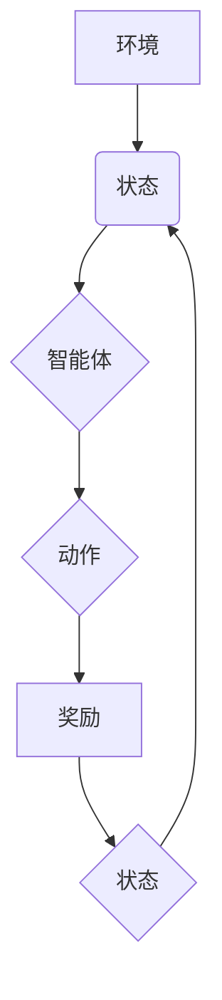

> 深度学习，强化学习，Q网络，DQN，目标函数，经验回放，深度Q网络，游戏AI

## 1. 背景介绍

在人工智能领域，强化学习 (Reinforcement Learning, RL) 作为一种模仿人类学习方式的算法，近年来取得了显著的进展。它通过让智能体在环境中与环境交互，学习最优策略来最大化奖励，从而解决复杂决策问题。深度强化学习 (Deep Reinforcement Learning, DRL) 将深度学习技术与强化学习相结合，进一步提升了智能体的学习能力和解决复杂问题的能力。

深度Q网络 (Deep Q-Network, DQN) 是DRL领域的重要里程碑，它将深度神经网络应用于Q函数的估计，有效地解决了传统Q学习算法在高维状态空间中的效率问题。DQN的提出，为游戏AI、机器人控制、自动驾驶等领域提供了强大的工具，推动了人工智能技术的快速发展。

## 2. 核心概念与联系

**2.1 强化学习基本概念**

强化学习的核心在于智能体与环境的交互过程。智能体通过与环境交互，获得奖励或惩罚，并根据这些反馈调整其行为策略，最终学习到最优策略，以最大化累积奖励。

* **智能体 (Agent):**  学习和决策的实体。
* **环境 (Environment):** 智能体所处的外部世界。
* **状态 (State):** 环境的当前状态。
* **动作 (Action):** 智能体在特定状态下可以执行的操作。
* **奖励 (Reward):** 环境对智能体动作的反馈，可以是正向奖励或负向惩罚。
* **策略 (Policy):** 智能体在不同状态下选择动作的规则。

**2.2 Q函数与价值估计**

Q函数 (Q-function) 是强化学习的核心概念之一，它表示在特定状态下执行特定动作的期望累积奖励。

* **Q(s, a):** 表示在状态s下执行动作a的期望累积奖励。

Q函数的估计是强化学习算法的核心任务。通过学习Q函数，智能体可以评估不同状态下不同动作的价值，从而选择最优动作。

**2.3 深度Q网络 (DQN) 架构**

DQN将深度神经网络应用于Q函数的估计，从而能够处理高维状态空间。DQN的架构通常包含以下部分：

* **输入层:**  接收环境的状态信息。
* **隐藏层:**  对状态信息进行特征提取和表示。
* **输出层:**  输出每个动作对应的Q值。

DQN使用深度神经网络学习Q函数，通过训练网络参数，使网络能够准确估计不同状态下不同动作的价值。



## 3. 核心算法原理 & 具体操作步骤

### 3.1 算法原理概述

DQN的核心思想是利用深度神经网络学习Q函数，并通过经验回放和目标网络来稳定训练过程。

* **深度神经网络:**  用于估计Q函数，将状态信息映射到动作对应的Q值。
* **经验回放:**  将训练过程中收集到的状态、动作、奖励和下一个状态存储在经验池中，并随机采样经验进行训练，避免训练过程中的样本相关性问题。
* **目标网络:**  与主网络共享相同的网络结构，但参数更新频率较低，用于计算目标Q值，稳定训练过程。

### 3.2 算法步骤详解

1. **初始化:** 初始化深度神经网络参数，并创建经验池。
2. **环境交互:** 智能体与环境交互，收集状态、动作、奖励和下一个状态的经验。
3. **经验存储:** 将收集到的经验存储到经验池中。
4. **经验采样:** 从经验池中随机采样多个经验样本。
5. **目标Q值计算:** 使用目标网络计算目标Q值，即在下一个状态下执行最优动作的期望累积奖励。
6. **损失函数计算:** 计算主网络预测的Q值与目标Q值的损失函数。
7. **参数更新:** 使用梯度下降算法更新主网络参数，最小化损失函数。
8. **目标网络更新:** 定期更新目标网络参数，使其与主网络参数保持一致。
9. **重复步骤2-8:**  重复以上步骤，直到训练完成。

### 3.3 算法优缺点

**优点:**

* **能够处理高维状态空间:** 深度神经网络可以学习复杂的状态表示，适用于高维状态空间的问题。
* **学习能力强:**  深度学习算法能够从大量数据中学习，提高智能体的学习能力。
* **应用广泛:**  DQN在游戏AI、机器人控制、自动驾驶等领域都有广泛的应用。

**缺点:**

* **训练时间长:**  深度神经网络的训练时间较长，需要大量的计算资源。
* **参数量大:**  深度神经网络的参数量较大，容易过拟合。
* **探索与利用的平衡:**  DQN在探索新策略和利用已知策略之间需要找到平衡点。

### 3.4 算法应用领域

DQN在以下领域具有广泛的应用前景:

* **游戏AI:**  DQN可以训练智能体玩各种游戏，例如围棋、Go、Atari游戏等。
* **机器人控制:**  DQN可以训练机器人执行复杂的任务，例如导航、抓取、组装等。
* **自动驾驶:**  DQN可以训练自动驾驶汽车在复杂道路环境中行驶。
* **医疗诊断:**  DQN可以辅助医生进行疾病诊断，提高诊断准确率。

## 4. 数学模型和公式 & 详细讲解 & 举例说明

### 4.1 数学模型构建

DQN的核心数学模型是Q函数，它表示在特定状态下执行特定动作的期望累积奖励。

$$Q(s, a) = E[\sum_{t=0}^{\infty} \gamma^t r_{t+1} | s_t = s, a_t = a]$$

其中：

* $s$ 表示状态。
* $a$ 表示动作。
* $r_{t+1}$ 表示在时间步t+1获得的奖励。
* $\gamma$ 表示折扣因子，控制未来奖励的权重。

### 4.2 公式推导过程

DQN的目标是学习一个能够估计Q函数的深度神经网络。

训练过程的目标是最小化预测Q值与目标Q值之间的损失函数。

$$L = \frac{1}{N} \sum_{i=1}^{N} (y_i - Q(s_i, a_i))^2$$

其中：

* $N$ 表示样本数量。
* $y_i$ 表示目标Q值，计算公式如下：

$$y_i = r_{i+1} + \gamma \max_{a'} Q(s_{i+1}, a')$$

### 4.3 案例分析与讲解

假设一个智能体在玩一个简单的游戏，状态空间是游戏中的地图，动作空间是向上、向下、向左、向右四个方向。

DQN可以学习到每个状态下执行不同动作的期望累积奖励，从而选择最优动作，例如在某个状态下，向右移动可能获得更高的奖励，因此DQN会学习到在该状态下执行向右移动动作的Q值更高。

## 5. 项目实践：代码实例和详细解释说明

### 5.1 开发环境搭建

* Python 3.x
* TensorFlow 或 PyTorch 深度学习框架
* OpenAI Gym 游戏环境

### 5.2 源代码详细实现

```python
import tensorflow as tf
import numpy as np
from tensorflow.keras.models import Sequential
from tensorflow.keras.layers import Dense

# 定义DQN网络
class DQN(tf.keras.Model):
    def __init__(self, state_size, action_size):
        super(DQN, self).__init__()
        self.dense1 = Dense(64, activation='relu')
        self.dense2 = Dense(64, activation='relu')
        self.output = Dense(action_size, activation='linear')

    def call(self, state):
        x = self.dense1(state)
        x = self.dense2(x)
        return self.output(x)

# 初始化DQN网络
state_size = 4  # 游戏状态维度
action_size = 4  # 动作维度
dqn = DQN(state_size, action_size)

# 定义损失函数和优化器
optimizer = tf.keras.optimizers.Adam(learning_rate=0.001)
loss_fn = tf.keras.losses.MeanSquaredError()

# 训练循环
for episode in range(1000):
    # ... (游戏环境交互和经验收集)
    # ... (经验回放和目标Q值计算)
    with tf.GradientTape() as tape:
        # 计算预测Q值
        q_values = dqn(state)
        # 计算损失
        loss = loss_fn(target_q_values, q_values)
    # 更新网络参数
    gradients = tape.gradient(loss, dqn.trainable_variables)
    optimizer.apply_gradients(zip(gradients, dqn.trainable_variables))
```

### 5.3 代码解读与分析

* **DQN网络定义:**  使用TensorFlow构建一个深度神经网络，包含两层全连接层和一层输出层，输出每个动作对应的Q值。
* **损失函数和优化器:**  使用均方误差损失函数和Adam优化器进行训练。
* **训练循环:**  循环进行游戏环境交互、经验收集、经验回放、目标Q值计算、损失计算和参数更新。

### 5.4 运行结果展示

训练完成后，DQN模型能够学习到每个状态下执行不同动作的期望累积奖励，从而选择最优动作，并在游戏中获得更高的分数。

## 6. 实际应用场景

DQN在以下实际应用场景中取得了显著的成果:

* **游戏AI:**  AlphaGo使用DQN算法战胜了世界围棋冠军，证明了DQN在复杂策略决策问题上的强大能力。
* **机器人控制:**  DQN可以训练机器人执行复杂的任务，例如导航、抓取、组装等，提高机器人自动化程度。
* **自动驾驶:**  DQN可以训练自动驾驶汽车在复杂道路环境中行驶，提高自动驾驶汽车的安全性和可靠性。

### 6.4 未来应用展望

DQN在未来将有更广泛的应用前景，例如:

* **个性化推荐:**  DQN可以根据用户的行为数据学习用户的偏好，提供个性化的商品推荐。
* **医疗诊断:**  DQN可以辅助医生进行疾病诊断，提高诊断准确率。
* **金融交易:**  DQN可以学习金融市场数据，进行智能投资决策。

## 7. 工具和资源推荐

### 7.1 学习资源推荐

* **书籍:**
    * 《深度强化学习》
    * 《强化学习：算法、策略和应用》
* **在线课程:**
    * Coursera: 强化学习
    * Udacity: 深度强化学习
* **博客和网站:**
    * OpenAI Blog
    * DeepMind Blog

### 7.2 开发工具推荐

* **TensorFlow:**  开源深度学习框架
* **PyTorch:**  开源深度学习框架
* **OpenAI Gym:**  游戏环境库

### 7.3 相关论文推荐

* **Playing Atari with Deep Reinforcement Learning**
* **Human-level control through deep reinforcement learning**
* **Deep Q-Network**

## 8. 总结：未来发展趋势与挑战

### 8.1 研究成果总结

DQN算法的提出，为深度强化学习领域带来了重大突破，推动了智能体学习能力的提升，并在游戏AI、机器人控制、自动驾驶等领域取得了显著的成果。

### 8.2 未来发展趋势

* **探索更有效的训练算法:**  提高训练效率，减少训练时间，降低计算资源需求。
