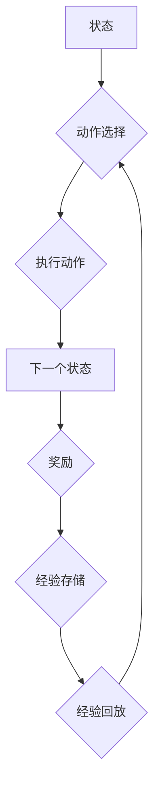

> Deep Q-Network (DQN), 目标网络, 误差修正, 强化学习, 价值函数, 贪婪策略

## 1. 背景介绍

强化学习 (Reinforcement Learning, RL) 作为机器学习领域的重要分支，近年来在游戏、机器人控制、自动驾驶等领域取得了显著进展。其中，Deep Q-Network (DQN) 算法作为首个将深度神经网络应用于强化学习的算法，为 RL 领域带来了革命性的变革。DQN 算法的核心在于利用深度神经网络学习状态-动作价值函数 (Q-function)，并通过贪婪策略选择最优动作。

然而，传统的 Q-learning 算法在面对高维状态空间和复杂环境时，容易陷入局部最优解，学习效率低下。DQN 算法通过引入目标网络 (Target Network) 和经验回放 (Experience Replay) 技术，有效解决了这些问题，显著提高了学习效率和稳定性。

## 2. 核心概念与联系

DQN 算法的核心概念包括：

* **状态-动作价值函数 (Q-function):**  Q-function 描述了在给定状态下执行特定动作的期望回报。
* **目标网络 (Target Network):** 目标网络是一个与主网络结构相同的网络，其权重参数是主网络权重参数的固定版本。
* **经验回放 (Experience Replay):** 经验回放是一种存储历史经验 (状态、动作、奖励、下一个状态) 的机制，并随机采样这些经验进行训练。
* **贪婪策略 (Greedy Policy):** 贪婪策略选择在当前状态下 Q-function 值最大的动作。

**Mermaid 流程图:**



## 3. 核心算法原理 & 具体操作步骤

### 3.1  算法原理概述

DQN 算法的核心思想是利用深度神经网络学习状态-动作价值函数，并通过贪婪策略选择最优动作。

* **主网络:** 主网络负责预测状态-动作价值函数，其权重参数通过训练更新。
* **目标网络:** 目标网络是一个与主网络结构相同的网络，其权重参数是主网络权重参数的固定版本。目标网络用于计算目标 Q 值，避免主网络更新过程中出现震荡和不稳定。
* **经验回放:** 经验回放机制将历史经验存储在一个缓冲池中，并随机采样这些经验进行训练。这有助于稳定训练过程，并提高学习效率。

### 3.2  算法步骤详解

1. **初始化:** 初始化主网络和目标网络的权重参数。
2. **环境交互:** 与环境交互，获取当前状态、执行动作、获得奖励和下一个状态。
3. **经验存储:** 将当前状态、动作、奖励和下一个状态存储到经验缓冲池中。
4. **经验回放:** 从经验缓冲池中随机采样一批经验。
5. **目标 Q 值计算:** 使用目标网络计算目标 Q 值。
6. **主网络更新:** 使用主网络预测 Q 值，并根据目标 Q 值进行反向传播和梯度更新。
7. **目标网络更新:** 定期更新目标网络的权重参数，使其与主网络权重参数保持一致。
8. **重复步骤 2-7:** 重复上述步骤，直到达到预设的训练目标。

### 3.3  算法优缺点

**优点:**

* **高效学习:** 经验回放和目标网络机制有效提高了学习效率。
* **适用于高维状态空间:** 深度神经网络可以处理高维状态空间。
* **可扩展性强:** 可以应用于各种强化学习任务。

**缺点:**

* **训练过程复杂:** 需要仔细调参和设计网络结构。
* **计算资源消耗大:** 深度神经网络训练需要大量的计算资源。
* **可能陷入局部最优解:** 贪婪策略可能会导致算法陷入局部最优解。

### 3.4  算法应用领域

DQN 算法已广泛应用于以下领域:

* **游戏:** 围棋、Go、Atari 游戏等。
* **机器人控制:** 机器人导航、抓取、运动控制等。
* **自动驾驶:** 车辆路径规划、避障、决策控制等。
* **金融:** 股票交易、风险管理等。

## 4. 数学模型和公式 & 详细讲解 & 举例说明

### 4.1  数学模型构建

DQN 算法的核心数学模型是状态-动作价值函数 (Q-function)。

$$
Q(s, a) = E[\sum_{t=0}^{\infty} \gamma^t r_{t+1} | s_t = s, a_t = a]
$$

其中:

* $s$ 表示状态
* $a$ 表示动作
* $r_{t+1}$ 表示在时间步 $t+1$ 获得的奖励
* $\gamma$ 表示折扣因子，控制未来奖励的权重

### 4.2  公式推导过程

DQN 算法的目标是学习一个能够最大化 Q-function 的策略。

$$
\pi^* = \arg\max_{\pi} E_{\pi} [R]
$$

其中:

* $\pi^*$ 表示最优策略
* $R$ 表示总奖励

DQN 算法使用深度神经网络来逼近 Q-function，并通过最小化以下损失函数来更新网络权重:

$$
L = \frac{1}{N} \sum_{i=1}^{N} (y_i - Q(s_i, a_i))^2
$$

其中:

* $N$ 表示样本数量
* $y_i$ 表示目标 Q 值，计算公式如下:

$$
y_i = r_{i+1} + \gamma \max_{a'} Q(s_{i+1}, a')
$$

### 4.3  案例分析与讲解

假设我们有一个简单的游戏环境，其中玩家可以选择向上、向下、向左、向右四个动作。

* 状态 $s$ 可以表示玩家当前的位置。
* 动作 $a$ 可以表示玩家选择的移动方向。
* 奖励 $r$ 可以表示玩家获得的积分或惩罚。

DQN 算法可以学习一个 Q-function，该函数可以预测在给定状态下执行特定动作的期望回报。例如，如果玩家在某个位置执行向上移动动作，DQN 算法可以预测执行该动作的期望回报。

## 5. 项目实践：代码实例和详细解释说明

### 5.1  开发环境搭建

* Python 3.x
* TensorFlow 或 PyTorch 深度学习框架
* OpenAI Gym 游戏环境

### 5.2  源代码详细实现

```python
import tensorflow as tf
import numpy as np

# 定义 DQN 网络结构
class DQN(tf.keras.Model):
    def __init__(self, state_size, action_size):
        super(DQN, self).__init__()
        self.dense1 = tf.keras.layers.Dense(64, activation='relu')
        self.dense2 = tf.keras.layers.Dense(64, activation='relu')
        self.output = tf.keras.layers.Dense(action_size)

    def call(self, state):
        x = self.dense1(state)
        x = self.dense2(x)
        return self.output(x)

# 定义 DQN 算法
class DQNAgent:
    def __init__(self, state_size, action_size, learning_rate=0.001, gamma=0.99, epsilon=1.0, epsilon_decay=0.995, epsilon_min=0.01):
        self.state_size = state_size
        self.action_size = action_size
        self.learning_rate = learning_rate
        self.gamma = gamma
        self.epsilon = epsilon
        self.epsilon_decay = epsilon_decay
        self.epsilon_min = epsilon_min
        self.model = DQN(state_size, action_size)
        self.target_model = DQN(state_size, action_size)
        self.optimizer = tf.keras.optimizers.Adam(learning_rate=self.learning_rate)

    def choose_action(self, state):
        if np.random.rand() < self.epsilon:
            return np.random.randint(self.action_size)
        else:
            q_values = self.model(state)
            return np.argmax(q_values[0])

    def train(self, state, action, reward, next_state, done):
        with tf.GradientTape() as tape:
            target_q_values = self.target_model(next_state)
            target_q_values = reward + self.gamma * np.max(target_q_values, axis=1) * (1 - done)
            q_values = self.model(state)
            loss = tf.keras.losses.MeanSquaredError()(target_q_values, q_values[0, action])
        gradients = tape.gradient(loss, self.model.trainable_variables)
        self.optimizer.apply_gradients(zip(gradients, self.model.trainable_variables))

        self.epsilon = max(self.epsilon * self.epsilon_decay, self.epsilon_min)

    def update_target_model(self):
        self.target_model.set_weights(self.model.get_weights())

# ... (其他代码)
```

### 5.3  代码解读与分析

* **DQN 网络结构:** 代码中定义了一个 DQN 网络结构，该网络包含两层全连接层和一层输出层。
* **DQN 算法:** 代码中定义了一个 DQNAgent 类，该类实现了 DQN 算法的核心逻辑，包括选择动作、训练模型和更新目标网络。
* **训练过程:** 训练过程包括以下步骤:
    * 根据当前状态选择动作。
    * 执行动作并获得奖励和下一个状态。
    * 使用目标 Q 值更新模型权重。
    * 定期更新目标网络的权重。

### 5.4  运行结果展示

训练完成后，可以将训练好的模型应用于游戏环境中，观察其在游戏中的表现。

## 6. 实际应用场景

DQN 算法已在许多实际应用场景中取得成功，例如:

* **AlphaGo:** DeepMind 使用 DQN 算法训练了 AlphaGo，该程序在围棋游戏中战胜了世界冠军。
* **Atari 游戏:** DQN 算法成功地学习了 Atari 游戏中的许多经典游戏，例如 Breakout、Space Invaders 和 CartPole。
* **机器人控制:** DQN 算法被用于训练机器人进行导航、抓取和运动控制等任务。

### 6.4  未来应用展望

DQN 算法在未来将有更广泛的应用前景，例如:

* **自动驾驶:** DQN 算法可以用于训练自动驾驶汽车进行路径规划、避障和决策控制。
* **医疗诊断:** DQN 算法可以用于分析医学图像，辅助医生进行诊断。
* **金融交易:** DQN 算法可以用于开发智能交易系统，进行股票交易和风险管理。

## 7. 工具和资源推荐

### 7.1  学习资源推荐

* **书籍:**
    * Deep Reinforcement Learning Hands-On by Maxim Lapan
    * Reinforcement Learning: An Introduction by Richard S. Sutton and Andrew G. Barto
* **在线课程:**
    * Deep Reinforcement Learning Specialization by DeepLearning.AI
    * Reinforcement Learning by David Silver (University of DeepMind)

### 7.2  开发工具推荐

* **TensorFlow:** https://www.tensorflow.org/
* **PyTorch:** https://pytorch.org/
* **OpenAI Gym:** https://gym.openai.com/

### 7.3  相关论文推荐

* **Playing Atari with Deep Reinforcement Learning** by Mnih et al. (2