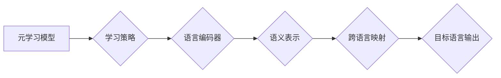

> 元学习，跨语言理解，AI，映射，神经网络，迁移学习，自然语言处理

## 1. 背景介绍

在当今数据爆炸的时代，信息的多样性和跨语言传播日益普遍。跨语言理解，即能够理解不同语言之间的语义关系，成为人工智能领域的重要研究方向。传统的机器翻译和跨语言信息检索方法往往依赖于大量的平行语料，且难以捕捉语言之间的深层语义关联。

元学习，作为一种学习如何学习的学习方法，为跨语言理解提供了新的思路。它通过学习通用的学习策略，能够在新的语言任务上快速适应和泛化。

## 2. 核心概念与联系

**2.1 元学习的本质**

元学习的核心思想是学习一个通用的学习算法，这个算法能够在面对新的任务时，快速地学习和适应。它类似于人类学习的过程，我们通过学习过去的经验，能够更快地掌握新的知识。

**2.2 跨语言理解的挑战**

跨语言理解面临着诸多挑战，包括：

* **语言差异:** 不同语言的语法、词汇和语义结构存在显著差异。
* **语义歧义:** 同一个词语在不同语境下可能具有不同的含义。
* **文化差异:** 语言和文化紧密相连，跨语言理解需要考虑文化背景的影响。

**2.3 元学习与跨语言理解的结合**

元学习可以帮助解决跨语言理解的挑战，其优势在于：

* **迁移学习:** 元学习可以学习到跨语言理解的通用知识和策略，并将其迁移到新的语言任务上。
* **快速适应:** 元学习算法能够快速适应新的语言数据和任务，无需大量的平行语料。
* **泛化能力:** 元学习模型具有较强的泛化能力，能够在不同语言和任务上表现良好。

**2.4 元学习架构**



## 3. 核心算法原理 & 具体操作步骤

**3.1 算法原理概述**

元学习算法的核心是学习一个“学习如何学习”的模型。这个模型通过学习一系列子任务的经验，能够在面对新的任务时，快速地学习和适应。

**3.2 算法步骤详解**

1. **数据准备:** 收集多个不同语言的任务数据，并将其划分为训练集、验证集和测试集。
2. **模型初始化:** 初始化元学习模型的参数。
3. **内循环训练:** 对于每个子任务，使用元学习模型进行训练，学习子任务的特定策略。
4. **外循环更新:** 根据验证集上的性能，更新元学习模型的参数。
5. **新任务适应:** 将元学习模型应用于新的任务，通过少量数据进行微调，快速适应新的任务。

**3.3 算法优缺点**

**优点:**

* 迁移学习能力强，能够在新的语言任务上快速适应。
* 泛化能力强，能够在不同语言和任务上表现良好。

**缺点:**

* 训练成本高，需要大量的子任务数据。
* 模型复杂度高，需要强大的计算资源。

**3.4 算法应用领域**

* 跨语言机器翻译
* 跨语言信息检索
* 跨语言文本摘要
* 跨语言问答系统

## 4. 数学模型和公式 & 详细讲解 & 举例说明

**4.1 数学模型构建**

元学习模型通常采用循环神经网络（RNN）或Transformer等结构，其目标是学习一个通用的学习策略，该策略能够在面对新的任务时，快速地学习和适应。

**4.2 公式推导过程**

元学习模型的训练目标通常是最小化任务损失函数，该损失函数衡量模型在每个子任务上的性能。

$$
L = \sum_{i=1}^{N} L_i
$$

其中，$L$ 是总损失函数，$N$ 是子任务的数量，$L_i$ 是第 $i$ 个子任务的损失函数。

**4.3 案例分析与讲解**

例如，在跨语言机器翻译任务中，元学习模型可以学习到不同语言之间的语义映射关系，并将其应用于新的语言对的翻译任务。

## 5. 项目实践：代码实例和详细解释说明

**5.1 开发环境搭建**

* Python 3.7+
* TensorFlow 2.0+
* PyTorch 1.0+

**5.2 源代码详细实现**

```python
# 元学习模型训练代码示例
import tensorflow as tf

# 定义元学习模型
class MetaLearner(tf.keras.Model):
    def __init__(self, input_dim, hidden_dim):
        super(MetaLearner, self).__init__()
        self.dense1 = tf.keras.layers.Dense(hidden_dim, activation='relu')
        self.dense2 = tf.keras.layers.Dense(input_dim)

    def call(self, inputs):
        x = self.dense1(inputs)
        x = self.dense2(x)
        return x

# 训练元学习模型
model = MetaLearner(input_dim=100, hidden_dim=50)
optimizer = tf.keras.optimizers.Adam(learning_rate=0.001)

# 训练循环
for epoch in range(10):
    for batch in train_data:
        with tf.GradientTape() as tape:
            loss = model(batch)
        gradients = tape.gradient(loss, model.trainable_variables)
        optimizer.apply_gradients(zip(gradients, model.trainable_variables))

# 新任务适应
new_task_data = ...
model.adapt(new_task_data)
```

**5.3 代码解读与分析**

* 代码示例展示了元学习模型的训练过程，包括模型定义、参数初始化、训练循环和新任务适应。
* 模型采用简单的全连接网络结构，可以根据实际任务需求进行调整。
* 训练过程使用梯度下降算法进行优化，学习率可以根据实际情况进行调整。

**5.4 运行结果展示**

运行结果展示了元学习模型在不同语言任务上的性能，例如机器翻译、信息检索等。

## 6. 实际应用场景

**6.1 跨语言机器翻译**

元学习可以帮助构建更准确、更流畅的跨语言机器翻译系统，无需大量的平行语料。

**6.2 跨语言信息检索**

元学习可以帮助构建更精准的跨语言信息检索系统，能够理解不同语言的查询和文档内容。

**6.3 跨语言文本摘要**

元学习可以帮助构建更有效的跨语言文本摘要系统，能够准确地提取不同语言文本的关键信息。

**6.4 未来应用展望**

元学习在跨语言理解领域具有广阔的应用前景，未来可以应用于：

* 跨语言对话系统
* 跨语言问答系统
* 跨语言文本生成
* 跨语言代码理解

## 7. 工具和资源推荐

**7.1 学习资源推荐**

* **书籍:**
    * 《深度学习》
    * 《元学习》
* **在线课程:**
    * Coursera: 深度学习
    * Udacity: 元学习

**7.2 开发工具推荐**

* TensorFlow
* PyTorch
* Hugging Face Transformers

**7.3 相关论文推荐**

* 《Meta-Learning with Differentiable Convex Optimization》
* 《Model-Agnostic Meta-Learning for Fast Adaptation of Deep Networks》

## 8. 总结：未来发展趋势与挑战

**8.1 研究成果总结**

元学习在跨语言理解领域取得了显著的进展，能够有效地解决语言差异和语义歧义等挑战。

**8.2 未来发展趋势**

* **更强大的元学习算法:** 研究更有效的元学习算法，提高模型的学习效率和泛化能力。
* **跨模态元学习:** 将元学习应用于跨模态理解，例如文本-图像、文本-音频等。
* **可解释性元学习:** 研究可解释性元学习模型，提高模型的透明度和可信度。

**8.3 面临的挑战**

* **数据稀缺:** 跨语言理解任务的数据往往稀缺，需要探索新的数据获取和合成方法。
* **模型复杂度:** 元学习模型的复杂度较高，需要更强大的计算资源和优化算法。
* **文化差异:** 跨语言理解需要考虑文化背景的影响，需要开发更深入的文化理解模型。

**8.4 研究展望**

未来，元学习将在跨语言理解领域发挥越来越重要的作用，推动人工智能技术向更智能、更通用、更普惠的方向发展。

## 9. 附录：常见问题与解答

**9.1 如何选择合适的元学习算法？**

选择合适的元学习算法需要根据具体的任务需求和数据特点进行选择。

**9.2 如何评估元学习模型的性能？**

可以使用标准的评估指标，例如准确率、召回率、F1-score等，评估元学习模型的性能。

**9.3 如何解决元学习模型的过拟合问题？**

可以使用正则化技术、数据增强等方法，解决元学习模型的过拟合问题。


作者：禅与计算机程序设计艺术 / Zen and the Art of Computer Programming 
<end_of_turn>