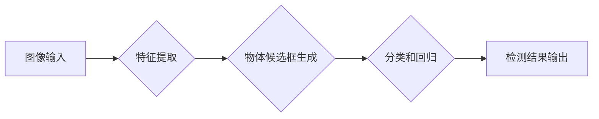

> 物体检测，物体识别，深度学习，卷积神经网络，YOLO，Faster R-CNN，目标跟踪，计算机视觉

## 1. 背景介绍

在当今数据爆炸的时代，图像和视频数据成为了信息的主要载体。人类能够通过视觉感知世界，而机器学习的进步使得计算机也具备了类似的能力。物体检测与识别作为计算机视觉领域的核心技术之一，赋予机器“看”的能力，使其能够理解和交互于视觉世界。

物体检测是指在图像或视频中定位和识别特定物体的任务，并为每个物体标注出其边界框。物体识别则是识别图像或视频中物体的类别，例如“猫”、“狗”、“汽车”等。

物体检测与识别技术在各个领域都有广泛的应用，例如：

* **自动驾驶:**  识别道路上的车辆、行人、交通信号灯等，帮助车辆安全行驶。
* **安防监控:**  识别入侵者、异常行为，提高安全防范水平。
* **医疗诊断:**  识别病灶、肿瘤等，辅助医生进行诊断。
* **零售业:**  识别商品、顾客行为，优化商品陈列和营销策略。
* **工业自动化:**  识别缺陷、异常情况，提高生产效率。

## 2. 核心概念与联系

物体检测与识别技术的核心是深度学习，特别是卷积神经网络（CNN）。CNN能够自动学习图像特征，并将其用于物体检测和识别。

**Mermaid 流程图:**



**核心概念:**

* **特征提取:**  CNN能够从图像中提取各种层次的特征，例如边缘、纹理、形状等。
* **物体候选框生成:**  通过区域建议网络（Region Proposal Network，RPN）等方法，生成候选物体区域。
* **分类和回归:**  对候选物体区域进行分类，并预测其边界框的坐标。

## 3. 核心算法原理 & 具体操作步骤

### 3.1  算法原理概述

常见的物体检测算法包括YOLO、Faster R-CNN等。

* **YOLO (You Only Look Once):**  YOLO是一种实时物体检测算法，它将图像划分为网格，每个网格预测多个物体候选框和类别概率。
* **Faster R-CNN:**  Faster R-CNN是一种基于区域建议网络的物体检测算法，它首先生成候选物体区域，然后对每个区域进行分类和回归。

### 3.2  算法步骤详解

**YOLO算法步骤:**

1. 将图像划分为S x S的网格。
2. 每个网格预测B个物体候选框和C个类别概率。
3. 使用损失函数计算预测结果与真实标签之间的误差。
4. 通过反向传播算法更新网络参数。

**Faster R-CNN算法步骤:**

1. 使用RPN生成候选物体区域。
2. 对每个候选区域进行特征提取。
3. 使用分类器对候选区域进行分类。
4. 使用回归器预测候选区域的边界框坐标。
5. 使用损失函数计算预测结果与真实标签之间的误差。
6. 通过反向传播算法更新网络参数。

### 3.3  算法优缺点

**YOLO算法:**

* **优点:**  实时性高，速度快。
* **缺点:**  检测精度相对较低。

**Faster R-CNN算法:**

* **优点:**  检测精度高。
* **缺点:**  速度相对较慢。

### 3.4  算法应用领域

YOLO算法主要应用于实时物体检测场景，例如自动驾驶、视频监控等。Faster R-CNN算法主要应用于需要高精度检测的场景，例如医疗诊断、工业缺陷检测等。

## 4. 数学模型和公式 & 详细讲解 & 举例说明

### 4.1  数学模型构建

物体检测算法通常使用损失函数来衡量预测结果与真实标签之间的误差。常见的损失函数包括：

* **分类损失函数:**  例如交叉熵损失函数，用于计算预测类别概率与真实类别之间的误差。
* **回归损失函数:**  例如均方误差损失函数，用于计算预测边界框坐标与真实边界框坐标之间的误差。

### 4.2  公式推导过程

**交叉熵损失函数:**

$$
L_{cls} = - \sum_{i=1}^{N} y_i \log(p_i)
$$

其中：

* $N$ 是图像中物体的数量。
* $y_i$ 是第 $i$ 个物体真实类别标签。
* $p_i$ 是模型预测第 $i$ 个物体类别概率。

**均方误差损失函数:**

$$
L_{reg} = \frac{1}{N} \sum_{i=1}^{N} \sum_{j=1}^{4} (b_i^j - \hat{b}_i^j)^2
$$

其中：

* $b_i^j$ 是第 $i$ 个物体真实边界框坐标的第 $j$ 个值。
* $\hat{b}_i^j$ 是模型预测第 $i$ 个物体边界框坐标的第 $j$ 个值。

### 4.3  案例分析与讲解

假设我们有一个图像，其中包含一个猫和一个狗。模型预测猫的类别概率为0.9，狗的类别概率为0.1。真实标签是猫和狗。

使用交叉熵损失函数计算分类损失：

$$
L_{cls} = - (0.9 \log(0.9) + 0.1 \log(0.1))
$$

使用均方误差损失函数计算回归损失：

$$
L_{reg} = \frac{1}{2} \sum_{j=1}^{4} ((b_1^j - \hat{b}_1^j)^2 + (b_2^j - \hat{b}_2^j)^2)
$$

其中 $b_1$ 和 $b_2$ 分别是猫和狗的真实边界框坐标，$\hat{b}_1$ 和 $\hat{b}_2$ 分别是模型预测的猫和狗边界框坐标。

## 5. 项目实践：代码实例和详细解释说明

### 5.1  开发环境搭建

* **操作系统:**  Ubuntu 18.04
* **Python版本:**  3.7
* **深度学习框架:**  TensorFlow 2.0
* **其他依赖库:**  OpenCV, NumPy, Matplotlib

### 5.2  源代码详细实现

```python
import tensorflow as tf
from tensorflow.keras.models import Model
from tensorflow.keras.layers import Input, Conv2D, MaxPooling2D, Flatten, Dense

# 定义模型输入
input_tensor = Input(shape=(224, 224, 3))

# 卷积层
x = Conv2D(32, (3, 3), activation='relu')(input_tensor)
x = MaxPooling2D((2, 2))(x)
x = Conv2D(64, (3, 3), activation='relu')(x)
x = MaxPooling2D((2, 2))(x)

# 全连接层
x = Flatten()(x)
x = Dense(128, activation='relu')(x)
output_tensor = Dense(10, activation='softmax')(x)

# 创建模型
model = Model(inputs=input_tensor, outputs=output_tensor)

# 编译模型
model.compile(optimizer='adam', loss='categorical_crossentropy', metrics=['accuracy'])

# 训练模型
model.fit(train_data, train_labels, epochs=10)
```

### 5.3  代码解读与分析

* **模型结构:**  该代码实现了一个简单的卷积神经网络模型，用于图像分类。模型包含多个卷积层和池化层，用于提取图像特征，以及全连接层，用于分类。
* **数据准备:**  需要准备训练数据和标签，并将其转换为模型可识别的格式。
* **模型训练:**  使用训练数据和标签训练模型，并使用交叉熵损失函数和Adam优化器。
* **模型评估:**  使用测试数据评估模型的性能，并计算准确率等指标。

### 5.4  运行结果展示

训练完成后，可以使用测试数据评估模型的性能。

## 6. 实际应用场景

### 6.1  自动驾驶

物体检测技术在自动驾驶中扮演着至关重要的角色，例如识别道路上的车辆、行人、交通信号灯等，帮助车辆安全行驶。

### 6.2  安防监控

物体检测技术可以用于安防监控系统，识别入侵者、异常行为，提高安全防范水平。

### 6.3  医疗诊断

物体检测技术可以用于医疗图像分析，识别病灶、肿瘤等，辅助医生进行诊断。

### 6.4  未来应用展望

随着深度学习技术的不断发展，物体检测与识别技术将应用于更多领域，例如：

* **智能家居:**  识别家庭成员、宠物等，提供个性化服务。
* **机器人技术:**  帮助机器人理解周围环境，进行导航和交互。
* **增强现实:**  将虚拟物体叠加到现实世界中，提供更丰富的交互体验。

## 7. 工具和资源推荐

### 7.1  学习资源推荐

* **书籍:**  
    * “深度学习” by Ian Goodfellow, Yoshua Bengio, Aaron Courville
    * “计算机视觉:算法与应用” by Richard Szeliski
* **在线课程:**  
    * Coursera: “Deep Learning Specialization” by Andrew Ng
    * Udacity: “Intro to Self-Driving Cars”
* **博客:**  
    * https://blog.openai.com/
    * https://towardsdatascience.com/

### 7.2  开发工具推荐

* **深度学习框架:**  TensorFlow, PyTorch, Keras
* **图像处理库:**  OpenCV, Pillow
* **数据可视化库:**  Matplotlib, Seaborn

### 7.3  相关论文推荐

* “You Only Look Once: Unified, Real-Time Object Detection” by Joseph Redmon et al.
* “Faster R-CNN: Towards Real-Time Object Detection with Region Proposal Networks” by Shaoqing Ren et al.

## 8. 总结：未来发展趋势与挑战

### 8.1  研究成果总结

近年来，物体检测与识别技术取得了显著进展，检测精度大幅提升，速度也得到了显著提高。

### 8.2  未来发展趋势

* **更小、更快的模型:**  研究更轻量级的模型，能够在移动设备上运行。
* **更鲁棒的模型:**  研究能够应对各种场景变化的更鲁棒的模型。
* **更全面的理解:**  研究能够理解物体之间的关系和场景语义的模型。

### 8.3  面临的挑战

* **数据标注:**  高质量的标注数据是训练物体检测模型的关键，但标注数据成本高昂。
* **计算资源:**  训练大型物体检测模型需要大量的计算资源。
* **模型解释性:**  深度学习模型的决策过程难以解释，这限制了其在一些安全关键应用中的应用。

### 8.4  研究展望

未来，物体检测与识别技术将继续朝着更智能、更可靠、更普适的方向发展，并将应用于更多领域，改变我们的生活方式。

## 9. 附录：常见问题与解答

**Q1: 什么是物体检测？**

**A1:** 物体检测是指在图像或视频中定位和识别特定物体的任务，并为每个物体标注出其边界框。

**Q2: 什么是物体识别？**

**A2:** 物体识别是指识别图像或视频中物体的类别，例如“猫”、“狗”、“汽车”等。

**Q3: 什么是深度学习？**

**A3:** 深度学习是一种机器学习的子领域，它使用多层神经