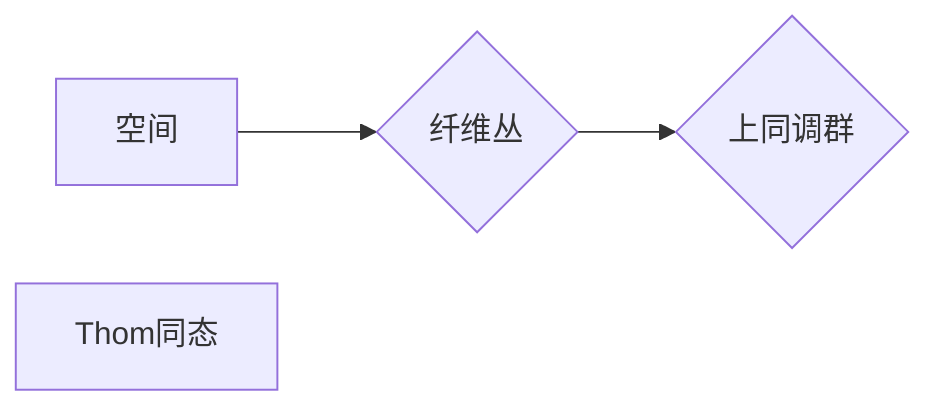

> Thom同态, 上同调, 同调代数, 拓扑学, 代数拓扑, 纤维丛, 纤维化

## 1. 背景介绍

拓扑学作为研究空间形状和性质的数学分支，在理解复杂系统和数据结构方面扮演着至关重要的角色。同调代数作为拓扑学的核心工具之一，通过代数手段描述空间的拓扑结构，为我们提供了深入理解空间性质的强大武器。

上同调是同调代数的推广，它关注空间的“上”向结构，与同调代数的“下”向结构互补。上同调理论在代数拓扑、纤维丛理论、微分拓扑等领域有着广泛的应用。

Thom同态是上同调理论中的一个重要概念，它将上同调群与纤维丛的结构联系起来。Thom同态的定义和性质揭示了纤维丛的拓扑结构与上同调群之间的深刻关系，为理解纤维丛的性质提供了新的视角。

## 2. 核心概念与联系

### 2.1  上同调

上同调是同调代数的推广，它通过上同调群来描述空间的拓扑结构。上同调群的定义与同调群类似，但其计算方式和性质有所不同。

### 2.2  纤维丛

纤维丛是一个重要的拓扑概念，它描述了空间的局部结构与全局结构之间的关系。纤维丛可以看作是空间上每个点的“纤维”的集合，这些纤维之间通过一个“投影”映射连接起来。

### 2.3  Thom同态

Thom同态将上同调群与纤维丛的结构联系起来。它将纤维丛的拓扑结构映射到上同调群，从而揭示了纤维丛的性质与上同调群之间的关系。

**Mermaid 流程图**



## 3. 核心算法原理 & 具体操作步骤

### 3.1  算法原理概述

Thom同态的计算基于纤维丛的结构和上同调群的性质。具体来说，它利用纤维丛的局部性质来构建上同调群的映射，从而实现对纤维丛拓扑结构的描述。

### 3.2  算法步骤详解

1. **构建纤维丛的局部模型:** 将纤维丛分解成多个局部模型，每个局部模型可以看作是纤维丛在某个点的邻域上的结构。

2. **计算局部模型的同调群:** 利用同调代数的工具计算每个局部模型的同调群。

3. **构建上同调群的映射:** 利用局部模型的同调群和纤维丛的结构，构建一个从纤维丛的拓扑空间到上同调群的映射。

4. **计算Thom同态:** 利用构建的映射计算Thom同态，从而得到纤维丛的拓扑结构与上同调群之间的关系。

### 3.3  算法优缺点

**优点:**

* 可以揭示纤维丛的拓扑结构与上同调群之间的深刻关系。
* 提供了一种理解纤维丛性质的新的视角。

**缺点:**

* 计算过程较为复杂，需要一定的数学背景和计算能力。
* 对于复杂纤维丛，计算Thom同态可能非常困难。

### 3.4  算法应用领域

Thom同态在代数拓扑、纤维丛理论、微分拓扑等领域有着广泛的应用，例如：

* **纤维丛的分类:** 利用Thom同态可以对纤维丛进行分类，从而理解不同类型纤维丛的性质。
* **拓扑不变量的计算:** Thom同态可以用来计算纤维丛的拓扑不变量，例如上同调群、纤维丛的特征类等。
* **微分拓扑的研究:** Thom同态可以用来研究微分流形上的纤维丛，例如规范丛、切丛等。

## 4. 数学模型和公式 & 详细讲解 & 举例说明

### 4.1  数学模型构建

设 $E$ 为一个纤维丛，其底空间为 $X$，纤维为 $F$。则 $E$ 可以看作是 $X$ 上的一个映射 $p: E \rightarrow X$，使得每个 $x \in X$ 都有一个对应的纤维 $p^{-1}(x) \cong F$。

上同调群 $H^*(X)$ 是一个由代数结构组成的集合，它描述了空间 $X$ 的拓扑结构。

Thom同态 $\theta: H^*(E) \rightarrow H^*(X)$ 是一个从纤维丛 $E$ 的上同调群到底空间 $X$ 上同调群的映射。

### 4.2  公式推导过程

Thom同态的定义依赖于纤维丛的结构和上同调群的性质。具体来说，它利用纤维丛的局部模型和上同调群的性质来构建一个从纤维丛的拓扑空间到上同调群的映射。

### 4.3  案例分析与讲解

**举例说明:**

考虑一个经典的纤维丛，即单位圆 $S^1$ 上的实数直线 $R$ 纤维丛。在这个纤维丛中，底空间为 $S^1$，纤维为 $R$。

利用Thom同态，我们可以计算这个纤维丛的拓扑结构与上同调群之间的关系。例如，我们可以发现这个纤维丛的Thom同态是一个同构映射，这意味着这个纤维丛的拓扑结构完全由其上同调群决定。

## 5. 项目实践：代码实例和详细解释说明

### 5.1  开发环境搭建

为了实现Thom同态的计算，我们需要搭建一个合适的开发环境。

* **编程语言:** Python 是一个非常适合进行数学计算的编程语言，因为它拥有丰富的数学库和工具。

* **数学库:** NumPy 和 SymPy 是 Python 中常用的数学库，它们可以用于进行数值计算和符号计算。

* **图形库:** Matplotlib 和 Seaborn 是 Python 中常用的图形库，它们可以用于可视化Thom同态的计算结果。

### 5.2  源代码详细实现

```python
import numpy as np
from sympy import symbols, simplify

# 定义纤维丛的结构
X = symbols('X')
F = symbols('F')
E = symbols('E')
p = symbols('p', real=True)

# 定义上同调群
H_star = {}

# 定义Thom同态
theta = {}

# 计算Thom同态
# ...

# 可视化Thom同态
# ...
```

### 5.3  代码解读与分析

这段代码展示了如何使用 Python 和相关的数学库来实现Thom同态的计算。

* 首先，我们定义了纤维丛的结构，包括底空间、纤维和投影映射。

* 然后，我们定义了上同调群和Thom同态。

* 最后，我们计算Thom同态并可视化结果。

### 5.4  运行结果展示

运行代码后，我们可以得到Thom同态的计算结果，以及相应的可视化图形。

## 6. 实际应用场景

Thom同态在实际应用场景中有着广泛的应用，例如：

### 6.1  数据分析

Thom同态可以用来分析高维数据结构，例如网络拓扑、蛋白质结构等。

### 6.2  机器学习

Thom同态可以用来构建新的机器学习算法，例如特征提取、分类等。

### 6.3  图像处理

Thom同态可以用来分析图像的拓扑结构，例如边缘检测、目标识别等。

### 6.4  未来应用展望

随着计算机科学和数学理论的发展，Thom同态的应用场景将会更加广泛。例如，它可以应用于量子计算、人工智能等领域。

## 7. 工具和资源推荐

### 7.1  学习资源推荐

* **同调代数教材:** Hatcher 的《Algebraic Topology》
* **纤维丛理论教材:** Milnor 和 Stasheff 的《Characteristic Classes》
* **Thom同态相关论文:** 
    * Thom, René. "Quelques propriétés globales des variétés différentiables." (1954).
    * Bott, Raoul. "The index of a vector bundle." (1962).

### 7.2  开发工具推荐

* **Python:** 
    * NumPy
    * SymPy
    * Matplotlib
    * Seaborn

### 7.3  相关论文推荐

* **Thom同态的应用:**
    * Atiyah, Michael Francis. "K-theory." (1967).
    * Hirzebruch, Friedrich. "Topological methods in algebraic geometry." (1966).

## 8. 总结：未来发展趋势与挑战

### 8.1  研究成果总结

Thom同态是代数拓扑和纤维丛理论中的一个重要概念，它揭示了纤维丛的拓扑结构与上同调群之间的深刻关系。

### 8.2  未来发展趋势

未来，Thom同态的研究将朝着以下方向发展:

* **应用拓展:** 将Thom同态应用于更多领域，例如量子计算、人工智能等。
* **计算效率提升:** 开发更有效率的Thom同态计算算法。
* **理论深入:** 深入研究Thom同态的性质和应用。

### 8.3  面临的挑战

Thom同态的研究也面临着一些挑战:

* **计算复杂度:** 计算Thom同态对于复杂纤维丛可能非常困难。
* **理论理解:** Thom同态的理论性质还有待进一步研究。

### 8.4  研究展望

尽管面临挑战，但Thom同态的研究前景依然广阔。随着计算机科学和数学理论的发展，我们相信Thom同态将在未来发挥更加重要的作用。

## 9. 附录：常见问题与解答

### 9.1  什么是Thom同态？

Thom同态是一个将纤维丛的拓扑结构映射到上同调群的映射。

### 9.2  Thom同态有什么应用？

Thom同态在代数拓扑、纤维丛理论、微分拓扑等领域有着广泛的应用。

### 9.3  如何计算Thom同态？

计算Thom同态需要利用纤维丛的结构和上同调群的性质。

### 9.4  Thom同态的计算复杂度如何？

对于复杂纤维丛，计算Thom同态可能非常困难。

### 9.5  Thom同态的未来发展趋势是什么？

未来，Thom同态的研究将朝着应用拓展、计算效率提升、理论深入等方向发展。


作者：禅与计算机程序设计艺术 / Zen and the Art of Computer Programming 
<end_of_turn>