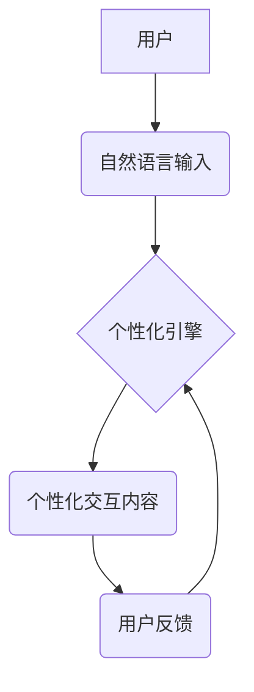

> CUI交互、个性化体验、自然语言处理、机器学习、深度学习、用户模型、推荐系统、多模态交互、虚拟现实

## 1. 背景介绍

随着人工智能技术的飞速发展，用户对交互体验的要求也越来越高。传统的命令行界面 (CLI) 和图形用户界面 (GUI) 已经无法满足用户日益增长的个性化需求。因此，个性化 CUI 交互体验成为一个重要的研究方向。

个性化 CUI 交互体验是指根据用户的个人喜好、行为模式和上下文信息，定制化地提供交互方式、内容和服务，以提升用户体验和效率。

## 2. 核心概念与联系

**2.1 核心概念**

* **CUI (Conversational User Interface):** 对话式用户界面，通过自然语言与用户进行交互，更接近人类的沟通方式。
* **个性化:** 根据用户的特定需求和偏好进行定制化，提供差异化的体验。
* **交互体验:** 用户与系统之间进行交互的整个过程，包括感知、理解、响应和反馈等环节。

**2.2 联系**

个性化 CUI 交互体验的核心是将 CUI 的对话式交互能力与个性化技术的结合。通过对用户的行为、偏好和上下文信息的分析，系统可以根据用户的需求动态调整交互方式、内容和服务，从而提供更符合用户期望的个性化体验。

**2.3 架构图**



## 3. 核心算法原理 & 具体操作步骤

**3.1 算法原理概述**

个性化 CUI 交互体验的核心算法主要包括：

* **自然语言处理 (NLP):** 用于理解用户的自然语言输入，提取关键信息和意图。
* **机器学习 (ML):** 用于构建用户模型，预测用户的行为和偏好。
* **推荐系统:** 用于根据用户的历史行为和偏好，推荐个性化的内容和服务。

**3.2 算法步骤详解**

1. **用户输入:** 用户通过自然语言输入指令或问题。
2. **自然语言理解:** 使用 NLP 技术对用户的输入进行分析，识别关键词、意图和上下文信息。
3. **用户建模:** 使用 ML 技术构建用户的个性化模型，包括用户的兴趣、偏好、行为模式等。
4. **内容推荐:** 根据用户的个性化模型，推荐个性化的内容和服务。
5. **交互反馈:** 用户对推荐的内容进行反馈，例如点赞、评论或选择。
6. **模型更新:** 根据用户的反馈，更新用户的个性化模型，以提高推荐的准确性和个性化程度。

**3.3 算法优缺点**

* **优点:**

    * 提供个性化体验，提升用户满意度。
    * 提高用户效率，减少用户操作成本。
    * 增强用户粘性，促进用户复购。

* **缺点:**

    * 需要大量的用户数据进行训练和模型更新。
    * 算法的复杂性较高，需要专业的技术人员进行开发和维护。
    * 存在隐私安全问题，需要妥善处理用户数据。

**3.4 算法应用领域**

个性化 CUI 交互体验的应用领域非常广泛，包括：

* **智能客服:** 提供个性化的客户服务，解决用户问题。
* **电商平台:** 推荐个性化的商品和服务，提高用户购买意愿。
* **教育平台:** 提供个性化的学习内容和辅导，提升学习效率。
* **医疗保健:** 提供个性化的医疗建议和健康管理服务。

## 4. 数学模型和公式 & 详细讲解 & 举例说明

**4.1 数学模型构建**

用户个性化模型可以采用基于用户的行为数据和偏好的机器学习模型，例如：

* **协同过滤:** 基于用户的行为相似性，推荐用户可能感兴趣的内容。
* **内容基准:** 基于内容的特征和标签，推荐与用户兴趣相符的内容。
* **深度学习:** 使用深度神经网络，学习用户复杂的兴趣和偏好模式。

**4.2 公式推导过程**

协同过滤算法的推荐公式可以表示为：

$$
r_{ui} = \frac{\sum_{j \in N(u)} s_{uj} \cdot s_{uj} }{\sum_{j \in N(u)} s_{uj}^2}
$$

其中：

* $r_{ui}$: 用户 $u$ 对物品 $i$ 的评分预测值。
* $s_{uj}$: 用户 $u$ 对物品 $j$ 的评分。
* $N(u)$: 用户 $u$ 评分过的物品集合。

**4.3 案例分析与讲解**

假设用户 A 评分了电影 1 和 2，用户 B 评分了电影 2 和 3，协同过滤算法可以根据用户的评分相似性，预测用户 A 对电影 3 的评分。

## 5. 项目实践：代码实例和详细解释说明

**5.1 开发环境搭建**

* 操作系统: Ubuntu 20.04
* Python 版本: 3.8
* 依赖库:

    * NLTK
    * SpaCy
    * scikit-learn
    * TensorFlow

**5.2 源代码详细实现**

```python
import nltk
from nltk.tokenize import word_tokenize
from sklearn.feature_extraction.text import TfidfVectorizer
from sklearn.metrics.pairwise import cosine_similarity

# 下载 NLTK 数据
nltk.download('punkt')

# 用户数据
user_data = [
    {"user_id": 1, "text": "我喜欢看科幻电影"},
    {"user_id": 2, "text": "我最近在学习机器学习"},
    {"user_id": 3, "text": "我爱吃披萨"}
]

# 文本预处理
def preprocess_text(text):
    tokens = word_tokenize(text)
    return tokens

# TF-IDF 向量化
vectorizer = TfidfVectorizer(tokenizer=preprocess_text)
tfidf_matrix = vectorizer.fit_transform([user["text"] for user in user_data])

# 计算余弦相似度
cosine_similarities = cosine_similarity(tfidf_matrix)

# 打印相似度矩阵
print(cosine_similarities)
```

**5.3 代码解读与分析**

* 代码首先使用 NLTK 库对用户文本进行分词。
* 然后使用 TF-IDF 向量化技术将文本转换为数值向量。
* 最后使用余弦相似度计算用户之间的文本相似度。

**5.4 运行结果展示**

运行代码后，会输出一个相似度矩阵，其中每个元素表示两个用户之间的文本相似度。

## 6. 实际应用场景

**6.1 智能客服**

个性化 CUI 交互体验可以用于构建智能客服系统，根据用户的历史对话记录和问题类型，提供个性化的服务和建议。

**6.2 个性化推荐**

个性化 CUI 交互体验可以用于构建个性化推荐系统，根据用户的兴趣爱好和行为模式，推荐个性化的商品、服务和内容。

**6.3 教育辅助**

个性化 CUI 交互体验可以用于构建教育辅助系统，根据学生的学习进度和知识掌握情况，提供个性化的学习内容和辅导。

**6.4 未来应用展望**

随着人工智能技术的不断发展，个性化 CUI 交互体验将在更多领域得到应用，例如：

* **医疗保健:** 提供个性化的医疗建议和健康管理服务。
* **金融服务:** 提供个性化的理财建议和投资服务。
* **娱乐休闲:** 提供个性化的游戏体验和娱乐内容。

## 7. 工具和资源推荐

**7.1 学习资源推荐**

* **书籍:**

    * 《深度学习》
    * 《自然语言处理》
    * 《机器学习》

* **在线课程:**

    * Coursera
    * edX
    * Udacity

**7.2 开发工具推荐**

* **Python:** 广泛应用于人工智能开发。
* **TensorFlow:** 深度学习框架。
* **PyTorch:** 深度学习框架。
* **spaCy:** 自然语言处理库。

**7.3 相关论文推荐**

* **BERT: Pre-training of Deep Bidirectional Transformers for Language Understanding**
* **Attention Is All You Need**
* **Recurrent Neural Networks for Sequence Learning**

## 8. 总结：未来发展趋势与挑战

**8.1 研究成果总结**

个性化 CUI 交互体验的研究取得了显著进展，例如：

* 自然语言处理技术取得了突破性进展，能够更准确地理解用户的自然语言输入。
* 机器学习和深度学习算法能够更有效地构建用户个性化模型。
* 多模态交互技术能够提供更丰富的交互体验。

**8.2 未来发展趋势**

* **更智能的对话系统:** 能够更自然地理解用户的意图和需求，提供更精准的响应。
* **更个性化的体验:** 能够根据用户的不同场景和需求，提供个性化的交互方式和内容。
* **更融合的多模态交互:** 结合语音、图像、视频等多种模态信息，提供更丰富的交互体验。

**8.3 面临的挑战**

* **数据隐私安全:** 个性化 CUI 交互体验需要收集和分析大量的用户数据，如何保护用户隐私安全是一个重要的挑战。
* **算法公平性:** 个性化推荐算法可能会存在偏差，导致某些用户获得不公平的待遇。
* **用户接受度:** 一些用户可能对个性化 CUI 交互体验感到不适，需要进行更多的用户调研和测试。

**8.4 研究展望**

未来，个性化 CUI 交互体验的研究将继续朝着更智能、更个性化、更融合的方向发展。


## 9. 附录：常见问题与解答

**9.1 如何构建用户个性化模型？**

可以使用机器学习算法，例如协同过滤、内容基准和深度学习，根据用户的行为数据和偏好构建用户个性化模型。

**9.2 如何保证用户数据隐私安全？**

可以使用数据加密、匿名化和差分隐私等技术，保护用户数据的隐私安全。

**9.3 如何评估个性化 CUI 交互体验的效果？**

可以使用用户满意度调查、点击率、转化率等指标，评估个性化 CUI 交互体验的效果。


作者：禅与计算机程序设计艺术 / Zen and the Art of Computer Programming 
<end_of_turn>