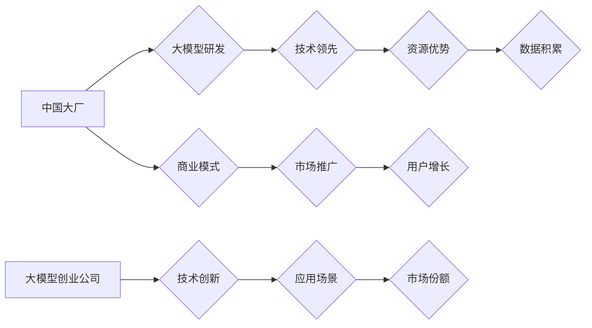

> 中国大厂，大模型，人工智能，创业公司，竞争格局，技术创新，商业模式

## 1. 背景介绍

近年来，人工智能（AI）技术蓬勃发展，特别是大模型的涌现，为中国科技行业带来了前所未有的机遇和挑战。中国大厂凭借雄厚的技术实力和资源优势，积极布局大模型领域，而大模型创业公司则凭借敏捷性和创新精神，在特定领域取得突破。两者之间的竞争格局日益激烈，对中国科技生态产生了深远影响。

**1.1 中国大厂的布局**

中国大厂，如百度、阿里巴巴、腾讯、华为等，在人工智能领域投入巨资，建立了强大的研发团队和完善的生态系统。它们拥有海量数据资源、强大的计算能力和成熟的商业模式，在自然语言处理、计算机视觉、语音识别等领域取得了领先地位。

* **百度**：发布了ERNIE、文心一言等大模型，并将其应用于搜索、智能助手、内容创作等领域。
* **阿里巴巴**：开发了达摩院系列大模型，在电商、金融、物流等领域进行应用探索。
* **腾讯**：打造了Hunyuan大模型，并将其应用于社交、游戏、云计算等领域。
* **华为**：积极布局大模型技术，并将其应用于5G、云计算、智慧城市等领域。

**1.2 大模型创业公司的崛起**

近年来，涌现出一批专注于大模型研究和应用的创业公司，例如旷视科技、商汤科技、元知科技等。这些公司往往在特定领域拥有深厚的技术积累和市场洞察力，能够快速迭代和创新。

* **旷视科技**：专注于计算机视觉领域，开发了视觉大模型，应用于智能驾驶、安防监控等领域。
* **商汤科技**：专注于人工智能芯片和算法，开发了多模态大模型，应用于智能家居、医疗诊断等领域。
* **元知科技**：专注于自然语言处理领域，开发了对话大模型，应用于智能客服、内容创作等领域。

## 2. 核心概念与联系

**2.1 大模型的概念**

大模型是指参数规模庞大、训练数据海量的人工智能模型。它们通常具有强大的泛化能力和学习能力，能够在多种任务中取得优异的性能。

**2.2 中国大厂与大模型创业公司的关系**

中国大厂和创业公司在AI领域形成了相互竞争、相互促进的生态系统。大厂凭借资源优势，推动了大模型技术的快速发展，而创业公司则通过创新和应用，推动了大模型技术的落地和商业化。

**2.3 竞争格局**

* **技术竞争:** 大厂和创业公司都在积极研发更强大的大模型，争夺技术领先地位。
* **数据竞争:** 大厂拥有海量数据资源，而创业公司则需要通过合作或购买数据来获取训练数据。
* **人才竞争:** 优秀的AI人才是推动大模型发展的关键，大厂和创业公司都在积极争夺人才。
* **应用竞争:** 大厂和创业公司都在积极探索大模型的应用场景，争夺市场份额。

**2.4 Mermaid 流程图**



## 3. 核心算法原理 & 具体操作步骤

**3.1 算法原理概述**

大模型的训练主要基于深度学习算法，特别是Transformer模型架构。Transformer模型通过自注意力机制，能够捕捉文本序列中的长距离依赖关系，从而实现更准确的理解和生成文本。

**3.2 算法步骤详解**

1. **数据预处理:** 将原始文本数据进行清洗、分词、标记等预处理操作，使其能够被模型理解。
2. **模型构建:** 根据Transformer模型架构，构建深度神经网络模型，并设置模型参数。
3. **模型训练:** 使用海量训练数据，通过反向传播算法，调整模型参数，使其能够准确预测文本序列。
4. **模型评估:** 使用测试数据评估模型的性能，并根据评估结果进行模型调优。
5. **模型部署:** 将训练好的模型部署到生产环境中，用于实际应用。

**3.3 算法优缺点**

* **优点:** 强大的泛化能力、学习能力、文本理解和生成能力。
* **缺点:** 训练成本高、计算资源需求大、模型解释性差。

**3.4 算法应用领域**

* 自然语言处理：文本分类、情感分析、机器翻译、文本摘要等。
* 计算机视觉：图像识别、目标检测、图像分割等。
* 语音识别：语音转文本、语音合成等。
* 其他领域：医疗诊断、金融风险评估、法律文本分析等。

## 4. 数学模型和公式 & 详细讲解 & 举例说明

**4.1 数学模型构建**

Transformer模型的核心是自注意力机制，其数学模型可以表示为：

$$
Attention(Q, K, V) = softmax(\frac{QK^T}{\sqrt{d_k}})V
$$

其中：

* $Q$：查询矩阵
* $K$：键矩阵
* $V$：值矩阵
* $d_k$：键向量的维度
* $softmax$：softmax函数

**4.2 公式推导过程**

自注意力机制通过计算查询向量与键向量的相似度，来确定每个值向量的权重，从而实现对文本序列的加权求和。

* 首先，计算查询向量与键向量的点积，并进行归一化处理。
* 然后，使用softmax函数将点积结果转换为概率分布。
* 最后，将概率分布与值矩阵相乘，得到每个位置的输出向量。

**4.3 案例分析与讲解**

假设我们有一个文本序列“我爱学习编程”，其查询向量、键向量和值向量分别为：

* $Q = [q_1, q_2, q_3, q_4, q_5]$
* $K = [k_1, k_2, k_3, k_4, k_5]$
* $V = [v_1, v_2, v_3, v_4, v_5]$

通过计算自注意力机制，我们可以得到每个位置的输出向量，例如输出向量 $o_2$ 可以表示为：

$$
o_2 = softmax(\frac{q_2k_1^T}{\sqrt{d_k}})v_1 + softmax(\frac{q_2k_2^T}{\sqrt{d_k}})v_2 + ... + softmax(\frac{q_2k_5^T}{\sqrt{d_k}})v_5
$$

## 5. 项目实践：代码实例和详细解释说明

**5.1 开发环境搭建**

* 操作系统：Ubuntu 20.04
* Python 版本：3.8
* 深度学习框架：PyTorch 1.8

**5.2 源代码详细实现**

```python
import torch
import torch.nn as nn

class Transformer(nn.Module):
    def __init__(self, vocab_size, embedding_dim, num_heads, num_layers):
        super(Transformer, self).__init__()
        self.embedding = nn.Embedding(vocab_size, embedding_dim)
        self.transformer_layers = nn.ModuleList([
            nn.TransformerEncoderLayer(embedding_dim, num_heads)
            for _ in range(num_layers)
        ])
        self.linear = nn.Linear(embedding_dim, vocab_size)

    def forward(self, x):
        x = self.embedding(x)
        for layer in self.transformer_layers:
            x = layer(x)
        x = self.linear(x)
        return x
```

**5.3 代码解读与分析**

* `__init__` 方法：初始化模型参数，包括词嵌入层、Transformer编码器层和线性输出层。
* `forward` 方法：定义模型的正向传播过程，将输入序列经过词嵌入层、Transformer编码器层和线性输出层，最终得到输出序列。

**5.4 运行结果展示**

通过训练和测试，可以评估模型的性能，例如准确率、困惑度等。

## 6. 实际应用场景

**6.1 自然语言处理**

* **机器翻译:** 将一种语言翻译成另一种语言。
* **文本摘要:** 将长文本压缩成短文本。
* **情感分析:** 分析文本中的情感倾向。
* **对话系统:** 开发能够与人类进行自然对话的智能助手。

**6.2 计算机视觉**

* **图像识别:** 将图像分类为不同的类别。
* **目标检测:** 在图像中识别和定位目标。
* **图像分割:** 将图像分割成不同的区域。

**6.3 语音识别**

* **语音转文本:** 将语音转换为文本。
* **语音合成:** 将文本转换为语音。

**6.4 未来应用展望**

* **个性化推荐:** 根据用户的兴趣和行为，推荐个性化的商品、服务和内容。
* **自动驾驶:** 帮助车辆理解周围环境，并做出安全驾驶决策。
* **医疗诊断:** 辅助医生诊断疾病，并提供个性化的治疗方案。

## 7. 工具和资源推荐

**7.1 学习资源推荐**

* **书籍:**
    * 《深度学习》
    * 《自然语言处理》
    * 《计算机视觉》
* **在线课程:**
    * Coursera
    * edX
    * Udacity

**7.2 开发工具推荐**

* **深度学习框架:** PyTorch, TensorFlow
* **编程语言:** Python
* **云计算平台:** AWS, Azure, Google Cloud

**7.3 相关论文推荐**

* 《Attention Is All You Need》
* 《BERT: Pre-training of Deep Bidirectional Transformers for Language Understanding》
* 《GPT-3: Language Models are Few-Shot Learners》

## 8. 总结：未来发展趋势与挑战

**8.1 研究成果总结**

近年来，大模型技术取得了显著进展，在多个领域取得了突破性成果。

**8.2 未来发展趋势**

* **模型规模继续扩大:** 模型参数规模将继续增长，从而提升模型的性能。
* **多模态模型发展:** 将文本、图像、音频等多种模态数据融合，构建更强大的多模态模型。
* **模型解释性增强:** 研究更有效的模型解释方法，提高模型的可解释性和可信度。

**8.3 面临的挑战**

* **训练成本高:** 大模型的训练成本非常高，需要大量的计算资源和数据。
* **数据安全和隐私:** 大模型的训练需要海量数据，如何保证数据安全和隐私是一个重要挑战。
* **模型偏见:** 大模型可能存在偏见问题，需要进行针对性的缓解措施。

**8.4 研究展望**

未来，大模型技术将继续发展，并在更多领域发挥重要作用。需要加强基础研究，探索更有效的训练方法和模型架构，并解决模型伦理和安全问题。

## 9. 附录：常见问题与解答

**9.1 如何选择合适的深度学习框架？**

* **PyTorch:** 灵活、易于使用，适合研究和开发。
* **TensorFlow:** 稳定、成熟，适合生产环境部署。

**9.2 如何获取训练数据？**

* **公开数据集:** 许多公开数据集可以用于训练大模型，例如GLUE、SQuAD等。
* **数据标注:** 可以雇佣人工标注数据，但成本较高。
* **数据合成:** 可以使用数据合成技术生成新的训练数据。

**9.3 如何评估大模型的性能？**

* **准确率:** 对于分类任务，准确率是衡量模型性能的重要指标。
* **困惑度:** 