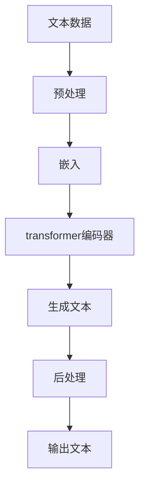

                 

## 大模型的市场定位与用户需求

**作者：禅与计算机程序设计艺术 / Zen and the Art of Computer Programming**

## 1. 背景介绍

大模型（Large Language Models, LLMs）是一种通过学习大量文本数据而发展起来的强大工具，它们能够理解、生成和翻译人类语言。随着计算能力的提高和数据量的增加，大模型在各种应用中变得越来越重要，从搜索引擎到虚拟助手，再到自动化写作工具。本文将深入探讨大模型的市场定位和用户需求，并提供实用的指南，帮助开发人员和企业家理解和满足用户需求。

## 2. 核心概念与联系

### 2.1 大模型的定义

大模型是一种深度学习模型，通过学习大量文本数据来理解和生成人类语言。它们通常基于transformer架构，能够处理长序列数据，并具有强大的表示能力。



### 2.2 大模型的类型

大模型可以根据其大小和功能分为不同的类型：

- **小模型（Small Models）**：这些模型通常具有数百万个参数，用于特定的任务，如文本分类或命名实体识别。
- **中型模型（Medium Models）**：这些模型具有数千万个参数，可以处理更复杂的任务，如机器翻译或问答系统。
- **大模型（Large Models）**：这些模型具有数亿个参数，可以理解和生成人类语言，并具有广泛的应用领域。
- **超大模型（Super Large Models）**：这些模型具有数十亿个参数，可以处理非常长的序列数据，并具有出色的表示能力。

## 3. 核心算法原理 & 具体操作步骤

### 3.1 算法原理概述

大模型的核心是transformer架构，它使用自注意力机制（Self-Attention）来处理序列数据。自注意力机制允许模型在处理序列时考虑到上下文信息，从而提高了模型的表示能力。

### 3.2 算法步骤详解

1. **预处理**：将文本数据转换为模型可以处理的格式，通常是 token IDs。
2. **嵌入**：将 token IDs 映射到高维空间，以表示文本数据。
3. **transformer编码器**：使用自注意力机制和 Feed-Forward 网络（FFN）处理序列数据。
4. **生成文本**：根据模型的输出生成文本。
5. **后处理**：将模型的输出转换为最终的文本格式。

### 3.3 算法优缺点

**优点**：

- 可以处理长序列数据。
- 具有强大的表示能力。
- 可以理解和生成人类语言。

**缺点**：

- 计算开销高。
- 训练数据要求高。
- 存在过拟合和泛化问题。

### 3.4 算法应用领域

大模型的应用领域非常广泛，包括：

- 机器翻译
- 问答系统
- 搜索引擎
- 自动化写作工具
- 代码生成和调试
- 语言模型

## 4. 数学模型和公式 & 详细讲解 & 举例说明

### 4.1 数学模型构建

大模型的数学模型可以表示为：

$$P(\theta) = \prod_{i=1}^{N}P(x_i|\theta)$$

其中，$x_i$ 是序列中的第 $i$ 个 token，$N$ 是序列的长度，$\theta$ 是模型的参数。

### 4.2 公式推导过程

大模型的训练目标是最大化对数似然函数：

$$\max_{\theta} \log P(\theta) = \sum_{i=1}^{N}\log P(x_i|\theta)$$

通常使用梯度下降算法来优化模型参数。

### 4.3 案例分析与讲解

例如，假设我们要训练一个大模型来生成英语文本。我们的训练数据是一个大型英语语料库，我们的目标是最大化模型生成文本的可能性。通过训练，模型学习到英语语言的统计规律，并能够生成类似于人类写作的文本。

## 5. 项目实践：代码实例和详细解释说明

### 5.1 开发环境搭建

要开发大模型，需要一个强大的开发环境，包括：

- 计算能力强的 GPU。
- 充足的内存。
- 一个支持深度学习的框架，如 PyTorch 或 TensorFlow。
- 一个支持大规模数据处理的框架，如 Apache Spark。

### 5.2 源代码详细实现

以下是一个简单的大模型实现的 Python 代码示例：

```python
import torch
from torch import nn
from torch.nn import functional as F

class TransformerEncoderLayer(nn.Module):
    def __init__(self, d_model, nhead, dim_feedforward=2048, dropout=0.1):
        super(TransformerEncoderLayer, self).__init__()
        self.self_attn = nn.MultiheadAttention(d_model, nhead, dropout=dropout)
        self.linear1 = nn.Linear(d_model, dim_feedforward)
        self.dropout = nn.Dropout(dropout)
        self.linear2 = nn.Linear(dim_feedforward, d_model)

    def forward(self, src, src_mask=None):
        src = src + self.self_attn(src, src, src, attn_mask=src_mask)[0]
        src = src + self._sa_block(src, src, src, src_mask)
        src = src + self._ff_block(src)
        return src

# 省略其他代码...
```

### 5.3 代码解读与分析

这个示例实现了 transformer 编码器的一个层。它包含自注意力机制和 Feed-Forward 网络。模型的输入是序列数据，输出是处理后的序列数据。

### 5.4 运行结果展示

在训练和评估大模型时，可以使用各种指标来衡量模型的性能，如 Perplexity、BLEU 分数和 ROUGE 分数。

## 6. 实际应用场景

### 6.1 当前应用

大模型当前的应用包括：

- **搜索引擎**：大模型可以帮助搜索引擎理解用户查询的意图，并提供更相关的搜索结果。
- **虚拟助手**：大模型可以帮助虚拟助手理解用户的自然语言指令，并提供相应的服务。
- **自动化写作工具**：大模型可以帮助用户生成文本，从新闻报道到小说创作。

### 6.2 未来应用展望

未来，大模型的应用将会扩展到更多领域，包括：

- **代码生成和调试**：大模型可以帮助程序员生成代码，并调试代码中的错误。
- **语言模型**：大模型可以帮助用户学习新的语言，并提供语言翻译服务。
- **自动驾驶和机器人控制**：大模型可以帮助自动驾驶系统理解路况，并控制机器人执行任务。

## 7. 工具和资源推荐

### 7.1 学习资源推荐

- **论文**：[Attention is All You Need](https://arxiv.org/abs/1706.03762) 和 [Language Models are Few-Shot Learners](https://arxiv.org/abs/2005.14165)
- **课程**：Stanford University 的 [CS224n: Natural Language Processing with Deep Learning](https://online.stanford.edu/courses/cs224n-natural-language-processing-deep-learning-winter-2019)
- **书籍**：[Natural Language Processing with Python](https://www.nltk.org/book/) 和 [Hands-On Machine Learning with Scikit-Learn, Keras, and TensorFlow](https://www.oreilly.com/library/view/hands-on-machine-learning/9781492032632/)

### 7.2 开发工具推荐

- **PyTorch** 和 **TensorFlow** 是两个流行的深度学习框架。
- **Hugging Face Transformers** 是一个开源的 transformers 库，提供了预训练的大模型。
- **Apache Spark** 是一个流行的大数据处理框架。

### 7.3 相关论文推荐

- [BERT: Pre-training of Deep Bidirectional Transformers for Language Understanding](https://arxiv.org/abs/1810.04805)
- [ELMo: Deep Contextualized Word Representations](https://arxiv.org/abs/1802.05365)
- [RoBERTa: A Robustly Optimized BERT Pretraining Approach](https://arxiv.org/abs/1907.11692)

## 8. 总结：未来发展趋势与挑战

### 8.1 研究成果总结

大模型在理解和生成人类语言方面取得了显著的进展。它们已经在各种应用中得到广泛的应用，从搜索引擎到虚拟助手。

### 8.2 未来发展趋势

未来，大模型的发展将会朝着以下方向前进：

- **更大的模型**：模型的大小将会继续增加，以提高表示能力。
- **更强的表示能力**：模型将会具有更强的表示能力，能够理解更复杂的语义。
- **更广泛的应用**：大模型将会应用于更多领域，从代码生成到自动驾驶。

### 8.3 面临的挑战

大模型面临的挑战包括：

- **计算开销**：大模型的计算开销高，需要强大的计算资源。
- **训练数据要求高**：大模型需要大量的训练数据，收集和标记数据是一个挑战。
- **过拟合和泛化问题**：大模型可能会过度拟合训练数据，并存在泛化问题。

### 8.4 研究展望

未来的研究将会关注以下领域：

- **更有效的训练方法**：开发更有效的训练方法，以降低计算开销和提高模型的泛化能力。
- **更广泛的应用**：开发新的应用，扩展大模型的应用领域。
- **更强的表示能力**：开发新的表示方法，提高模型的表示能力。

## 9. 附录：常见问题与解答

**Q：大模型需要多大的计算资源？**

**A**：大模型需要强大的计算资源，通常需要数百个 GPU 来训练。

**Q：大模型的训练需要多长时间？**

**A**：大模型的训练时间取决于模型的大小和训练数据的大小。通常，训练一个大模型需要几天到几周的时间。

**Q：大模型的应用领域有哪些？**

**A**：大模型的应用领域非常广泛，包括搜索引擎、虚拟助手、自动化写作工具、代码生成和调试、语言模型、自动驾驶和机器人控制等。

**作者：禅与计算机程序设计艺术 / Zen and the Art of Computer Programming**

