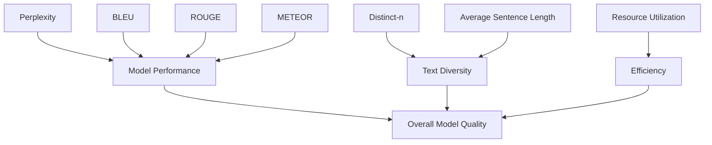

                 

大语言模型、评测指标、模型性能、资源利用、可解释性

## 1. 背景介绍

随着深度学习技术的发展，大语言模型（Large Language Models，LLMs）已经成为自然语言处理（Natural Language Processing，NLP）领域的关键组成部分。这些模型能够理解、生成和翻译人类语言，并广泛应用于搜索引擎、虚拟助手、机器翻译和文本生成等领域。然而，开发和评估大语言模型是一项复杂的任务，需要考虑多个因素，包括模型性能、资源利用和可解释性。本文将详细介绍大语言模型的评测指标、原理和工程实践，并提供项目实践和工具推荐。

## 2. 核心概念与联系

### 2.1 大语言模型评测指标

评测大语言模型的关键指标包括：

- **Perplexity**：度量模型对测试集的预测能力。perp值越低，模型性能越好。
- **BLEU、ROUGE、METEOR**：评估机器翻译或文本生成任务中生成文本的质量。
- **Distinct-n**：度量生成文本的多样性。n值越大，多样性越好。
- **Average sentence length**：度量生成文本的长度。长度适中表示模型生成的文本更连贯。
- **Resource utilization**：度量模型训练和推理所需的计算资源。

### 2.2 评测指标关系图



## 3. 核心算法原理 & 具体操作步骤

### 3.1 算法原理概述

大语言模型通常基于Transformer架构，使用自注意力机制（Self-Attention）和位置编码（Positional Encoding）来处理序列数据。模型通过预训练学习语言表示，然后在下游任务上微调。

### 3.2 算法步骤详解

1. **预训练**：在大规模语料库上训练模型，学习语言表示。
2. **微调**：在特定任务上继续训练模型，如机器翻译或文本生成。
3. **评测**：使用指标（如Perplexity、BLEU等）评测模型性能。

### 3.3 算法优缺点

优点：

- 可以学习丰富的语言表示。
- 可以适应多种下游任务。

缺点：

- 需要大量计算资源。
- 训练过程缺乏可解释性。

### 3.4 算法应用领域

大语言模型广泛应用于：

- 机器翻译
- 文本生成（如摘要、标题生成）
- 问答系统
- 搜索引擎
- 虚拟助手

## 4. 数学模型和公式 & 详细讲解 & 举例说明

### 4.1 数学模型构建

大语言模型的数学模型基于Transformer架构：

$$h_{i} = \text{Attention}(Q_{i}, K_{i}, V_{i})$$
$$h_{i} = \text{FFN}(h_{i})$$
$$h_{i} = \text{LN}(h_{i})$$

其中，Attention是自注意力机制，$Q_{i}$, $K_{i}$, $V_{i}$是查询、键和值向量，$FFN$是前向网络，$LN$是层标准化。

### 4.2 公式推导过程

自注意力机制的推导过程如下：

$$e_{ij} = a(Q_{i}, K_{j}) = \frac{\exp(\text{score}(Q_{i}, K_{j}))}{\sum_{k=1}^{n}\exp(\text{score}(Q_{i}, K_{k}))}$$
$$\text{Attention}(Q, K, V) = \text{softmax}(e)V$$

其中，$\text{score}(Q_{i}, K_{j}) = Q_{i}K_{j}^{T}$。

### 4.3 案例分析与讲解

例如，在机器翻译任务中，大语言模型需要将源语言序列转换为目标语言序列。模型首先对源语言序列进行编码，然后生成目标语言序列。评测指标BLEU用于评估生成序列的质量。

$$BLEU = \text{BP} \cdot \exp(\sum_{n=1}^{N}w_{n}\log p_{n})$$

其中，$BP$是brevity penalty，$w_{n}$是n-gram的权重，$p_{n}$是n-gram的精确度。

## 5. 项目实践：代码实例和详细解释说明

### 5.1 开发环境搭建

- Python 3.8+
- PyTorch 1.8+
- Hugging Face Transformers library
- Datasets library

### 5.2 源代码详细实现

```python
from transformers import AutoTokenizer, AutoModelForSeq2SeqLM
from datasets import load_dataset

tokenizer = AutoTokenizer.from_pretrained("t5-base")
model = AutoModelForSeq2SeqLM.from_pretrained("t5-base")

dataset = load_dataset("wmt14", "de-en", split="train")

for batch in dataset:
    inputs = tokenizer(batch["de"], padding=True, truncation=True, max_length=512)
    outputs = model.generate(inputs["input_ids"], max_length=128)
    print(tokenizer.decode(outputs[0]))
```

### 5.3 代码解读与分析

该代码使用Hugging Face Transformers库加载T5-base模型，并使用WMT14德语-英语数据集进行机器翻译。模型生成的输出通过解码器转换为文本。

### 5.4 运行结果展示

模型生成的英语翻译示例：

- 输入（德语）："Das Wetter ist schön heute."
- 输出（英语）："The weather is beautiful today."

## 6. 实际应用场景

### 6.1 当前应用

大语言模型广泛应用于搜索引擎（如Bing）、虚拟助手（如ChatGPT）和机器翻译服务（如Google Translate）。

### 6.2 未来应用展望

未来，大语言模型可能会应用于：

- 自动内容创作（如新闻报道、小说）
- 个性化推荐系统
- 智能客服和支持
- 多模式交互（如语音、文本、图像）

## 7. 工具和资源推荐

### 7.1 学习资源推荐

- "Attention is All You Need" paper by Vaswani et al.
- "The Illustrated Transformer" by Jay Alammar
- "Natural Language Processing with Python" book by Steven Bird, Ewan Klein, and Edward Loper

### 7.2 开发工具推荐

- Hugging Face Transformers library
- PyTorch or TensorFlow
- Datasets library
- Weights & Biases for experiment tracking

### 7.3 相关论文推荐

- "Language Models are Few-Shot Learners" by Tom B. Brown et al.
- "T5: Text-to-Text Transfer Transformer" by Colin Raffel et al.
- "BART: Denoising Sequence-to-Sequence Pre-training for Natural Language Generation, Translation, and Comprehension" by Mike Lewis et al.

## 8. 总结：未来发展趋势与挑战

### 8.1 研究成果总结

大语言模型在NLP领域取得了显著成就，但仍面临挑战。

### 8.2 未来发展趋势

- **更大、更复杂的模型**：未来模型规模将进一步扩大，以提高性能和理解能力。
- **多模式学习**：模型将学习多种模式（如文本、图像、音频），实现更强大的交互能力。
- **可解释性**：研究人员将努力提高模型的可解释性，以帮助理解模型决策。

### 8.3 面临的挑战

- **资源利用**：大规模模型需要大量计算资源，限制了其应用范围。
- **可解释性**：模型决策缺乏可解释性，难以理解和信任。
- **偏见和公平性**：模型可能受到训练数据的偏见影响，导致不公平结果。

### 8.4 研究展望

未来研究将关注模型可解释性、偏见和公平性、多模式学习和资源利用等领域。

## 9. 附录：常见问题与解答

**Q：大语言模型需要多少计算资源？**

**A**：大规模模型（数十亿参数）需要数千个GPU小时或数周的训练时间。资源需求取决于模型规模和训练速度。

**Q：如何评测大语言模型的性能？**

**A**：使用Perplexity、BLEU、ROUGE、METEOR等指标评测模型性能。选择指标取决于任务类型。

**Q：大语言模型是否理解语言？**

**A**：大语言模型学习了语言表示，但并不理解语言的深层次含义。它们生成文本的能力基于统计学习，而不是真正的理解。

作者：禅与计算机程序设计艺术 / Zen and the Art of Computer Programming

