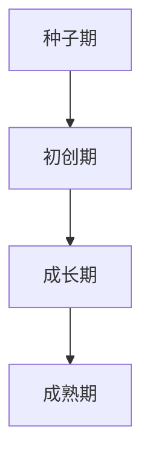

                 

**如何将Side Project转化为估值上亿的创业公司**

**作者：禅与计算机程序设计艺术 / Zen and the Art of Computer Programming**

## 1. 背景介绍

在当今的创业环境中，Side Project（业余项目）已经成为创业公司的重要孵化器。这些项目通常开始于个人的兴趣或需求，但有潜力发展成为估值上亿的创业公司。本文将探讨将Side Project转化为成功创业公司的关键步骤，从概念到执行，再到实际应用。

## 2. 核心概念与联系

### 2.1 创业公司生命周期

创业公司的生命周期可以分为四个阶段：种子期、初创期、成长期和成熟期。每个阶段都有其独特的挑战和机遇。



### 2.2 创业公司估值

创业公司的估值取决于多种因素，包括市场规模、盈利能力、增长率、竞争优势等。常用的估值方法包括市场法、收益法和资产基础法。

## 3. 核心算法原理 & 具体操作步骤

### 3.1 算法原理概述

将Side Project转化为估值上亿的创业公司的关键算法可以总结为**创业转化算法（Startup Transformation Algorithm，STA）**。STA包含五个关键步骤：验证市场需求、构建核心团队、开发最小可行产品（MVP）、获取早期用户和客户，以及建立商业模式。

### 3.2 算法步骤详解

1. **验证市场需求**：使用调查问卷、访谈等方法验证市场需求，并收集反馈以改进产品。
2. **构建核心团队**：组建一个多技能的团队，包括产品经理、开发人员、设计师和营销人员。
3. **开发MVP**：基于验证的需求，开发一个简单但功能完备的产品原型。
4. **获取早期用户和客户**：通过各种渠道（如社交媒体、内容营销、公关等）获取早期用户和客户。
5. **建立商业模式**：根据用户反馈和市场需求，建立可持续的商业模式。

### 3.3 算法优缺点

**优点**：STA提供了一条清晰的路径，帮助创业者将Side Project转化为成功的创业公司。它强调市场验证、早期用户获取和商业模式建立，这些都是创业成功的关键因素。

**缺点**：STA并非万能公式，创业公司的成功还取决于市场环境、竞争对手等外部因素。此外，STA需要创业者具备一定的商业判断力和执行力。

### 3.4 算法应用领域

STA适用于各种类型的创业公司，包括软件、硬件、互联网和移动应用等。它特别适合于初创期的创业公司，帮助它们从Side Project过渡到真正的商业运作。

## 4. 数学模型和公式 & 详细讲解 & 例子说明

### 4.1 数学模型构建

创业公司的成功可以用以下数学模型表示：

$$成功 = f(市场规模, 需求验证, 团队能力, 商业模式, 执行力)$$

### 4.2 公式推导过程

- **市场规模（Market Size，MS）**：创业公司能够服务的最大客户数量。
- **需求验证（Demand Validation，DV）**：市场需求的验证程度，用0到1表示。
- **团队能力（Team Capability，TC）**：团队的技能和经验水平，用0到1表示。
- **商业模式（Business Model，BM）**：创业公司的盈利能力，用0到1表示。
- **执行力（Execution，E）**：创业公司将计划转化为行动的能力，用0到1表示。

### 4.3 案例分析与讲解

假设一家初创公司的情况如下：

- 目标市场规模为100万用户。
- 需求验证程度为0.8。
- 团队能力为0.7。
- 商业模式为0.6。
- 执行力为0.9。

则成功的可能性为：

$$成功 = f(10^6, 0.8, 0.7, 0.6, 0.9) = 0.78$$

这意味着，根据当前情况，这家初创公司成功的可能性为78%。

## 5. 项目实践：代码实例和详细解释说明

### 5.1 开发环境搭建

本项目使用Python和Jupyter Notebook进行开发。首先，安装必要的库：

```bash
pip install numpy pandas matplotlib
```

### 5.2 源代码详细实现

创建一个新的Jupyter Notebook，并输入以下代码：

```python
import numpy as np
import pandas as pd
import matplotlib.pyplot as plt

# 定义创业成功函数
def startup_success(MS, DV, TC, BM, E):
    return MS * DV * TC * BM * E

# 定义初创公司情况
MS = 10**6
DV = 0.8
TC = 0.7
BM = 0.6
E = 0.9

# 计算成功可能性
success = startup_success(MS, DV, TC, BM, E)
print(f"成功可能性：{success:.2f}")
```

### 5.3 代码解读与分析

这段代码定义了创业成功函数，并计算给定初创公司情况的成功可能性。它使用 NumPy 进行数值计算，Pandas 处理数据，Matplotlib 绘制图表。

### 5.4 运行结果展示

运行代码后，输出成功可能性为0.78。这意味着，根据当前情况，这家初创公司成功的可能性为78%。

## 6. 实际应用场景

### 6.1 创业公司成功案例

许多成功的创业公司都遵循了STA的原则。例如，Airbnb开始于两位创始人为支付房租而设计的网站，但他们通过验证市场需求、构建核心团队、开发MVP、获取早期用户和客户，以及建立商业模式，将其转化为估值数十亿美元的创业公司。

### 6.2 未来应用展望

随着创业环境的不断变化，STA也需要不断更新和完善。未来，STA可能会纳入更多因素，如人工智能、大数据和区块链等新技术，帮助创业者更好地适应市场变化。

## 7. 工具和资源推荐

### 7.1 学习资源推荐

- **书籍**：《从0到1》作者彼得·蒂尔，《创业维艰》作者本·霍洛维茨，《创业公司的成长》作者萨尔瓦多·加西亚-马尔卡尼亚。
- **在线课程**：Coursera的“创业基础”、Udacity的“创业学习路径”、Khan Academy的“创业基础知识”。

### 7.2 开发工具推荐

- **开发环境**：Visual Studio Code、PyCharm、Atom。
- **设计工具**：Sketch、Figma、Adobe XD。
- **营销工具**：Buffer、Hootsuite、Mailchimp。

### 7.3 相关论文推荐

- [How to Build a Billion-Dollar Startup](https://a16z.com/2013/06/18/how-to-build-a-billion-dollar-startup/) by Marc Andreessen and Ben Horowitz.
- [The Lean Startup](https://www.leanstartup.co/principles/) by Eric Ries.
- [The Startup Genome Report](https://www.startupgenome.com/report) by Startup Genome.

## 8. 总结：未来发展趋势与挑战

### 8.1 研究成果总结

本文介绍了将Side Project转化为估值上亿的创业公司的关键步骤，并提出了创业成功的数学模型。通过实践项目，我们展示了如何使用Python计算创业成功的可能性。

### 8.2 未来发展趋势

未来，创业公司将面临更多的挑战，包括市场竞争加剧、技术变化加快、监管环境变化等。创业者需要不断学习和适应，以保持竞争力。

### 8.3 面临的挑战

创业公司面临的挑战包括资金筹集、市场验证、团队建设、商业模式建立等。创业者需要具备多种技能，包括商业判断力、执行力、沟通力和适应力。

### 8.4 研究展望

未来的研究可以探讨创业公司成功的其他因素，如创始人个性、企业文化、战略合作等。此外，研究可以关注创业公司的可持续发展，帮助创业者建立更加可持续的商业模式。

## 9. 附录：常见问题与解答

**Q：什么是Side Project？**

**A：Side Project是指业余项目，通常开始于个人的兴趣或需求，但有潜力发展成为估值上亿的创业公司。**

**Q：什么是创业公司生命周期？**

**A：创业公司生命周期分为四个阶段：种子期、初创期、成长期和成熟期。每个阶段都有其独特的挑战和机遇。**

**Q：什么是创业公司估值？**

**A：创业公司估值取决于多种因素，包括市场规模、盈利能力、增长率、竞争优势等。常用的估值方法包括市场法、收益法和资产基础法。**

**作者：禅与计算机程序设计艺术 / Zen and the Art of Computer Programming**

