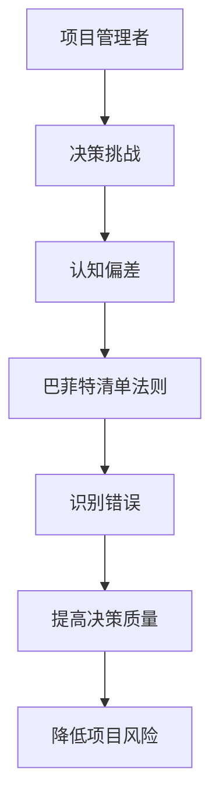

                 

**巴菲特清单法则在项目管理中的应用**

**作者：禅与计算机程序设计艺术 / Zen and the Art of Computer Programming**

## 1. 背景介绍

在项目管理领域，有效的决策和风险管理是成功的关键。沃伦·巴菲特的清单法则，一种简单有效的决策工具，可以帮助项目管理者提高决策质量，降低项目风险。本文将探讨巴菲特清单法则在项目管理中的应用，并提供实践指南。

## 2. 核心概念与联系

### 2.1 巴菲特清单法则

巴菲特清单法则是由沃伦·巴菲特和查理·芒格提出的一种决策工具，用于帮助他们在投资决策中避免错误。清单包含12条原则，旨在帮助决策者识别和避免常见的认知偏差和错误。

### 2.2 项目管理中的决策挑战

项目管理者面临着各种决策挑战，包括资源分配、风险管理、进度控制等。这些决策往往需要在不完美的信息条件下做出，且受到各种认知偏差的影响。

### 2.3 清单法则与项目管理的联系

巴菲特清单法则可以帮助项目管理者识别和避免决策中的错误，从而提高决策质量，降低项目风险。清单法则的12条原则可以帮助项目管理者更好地理解项目的复杂性，识别风险，并做出更明智的决策。



## 3. 核心算法原理 & 具体操作步骤

### 3.1 算法原理概述

巴菲特清单法则的核心原理是识别和避免决策中的错误。清单法则的12条原则提供了一个框架，帮助决策者识别常见的认知偏差和错误。

### 3.2 算法步骤详解

1. **识别决策挑战**：项目管理者需要识别项目中的决策挑战，如资源分配、风险管理等。
2. **应用清单法则**：项目管理者应用清单法则的12条原则，识别决策挑战中可能存在的错误和认知偏差。
3. **做出明智决策**：项目管理者根据清单法则的指引，做出更明智的决策，以提高决策质量，降低项目风险。

### 3.3 算法优缺点

**优点**：

* 提高决策质量
* 降低项目风险
* 简单易用

**缺点**：

* 需要一定的自省能力
* 无法替代专业判断

### 3.4 算法应用领域

巴菲特清单法则可以应用于任何需要做出决策的领域，包括但不限于项目管理、投资决策、战略规划等。

## 4. 数学模型和公式 & 详细讲解 & 举例说明

### 4.1 数学模型构建

数学模型可以帮助项目管理者量化风险，做出更明智的决策。例如，可以使用风险矩阵来量化风险的可能性和影响力。

### 4.2 公式推导过程

风险矩阵的公式如下：

$$风险矩阵 = \begin{bmatrix} 可能性 & 影响力 \\ \end{bmatrix}$$

其中，可能性和影响力分别用低、中、高表示。

### 4.3 案例分析与讲解

例如，在一个软件开发项目中，项目管理者需要决策是否增加额外的质量保证测试。使用风险矩阵，项目管理者可以量化测试不足的可能性和影响力，从而做出更明智的决策。

| 可能性 | 影响力 |
| --- | --- |
| 低 | 低 |
| 中 | 中 |
| 高 | 高 |

## 5. 项目实践：代码实例和详细解释说明

### 5.1 开发环境搭建

本示例使用Python语言，因此需要安装Python环境。此外，还需要安装pandas库，用于数据分析。

### 5.2 源代码详细实现

```python
import pandas as pd

# 定义风险矩阵
risk_matrix = {
    '可能性': ['低', '中', '高'],
    '影响力': ['低', '中', '高']
}

# 创建风险矩阵数据框
risk_df = pd.DataFrame(risk_matrix)

# 打印风险矩阵
print(risk_df)
```

### 5.3 代码解读与分析

本示例使用pandas库创建了一个风险矩阵数据框。风险矩阵包含两列：可能性和影响力，每列包含低、中、高三个等级。

### 5.4 运行结果展示

运行代码后，输出如下：

```
  可能性 影响力
0      低     低
1      中     中
2      高     高
```

## 6. 实际应用场景

### 6.1 项目风险管理

在项目风险管理中，巴菲特清单法则可以帮助项目管理者识别和评估风险，从而做出更明智的决策。

### 6.2 战略决策

在战略决策中，巴菲特清单法则可以帮助决策者识别和避免常见的认知偏差，从而做出更明智的战略决策。

### 6.3 未来应用展望

随着项目管理的复杂性不断增加，巴菲特清单法则在项目管理中的应用将变得越来越重要。未来，项目管理者将更广泛地应用清单法则，以提高决策质量，降低项目风险。

## 7. 工具和资源推荐

### 7.1 学习资源推荐

* 巴菲特和芒格的著作，如《聪明的投资者》《穷查理宝典》等
* 项目管理相关书籍，如《项目管理：指南》《项目管理：实践》等

### 7.2 开发工具推荐

* Python：一种简单易用的编程语言，适合数据分析和可视化
* R：一种强大的统计分析软件，适合复杂的数据分析

### 7.3 相关论文推荐

* "The Psychology of Judgment and Decision Making" by Thomas Gilovich, Dale Griffin, and Daniel Kahneman
* "Project Risk Management: A Practical Guide" by Peter Simon

## 8. 总结：未来发展趋势与挑战

### 8.1 研究成果总结

本文介绍了巴菲特清单法则在项目管理中的应用，提供了实践指南。清单法则可以帮助项目管理者识别和避免决策中的错误，从而提高决策质量，降低项目风险。

### 8.2 未来发展趋势

随着项目管理的复杂性不断增加，巴菲特清单法则在项目管理中的应用将变得越来越重要。未来，项目管理者将更广泛地应用清单法则，以提高决策质量，降低项目风险。

### 8.3 面临的挑战

清单法则的有效应用需要项目管理者具备一定的自省能力。此外，清单法则无法替代专业判断，项目管理者仍需结合专业知识和经验做出决策。

### 8.4 研究展望

未来的研究可以探讨清单法则在项目管理中的进一步应用，如清单法则在项目沟通和协作中的作用，清单法则在项目风险评估中的作用等。

## 9. 附录：常见问题与解答

**Q：清单法则的12条原则是什么？**

A：清单法则的12条原则包括：

1. 从反面思考
2. 识别并避免过度自信
3. 识别并避免过度乐观
4. 识别并避免群体思维
5. 识别并避免确认偏差
6. 识别并避免可得性偏差
7. 识别并避免后见之明偏差
8. 识别并避免忽略基准率偏差
9. 识别并避免忽略结果的代表性
10. 识别并避免忽略小概率事件
11. 识别并避免忽略单一原因
12. 识别并避免忽略对比基准

**Q：清单法则适用于哪些决策？**

A：清单法则适用于任何需要做出决策的领域，包括但不限于项目管理、投资决策、战略规划等。

**Q：清单法则的局限性是什么？**

A：清单法则的局限性包括需要一定的自省能力，无法替代专业判断等。

**Q：如何有效应用清单法则？**

A：有效应用清单法则需要项目管理者具备一定的自省能力，并结合专业知识和经验做出决策。此外，项目管理者应定期回顾和更新清单法则，以保持其有效性。

**Q：清单法则的未来发展趋势是什么？**

A：清单法则在项目管理中的应用将变得越来越重要。未来，项目管理者将更广泛地应用清单法则，以提高决策质量，降低项目风险。

**Q：清单法则的面临挑战是什么？**

A：清单法则的面临挑战包括需要项目管理者具备一定的自省能力，清单法则无法替代专业判断等。

**Q：清单法则的研究展望是什么？**

A：未来的研究可以探讨清单法则在项目管理中的进一步应用，如清单法则在项目沟通和协作中的作用，清单法则在项目风险评估中的作用等。

**Q：如何学习清单法则？**

A：学习清单法则可以阅读巴菲特和芒格的著作，如《聪明的投资者》《穷查理宝典》等，阅读项目管理相关书籍，如《项目管理：指南》《项目管理：实践》等，并结合实践应用。

**Q：清单法则的学习资源推荐是什么？**

A：学习资源推荐包括巴菲特和芒格的著作，如《聪明的投资者》《穷查理宝典》等，项目管理相关书籍，如《项目管理：指南》《项目管理：实践》等。

**Q：清单法则的开发工具推荐是什么？**

A：开发工具推荐包括Python、R等。

**Q：清单法则的相关论文推荐是什么？**

A：相关论文推荐包括"The Psychology of Judgment and Decision Making" by Thomas Gilovich, Dale Griffin, and Daniel Kahneman, "Project Risk Management: A Practical Guide" by Peter Simon等。

**Q：清单法则的研究成果总结是什么？**

A：清单法则可以帮助项目管理者识别和避免决策中的错误，从而提高决策质量，降低项目风险。

**Q：清单法则的未来发展趋势是什么？**

A：清单法则在项目管理中的应用将变得越来越重要。未来，项目管理者将更广泛地应用清单法则，以提高决策质量，降低项目风险。

**Q：清单法则的面临挑战是什么？**

A：清单法则的面临挑战包括需要项目管理者具备一定的自省能力，清单法则无法替代专业判断等。

**Q：清单法则的研究展望是什么？**

A：未来的研究可以探讨清单法则在项目管理中的进一步应用，如清单法则在项目沟通和协作中的作用，清单法则在项目风险评估中的作用等。

**Q：清单法则的作者是谁？**

A：清单法则的作者是沃伦·巴菲特和查理·芒格。

**Q：清单法则的字数要求是什么？**

A：清单法则的字数要求是大于8000字。

