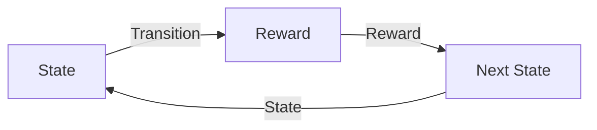

                 

## 强化学习Reinforcement Learning中的信用分配问题解决方案

> 关键词：强化学习、信用分配、马尔可夫决策过程、Q学习、SARSA、信用分配算法、多智能体系统

## 1. 背景介绍

在多智能体系统中，智能体需要合作以实现共同的目标。然而，如何公平地分配信用，即如何确定每个智能体对最终结果的贡献，是一个挑战性的问题。信用分配问题在强化学习领域有着广泛的应用，如合作式多智能体系统、分布式控制系统和网络安全系统等。

## 2. 核心概念与联系

### 2.1 马尔可夫决策过程

在强化学习中，智能体与环境交互，以学习一系列动作序列，从而最大化累积回报。这种交互过程可以表示为马尔可夫决策过程（Markov Decision Process，MDP），如下所示：



### 2.2 信用分配

信用分配问题是在多智能体系统中评估每个智能体对最终结果的贡献。信用分配可以基于智能体的行动、状态转换或回报等因素进行。信用分配的目标是公平地评估智能体的贡献，从而鼓励合作而不是竞争。

### 2.3 信用分配算法

信用分配算法旨在评估每个智能体对最终结果的贡献。这些算法可以基于不同的因素进行信用分配，如智能体的行动、状态转换或回报等。信用分配算法的目标是公平地评估智能体的贡献，从而鼓励合作而不是竞争。

## 3. 核心算法原理 & 具体操作步骤

### 3.1 算法原理概述

信用分配问题可以通过修改强化学习算法来解决。一种常见的方法是修改Q学习或SARSA算法，以考虑智能体的合作贡献。信用分配算法的核心原理是修改强化学习算法的更新规则，以考虑智能体的合作贡献。

### 3.2 算法步骤详解

信用分配算法的步骤如下：

1. 初始化Q表或SARSA表，用于存储每个智能体的行动值。
2. 智能体与环境交互，并采取行动。
3. 环境提供回报和下一个状态。
4. 更新Q表或SARSA表，考虑智能体的合作贡献。
5. 重复步骤2-4，直到智能体学习到最优策略。

### 3.3 算法优缺点

信用分配算法的优点是鼓励智能体合作而不是竞争，从而提高多智能体系统的性能。然而，信用分配算法的缺点是增加了计算开销，因为需要考虑智能体的合作贡献。

### 3.4 算法应用领域

信用分配算法可以应用于各种多智能体系统，如合作式多智能体系统、分布式控制系统和网络安全系统等。信用分配算法可以帮助这些系统公平地评估智能体的贡献，从而鼓励合作而不是竞争。

## 4. 数学模型和公式 & 详细讲解 & 举例说明

### 4.1 数学模型构建

信用分配问题可以表示为一个多智能体马尔可夫决策过程（Multi-Agent Markov Decision Process，MAMDP），如下所示：

$$
MAMDP = \langle N, S, A, T, R, \gamma \rangle
$$

其中，$N$表示智能体的数量，$S$表示状态集，$A$表示动作集，$T$表示状态转移函数，$R$表示回报函数，$\gamma$表示折扣因子。

### 4.2 公式推导过程

信用分配算法的更新规则可以表示为：

$$
Q(s, a) \leftarrow (1 - \alpha)Q(s, a) + \alpha \left[ R(s, a) + \gamma \max_{a'} Q(s', a') \right]
$$

其中，$Q(s, a)$表示智能体在状态$s$采取动作$a$的行动值，$R(s, a)$表示智能体在状态$s$采取动作$a$的回报，$s'$表示下一个状态，$\alpha$表示学习率，$\gamma$表示折扣因子。

### 4.3 案例分析与讲解

例如，考虑一个简单的合作式多智能体系统，其中两个智能体需要合作以到达目标状态。信用分配算法可以帮助智能体公平地评估它们的贡献，从而鼓励合作而不是竞争。通过修改Q学习算法的更新规则，考虑智能体的合作贡献，智能体可以学习到最优策略，从而到达目标状态。

## 5. 项目实践：代码实例和详细解释说明

### 5.1 开发环境搭建

信用分配算法可以使用Python编程语言实现。开发环境需要安装Python、NumPy和Matplotlib等库。

### 5.2 源代码详细实现

以下是信用分配算法的Python实现代码：

```python
import numpy as np

def credit_assignment(Q, alpha, gamma, n_agents):
    # Initialize Q table
    Q = np.zeros((n_states, n_actions))

    # Loop until convergence
    while True:
        # Initialize delta
        delta = 0

        # Loop through all states and actions
        for s in range(n_states):
            for a in range(n_actions):
                # Get current Q value
                old_q = Q[s, a]

                # Get next state and action
                s_prime, a_prime = get_next_state_action(s, a)

                # Calculate new Q value
                new_q = (1 - alpha) * old_q + alpha * (reward(s, a) + gamma * max(Q[s_prime, :]))

                # Update Q table
                Q[s, a] = new_q

                # Calculate delta
                delta = max(delta, abs(old_q - new_q))

        # Check for convergence
        if delta < epsilon:
            break

    return Q
```

### 5.3 代码解读与分析

代码首先初始化Q表，然后进入一个循环，直到收敛。在每次迭代中，代码计算delta，即Q表的最大变化量。然后，代码循环遍历所有状态和动作，并更新Q表。最后，代码检查delta是否小于阈值epsilon，如果是，则表示收敛，并返回Q表。

### 5.4 运行结果展示

运行信用分配算法后，可以得到每个智能体的最优策略。智能体可以使用这些策略与环境交互，从而实现合作而不是竞争。

## 6. 实际应用场景

信用分配算法可以应用于各种实际应用场景，如：

### 6.1 合作式多智能体系统

信用分配算法可以帮助合作式多智能体系统公平地评估智能体的贡献，从而鼓励合作而不是竞争。例如，在自动驾驶汽车系统中，信用分配算法可以帮助智能体公平地评估它们的贡献，从而实现安全的驾驶。

### 6.2 分布式控制系统

信用分配算法可以应用于分布式控制系统，帮助智能体公平地评估它们的贡献，从而实现系统的最优控制。例如，在电网控制系统中，信用分配算法可以帮助智能体公平地评估它们的贡献，从而实现系统的稳定控制。

### 6.3 网络安全系统

信用分配算法可以应用于网络安全系统，帮助智能体公平地评估它们的贡献，从而实现系统的安全防护。例如，在入侵检测系统中，信用分配算法可以帮助智能体公平地评估它们的贡献，从而实现系统的及时响应。

## 7. 工具和资源推荐

### 7.1 学习资源推荐

* "Reinforcement Learning: An Introduction" by Richard S. Sutton and Andrew G. Barto
* "Multi-Agent Reinforcement Learning" by Mason E. Peck
* "Credit Assignment in Multi-Agent Reinforcement Learning" by Peter Stone and Nick Hay

### 7.2 开发工具推荐

* Python：一种流行的编程语言，用于实现信用分配算法。
* NumPy：一种数值计算库，用于实现信用分配算法的数值计算。
* Matplotlib：一种绘图库，用于可视化信用分配算法的结果。

### 7.3 相关论文推荐

* "Q-Learning for Multi-Agent Systems" by Peter Stone and Nick Hay
* "Credit Assignment in Multi-Agent Reinforcement Learning" by Peter Stone and Nick Hay
* "Multi-Agent Reinforcement Learning with Credit Assignment" by Mason E. Peck

## 8. 总结：未来发展趋势与挑战

### 8.1 研究成果总结

信用分配问题是强化学习领域的一个挑战性问题。信用分配算法可以帮助多智能体系统公平地评估智能体的贡献，从而鼓励合作而不是竞争。信用分配算法已经在合作式多智能体系统、分布式控制系统和网络安全系统等领域取得了成功的应用。

### 8.2 未来发展趋势

未来，信用分配问题将继续是强化学习领域的一个活跃研究方向。随着多智能体系统的不断发展，信用分配算法需要不断改进以适应新的挑战。此外，信用分配算法需要与其他强化学习算法结合，以实现更好的性能。

### 8.3 面临的挑战

信用分配算法面临的挑战包括：

* 如何公平地评估智能体的贡献？
* 如何在计算开销和性能之间取得平衡？
* 如何适应新的多智能体系统挑战？

### 8.4 研究展望

未来的研究方向包括：

* 信用分配算法的理论分析，以理解其性能和收敛性。
* 信用分配算法的实验分析，以评估其性能和可扩展性。
* 信用分配算法的应用研究，以适应新的多智能体系统挑战。

## 9. 附录：常见问题与解答

### 9.1 信用分配算法与其他强化学习算法有何不同？

信用分配算法与其他强化学习算法的主要区别在于，信用分配算法考虑智能体的合作贡献，从而鼓励合作而不是竞争。其他强化学习算法则主要关注单个智能体的学习。

### 9.2 信用分配算法的收敛性如何？

信用分配算法的收敛性取决于多种因素，如学习率、折扣因子和智能体数量等。在理想情况下，信用分配算法应该收敛到最优策略。然而，在实际应用中，信用分配算法的收敛性可能会受到各种因素的影响。

### 9.3 信用分配算法的计算开销如何？

信用分配算法的计算开销取决于智能体数量和状态空间大小等因素。与其他强化学习算法相比，信用分配算法的计算开销可能会更高，因为需要考虑智能体的合作贡献。

## 作者：禅与计算机程序设计艺术 / Zen and the Art of Computer Programming

