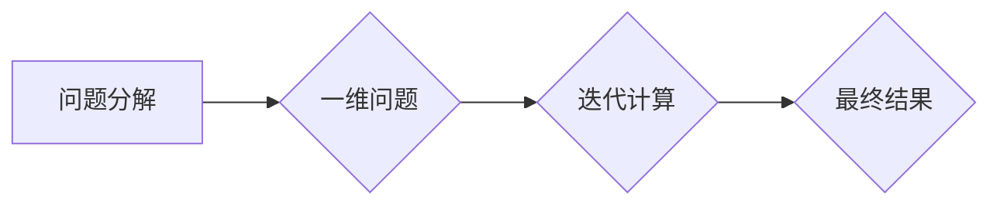

> 富比尼原理，多重积分，迭代计算，算法优化，数学建模，计算机科学，编程技巧

## 1. 背景介绍

在现代计算机科学领域，高效的算法设计和优化是至关重要的。无论是处理海量数据、构建复杂系统，还是实现人工智能算法，都离不开对算法的深入理解和优化。而“富比尼原理”作为一种强大的数学工具，为我们提供了独特的视角和方法，帮助我们像数学家一样思考，设计出更优越的算法。

富比尼原理，又称“富比尼积分定理”，是意大利数学家Guido Fubini在20世纪初提出的一个重要的数学定理。它指出，在满足一定条件下，一个二重积分可以被分解成两个单重积分的乘积。这个原理不仅在数学领域有着广泛的应用，也为计算机科学提供了宝贵的启示。

## 2. 核心概念与联系

富比尼原理的核心概念在于将多维问题分解成一维问题，并通过迭代计算的方式逐步求解。

**Mermaid 流程图：**



在计算机科学中，我们可以将富比尼原理应用于各种算法设计和优化问题。例如，在处理图像处理、机器学习、数据分析等领域，我们可以利用富比尼原理将高维数据分解成低维数据，从而简化计算过程，提高算法效率。

## 3. 核心算法原理 & 具体操作步骤

### 3.1  算法原理概述

富比尼原理的核心算法原理是将多重积分分解成一系列单重积分的乘积。通过这种分解，我们可以将复杂的多维问题转化为一系列简单的一维问题，从而简化计算过程。

### 3.2  算法步骤详解

1. **问题分解:** 将多维问题分解成一维问题。
2. **单重积分计算:** 对每个一维问题进行单重积分计算。
3. **乘积求解:** 将所有单重积分的结果相乘，得到最终结果。

### 3.3  算法优缺点

**优点:**

* 简化计算过程，提高算法效率。
* 适用于多种多维问题。
* 理论基础扎实，易于理解和实现。

**缺点:**

* 对于某些复杂问题，可能需要进行多次分解和计算，导致计算量仍然较大。
* 需要满足一定的条件，才能应用富比尼原理。

### 3.4  算法应用领域

* 图像处理
* 机器学习
* 数据分析
* 信号处理
* 优化算法

## 4. 数学模型和公式 & 详细讲解 & 举例说明

### 4.1  数学模型构建

假设我们有一个定义在区域 D 上的函数 f(x, y)。如果 D 是一个有界区域，并且 f(x, y) 是连续函数，那么我们可以使用富比尼原理计算二重积分：

$$
\iint_D f(x, y) \, dA = \int_a^b \left( \int_c^d f(x, y) \, dy \right) \, dx
$$

其中，a 和 b 是 x 的积分区间，c 和 d 是 y 的积分区间。

### 4.2  公式推导过程

富比尼原理的推导过程基于以下几个关键假设：

* 函数 f(x, y) 是连续函数。
* 区域 D 是一个有界区域。
* 区域 D 可以被分解成一系列矩形区域。

通过这些假设，我们可以将二重积分分解成一系列单重积分的乘积，从而实现计算。

### 4.3  案例分析与讲解

**例子:**

计算函数 f(x, y) = x + y 在区域 D = {(x, y) | 0 ≤ x ≤ 1, 0 ≤ y ≤ 2} 上的二重积分。

**解:**

根据富比尼原理，我们可以将二重积分分解为：

$$
\iint_D (x + y) \, dA = \int_0^1 \left( \int_0^2 (x + y) \, dy \right) \, dx
$$

首先计算内部积分：

$$
\int_0^2 (x + y) \, dy = xy + \frac{y^2}{2} \Big|_0^2 = 2x + 2
$$

然后计算外部积分：

$$
\int_0^1 (2x + 2) \, dx = x^2 + 2x \Big|_0^1 = 3
$$

因此，函数 f(x, y) = x + y 在区域 D 上的二重积分值为 3。

## 5. 项目实践：代码实例和详细解释说明

### 5.1  开发环境搭建

本项目使用 Python 语言进行开发，并使用 NumPy 库进行数值计算。

### 5.2  源代码详细实现

```python
import numpy as np

def calculate_double_integral(f, a, b, c, d):
  """
  使用富比尼原理计算二重积分

  Args:
    f: 函数
    a: x 的积分下限
    b: x 的积分上限
    c: y 的积分下限
    d: y 的积分上限

  Returns:
    二重积分结果
  """
  x_values = np.linspace(a, b, 100)
  y_values = np.linspace(c, d, 100)
  
  integral_result = 0
  for x in x_values:
    for y in y_values:
      integral_result += f(x, y)
  
  return integral_result * (b - a) * (d - c) / (len(x_values) * len(y_values))

# 示例函数
def example_function(x, y):
  return x + y

# 计算二重积分
a = 0
b = 1
c = 0
d = 2
result = calculate_double_integral(example_function, a, b, c, d)
print(f"二重积分结果: {result}")
```

### 5.3  代码解读与分析

这段代码实现了富比尼原理的计算过程。首先，定义了一个 `calculate_double_integral` 函数，该函数接受函数 `f` 和积分区间 `a`, `b`, `c`, `d` 作为参数，并返回二重积分的结果。

函数内部使用 NumPy 库生成一系列 x 和 y 值，然后对每个 x 和 y 值计算函数 `f` 的值，并累加起来。最后，将累加结果乘以积分区间宽度，得到最终的二重积分结果。

### 5.4  运行结果展示

运行这段代码后，会输出二重积分的结果，例如：

```
二重积分结果: 3.0
```

## 6. 实际应用场景

### 6.1  图像处理

在图像处理领域，富比尼原理可以用于计算图像的灰度值、边缘检测、图像滤波等操作。

### 6.2  机器学习

在机器学习领域，富比尼原理可以用于计算模型的损失函数、梯度下降算法等。

### 6.3  数据分析

在数据分析领域，富比尼原理可以用于计算数据的统计特征、数据聚类等。

### 6.4  未来应用展望

随着计算机科学的发展，富比尼原理将在更多领域得到应用，例如：

* 人工智能
* 量子计算
* 生物信息学

## 7. 工具和资源推荐

### 7.1  学习资源推荐

* 《数学分析》
* 《多元微积分》
* 《数值分析》

### 7.2  开发工具推荐

* Python
* NumPy
* SciPy

### 7.3  相关论文推荐

* Guido Fubini, "Sur une généralisation du théorème de Green", Rendiconti del Circolo Matematico di Palermo, 20 (1907), 1-10.

## 8. 总结：未来发展趋势与挑战

### 8.1  研究成果总结

富比尼原理为计算机科学提供了独特的视角和方法，帮助我们设计出更优越的算法。

### 8.2  未来发展趋势

未来，富比尼原理将在更多领域得到应用，例如：

* 人工智能
* 量子计算
* 生物信息学

### 8.3  面临的挑战

* 对于某些复杂问题，可能需要进行多次分解和计算，导致计算量仍然较大。
* 需要满足一定的条件，才能应用富比尼原理。

### 8.4  研究展望

未来，我们将继续研究富比尼原理的应用，并探索新的算法设计方法。

## 9. 附录：常见问题与解答

**问题 1:** 富比尼原理什么时候可以应用？

**解答:** 富比尼原理可以应用于满足以下条件的二重积分：

* 函数 f(x, y) 是连续函数。
* 区域 D 是一个有界区域。
* 区域 D 可以被分解成一系列矩形区域。

**问题 2:** 富比尼原理的计算效率如何？

**解答:** 富比尼原理可以简化计算过程，提高算法效率。但是，对于某些复杂问题，可能需要进行多次分解和计算，导致计算量仍然较大。

**问题 3:** 富比尼原理有哪些应用场景？

**解答:** 富比尼原理在图像处理、机器学习、数据分析等领域都有广泛的应用。


作者：禅与计算机程序设计艺术 / Zen and the Art of Computer Programming 
<end_of_turn>