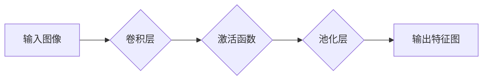

> 卷积神经网络 (CNN)，卷积层，卷积操作，池化层，特征提取，图像识别，深度学习

## 1. 背景介绍

卷积神经网络 (CNN) 作为深度学习领域最成功的应用之一，在图像识别、物体检测、自然语言处理等领域取得了突破性的进展。CNN 的核心结构之一是卷积层，它通过卷积操作提取图像特征，为后续的分类和识别任务提供基础。

传统的机器学习方法需要人工提取图像特征，这不仅耗时费力，而且难以捕捉到图像的复杂结构。而卷积层则能够自动学习图像特征，并随着训练数据量的增加，不断提升特征提取能力。

## 2. 核心概念与联系

卷积层通过卷积操作和池化操作来提取图像特征。

**2.1 卷积操作**

卷积操作是卷积层的核心，它通过一个称为卷积核 (kernel) 的小矩阵，在图像上滑动，计算每个位置的卷积结果。卷积核可以看作是一个过滤器，它能够检测图像中特定的特征，例如边缘、纹理等。

**2.2 池化操作**

池化操作用于降低图像尺寸，同时保留图像最重要的特征信息。常见的池化操作包括最大池化和平均池化。最大池化选择每个区域的最大值作为输出，而平均池化则计算每个区域的平均值。

**2.3 架构图**



## 3. 核心算法原理 & 具体操作步骤

### 3.1 算法原理概述

卷积操作的核心思想是通过滑动窗口的方式，将卷积核与图像进行逐元素相乘并求和，从而提取图像局部特征。

### 3.2 算法步骤详解

1. **初始化卷积核:** 卷积核是一个大小为 (filter_size x filter_size) 的矩阵，其元素值通常随机初始化。
2. **滑动窗口:** 将卷积核在图像上滑动，每次滑动一个步长 (stride)。
3. **卷积计算:** 在每个位置，将卷积核与图像相应区域进行逐元素相乘并求和，得到卷积结果。
4. **激活函数:** 将卷积结果输入激活函数，例如 ReLU 函数，以引入非线性特性。
5. **池化操作:** 对激活后的特征图进行池化操作，例如最大池化，以降低特征图尺寸。

### 3.3 算法优缺点

**优点:**

* **高效提取特征:** 卷积操作能够有效地提取图像局部特征，并通过堆叠多个卷积层，学习更深层次的特征。
* **参数共享:** 卷积核在图像上滑动时，参数共享机制能够减少模型参数量，提高训练效率。
* **平移不变性:** 卷积操作具有平移不变性，这意味着即使图像中的物体发生位置变化，卷积层也能识别出该物体。

**缺点:**

* **计算量大:** 卷积操作的计算量较大，尤其是在处理高分辨率图像时。
* **参数调整困难:** 卷积核的尺寸、步长、数量等参数需要精心调整，才能获得最佳的性能。

### 3.4 算法应用领域

卷积层广泛应用于图像识别、物体检测、图像分割、视频分析等领域。

## 4. 数学模型和公式 & 详细讲解 & 举例说明

### 4.1 数学模型构建

设输入图像为 $I \in R^{H \times W \times C}$，其中 $H$ 为图像高度，$W$ 为图像宽度，$C$ 为通道数。卷积核为 $K \in R^{F \times F \times C \times D}$，其中 $F$ 为卷积核大小，$D$ 为输出通道数。卷积操作的输出为 $O \in R^{(H-F+1) \times (W-F+1) \times D}$。

### 4.2 公式推导过程

卷积操作的数学公式如下：

$$
O_{i,j,k} = \sum_{m=0}^{F-1} \sum_{n=0}^{F-1} I_{i+m,j+n,l} * K_{m,n,l,k}
$$

其中：

* $O_{i,j,k}$ 为输出特征图的第 $i$ 行、第 $j$ 列、第 $k$ 个通道的值。
* $I_{i+m,j+n,l}$ 为输入图像的第 $i+m$ 行、第 $j+n$ 列、第 $l$ 个通道的值。
* $K_{m,n,l,k}$ 为卷积核的第 $m$ 行、第 $n$ 列、第 $l$ 个通道、第 $k$ 个输出通道的值。

### 4.3 案例分析与讲解

假设输入图像大小为 $32 \times 32 \times 3$，卷积核大小为 $3 \times 3$，输出通道数为 64。则卷积操作的输出特征图大小为 $30 \times 30 \times 64$。

## 5. 项目实践：代码实例和详细解释说明

### 5.1 开发环境搭建

本示例使用 Python 语言和 TensorFlow 库进行实现。

### 5.2 源代码详细实现

```python
import tensorflow as tf

# 定义卷积层
def conv_layer(input_tensor, filters, kernel_size, strides=1, padding='same'):
    x = tf.keras.layers.Conv2D(filters, kernel_size, strides=strides, padding=padding)(input_tensor)
    x = tf.keras.layers.Activation('relu')(x)
    return x

# 定义模型
model = tf.keras.models.Sequential([
    tf.keras.layers.Input(shape=(32, 32, 3)),
    conv_layer(None, 32, 3, strides=1),
    conv_layer(None, 64, 3, strides=2),
    tf.keras.layers.Flatten(),
    tf.keras.layers.Dense(10, activation='softmax')
])

# 编译模型
model.compile(optimizer='adam',
              loss='sparse_categorical_crossentropy',
              metrics=['accuracy'])

# 训练模型
model.fit(x_train, y_train, epochs=10)
```

### 5.3 代码解读与分析

* `conv_layer` 函数定义了一个卷积层，包含卷积操作、激活函数和 padding 操作。
* `model` 对象定义了一个卷积神经网络模型，包含多个卷积层、flatten 层和全连接层。
* `model.compile` 方法配置模型的优化器、损失函数和评价指标。
* `model.fit` 方法训练模型，使用训练数据和标签进行训练。

### 5.4 运行结果展示

训练完成后，可以评估模型的性能，例如在测试集上的准确率。

## 6. 实际应用场景

卷积层在图像识别、物体检测、图像分割等领域有着广泛的应用。

### 6.1 图像识别

卷积层可以用于识别图像中的物体，例如人脸、车辆、动物等。

### 6.2 物体检测

卷积层可以用于检测图像中物体的位置和类别，例如在视频中检测行人、车辆等。

### 6.3 图像分割

卷积层可以用于将图像分割成不同的区域，例如将图像中的前景和背景分开。

### 6.4 未来应用展望

随着深度学习技术的不断发展，卷积层将在更多领域得到应用，例如医疗影像分析、自动驾驶、机器人视觉等。

## 7. 工具和资源推荐

### 7.1 学习资源推荐

* **书籍:**
    * 深度学习
    * 构建深度神经网络
* **在线课程:**
    * Coursera: 深度学习
    * Udacity: 深度学习工程师

### 7.2 开发工具推荐

* **TensorFlow:** 开源深度学习框架
* **PyTorch:** 开源深度学习框架
* **Keras:** 高级深度学习API

### 7.3 相关论文推荐

* AlexNet: ImageNet Classification with Deep Convolutional Neural Networks
* VGGNet: Very Deep Convolutional Networks for Large-Scale Image Recognition
* ResNet: Deep Residual Learning for Image Recognition

## 8. 总结：未来发展趋势与挑战

### 8.1 研究成果总结

卷积层作为深度学习领域的重要组成部分，取得了显著的成果，在图像识别、物体检测等领域取得了突破性的进展。

### 8.2 未来发展趋势

* **模型更深更广:** 探索更深层次的卷积网络结构，以及更广泛的应用场景。
* **效率更高:** 研究更高效的卷积算法和硬件加速方案，降低模型训练和推理的成本。
* **可解释性更强:** 研究卷积网络的内部机制，提高模型的可解释性和可信度。

### 8.3 面临的挑战

* **数据依赖性:** 卷积网络的性能依赖于大量高质量的训练数据。
* **计算资源需求:** 训练大型卷积网络需要大量的计算资源。
* **模型泛化能力:** 确保卷积网络能够泛化到新的数据和场景。

### 8.4 研究展望

未来，卷积层将继续是深度学习领域的重要研究方向，并将在更多领域发挥重要作用。

## 9. 附录：常见问题与解答

### 9.1 卷积核的尺寸和步长如何选择？

卷积核的尺寸和步长需要根据具体的应用场景和图像特征进行选择。一般来说，较小的卷积核尺寸和较大的步长可以提取更抽象的特征，而较大的卷积核尺寸和较小的步长可以提取更精细的特征。

### 9.2 如何防止过拟合？

过拟合是指模型在训练数据上表现良好，但在测试数据上表现较差。为了防止过拟合，可以使用正则化技术、数据增强、Dropout 等方法。

### 9.3 如何评估卷积网络的性能？

卷积网络的性能通常使用准确率、召回率、F1-score 等指标进行评估。

作者：禅与计算机程序设计艺术 / Zen and the Art of Computer Programming


<end_of_turn>