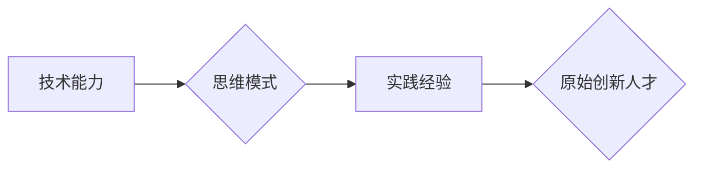

> 原始创新、人才培养、技术能力、思维模式、实践经验

## 1. 背景介绍

在当今科技飞速发展的时代，原始创新人才显得尤为重要。他们能够洞察未来趋势，提出颠覆性的想法，并将其转化为现实，推动科技进步和社会发展。然而，培养原始创新人才并非易事，需要具备多种独特的能力和素质。

传统的教育模式往往侧重于知识传授和技能训练，而缺乏对创新思维和实践能力的培养。因此，我们需要重新思考如何培养具备原始创新能力的人才。

## 2. 核心概念与联系

原始创新人才的形成是一个复杂的过程，涉及多个方面的因素相互作用。我们可以将其概括为三种核心能力：

* **技术能力：** 扎实的技术基础是原始创新人才的基石。他们需要具备广泛的专业知识和技能，能够熟练运用各种技术工具和方法。
* **思维模式：** 原始创新人才拥有独特的思维模式，能够跳出常规思维，从不同的角度思考问题，并提出创新的解决方案。
* **实践经验：** 理论知识和思维模式需要通过实践检验和积累才能真正转化为创新成果。原始创新人才需要不断进行实践探索，积累经验，并从中不断学习和成长。

**Mermaid 流程图：**



## 3. 核心算法原理 & 具体操作步骤

### 3.1  算法原理概述

原始创新并非简单的算法，它更像是一个复杂的过程，需要结合多种因素进行分析和决策。我们可以将其抽象为一个算法框架，并将其核心原理概括为以下几点：

* **问题识别：** 原始创新首先需要识别出亟待解决的问题或未被满足的需求。
* **方案探索：** 针对识别出的问题，需要进行广泛的方案探索，并进行初步的评估和筛选。
* **方案验证：** 选择出最有潜力的方案后，需要进行验证和测试，以确保其可行性和有效性。
* **方案迭代：** 经过验证和测试后，需要对方案进行迭代优化，不断完善和改进。

### 3.2  算法步骤详解

1. **问题识别：** 通过观察、调研、思考等方式，识别出亟待解决的问题或未被满足的需求。
2. **方案探索：** 利用已有知识、经验和工具，进行广泛的方案探索，并进行初步的评估和筛选。
3. **方案验证：** 选择出最有潜力的方案后，进行原型设计、实验测试等方式进行验证，并收集反馈信息。
4. **方案迭代：** 根据验证结果和反馈信息，对方案进行迭代优化，不断完善和改进。

### 3.3  算法优缺点

**优点：**

* 能够有效地解决实际问题，并创造新的价值。
* 能够促进知识创新和技术进步。
* 能够培养人才的创新思维和实践能力。

**缺点：**

* 原始创新是一个复杂的过程，需要投入大量的时间和精力。
* 原始创新存在一定的风险和不确定性。
* 原始创新需要具备一定的创新意识和能力。

### 3.4  算法应用领域

原始创新人才的应用领域非常广泛，包括但不限于：

* 科技创新
* 产业升级
* 社会发展
* 文化创意

## 4. 数学模型和公式 & 详细讲解 & 举例说明

### 4.1  数学模型构建

我们可以用一个简单的数学模型来描述原始创新的过程：

```latex
I = f(T, M, P)
```

其中：

* $I$ 代表原始创新成果
* $T$ 代表技术能力
* $M$ 代表思维模式
* $P$ 代表实践经验

这个模型表明，原始创新成果是技术能力、思维模式和实践经验的综合作用的结果。

### 4.2  公式推导过程

我们可以进一步推导这个模型，分析各个因素对原始创新成果的影响：

* **技术能力：** 技术能力是原始创新成果的基础，它决定了我们能够解决问题的范围和深度。
* **思维模式：** 思维模式决定了我们如何思考问题和寻找解决方案，它能够帮助我们跳出常规思维，提出更创新的想法。
* **实践经验：** 实践经验是检验和积累的场所，它能够帮助我们验证想法的可行性，并不断完善和改进方案。

### 4.3  案例分析与讲解

例如，一个优秀的程序员（高技术能力）可能会遇到一个新的技术难题。如果他拥有独特的思维模式（例如，能够从不同的角度思考问题，并进行跨领域思考），并积累了丰富的实践经验（例如，曾解决过类似的难题），那么他更有可能提出创新的解决方案。

## 5. 项目实践：代码实例和详细解释说明

### 5.1  开发环境搭建

为了更好地理解原始创新的过程，我们可以通过一个简单的项目实践来进行演示。

**项目目标：** 开发一个能够自动生成代码的工具。

**开发环境：**

* 操作系统：Windows/macOS/Linux
* 编程语言：Python
* 工具：PyCharm/VS Code

### 5.2  源代码详细实现

```python
def generate_code(template, data):
  """
  根据模板和数据生成代码

  Args:
    template: 代码模板
    data: 代码数据

  Returns:
    生成的代码
  """
  for key, value in data.items():
    template = template.replace(f'{{{key}}}', value)
  return template

# 示例代码模板
template = """
class MyClass:
  def __init__(self, {name}):
    self.{name} = {name}

  def say_hello(self):
    print(f"Hello, my name is {self.{name}}!")
"""

# 示例代码数据
data = {
  "name": "World"
}

# 生成代码
generated_code = generate_code(template, data)
print(generated_code)
```

### 5.3  代码解读与分析

这段代码实现了根据模板和数据生成代码的功能。

* `generate_code()` 函数接受代码模板和代码数据作为参数，并根据数据替换模板中的占位符，生成最终的代码。
* `template` 变量存储了代码模板，其中包含了占位符 `{{{key}}}`。
* `data` 变量存储了代码数据，其中包含了需要替换的变量名和值。
* `generated_code` 变量存储了生成的代码。

### 5.4  运行结果展示

运行这段代码后，会输出以下生成的代码：

```python
class MyClass:
  def __init__(self, World):
    self.World = World

  def say_hello(self):
    print(f"Hello, my name is World!")
```

## 6. 实际应用场景

原始创新人才在各个领域都有着广泛的应用场景，例如：

### 6.1  科技创新

* **人工智能：** 研发新的算法和模型，推动人工智能技术的发展。
* **生物技术：** 开发新的药物和治疗方法，改善人类健康。
* **能源技术：** 探索新的能源来源和技术，解决能源短缺问题。

### 6.2  产业升级

* **制造业：** 推动智能制造，提高生产效率和产品质量。
* **服务业：** 开发新的服务模式和产品，提升服务质量和用户体验。
* **农业：** 运用科技手段提高农业生产效率和产品质量。

### 6.3  社会发展

* **教育：** 开发新的教育模式和教学方法，提高教育质量。
* **医疗：** 推动医疗信息化，提高医疗服务效率和质量。
* **文化：** 创作新的文化产品和内容，丰富人们的精神生活。

### 6.4  未来应用展望

随着科技的不断发展，原始创新人才的需求将会更加迫切。未来，原始创新人才将发挥更加重要的作用，推动社会进步和人类文明的发展。

## 7. 工具和资源推荐

### 7.1  学习资源推荐

* **在线课程：** Coursera、edX、Udacity 等平台提供丰富的在线课程，涵盖人工智能、数据科学、软件工程等领域。
* **书籍：** 《创新者的窘境》、《零到一》、《刻意练习》等书籍，可以帮助我们理解创新思维和实践方法。
* **学术期刊：** Nature、Science、IEEE Transactions 等学术期刊，可以了解最新的科技成果和研究进展。

### 7.2  开发工具推荐

* **编程语言：** Python、Java、C++ 等编程语言，是开发软件和应用的常用工具。
* **IDE：** PyCharm、VS Code、Eclipse 等集成开发环境，可以提高开发效率和代码质量。
* **版本控制系统：** Git、GitHub 等版本控制系统，可以帮助我们管理代码和协同开发。

### 7.3  相关论文推荐

* **人工智能：** Deep Learning，Reinforcement Learning，Natural Language Processing 等领域的相关论文。
* **生物技术：** 基因编辑、合成生物学、精准医疗等领域的相关论文。
* **能源技术：** 太阳能、风能、核能等领域的相关论文。

## 8. 总结：未来发展趋势与挑战

### 8.1  研究成果总结

原始创新人才的培养是一个系统工程，需要多方共同努力。

* **教育机构：** 应改革教育模式，培养学生的创新思维和实践能力。
* **企业：** 应重视人才培养，为创新人才提供良好的发展平台。
* **政府：** 应制定相关政策，支持原始创新人才的成长和发展。

### 8.2  未来发展趋势

未来，原始创新人才的培养将更加注重以下几个方面：

* **跨学科融合：** 鼓励不同学科领域的交叉融合，培养具有跨学科思维能力的人才。
* **实践导向：** 加强实践教学，让学生在实践中学习和成长。
* **个性化培养：** 针对不同学生的特点和需求，制定个性化的培养方案。

### 8.3  面临的挑战

原始创新人才的培养也面临着一些挑战：

* **创新思维的培养：** 创新思维是一种很难培养的素质，需要长期积累和实践。
* **实践机会的缺乏：** 很多学生缺乏实践机会，难以将理论知识转化为实际应用。
* **人才流失：** 一些优秀的创新人才可能会选择出国发展，导致人才流失。

### 8.4  研究展望

未来，我们需要继续深入研究原始创新人才的培养机制，探索更加有效的培养方法，为社会发展培养更多优秀的人才。

## 9. 附录：常见问题与解答

**问题：** 如何培养学生的创新思维？

**解答：** 

* 鼓励学生提出问题，并尝试寻找解决方案。
* 提供开放式的学习环境，让学生自由探索和尝试。
* 引导学生进行跨学科思考，鼓励他们将不同领域的知识结合起来。

**问题：** 如何让学生获得更多的实践机会？

**解答：** 

* 组织学生参加实践活动，例如创业项目、科学竞赛等。
* 建立与企业的合作关系，为学生提供实习机会。
* 利用互联网平台，让学生参与在线项目和社区开发。


作者：禅与计算机程序设计艺术 / Zen and the Art of Computer Programming 
<end_of_turn>