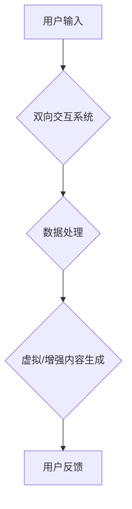

> 双向交互，VR/AR技术，沉浸式体验，人工智能，自然语言处理，计算机视觉，用户体验，交互设计

## 1. 背景介绍

近年来，虚拟现实（VR）和增强现实（AR）技术蓬勃发展，为人们提供了沉浸式、交互式的数字体验。与传统的单向信息传递模式相比，双向交互技术为用户提供了更主动、更自然的参与方式，极大地提升了用户体验。

VR/AR技术在各个领域都展现出巨大的应用潜力，例如：

* **教育培训:**  VR/AR可以构建虚拟环境，让用户身临其境地体验学习内容，例如模拟手术、探索宇宙等。
* **游戏娱乐:** VR/AR游戏可以提供更沉浸式的游戏体验，让玩家身临其境地参与游戏世界。
* **医疗保健:** VR/AR可以用于医疗培训、手术模拟、康复治疗等，提高医疗效率和安全性。
* **工业设计:** VR/AR可以帮助设计师进行虚拟原型设计和测试，缩短产品开发周期。

## 2. 核心概念与联系

**2.1 双向交互**

双向交互是指用户与系统之间可以进行双向信息传递和反馈的交互模式。传统的单向交互模式，例如观看视频或阅读文章，用户只能被动接收信息。而双向交互模式，例如聊天机器人或游戏，用户可以主动输入信息并与系统进行互动，从而获得更个性化、更丰富的体验。

**2.2 VR/AR技术**

* **VR（虚拟现实）:**  VR技术通过头戴式显示器和手柄等设备，创造出一个虚拟环境，让用户沉浸其中。
* **AR（增强现实）:** AR技术通过摄像头和显示器，将虚拟内容叠加到现实世界中，增强用户的现实世界感知。

**2.3 核心概念联系**

双向交互技术与VR/AR技术相结合，可以创造出更沉浸式、更自然的交互体验。例如，在VR游戏中，用户可以通过手柄和语音控制角色的动作，与游戏世界进行互动。在AR应用中，用户可以通过语音指令控制虚拟物体，并与现实世界中的物体进行交互。

**2.4 Mermaid 流程图**



## 3. 核心算法原理 & 具体操作步骤

**3.1 算法原理概述**

双向交互与VR/AR技术的应用涉及到多种算法，例如：

* **自然语言处理 (NLP):** 用于理解和处理用户的自然语言输入，例如语音指令、文本聊天。
* **计算机视觉 (CV):** 用于识别和理解用户的动作和环境，例如手势识别、物体识别。
* **机器学习 (ML):** 用于训练模型，使系统能够更好地理解用户的意图和行为，并提供更个性化的交互体验。

**3.2 算法步骤详解**

1. **用户输入:** 用户通过语音、手势、文本等方式输入信息。
2. **数据预处理:** 系统对用户输入进行预处理，例如语音识别、文本清洗等。
3. **意图识别:** 系统使用NLP算法识别用户的意图，例如用户想要做什么、想要获取什么信息。
4. **内容生成:** 系统根据用户的意图，使用CV和ML算法生成相应的虚拟或增强内容，例如虚拟物体、虚拟场景、增强现实叠加信息等。
5. **反馈呈现:** 系统将生成的虚拟或增强内容呈现给用户，并接收用户的反馈。
6. **系统学习:** 系统使用用户的反馈数据，不断训练和优化模型，提高交互体验。

**3.3 算法优缺点**

* **优点:** 
    * 提升用户体验: 提供更沉浸式、更自然的交互体验。
    * 个性化服务: 根据用户的意图和行为提供个性化的服务。
    * 拓展应用场景: 在教育、医疗、娱乐等领域拓展新的应用场景。
* **缺点:** 
    * 技术复杂: 需要整合多种算法和技术，开发难度较高。
    * 计算资源需求: 处理大量数据和生成虚拟内容需要较高的计算资源。
    * 隐私安全: 用户数据收集和使用需要考虑隐私安全问题。

**3.4 算法应用领域**

* **游戏娱乐:**  VR/AR游戏、互动式电影、虚拟演唱会等。
* **教育培训:**  虚拟实验室、沉浸式教学、远程培训等。
* **医疗保健:**  手术模拟、康复治疗、远程医疗等。
* **工业设计:**  虚拟原型设计、产品测试、远程协作等。

## 4. 数学模型和公式 & 详细讲解 & 举例说明

**4.1 数学模型构建**

双向交互与VR/AR技术的应用涉及到多种数学模型，例如：

* **用户行为模型:** 用于预测用户的行为模式，例如用户点击、滑动、语音输入等。
* **虚拟环境建模:** 用于构建虚拟环境的几何形状、物理属性、光照效果等。
* **增强现实叠加模型:** 用于将虚拟内容叠加到现实世界中，并确保虚拟内容与现实世界环境的融合。

**4.2 公式推导过程**

例如，用户行为模型可以使用马尔科夫链来描述用户的行为模式。马尔科夫链是一种统计模型，它假设用户的当前状态只依赖于其前一个状态，而与过去的其他状态无关。

**状态转移概率矩阵:**

$$
P = \begin{bmatrix}
p_{11} & p_{12} & \cdots & p_{1n} \\
p_{21} & p_{22} & \cdots & p_{2n} \\
\vdots & \vdots & \ddots & \vdots \\
p_{n1} & p_{n2} & \cdots & p_{nn}
\end{bmatrix}
$$

其中，$p_{ij}$表示从状态$i$转移到状态$j$的概率。

**4.3 案例分析与讲解**

例如，假设用户在浏览网页时，可以处于“阅读”、“点击链接”、“返回上一页”三种状态。我们可以使用马尔科夫链来建模用户的行为模式，并预测用户下一步的行为。

## 5. 项目实践：代码实例和详细解释说明

**5.1 开发环境搭建**

* 操作系统: Windows/macOS/Linux
* 编程语言: Python
* 框架: TensorFlow/PyTorch
* 库: OpenCV、NLTK、SpeechRecognition

**5.2 源代码详细实现**

```python
# 导入必要的库
import cv2
import speech_recognition as sr

# 初始化语音识别器
r = sr.Recognizer()

# 使用摄像头获取视频流
cap = cv2.VideoCapture(0)

while True:
    # 读取视频帧
    ret, frame = cap.read()

    # 使用OpenCV进行人脸识别
    face_cascade = cv2.CascadeClassifier('haarcascade_frontalface_default.xml')
    faces = face_cascade.detectMultiScale(frame, 1.3, 5)

    # 如果检测到人脸，则进行语音识别
    for (x, y, w, h) in faces:
        # 裁剪人脸区域
        face_roi = frame[y:y+h, x:x+w]

        # 使用麦克风获取语音输入
        with sr.Microphone() as source:
            print("说话吧...")
            audio = r.listen(source)

        try:
            # 使用Google Speech Recognition进行语音识别
            text = r.recognize_google(audio)
            print("你说了:", text)

            # 根据语音识别结果进行相应的操作
            if "你好" in text:
                print("你好!")
            elif "再见" in text:
                print("再见!")
            else:
                print("我理解不了你的意思")

        except sr.UnknownValueError:
            print("语音识别失败")
        except sr.RequestError as e:
            print("无法连接到语音识别服务; {0}".format(e))

    # 显示视频帧
    cv2.imshow('Video', frame)

    # 按键退出
    if cv2.waitKey(1) & 0xFF == ord('q'):
        break

# 释放资源
cap.release()
cv2.destroyAllWindows()
```

**5.3 代码解读与分析**

这段代码实现了简单的双向交互系统，它使用摄像头获取视频流，使用OpenCV进行人脸识别，使用SpeechRecognition进行语音识别，并根据语音识别结果进行相应的操作。

**5.4 运行结果展示**

当程序运行时，它会打开摄像头，并显示视频流。当检测到人脸时，程序会提示用户说话，并识别用户的语音输入。根据语音识别结果，程序会输出相应的文字信息，并进行相应的操作。

## 6. 实际应用场景

**6.1 教育培训**

* **虚拟实验室:** 学生可以在虚拟实验室中进行实验操作，例如模拟化学反应、生物细胞观察等，无需担心安全风险和成本问题。
* **沉浸式教学:** 教师可以使用VR/AR技术创建沉浸式的教学场景，例如模拟历史事件、探索宇宙等，提高学生的学习兴趣和理解能力。

**6.2 医疗保健**

* **手术模拟:** 医生可以使用VR/AR技术进行手术模拟，熟悉手术步骤和操作技巧，提高手术成功率。
* **康复治疗:**  患者可以使用VR/AR技术进行康复治疗，例如虚拟现实运动训练、虚拟现实疼痛管理等，提高治疗效果。

**6.3 工业设计**

* **虚拟原型设计:** 设计师可以使用VR/AR技术创建虚拟原型，进行虚拟测试和优化，缩短产品开发周期。
* **远程协作:**  团队成员可以使用VR/AR技术进行远程协作，例如共同设计产品、进行虚拟会议等，提高工作效率。

**6.4 未来应用展望**

随着VR/AR技术的不断发展，双向交互技术将在更多领域得到应用，例如：

* **元宇宙:**  双向交互技术将成为元宇宙中用户与虚拟世界交互的关键技术。
* **智能家居:**  双向交互技术将使智能家居更加智能化，用户可以通过语音、手势等方式控制家居设备。
* **个性化服务:**  双向交互技术将使服务更加个性化，例如根据用户的喜好推荐商品、提供定制化的服务等。

## 7. 工具和资源推荐

**7.1 学习资源推荐**

* **书籍:**
    * 《VR/AR技术入门》
    * 《双向交互设计》
    * 《深度学习》
* **在线课程:**
    * Coursera: VR/AR开发课程
    * Udemy: 双向交互设计课程
    * edX: 深度学习课程

**7.2 开发工具推荐**

* **Unity:**  游戏开发引擎，支持VR/AR开发。
* **Unreal Engine:**  游戏开发引擎，支持VR/AR开发。
* **ARKit:**  苹果公司提供的AR开发框架。
* **ARCore:**  谷歌公司提供的AR开发框架。

**7.3 相关论文推荐**

* **双向交互与VR/AR技术的应用研究**
* **基于深度学习的VR/AR交互系统**
* **增强现实技术在教育领域的应用研究**

## 8. 总结：未来发展趋势与挑战

**8.1 研究成果总结**

近年来，双向交互与VR/AR技术的应用取得了显著进展，在教育、医疗、工业等领域展现出巨大的应用潜力。

**8.2 未来发展趋势**

* **技术融合:**  VR/AR技术将与人工智能、物联网等技术融合，创造出更加智能、更加丰富的交互体验。
* **应用拓展:**  VR/AR技术将应用于更多领域，例如社交、娱乐、商业等。
* **体验提升:**  VR/AR技术的沉浸感、交互性、真实感将不断提升。

**8.3 面临的挑战**

* **技术难题:**  VR/AR技术的开发和应用仍然面临着一些技术难题，例如计算资源需求、用户体验等。
* **成本问题:**  VR/AR设备和软件的成本仍然较高，限制了其普及率。
