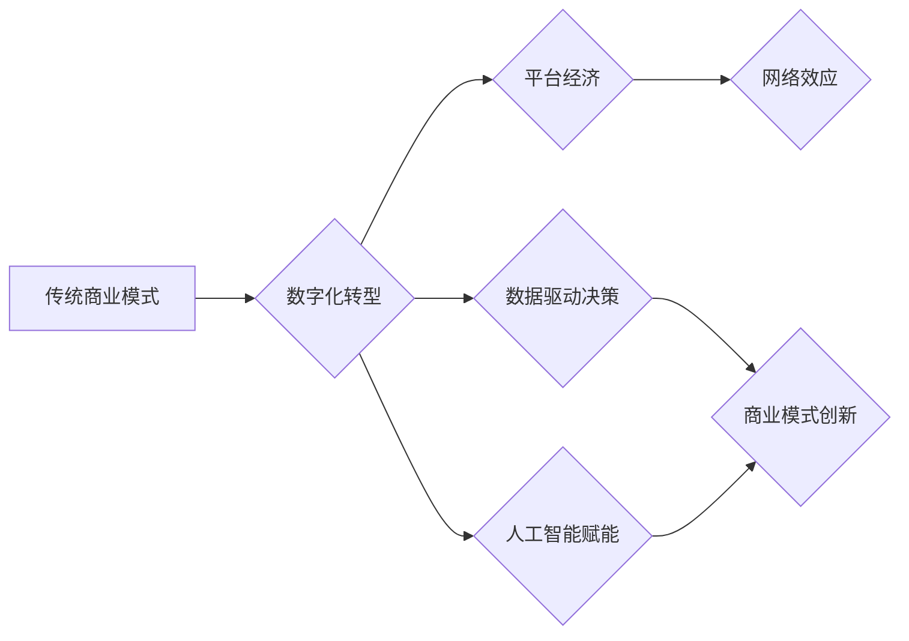

>  商业模式、竞争格局、数字化转型、平台经济、人工智能、数据驱动、网络效应

## 1. 背景介绍

商业竞争一直是市场经济的永恒主题。从传统的线下竞争到如今的数字化时代，商业竞争格局不断演变，呈现出越来越多的复杂性和动态性。

过去，企业之间的竞争主要围绕产品、价格、渠道等要素展开。然而，随着互联网、移动互联网、大数据、人工智能等技术的快速发展，商业竞争格局正在发生深刻的变革。数字化转型成为企业发展的关键，而平台经济、数据驱动、人工智能等新兴力量也逐渐成为竞争的新焦点。

## 2. 核心概念与联系

**2.1 商业模式创新**

商业模式是指企业为创造、传递和捕获价值而采取的策略和实践。随着科技进步和市场需求的变化，传统的商业模式面临着挑战，企业需要不断进行创新，以适应新的市场环境。

**2.2 平台经济崛起**

平台经济是指以平台为核心，通过连接供需双方，提供交易、服务和内容等价值的商业模式。平台经济的出现，打破了传统的产业链条，促进了资源的整合和共享，也为企业提供了新的商业机会。

**2.3 数据驱动决策**

数据已经成为企业最重要的资产。通过收集、分析和利用数据，企业可以洞察市场趋势、了解用户需求、优化运营效率，从而做出更科学、更精准的决策。

**2.4 人工智能赋能**

人工智能技术正在深刻地改变着商业模式。从自动化生产到个性化服务，人工智能可以帮助企业提高效率、降低成本、提升用户体验。

**2.5 网络效应**

网络效应是指随着用户数量的增加，平台价值和用户体验不断提升的现象。平台经济的成功很大程度上依赖于网络效应，因此，吸引用户和构建用户生态成为平台企业的重要目标。

**Mermaid 流程图**



## 3. 核心算法原理 & 具体操作步骤

**3.1 算法原理概述**

在商业领域，各种算法被广泛应用于数据分析、预测模型、推荐系统等方面。例如，协同过滤算法可以用于推荐产品或服务；机器学习算法可以用于预测用户行为或市场趋势；深度学习算法可以用于图像识别、自然语言处理等领域。

**3.2 算法步骤详解**

具体算法的步骤会根据不同的应用场景而有所不同。例如，协同过滤算法的步骤一般包括：

1. 收集用户行为数据，例如用户对产品的评分、购买记录等。
2. 计算用户之间的相似度，例如基于评分的相似度、基于购买记录的相似度等。
3. 根据用户之间的相似度，推荐用户可能感兴趣的产品或服务。

**3.3 算法优缺点**

不同的算法具有不同的优缺点。例如，协同过滤算法的优点是能够推荐个性化的产品或服务，缺点是需要大量的用户行为数据才能有效运行。

**3.4 算法应用领域**

算法在商业领域应用广泛，例如：

* **电商平台：**推荐系统、搜索引擎、价格优化等。
* **金融行业：**风险评估、欺诈检测、信用评分等。
* **医疗保健：**疾病诊断、药物研发、个性化治疗等。

## 4. 数学模型和公式 & 详细讲解 & 举例说明

**4.1 数学模型构建**

在商业领域，可以使用数学模型来描述和分析各种现象。例如，可以使用线性回归模型来预测销售额，可以使用Logistic回归模型来预测用户转化率。

**4.2 公式推导过程**

数学模型的公式推导过程通常需要用到微积分、概率论等数学知识。例如，线性回归模型的公式推导过程需要用到最小二乘法。

**4.3 案例分析与讲解**

例如，可以使用线性回归模型来预测销售额。假设销售额与广告投入量之间存在线性关系，可以使用以下公式来建立模型：

$$
y = a + bx
$$

其中：

* $y$ 表示销售额
* $x$ 表示广告投入量
* $a$ 表示截距
* $b$ 表示斜率

可以通过最小二乘法来估计 $a$ 和 $b$ 的值。

## 5. 项目实践：代码实例和详细解释说明

**5.1 开发环境搭建**

可以使用 Python 语言和相关的库来实现商业领域的算法模型。例如，可以使用 scikit-learn 库来实现机器学习算法。

**5.2 源代码详细实现**

```python
from sklearn.linear_model import LinearRegression

# 准备数据
x = [1, 2, 3, 4, 5]
y = [2, 4, 5, 4, 6]

# 创建线性回归模型
model = LinearRegression()

# 训练模型
model.fit(x.reshape(-1, 1), y)

# 预测新的销售额
new_x = 6
predicted_y = model.predict(new_x.reshape(-1, 1))

# 打印预测结果
print(f"预测的销售额为：{predicted_y[0]}")
```

**5.3 代码解读与分析**

这段代码首先准备了训练数据，然后创建了一个线性回归模型，并使用训练数据训练模型。最后，使用训练好的模型预测新的销售额。

**5.4 运行结果展示**

运行这段代码后，会输出预测的销售额。

## 6. 实际应用场景

**6.1 电商平台推荐系统**

电商平台可以使用协同过滤算法或基于内容的推荐算法来推荐产品或服务，提高用户体验和转化率。

**6.2 金融行业风险评估**

金融机构可以使用机器学习算法来评估客户的信用风险，帮助决策贷款审批和风险控制。

**6.3 医疗保健疾病诊断**

医疗机构可以使用深度学习算法来分析患者的影像数据，辅助医生进行疾病诊断。

**6.4 未来应用展望**

随着人工智能技术的不断发展，商业领域将会有更多新的应用场景。例如，虚拟助手、个性化营销、自动驾驶等领域都将迎来新的突破。

## 7. 工具和资源推荐

**7.1 学习资源推荐**

* **在线课程:** Coursera, edX, Udacity 等平台提供各种人工智能和数据科学课程。
* **书籍:** 《深度学习》、《机器学习实战》等书籍可以帮助读者深入了解人工智能和机器学习的原理和应用。
* **开源项目:** TensorFlow, PyTorch 等开源项目可以帮助读者实践人工智能算法。

**7.2 开发工具推荐**

* **Python:** Python 语言是人工智能开发的常用语言，拥有丰富的库和工具。
* **Jupyter Notebook:** Jupyter Notebook 是一个交互式编程环境，方便进行数据分析和模型开发。
* **云计算平台:** AWS, Azure, GCP 等云计算平台提供强大的计算资源和服务，方便进行大规模数据处理和模型训练。

**7.3 相关论文推荐**

* **《ImageNet Classification with Deep Convolutional Neural Networks》**
* **《Attention Is All You Need》**
* **《BERT: Pre-training of Deep Bidirectional Transformers for Language Understanding》**

## 8. 总结：未来发展趋势与挑战

**8.1 研究成果总结**

近年来，人工智能技术取得了长足的进步，在商业领域也得到了广泛应用。从推荐系统到风险评估，从疾病诊断到个性化营销，人工智能正在改变着商业模式和竞争格局。

**8.2 未来发展趋势**

未来，人工智能技术将继续发展，并对商业领域产生更深远的影响。例如，

* **更强大的计算能力:** 量子计算等新兴技术将为人工智能提供更强大的计算能力，推动算法的复杂性和应用范围的扩展。
* **更丰富的传感器数据:** 物联网、传感器技术的发展将为人工智能提供更丰富的传感器数据，帮助企业更好地理解用户行为和市场趋势。
* **更智能的自动化:** 人工智能将推动自动化程度的提升，例如自动驾驶、自动客服等，帮助企业提高效率和降低成本。

**8.3 面临的挑战**

人工智能技术的发展也面临着一些挑战，例如：

* **数据隐私和安全:** 人工智能算法依赖于大量数据，如何保护用户数据隐私和安全是一个重要的挑战。
* **算法偏见:** 人工智能算法可能会受到训练数据的影响，导致算法偏见，需要采取措施避免和解决算法偏见问题。
* **伦理问题:** 人工智能技术的应用可能会引发一些伦理问题，例如自动决策的责任归属、人工智能的权利等，需要进行深入的探讨和研究。

**8.4 研究展望**

未来，人工智能研究将继续深入，探索更智能、更安全、更可解释的人工智能算法，并将其应用于更多领域，为人类社会带来更多福祉。

## 9. 附录：常见问题与解答

**9.1 如何选择合适的算法？**

选择合适的算法需要根据具体的应用场景和数据特点进行分析。例如，如果需要推荐个性化的产品，可以使用协同过滤算法；如果需要预测用户行为，可以使用机器学习算法。

**9.2 如何解决算法偏见问题？**

可以采取以下措施来解决算法偏见问题：

* 使用更全面、更均衡的数据集进行训练。
* 在算法设计中加入公平性约束。
* 定期评估算法的公平性，并进行调整。

**9.3 如何保护用户数据隐私？**

可以采取以下措施来保护用户数据隐私：

* 采用加密技术保护用户数据。
* 明确告知用户数据的使用目的和方式。
* 限制数据访问权限，只允许授权人员访问用户数据。


作者：禅与计算机程序设计艺术 / Zen and the Art of Computer Programming 
<end_of_turn>