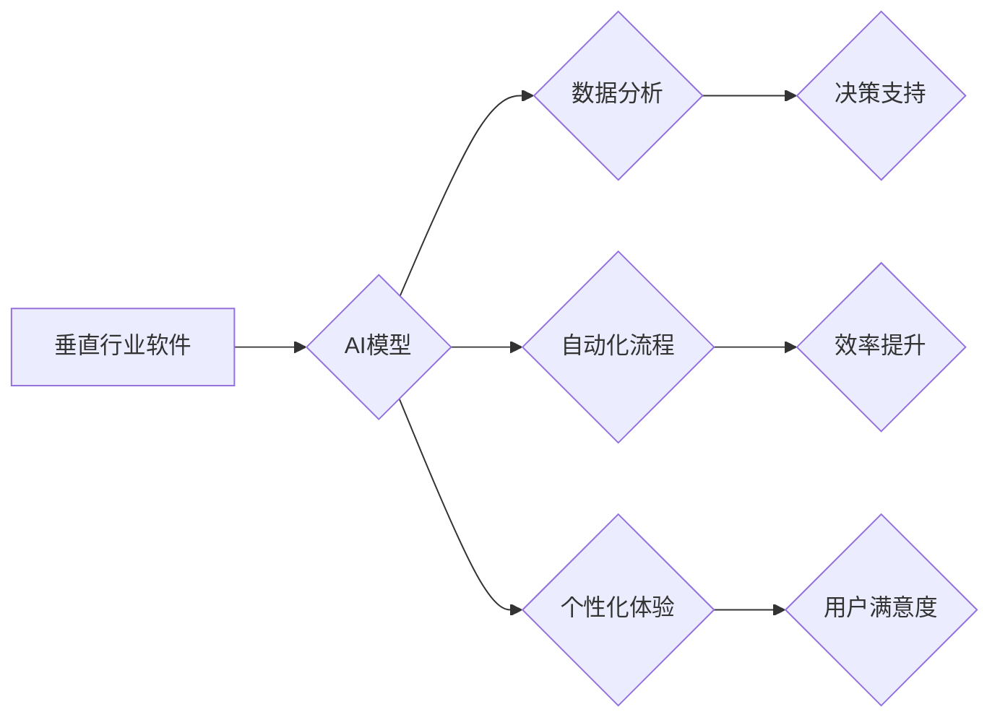

> 垂直行业软件，人工智能，深度学习，机器学习，自然语言处理，计算机视觉，行业应用，数据驱动

## 1. 背景介绍

随着人工智能（AI）技术的飞速发展，其应用场景不断拓展，从日常生活到各个行业领域，AI都展现出强大的潜力。垂直行业软件，是指针对特定行业或领域的软件应用，例如医疗、金融、教育、制造等。传统垂直行业软件往往以满足特定业务流程和数据处理需求为主，缺乏智能化和个性化功能。而AI技术的融入，为垂直行业软件注入了新的活力，使其能够更加智能化、高效化和个性化。

## 2. 核心概念与联系

**2.1 垂直行业软件**

垂直行业软件是指针对特定行业或领域的软件应用，其功能和设计都围绕着该行业的特定需求和业务流程而构建。例如，医疗行业软件用于管理患者信息、预约挂号、电子病历等；金融行业软件用于处理交易、风险管理、客户服务等。

**2.2 人工智能**

人工智能（AI）是指模拟人类智能行为的计算机系统。AI技术涵盖了多个领域，包括机器学习、深度学习、自然语言处理、计算机视觉等。

**2.3 AI与垂直行业软件的结合**

将AI技术融入垂直行业软件，可以赋予软件更强大的智能化能力，例如：

* **数据分析和预测:** AI算法可以分析海量行业数据，发现隐藏的模式和趋势，并进行预测，帮助企业做出更明智的决策。
* **自动化流程:** AI可以自动化重复性任务，提高工作效率，例如自动生成报告、处理客户服务请求等。
* **个性化体验:** AI可以根据用户的行为和偏好，提供个性化的服务和体验，例如推荐产品、定制服务等。

**2.4 架构图**



## 3. 核心算法原理 & 具体操作步骤

**3.1 算法原理概述**

在垂直行业软件中，常用的AI算法包括：

* **机器学习:** 通过训练数据，让算法自动学习并改进其性能。
* **深度学习:** 一种更高级的机器学习方法，使用多层神经网络来模拟人类大脑的学习过程。
* **自然语言处理:** 处理和理解人类语言，例如文本分类、情感分析、机器翻译等。
* **计算机视觉:** 处理和理解图像和视频，例如图像识别、物体检测、场景理解等。

**3.2 算法步骤详解**

以机器学习为例，其基本步骤包括：

1. **数据收集和预处理:** 收集相关数据，并进行清洗、转换、特征提取等预处理工作。
2. **模型选择:** 根据任务需求选择合适的机器学习模型，例如线性回归、逻辑回归、决策树、支持向量机等。
3. **模型训练:** 使用训练数据训练模型，调整模型参数，使其能够准确地预测或分类数据。
4. **模型评估:** 使用测试数据评估模型的性能，例如准确率、召回率、F1-score等。
5. **模型部署:** 将训练好的模型部署到实际应用环境中，用于进行预测或分类。

**3.3 算法优缺点**

不同的AI算法各有优缺点，需要根据具体应用场景选择合适的算法。例如，机器学习算法能够自动学习数据模式，但需要大量的训练数据；深度学习算法能够处理更复杂的数据，但训练时间更长，计算资源要求更高。

**3.4 算法应用领域**

AI算法在垂直行业软件中应用广泛，例如：

* **医疗行业:** 疾病诊断、药物研发、患者画像分析等。
* **金融行业:** 风险评估、欺诈检测、客户服务自动化等。
* **教育行业:** 个性化学习推荐、智能答疑、学生行为分析等。
* **制造业:** 预测性维护、质量控制、生产流程优化等。

## 4. 数学模型和公式 & 详细讲解 & 举例说明

**4.1 数学模型构建**

在AI算法中，数学模型是描述算法逻辑和关系的核心。例如，线性回归模型的数学表达式为：

$$y = w_0 + w_1x_1 + w_2x_2 + ... + w_nx_n + \epsilon$$

其中：

* $y$ 是预测值
* $w_0, w_1, ..., w_n$ 是模型参数
* $x_1, x_2, ..., x_n$ 是输入特征
* $\epsilon$ 是误差项

**4.2 公式推导过程**

模型参数的学习过程通常使用梯度下降算法，其核心思想是通过不断调整参数，使模型预测值与真实值之间的误差最小化。梯度下降算法的公式为：

$$w_i = w_i - \alpha \frac{\partial Loss}{\partial w_i}$$

其中：

* $w_i$ 是模型参数
* $\alpha$ 是学习率
* $Loss$ 是损失函数，用于衡量模型预测值与真实值之间的误差
* $\frac{\partial Loss}{\partial w_i}$ 是损失函数对参数 $w_i$ 的梯度

**4.3 案例分析与讲解**

以房价预测为例，假设我们收集了房屋面积、房间数量、地理位置等特征数据，以及对应的房价数据。我们可以使用线性回归模型进行房价预测。

通过训练数据，模型会学习到房屋面积、房间数量、地理位置等特征与房价之间的关系，并得到相应的模型参数。然后，我们可以使用训练好的模型预测新房子的房价。

## 5. 项目实践：代码实例和详细解释说明

**5.1 开发环境搭建**

* 操作系统：Windows/macOS/Linux
* Python版本：3.6+
* 必要的库：NumPy、Pandas、Scikit-learn、TensorFlow/PyTorch等

**5.2 源代码详细实现**

```python
import pandas as pd
from sklearn.model_selection import train_test_split
from sklearn.linear_model import LinearRegression
from sklearn.metrics import mean_squared_error

# 加载数据
data = pd.read_csv('house_data.csv')

# 划分训练集和测试集
X = data[['area', 'rooms', 'location']]
y = data['price']
X_train, X_test, y_train, y_test = train_test_split(X, y, test_size=0.2, random_state=42)

# 创建线性回归模型
model = LinearRegression()

# 训练模型
model.fit(X_train, y_train)

# 预测测试集数据
y_pred = model.predict(X_test)

# 计算模型性能
mse = mean_squared_error(y_test, y_pred)
print(f'Mean Squared Error: {mse}')
```

**5.3 代码解读与分析**

* 首先，我们加载数据并划分训练集和测试集。
* 然后，我们创建线性回归模型并使用训练集进行模型训练。
* 训练完成后，我们使用测试集数据进行预测，并计算模型性能。

**5.4 运行结果展示**

运行代码后，会输出模型的均方误差（MSE）值，该值越小，模型的预测性能越好。

## 6. 实际应用场景

**6.1 医疗行业**

* **疾病诊断:** AI算法可以分析患者的病历、影像数据等，辅助医生进行疾病诊断。
* **药物研发:** AI可以加速药物研发过程，例如预测药物的有效性、安全性等。
* **患者画像分析:** AI可以分析患者的医疗数据，构建患者画像，为个性化医疗提供支持。

**6.2 金融行业**

* **风险评估:** AI可以分析客户的财务数据，评估其信用风险。
* **欺诈检测:** AI可以识别异常交易行为，防止金融欺诈。
* **客户服务自动化:** AI可以处理客户的咨询请求，提高客户服务效率。

**6.3 教育行业**

* **个性化学习推荐:** AI可以根据学生的学习情况，推荐个性化的学习内容。
* **智能答疑:** AI可以回答学生的学习问题，提供即时反馈。
* **学生行为分析:** AI可以分析学生的学习行为，发现学习问题，提供针对性帮助。

**6.4 未来应用展望**

随着AI技术的不断发展，其在垂直行业软件中的应用场景将更加广泛。例如，在制造业，AI可以实现智能工厂，提高生产效率和产品质量；在农业，AI可以实现精准农业，提高产量和资源利用效率。

## 7. 工具和资源推荐

**7.1 学习资源推荐**

* **在线课程:** Coursera、edX、Udacity等平台提供丰富的AI课程。
* **书籍:** 《深度学习》、《机器学习实战》等书籍是学习AI的基础教材。
* **博客和论坛:** Kaggle、Towards Data Science等平台提供大量的AI技术文章和讨论。

**7.2 开发工具推荐**

* **Python:** 作为AI开发的主要语言，Python拥有丰富的AI库和工具。
* **TensorFlow/PyTorch:** 深度学习框架，用于构建和训练深度学习模型。
* **Scikit-learn:** 机器学习库，提供各种机器学习算法和工具。

**7.3 相关论文推荐**

* **《ImageNet Classification with Deep Convolutional Neural Networks》**
* **《Attention Is All You Need》**
* **《BERT: Pre-training of Deep Bidirectional Transformers for Language Understanding》**

## 8. 总结：未来发展趋势与挑战

**8.1 研究成果总结**

近年来，AI技术取得了长足的进步，在垂直行业软件的应用也取得了显著成果。例如，在医疗领域，AI辅助诊断的准确率不断提高；在金融领域，AI驱动的欺诈检测系统越来越完善。

**8.2 未来发展趋势**

* **模型更加智能化:** 未来，AI模型将更加智能化，能够更好地理解和处理复杂数据。
* **应用场景更加广泛:** AI将应用于更多垂直行业领域，为各行各业带来新的价值。
* **数据安全和隐私保护:** 随着AI技术的应用，数据安全和隐私保护将成为更加重要的议题。

**8.3 面临的挑战**

* **数据质量和可用性:** AI算法的性能依赖于高质量的数据，但现实中数据往往存在噪声、缺失等问题。
* **算法解释性和可信度:** 许多AI算法是黑盒模型，其决策过程难以解释，这会影响其在一些领域中的应用。
* **伦理和社会影响:** AI技术的应用可能带来一些伦理和社会问题，例如算法偏见、就业替代等，需要引起重视和探讨。

**8.4 研究展望**

未来，研究者将继续探索更智能、更安全、更可解释的AI算法，并将其应用于更多垂直行业领域，为人类社会带来更多福祉。

## 9. 附录：常见问题与解答

**9.1 如何选择合适的AI算法？**

选择合适的AI算法需要根据具体应用场景和数据特点进行考虑。例如，对于分类问题，可以考虑使用逻辑回归、支持向量机等算法；对于回归问题，可以考虑使用线性回归、决策树等算法。

**9.2 如何处理数据噪声和缺失值？**

数据噪声和缺失值会影响AI算法的性能，需要进行相应的处理。例如，可以使用数据清洗技术去除噪声，可以使用插值法填充缺失值。

**9.3 如何评估AI模型的性能？**

常用的AI模型性能评估指标包括准确率、召回率、F1-score、AUC等。选择合适的评估指标需要根据具体应用场景进行考虑。


作者：禅与计算机程序设计艺术 / Zen and the Art of Computer Programming 
<end_of_turn>