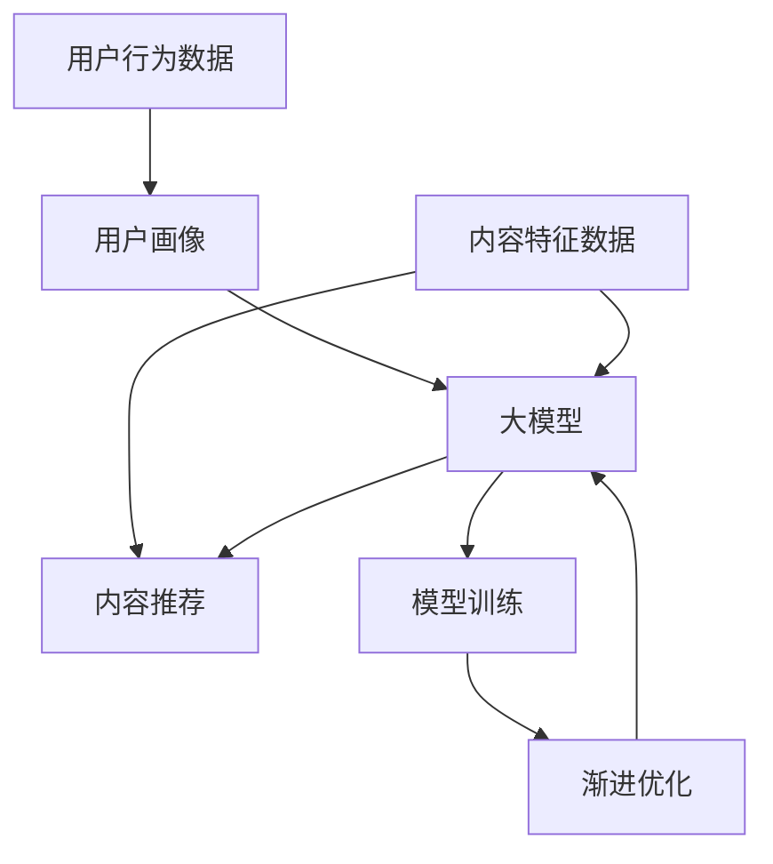

                 

**推荐系统**、**大模型**、**渐进优化**、**课程学习**、**用户画像**、**内容推荐**、**模型训练**、**性能优化**

## 1. 背景介绍

在当今信息爆炸的时代，推荐系统已成为连接用户和内容的关键桥梁，其作用日益凸显。然而，随着用户数量和内容量的指数级增长，传统的推荐系统面临着挑战，无法提供个性化、高质量的推荐。大模型的出现为推荐系统带来了新的机遇，但如何有效地学习和优化大模型以提高推荐系统的性能，仍然是一个亟待解决的问题。

## 2. 核心概念与联系

### 2.1 核心概念

- **大模型（Large Model）**：指具有数十亿甚至数千亿参数的模型，能够学习和表示复杂的数据分布。
- **渐进优化（Incremental Optimization）**：指在模型训练过程中，不断地调整和优化模型参数，以提高模型性能的方法。
- **用户画像（User Profiling）**：指根据用户的行为数据、偏好数据和其他相关数据，构建用户的数字画像，以便提供个性化推荐。
- **内容推荐（Content Recommendation）**：指根据用户画像和内容特征，为用户推荐相关内容的过程。

### 2.2 核心概念联系

大模型在推荐系统中的应用，需要结合用户画像和内容特征，构建模型以提供个性化推荐。然而，大模型的训练和优化过程复杂且耗时，需要采用渐进优化的方法，不断地调整和优化模型参数，以提高模型性能。以下是核心概念的联系 Mermaid 流程图：



## 3. 核心算法原理 & 具体操作步骤

### 3.1 算法原理概述

在推荐系统中，大模型的核心算法原理是基于用户画像和内容特征，学习用户与内容之间的关系，并根据关系预测用户对内容的喜好。常用的大模型算法包括神经协同过滤（Neural Collaborative Filtering）、自注意力模型（Self-Attention Model）和转换器模型（Transformer Model）等。

### 3.2 算法步骤详解

以神经协同过滤为例，其算法步骤如下：

1. **数据预处理**：收集用户行为数据和内容特征数据，并进行预处理，如去除缺失值、归一化等。
2. **用户画像构建**：根据用户行为数据，构建用户画像，如基于用户点击历史构建用户兴趣向量。
3. **内容特征提取**：根据内容特征数据，提取内容特征，如基于内容文本构建词向量。
4. **模型构建**：构建神经协同过滤模型，将用户画像和内容特征输入模型，学习用户与内容之间的关系。
5. **模型训练**：使用训练数据集，采用反向传播算法，优化模型参数，以最小化预测误差。
6. **模型评估**：使用验证数据集，评估模型性能，如准确率、召回率和 F1 分数等。
7. **模型部署**：将训练好的模型部署到推荐系统中，为用户提供个性化推荐。

### 3.3 算法优缺点

大模型在推荐系统中的优点包括：

- 可以学习和表示复杂的数据分布，提供更准确的推荐。
- 可以处理海量数据，适应用户数量和内容量的指数级增长。
- 可以学习用户与内容之间的长期关系，提供更个性化的推荐。

然而，大模型也存在一些缺点：

- 训练和优化过程复杂且耗时，需要大量的计算资源。
- 存在过拟合的风险，需要采用正则化和 dropout 等技术进行防止。
- 模型的解释性较差，难以理解模型的决策过程。

### 3.4 算法应用领域

大模型在推荐系统中的应用领域包括：

- **内容推荐**：为用户推荐相关内容，如视频、音乐、新闻等。
- **商品推荐**：为用户推荐相关商品，如电商平台的商品推荐。
- **好友推荐**：为用户推荐相关好友，如社交平台的好友推荐。
- **广告推荐**：为用户推荐相关广告，如广告平台的广告推荐。

## 4. 数学模型和公式 & 详细讲解 & 举例说明

### 4.1 数学模型构建

在推荐系统中，大模型的数学模型可以表示为：

$$P(u, i) = f(U, I; \theta)$$

其中，$P(u, i)$ 表示用户 $u$ 对内容 $i$ 的喜好概率，$f(\cdot)$ 表示模型函数，$U$ 表示用户画像，$I$ 表示内容特征，$\theta$ 表示模型参数。

### 4.2 公式推导过程

以神经协同过滤为例，其模型函数可以表示为：

$$f(U, I; \theta) = \sigma(W_U U + W_I I + b)$$

其中，$\sigma(\cdot)$ 表示激活函数，$W_U$ 和 $W_I$ 表示用户画像和内容特征的权重矩阵，$b$ 表示偏置向量。

模型参数 $\theta = \{W_U, W_I, b\}$ 可以通过最小化预测误差来优化：

$$\theta^* = \arg\min_{\theta} \sum_{u, i} L(P(u, i), \hat{P}(u, i))$$

其中，$L(\cdot, \cdot)$ 表示损失函数，$P(u, i)$ 表示真实喜好概率，$\hat{P}(u, i)$ 表示模型预测的喜好概率。

### 4.3 案例分析与讲解

假设我们要构建一个视频推荐系统，用户画像 $U$ 可以表示为用户的兴趣向量，内容特征 $I$ 可以表示为视频的特征向量。我们可以使用神经协同过滤模型，学习用户与视频之间的关系，并根据关系预测用户对视频的喜好。

例如，对于用户 $u_1$ 和视频 $i_1$，我们可以计算用户 $u_1$ 对视频 $i_1$ 的喜好概率：

$$\hat{P}(u_1, i_1) = \sigma(W_U u_1 + W_I i_1 + b)$$

其中，$u_1$ 和 $i_1$ 表示用户 $u_1$ 和视频 $i_1$ 的向量表示，$W_U$、$W_I$ 和 $b$ 表示模型参数。根据喜好概率的大小，我们可以为用户 $u_1$ 推荐相关视频。

## 5. 项目实践：代码实例和详细解释说明

### 5.1 开发环境搭建

在开始项目实践之前，我们需要搭建开发环境。推荐使用 Python 语言，并安装以下依赖项：

- TensorFlow：用于构建和训练神经网络模型。
- Pandas：用于数据处理和分析。
- NumPy：用于数值计算。
- Scikit-learn：用于模型评估和其他机器学习任务。

### 5.2 源代码详细实现

以下是神经协同过滤模型的 Python 实现代码：

```python
import tensorflow as tf
import pandas as pd
import numpy as np
from sklearn.model_selection import train_test_split
from sklearn.metrics import precision_score, recall_score, f1_score

# 加载数据
data = pd.read_csv('data.csv')
users = data['user_id'].unique()
items = data['item_id'].unique()

# 构建用户画像和内容特征
user_features = pd.get_dummies(data['user_features'])
item_features = pd.get_dummies(data['item_features'])

# 将数据分为训练集和验证集
X_train, X_val, y_train, y_val = train_test_split(user_features, item_features, test_size=0.2, random_state=42)

# 构建模型
model = tf.keras.Sequential([
    tf.keras.layers.Dense(64, activation='relu', input_shape=(X_train.shape[1],)),
    tf.keras.layers.Dense(32, activation='relu'),
    tf.keras.layers.Dense(1, activation='sigmoid')
])

# 编译模型
model.compile(optimizer='adam', loss='binary_crossentropy', metrics=['accuracy'])

# 训练模型
model.fit(X_train, y_train, epochs=10, batch_size=32, validation_data=(X_val, y_val))

# 评估模型
y_pred = model.predict(X_val) > 0.5
print("Precision:", precision_score(y_val, y_pred))
print("Recall:", recall_score(y_val, y_pred))
print("F1 Score:", f1_score(y_val, y_pred))
```

### 5.3 代码解读与分析

在代码中，我们首先加载数据，并构建用户画像和内容特征。然后，我们将数据分为训练集和验证集。接着，我们构建神经协同过滤模型，并编译模型。之后，我们训练模型，并评估模型性能。

### 5.4 运行结果展示

运行代码后，我们可以得到模型的精确度、召回率和 F1 分数等指标。这些指标可以帮助我们评估模型的性能，并调整模型参数以提高性能。

## 6. 实际应用场景

大模型在推荐系统中的实际应用场景包括：

### 6.1 个性化推荐

大模型可以学习用户的兴趣和偏好，为用户提供个性化推荐。例如，在视频推荐系统中，大模型可以根据用户的观看历史和兴趣，为用户推荐相关视频。

### 6.2 内容生成

大模型可以根据用户的兴趣和偏好，生成相关内容。例如，在新闻推荐系统中，大模型可以根据用户的阅读历史和兴趣，生成相关新闻标题和内容。

### 6.3 用户画像

大模型可以根据用户的行为数据和偏好数据，构建用户的数字画像。用户画像可以帮助推荐系统提供更个性化的推荐，并帮助商家进行精准营销。

### 6.4 未来应用展望

随着大模型技术的不断发展，大模型在推荐系统中的应用将会更加广泛。未来，大模型将能够学习和表示更复杂的数据分布，提供更准确和个性化的推荐。此外，大模型还将与其他技术结合，如区块链和人工智能，为用户提供更智能和安全的推荐服务。

## 7. 工具和资源推荐

### 7.1 学习资源推荐

以下是学习大模型和推荐系统的推荐资源：

- **书籍**：
  - "Recommender Systems: The Textbook" by Latha Kant and Gordon Cormack
  - "Deep Learning" by Ian Goodfellow, Yoshua Bengio, and Aaron Courville
- **在线课程**：
  - "Recommender Systems" on Coursera by the University of California, Irvine
  - "Deep Learning Specialization" on Coursera by Andrew Ng
- **博客**：
  - "Towards Data Science" (https://towardsdatascience.com/)
  - " KDnuggets" (https://www.kdnuggets.com/)

### 7.2 开发工具推荐

以下是开发大模型和推荐系统的推荐工具：

- **编程语言**：Python
- **机器学习库**：TensorFlow, PyTorch, Scikit-learn
- **数据处理库**：Pandas, NumPy
- **可视化库**：Matplotlib, Seaborn
- **开发环境**：Jupyter Notebook, Google Colab

### 7.3 相关论文推荐

以下是相关论文推荐：

- "Neural Collaborative Filtering" by Wang et al. (2017)
- "Self-Attentive Sequential Recommendation" by Kang and McAuley (2018)
- "BERT4Rec: Sequential Recommendation with Bidirectional Encoder Representations from Transformers" by Sun et al. (2019)

## 8. 总结：未来发展趋势与挑战

### 8.1 研究成果总结

在本文中，我们介绍了大模型在推荐系统中的应用，并详细讲解了神经协同过滤模型的原理、步骤、优缺点和应用领域。我们还提供了项目实践的代码实例和详细解释说明，并介绍了大模型在推荐系统中的实际应用场景。最后，我们推荐了学习资源、开发工具和相关论文。

### 8.2 未来发展趋势

未来，大模型在推荐系统中的应用将会更加广泛，并与其他技术结合，为用户提供更智能和安全的推荐服务。此外，大模型还将与其他领域结合，如医疗和金融，为这些领域提供个性化的解决方案。

### 8.3 面临的挑战

然而，大模型在推荐系统中的应用也面临着挑战，包括：

- **数据隐私**：大模型需要收集大量的用户数据，如何保护用户数据隐私是一个亟待解决的问题。
- **模型解释性**：大模型的决策过程通常难以理解，如何提高模型的解释性是一个挑战。
- **计算资源**：大模型的训练和优化过程复杂且耗时，需要大量的计算资源，如何优化计算资源利用率是一个挑战。

### 8.4 研究展望

未来，我们将继续研究大模型在推荐系统中的应用，并探索大模型与其他技术的结合。我们还将研究如何保护用户数据隐私，如何提高模型解释性，以及如何优化计算资源利用率。我们相信，通过不断的研究和创新，大模型在推荐系统中的应用将会取得更大的进展。

## 9. 附录：常见问题与解答

**Q1：大模型在推荐系统中的优点是什么？**

A1：大模型在推荐系统中的优点包括可以学习和表示复杂的数据分布，提供更准确的推荐，可以处理海量数据，适应用户数量和内容量的指数级增长，可以学习用户与内容之间的长期关系，提供更个性化的推荐。

**Q2：大模型在推荐系统中的缺点是什么？**

A2：大模型在推荐系统中的缺点包括训练和优化过程复杂且耗时，需要大量的计算资源，存在过拟合的风险，模型的解释性较差，难以理解模型的决策过程。

**Q3：如何构建大模型在推荐系统中的数学模型？**

A3：大模型在推荐系统中的数学模型可以表示为 $P(u, i) = f(U, I; \theta)$, 其中 $P(u, i)$ 表示用户 $u$ 对内容 $i$ 的喜好概率，$f(\cdot)$ 表示模型函数，$U$ 表示用户画像，$I$ 表示内容特征，$\theta$ 表示模型参数。

**Q4：如何推导大模型在推荐系统中的公式？**

A4：以神经协同过滤为例，其模型函数可以表示为 $f(U, I; \theta) = \sigma(W_U U + W_I I + b)$, 其中 $\sigma(\cdot)$ 表示激活函数，$W_U$ 和 $W_I$ 表示用户画像和内容特征的权重矩阵，$b$ 表示偏置向量。模型参数 $\theta = \{W_U, W_I, b\}$ 可以通过最小化预测误差来优化。

**Q5：如何评估大模型在推荐系统中的性能？**

A5：评估大模型在推荐系统中的性能可以使用准确率、召回率和 F1 分数等指标。这些指标可以帮助我们评估模型的性能，并调整模型参数以提高性能。

## 作者：禅与计算机程序设计艺术 / Zen and the Art of Computer Programming

**版权声明**：本文版权归作者所有，欢迎转载，但请注明出处及作者信息。

**联系作者**：如果您有任何问题或建议，请通过 [email](mailto:your-email@example.com) 联系我。

