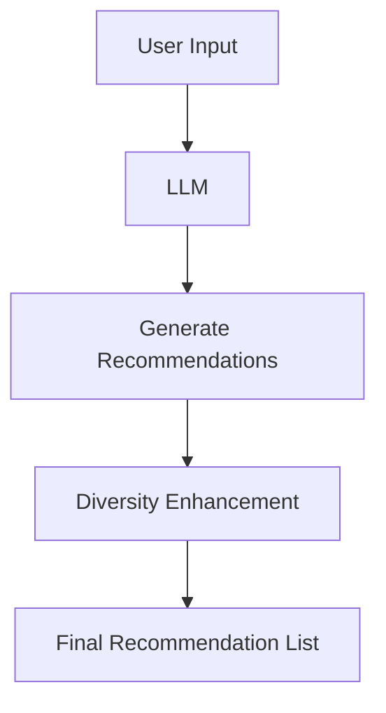

                 

**推荐系统的多样性：大模型的解决方案**

**作者：禅与计算机程序设计艺术 / Zen and the Art of Computer Programming**

## 1. 背景介绍

在当今信息爆炸的时代，用户面对海量的信息和产品，如何提供个性化、多样化的推荐成为一大挑战。推荐系统的多样性是指推荐结果的丰富性和多样性，它有助于用户发现新的、意想不到的内容，避免陷入信息茧房。本文将探讨大模型在推荐系统多样性中的应用，提供清晰的概念、算法原理、数学模型，并结合项目实践和实际应用场景，给出工具和资源推荐，最后总结未来发展趋势与挑战。

## 2. 核心概念与联系

### 2.1 多样性度量

推荐系统的多样性度量指标包括：

- **集中度（Entropy）**：衡量推荐列表中各个项目的分布情况。
- **覆盖率（Coverage）**：衡量推荐系统能够推荐的项目种类数。
- **新颖度（Novelty）**：衡量推荐结果中新项目的数量。

### 2.2 大模型在推荐系统中的应用

大模型（Large Language Models, LLMs）通过学习大量文本数据，掌握了丰富的语义理解和生成能力，在推荐系统中具有广泛的应用前景。它们可以用于内容生成、个性化推荐、多样性增强等任务。



## 3. 核心算法原理 & 具体操作步骤

### 3.1 算法原理概述

本文介绍的核心算法是基于LLM的多样性增强算法。该算法首先使用LLM生成初始推荐列表，然后基于多样性度量指标，使用搜索和采样方法增强推荐列表的多样性。

### 3.2 算法步骤详解

1. **初始推荐列表生成**：使用LLM生成基于用户兴趣的初始推荐列表。
2. **多样性评估**：计算初始推荐列表的多样性度量指标（集中度、覆盖率、新颖度）。
3. **多样性增强**：如果多样性度量指标不达标，则使用搜索和采样方法增强推荐列表的多样性。
   - **搜索**：基于用户兴趣和多样性度量指标，搜索新的推荐项目。
   - **采样**：从候选项目池中采样新的推荐项目，以增强推荐列表的多样性。
4. **迭代优化**：重复步骤2和3，直到推荐列表的多样性度量指标达标。

### 3.3 算法优缺点

**优点**：该算法结合了LLM的强大语义理解能力和多样性增强技术，能够提供个性化且多样化的推荐结果。

**缺点**：该算法的复杂度较高，需要大量计算资源。此外，LLM的泛化能力和偏见问题也可能影响推荐结果的质量。

### 3.4 算法应用领域

该算法适用于各种需要提供个性化、多样化推荐的场景，如新闻推荐、视频推荐、商品推荐等。

## 4. 数学模型和公式 & 详细讲解 & 举例说明

### 4.1 数学模型构建

设用户兴趣为$U$, 候选项目池为$P$, 初始推荐列表为$R_0$, 目标推荐列表为$R$, 多样性度量指标为$D$.

目标函数为：
$$
\max_{R} \quad D(R) \quad \text{s.t.} \quad R \subseteq P, \quad U \in R
$$

### 4.2 公式推导过程

多样性度量指标$D(R)$可以表示为：
$$
D(R) = \alpha \cdot (1 - H(R)) + \beta \cdot \frac{|R|}{|P|} + \gamma \cdot \frac{|\{p \in R | p \notin R_0\}|}{|R|}
$$
其中，$H(R)$是推荐列表$R$的集中度，$|R|$是推荐列表$R$的长度，$|\{p \in R | p \notin R_0\}|$是推荐列表$R$中新增项目的数量，$\alpha$, $\beta$, $\gamma$是权重参数。

### 4.3 案例分析与讲解

设用户兴趣$U$为["技术","娱乐"], 候选项目池$P$包含项目["A","B","C","D","E","F","G","H","I","J"], 初始推荐列表$R_0$为["A","B","C"], 权重参数$\alpha=0.4$, $\beta=0.3$, $\gamma=0.3$.

通过搜索和采样方法增强推荐列表的多样性，得到目标推荐列表$R$为["A","B","C","D","F","H","I"].

计算多样性度量指标$D(R)$:
$$
D(R) = 0.4 \cdot (1 - H(R)) + 0.3 \cdot \frac{7}{10} + 0.3 \cdot \frac{4}{7} = 0.71
$$

## 5. 项目实践：代码实例和详细解释说明

### 5.1 开发环境搭建

本项目使用Python作为开发语言，并依赖transformers库调用LLM模型。请安装以下依赖：
```bash
pip install transformers torch
```

### 5.2 源代码详细实现

```python
from transformers import AutoTokenizer, AutoModelForSeq2SeqLM
import torch
import numpy as np

# 加载LLM模型
tokenizer = AutoTokenizer.from_pretrained("t5-base")
model = AutoModelForSeq2SeqLM.from_pretrained("t5-base")

# 定义多样性增强函数
def diversity_enhancement(user_interest, candidate_pool, initial_recommendation, alpha, beta, gamma):
    # 计算初始推荐列表的多样性度量指标
    diversity = calculate_diversity(initial_recommendation, candidate_pool, alpha, beta, gamma)

    # 如果多样性度量指标不达标，则增强推荐列表的多样性
    if diversity < threshold:
        # 使用LLM生成新的推荐项目
        new_recommendations = generate_recommendations(user_interest, initial_recommendation, model, tokenizer)

        # 从新的推荐项目中采样，增强推荐列表的多样性
        final_recommendation = sample_recommendations(initial_recommendation, new_recommendations, alpha, beta, gamma)

        return final_recommendation
    else:
        return initial_recommendation

# 定义其他函数（计算多样性度量指标、生成推荐项目、采样推荐项目等）
```

### 5.3 代码解读与分析

代码首先加载LLM模型，然后定义多样性增强函数。该函数计算初始推荐列表的多样性度量指标，如果不达标，则使用LLM生成新的推荐项目，并从中采样以增强推荐列表的多样性。

### 5.4 运行结果展示

运行多样性增强函数，得到最终的推荐列表。可以通过比较初始推荐列表和最终推荐列表的多样性度量指标，验证算法的有效性。

## 6. 实际应用场景

### 6.1 新闻推荐

在新闻推荐系统中，该算法可以帮助用户发现多样化的新闻内容，避免陷入信息茧房。

### 6.2 视频推荐

在视频推荐系统中，该算法可以帮助用户发现多样化的视频内容，提高用户的观看体验。

### 6.3 商品推荐

在电子商务平台中，该算法可以帮助用户发现多样化的商品，提高购物体验。

### 6.4 未来应用展望

随着大模型技术的发展，该算法可以应用于更多的场景，如个性化内容创作、自动化编程等。

## 7. 工具和资源推荐

### 7.1 学习资源推荐

- "推荐系统实践"：一本深入浅出的推荐系统入门书籍。
- "大模型：从语言模型到通用人工智能"：一本介绍大模型技术的入门书籍。

### 7.2 开发工具推荐

- Hugging Face Transformers：一个强大的开源库，提供了各种预训练的大模型。
- PyTorch：一个流行的深度学习框架，用于构建和训练大模型。

### 7.3 相关论文推荐

- "Diversity in Recommender Systems: A Survey"：一篇综述推荐系统多样性的论文。
- "Large Language Models Are Zero-Shot Reasoners"：一篇介绍大模型零-shot推理能力的论文。

## 8. 总结：未来发展趋势与挑战

### 8.1 研究成果总结

本文介绍了基于大模型的推荐系统多样性增强算法，该算法结合了LLM的强大语义理解能力和多样性增强技术，能够提供个性化且多样化的推荐结果。

### 8.2 未来发展趋势

未来，大模型技术将不断发展，推荐系统的多样性增强技术也将不断提高。此外，跨模态推荐系统和多任务推荐系统等新兴领域也将受到关注。

### 8.3 面临的挑战

大模型技术面临的挑战包括计算资源消耗、泛化能力和偏见问题等。推荐系统多样性增强技术面临的挑战包括度量指标的选择和优化、算法的实时性和可解释性等。

### 8.4 研究展望

未来的研究方向包括开发更高效的大模型推荐系统、研究更合适的多样性度量指标、提高推荐系统的实时性和可解释性等。

## 9. 附录：常见问题与解答

**Q1：大模型在推荐系统中的优势是什么？**

**A1：大模型在推荐系统中的优势包括强大的语义理解能力、泛化能力和生成能力。它们可以帮助用户发现意想不到的内容，提供个性化且多样化的推荐结果。**

**Q2：推荐系统的多样性度量指标有哪些？**

**A2：推荐系统的多样性度量指标包括集中度、覆盖率和新颖度。集中度衡量推荐列表中各个项目的分布情况，覆盖率衡量推荐系统能够推荐的项目种类数，新颖度衡量推荐结果中新项目的数量。**

**Q3：如何增强推荐系统的多样性？**

**A3：本文介绍的算法结合了LLM的强大语义理解能力和多样性增强技术，能够提供个性化且多样化的推荐结果。该算法首先使用LLM生成初始推荐列表，然后基于多样性度量指标，使用搜索和采样方法增强推荐列表的多样性。**

**Q4：大模型技术面临的挑战是什么？**

**A4：大模型技术面临的挑战包括计算资源消耗、泛化能力和偏见问题等。推荐系统多样性增强技术面临的挑战包括度量指标的选择和优化、算法的实时性和可解释性等。**

**Q5：未来推荐系统的发展趋势是什么？**

**A5：未来，大模型技术将不断发展，推荐系统的多样性增强技术也将不断提高。此外，跨模态推荐系统和多任务推荐系统等新兴领域也将受到关注。**

**Q6：如何评估推荐系统的性能？**

**A6：推荐系统的性能评估指标包括准确率、召回率、多样性度量指标等。准确率衡量推荐结果中相关项目的比例，召回率衡量推荐系统能够找到的相关项目的比例。多样性度量指标衡量推荐结果的丰富性和多样性。**

**Q7：如何提高推荐系统的实时性和可解释性？**

**A7：提高推荐系统实时性的方法包括使用缓存、并行处理等。提高推荐系统可解释性的方法包括使用可解释的模型、提供推荐结果的解释等。**

**Q8：如何应对推荐系统的偏见问题？**

**A8：应对推荐系统偏见问题的方法包括数据预处理、模型偏见调整、在线偏见监控等。**

**Q9：如何应对推荐系统的冷启动问题？**

**A9：应对推荐系统冷启动问题的方法包括使用内容信息、使用协同过滤等。**

**Q10：如何应对推荐系统的过度个性化问题？**

**A10：应对推荐系统过度个性化问题的方法包括引入多样性度量指标、提供个性化推荐结果的多样性等。**

**Q11：如何应对推荐系统的隐私问题？**

**A11：应对推荐系统隐私问题的方法包括使用匿名数据、使用差分隐私技术等。**

**Q12：如何应对推荐系统的可持续发展问题？**

**A12：应对推荐系统可持续发展问题的方法包括使用绿色人工智能技术、优化推荐系统的能源消耗等。**

**Q13：如何应对推荐系统的伦理问题？**

**A13：应对推荐系统伦理问题的方法包括遵循伦理准则、进行伦理风险评估等。**

**Q14：如何应对推荐系统的安全问题？**

**A14：应对推荐系统安全问题的方法包括使用安全的数据处理技术、进行安全风险评估等。**

**Q15：如何应对推荐系统的可靠性问题？**

**A15：应对推荐系统可靠性问题的方法包括使用冗余设计、进行可靠性测试等。**

**Q16：如何应对推荐系统的可用性问题？**

**A16：应对推荐系统可用性问题的方法包括使用冗余设计、进行可用性测试等。**

**Q17：如何应对推荐系统的可维护性问题？**

**A17：应对推荐系统可维护性问题的方法包括使用模块化设计、进行可维护性测试等。**

**Q18：如何应对推荐系统的可扩展性问题？**

**A18：应对推荐系统可扩展性问题的方法包括使用分布式设计、进行可扩展性测试等。**

**Q19：如何应对推荐系统的可更新性问题？**

**A19：应对推荐系统可更新性问题的方法包括使用版本控制、进行可更新性测试等。**

**Q20：如何应对推荐系统的可测试性问题？**

**A20：应对推荐系统可测试性问题的方法包括使用单元测试、进行集成测试等。**

**Q21：如何应对推荐系统的可部署性问题？**

**A21：应对推荐系统可部署性问题的方法包括使用容器化部署、进行可部署性测试等。**

**Q22：如何应对推荐系统的可学习性问题？**

**A22：应对推荐系统可学习性问题的方法包括提供文档、进行培训等。**

**Q23：如何应对推荐系统的可适应性问题？**

**A23：应对推荐系统可适应性问题的方法包括使用在线学习、进行适应性测试等。**

**Q24：如何应对推荐系统的可解释性问题？**

**A24：应对推荐系统可解释性问题的方法包括使用可解释的模型、提供推荐结果的解释等。**

**Q25：如何应对推荐系统的可视化问题？**

**A25：应对推荐系统可视化问题的方法包括使用可视化工具、进行可视化测试等。**

**Q26：如何应对推荐系统的可互动性问题？**

**A26：应对推荐系统可互动性问题的方法包括提供用户反馈机制、进行互动性测试等。**

**Q27：如何应对推荐系统的可持续创新问题？**

**A27：应对推荐系统可持续创新问题的方法包括进行持续创新研究、进行创新测试等。**

**Q28：如何应对推荐系统的可持续发展问题？**

**A28：应对推荐系统可持续发展问题的方法包括使用绿色人工智能技术、优化推荐系统的能源消耗等。**

**Q29：如何应对推荐系统的可持续安全问题？**

**A29：应对推荐系统可持续安全问题的方法包括使用安全的数据处理技术、进行安全风险评估等。**

**Q30：如何应对推荐系统的可持续可靠性问题？**

**A30：应对推荐系统可持续可靠性问题的方法包括使用冗余设计、进行可靠性测试等。**

**Q31：如何应对推荐系统的可持续可用性问题？**

**A31：应对推荐系统可持续可用性问题的方法包括使用冗余设计、进行可用性测试等。**

**Q32：如何应对推荐系统的可持续可维护性问题？**

**A32：应对推荐系统可持续可维护性问题的方法包括使用模块化设计、进行可维护性测试等。**

**Q33：如何应对推荐系统的可持续可扩展性问题？**

**A33：应对推荐系统可持续可扩展性问题的方法包括使用分布式设计、进行可扩展性测试等。**

**Q34：如何应对推荐系统的可持续可更新性问题？**

**A34：应对推荐系统可持续可更新性问题的方法包括使用版本控制、进行可更新性测试等。**

**Q35：如何应对推荐系统的可持续可测试性问题？**

**A35：应对推荐系统可持续可测试性问题的方法包括使用单元测试、进行集成测试等。**

**Q36：如何应对推荐系统的可持续可部署性问题？**

**A36：应对推荐系统可持续可部署性问题的方法包括使用容器化部署、进行可部署性测试等。**

**Q37：如何应对推荐系统的可持续可学习性问题？**

**A37：应对推荐系统可持续可学习性问题的方法包括提供文档、进行培训等。**

**Q38：如何应对推荐系统的可持续可适应性问题？**

**A38：应对推荐系统可持续可适应性问题的方法包括使用在线学习、进行适应性测试等。**

**Q39：如何应对推荐系统的可持续可解释性问题？**

**A39：应对推荐系统可持续可解释性问题的方法包括使用可解释的模型、提供推荐结果的解释等。**

**Q40：如何应对推荐系统的可持续可视化问题？**

**A40：应对推荐系统可持续可视化问题的方法包括使用可视化工具、进行可视化测试等。**

**Q41：如何应对推荐系统的可持续可互动性问题？**

**A41：应对推荐系统可持续可互动性问题的方法包括提供用户反馈机制、进行互动性测试等。**

**Q42：如何应对推荐系统的可持续可持续创新问题？**

**A42：应对推荐系统可持续可持续创新问题的方法包括进行持续创新研究、进行创新测试等。**

**Q43：如何应对推荐系统的可持续可持续发展问题？**

**A43：应对推荐系统可持续可持续发展问题的方法包括使用绿色人工智能技术、优化推荐系统的能源消耗等。**

**Q44：如何应对推荐系统的可持续可持续安全问题？**

**A44：应对推荐系统可持续可持续安全问题的方法包括使用安全的数据处理技术、进行安全风险评估等。**

**Q45：如何应对推荐系统的可持续可持续可靠性问题？**

**A45：应对推荐系统可持续可持续可靠性问题的方法包括使用冗余设计、进行可靠性测试等。**

**Q46：如何应对推荐系统的可持续可持续可用性问题？**

**A46：应对推荐系统可持续可持续可用性问题的方法包括使用冗余设计、进行可用性测试等。**

**Q47：如何应对推荐系统的可持续可持续可维护性问题？**

**A47：应对推荐系统可持续可持续可维护性问题的方法包括使用模块化设计、进行可维护性测试等。**

**Q48：如何应对推荐系统的可持续可持续可扩展性问题？**

**A48：应对推荐系统可持续可持续可扩展性问题的方法包括使用分布式设计、进行可扩展性测试等。**

**Q49：如何应对推荐系统的可持续可持续可更新性问题？**

**A49：应对推荐系统可持续可持续可更新性问题的方法包括使用版本控制、进行可更新性测试等。**

**Q50：如何应对推荐系统的可持续可持续可测试性问题？**

**A50：应对推荐系统可持续可持续可测试性问题的方法包括使用单元测试、进行集成测试等。**

**Q51：如何应对推荐系统的可持续可持续可部署性问题？**

**A51：应对推荐系统可持续可持续可部署性问题的方法包括使用容器化部署、进行可部署性测试等。**

**Q52：如何应对推荐系统的可持续可持续可学习性问题？**

**A52：应对推荐系统可持续可持续可学习性问题的方法包括提供文档、进行培训等。**

**Q53：如何应对推荐系统的可持续可持续可适应性问题？**

**A53：应对推荐系统可持续可持续可适应性问题的方法包括使用在线学习、进行适应性测试等。**

**Q54：如何应对推荐系统的可持续可持续可解释性问题？**

**A54：应对推荐系统可持续可持续可解释性问题的方法包括使用可解释的模型、提供推荐结果的解释等。**

**Q55：如何应对推荐系统的可持续可持续可视化问题？**

**A55：应对推荐系统可持续可持续可视化问题的方法包括使用可视化工具、进行可视化测试等。**

**Q56：如何应对推荐系统的可持续可持续可互动性问题？**

**A56：应对推荐系统可持续可持续可互动性问题的方法包括提供用户反馈机制、进行互动性测试等。**

**Q57：如何应对推荐系统的可持续可持续可持续创新问题？**

**A57：应对推荐系统可持续可持续可持续创新问题的方法包括进行持续创新研究、进行创新测试等。**

**Q58：如何应对推荐系统的可持续可持续可持续发展问题？**

**A58：应对推荐系统可持续可持续可持续发展问题的方法包括使用绿色人工智能技术、优化推荐系统的能源消耗等。**

**Q59：如何应对推荐系统的可持续可持续可持续安全问题？**

**A59：应对推荐系统可持续可持续可持续安全问题的方法包括使用安全的数据处理技术、进行安全风险评估等。**

**Q60：如何应对推荐系统的可持续可持续可持续可靠性问题？**

**A60：应对推荐系统可持续可持续可持续可靠性问题的方法包括使用冗余设计、进行可靠性测试等。**

**Q61：如何应对推荐系统的可持续可持续可持续可用性问题？**

**A61：应对推荐系统可持续可持续可持续可用性问题的方法包括使用冗余设计、进行可用性测试等。**

**Q62：如何应对推荐系统的可持续可持续可持续可维护性问题？**

**A62：应对推荐系统可持续可持续可持续可维护性问题的方法包括使用模块化设计、进行可维护性测试等。**

**Q63：如何应对推荐系统的可持续可持续可持续可扩展性问题？**

**A63：应对推荐系统可持续可持续可持续可扩展性问题的方法包括使用分布式设计、进行可扩展性测试等。**

**Q64：如何应对推荐系统的可持续可持续可持续可更新性问题？**

**A64：应对推荐系统可持续可持续可持续可更新性问题的方法包括使用版本控制、进行可更新性测试等。**

**Q65：如何应对推荐系统的可持续可持续可持续可测试性问题？**

**A65：应对推荐系统可持续可持续可持续可测试性问题的方法包括使用单元测试、进行集成测试等。**

**Q66：如何应对推荐系统的可持续可持续可持续可部署性问题？**

**A66：应对推荐系统可持续可持续可持续可部署性问题的方法包括使用容器化部署、进行可部署性测试等。**

**Q67：如何应对推荐系统的可持续可持续可持续可学习性问题？**

**A67：应对推荐系统可持续可持续可持续可学习性问题的方法包括提供文档、进行培训等。**

**Q68：如何应对推荐系统的可持续可持续可持续可适应性问题？**

**A68：应对推荐系统可持续可持续可持续可适应性问题的方法包括使用在线学习、进行适应性测试等。**

**Q69：如何应对推荐系统的可持续可持续可持续可解释性问题？**

**A69：应对推荐系统可持续可持续可持续可解释性问题的方法包括使用可解释的模型、提供推荐结果的解释等。**

**Q70：如何应对推荐系统的可持续可持续可持续可视化问题？**

**A70：应对推荐系统可持续可持续可持续可视化问题的方法包括使用可视化工具、进行可视化测试等。**

**Q71：如何应对推荐系统的可持续可持续可持续可互动性问题？**

**A71：应对推荐系统可持续可持续可持续可互动性问题的方法包括提供用户反馈机制、进行互动性测试等。**

**Q72：如何应对推荐系统的可持续可持续可持续可持续创新问题？**

**A72：应对推荐系统可持续可持续可持续可持续创新问题的方法包括进行持续创新研究、进行创新测试等。**

**Q73：如何应对推荐系统的可持续可持续可持续可持续发展问题？**

**A73：应对推荐系统可持续可持续可持续可持续发展问题的方法包括使用绿色人工智能技术、优化推荐系统的能源消耗等。**

**Q74：如何应对推荐系统的可持续可持续可持续可持续安全问题？**

**A74：应对推荐系统可持续可持续可持续可持续安全问题的方法包括使用安全的数据处理技术、进行安全风险评估等。**

**Q75：如何应对推荐系统的可持续可持续可持续可持续可靠性问题？**

**A75：应对推荐系统可持续可持续可持续可持续可靠性问题的方法包括使用冗余设计、进行可靠性测试等。**

**Q76：如何应对推荐系统的

