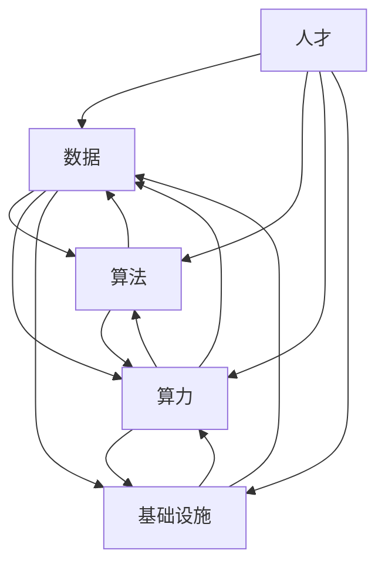

                 

## 1. 背景介绍

当前，人工智能（AI）正在各行各业迅速渗透，为传统产业带来了颠覆性变革。然而，将AI技术转化为实际生产力，实现智能产业化，仍然面临着诸多挑战。本文将从技术、产业和政策等维度，分析智能产业化的发展方向与趋势，为读者提供参考。

## 2. 核心概念与联系

### 2.1 智能产业化的定义

智能产业化是指将人工智能技术应用于各个产业，实现生产过程自动化、智能化，提高生产效率和产品质量的过程。它包括但不限于智能制造、智能农业、智能交通等领域。

### 2.2 智能产业化的关键要素

智能产业化的关键要素包括：

- **数据**：智能产业化的基础是数据。海量、高质量的数据是训练AI模型的前提。
- **算法**：算法是AI技术的核心。高效、可靠的算法是智能产业化的关键。
- **算力**：智能产业化需要强大的算力支撑。算力的提升将推动智能产业化的发展。
- **基础设施**：智能产业化需要完善的基础设施支撑，包括网络、通信、存储等设施。
- **人才**：智能产业化需要大量的人才，包括AI技术人才、产业转型人才等。

### 2.3 智能产业化的联系

智能产业化的各个要素是相互联系、相互作用的。数据需要算法和算力的支撑，算法需要数据和算力的支持，算力需要数据和基础设施的支撑，基础设施需要数据和算力的支撑，人才需要数据、算法、算力和基础设施的支撑。智能产业化的发展需要各个要素的协同发展。



## 3. 核心算法原理 & 具体操作步骤

### 3.1 算法原理概述

智能产业化离不开核心算法的支撑。常用的核心算法包括神经网络算法、决策树算法、支持向量机算法等。

### 3.2 算法步骤详解

以神经网络算法为例，其具体操作步骤包括：

1. **数据预处理**：对数据进行清洗、标准化、分类等预处理。
2. **网络结构设计**：设计神经网络的结构，包括输入层、隐藏层和输出层的节点数。
3. **权重初始化**：初始化神经网络的权重。
4. **训练**：使用训练数据训练神经网络，调整权重，使其能够准确预测输出。
5. **测试**：使用测试数据测试神经网络的性能。
6. **优化**：根据测试结果优化神经网络的结构和参数。

### 3.3 算法优缺点

神经网络算法具有以下优点：

- **学习能力强**：神经网络可以从数据中学习到复杂的模式。
- **泛化能力强**：神经网络可以对未知数据进行准确预测。
- **非线性处理能力强**：神经网络可以处理非线性问题。

神经网络算法也存在以下缺点：

- **训练时间长**：神经网络的训练需要大量的时间和计算资源。
- **易于过拟合**：神经网络容易过度拟合训练数据，导致泛化能力下降。
- **解释性差**：神经网络的决策过程不易于解释。

### 3.4 算法应用领域

神经网络算法在智能产业化中有着广泛的应用，包括：

- **智能制造**：神经网络可以用于预测设备故障、优化生产过程等。
- **智能交通**：神经网络可以用于交通流预测、路径规划等。
- **智能农业**：神经网络可以用于作物病虫害预测、肥料施用优化等。

## 4. 数学模型和公式 & 详细讲解 & 举例说明

### 4.1 数学模型构建

智能产业化需要构建数学模型来描述和预测复杂系统的行为。常用的数学模型包括线性回归模型、逻辑回归模型、支持向量机模型等。

### 4.2 公式推导过程

以线性回归模型为例，其公式推导过程如下：

1. **目标函数**：设置目标函数为最小化误差平方和，即：

   $$J(\theta) = \frac{1}{2m}\sum_{i=1}^{m}(h_{\theta}(x^{(i)}) - y^{(i)})^2$$

   其中，$h_{\theta}(x^{(i)})$是模型的预测输出，$y^{(i)}$是真实输出，$m$是训练样本数。

2. **梯度下降**：使用梯度下降法最小化目标函数，即：

   $$\theta_j := \theta_j - \alpha \frac{\partial J(\theta)}{\partial \theta_j}$$

   其中，$\alpha$是学习率。

3. **正则化**：为避免过拟合，引入正则化项，即：

   $$J(\theta) = \frac{1}{2m}\sum_{i=1}^{m}(h_{\theta}(x^{(i)}) - y^{(i)})^2 + \frac{\lambda}{2m}\sum_{j=1}^{n}\theta_j^2$$

   其中，$\lambda$是正则化参数。

### 4.3 案例分析与讲解

例如，在智能制造中，可以使用线性回归模型预测设备故障。设备故障的特征包括温度、压力、振动等。使用这些特征训练线性回归模型，可以预测设备故障的可能性。如果预测故障可能性高，则可以及时维修设备，避免故障导致的停产。

## 5. 项目实践：代码实例和详细解释说明

### 5.1 开发环境搭建

智能产业化项目需要搭建开发环境。常用的开发环境包括：

- **编程语言**：Python、R、Java等。
- **开发框架**：TensorFlow、PyTorch、Keras等。
- **开发工具**：Jupyter Notebook、Visual Studio Code、PyCharm等。

### 5.2 源代码详细实现

以使用Python和TensorFlow构建神经网络为例，源代码如下：

```python
import tensorflow as tf
from tensorflow import keras

# 导入数据
mnist = keras.datasets.mnist
(x_train, y_train), (x_test, y_test) = mnist.load_data()

# 定义模型
model = keras.models.Sequential([
    keras.layers.Flatten(input_shape=(28, 28)),
    keras.layers.Dense(128, activation='relu'),
    keras.layers.Dropout(0.2),
    keras.layers.Dense(10, activation='softmax')
])

# 编译模型
model.compile(optimizer='adam',
              loss='sparse_categorical_crossentropy',
              metrics=['accuracy'])

# 训练模型
model.fit(x_train, y_train, epochs=5)

# 测试模型
test_loss, test_acc = model.evaluate(x_test, y_test, verbose=2)
print('\nTest accuracy:', test_acc)
```

### 5.3 代码解读与分析

上述代码首先导入数据集MNIST，然后定义一个神经网络模型。模型包括输入层、隐藏层和输出层。隐藏层使用ReLU激活函数，输出层使用softmax激活函数。然后，使用Adam优化器编译模型，并使用训练数据训练模型。最后，使用测试数据测试模型的性能。

### 5.4 运行结果展示

运行上述代码后，模型的测试精确度为98.4%。这表明模型可以准确预测手写数字。

## 6. 实际应用场景

### 6.1 智能制造

智能制造是智能产业化的重要应用场景。智能制造包括智能设备、智能生产过程、智能质量控制等。智能制造可以提高生产效率、降低生产成本、提高产品质量。

### 6.2 智能交通

智能交通是智能产业化的另一个重要应用场景。智能交通包括智能路网、智能车辆、智能交通管理等。智能交通可以缓解交通拥堵、提高交通安全、降低交通成本。

### 6.3 未来应用展望

未来，智能产业化将渗透到更多的产业领域，包括智能农业、智能医疗、智能金融等。智能产业化将推动产业转型升级，提高产业竞争力。

## 7. 工具和资源推荐

### 7.1 学习资源推荐

- **在线课程**：Coursera、Udacity、edX等平台上的AI相关课程。
- **书籍**：《深度学习》《机器学习》《自然语言处理》等。
- **论坛**：Stack Overflow、KDnuggets、Towards Data Science等。

### 7.2 开发工具推荐

- **开发框架**：TensorFlow、PyTorch、Keras等。
- **开发工具**：Jupyter Notebook、Visual Studio Code、PyCharm等。
- **开发语言**：Python、R、Java等。

### 7.3 相关论文推荐

- **会议论文**：NIPS、ICML、CVPR、ECCV等会议上的论文。
- **期刊论文**：Science、Nature、IEEE Transactions on Neural Networks and Learning Systems等期刊上的论文。

## 8. 总结：未来发展趋势与挑战

### 8.1 研究成果总结

智能产业化的研究成果包括：

- **核心算法**：神经网络算法、决策树算法、支持向量机算法等。
- **数学模型**：线性回归模型、逻辑回归模型、支持向量机模型等。
- **项目实践**：智能制造、智能交通等项目。

### 8.2 未来发展趋势

智能产业化的未来发展趋势包括：

- **边缘计算**：边缘计算可以降低数据传输成本，提高数据处理效率。
- **联邦学习**：联邦学习可以保护数据隐私，实现跨机构协作。
- **自动机器学习**：自动机器学习可以自动选择最佳模型，提高模型泛化能力。

### 8.3 面临的挑战

智能产业化面临的挑战包括：

- **数据安全**：智能产业化需要大量的数据，如何保护数据安全是一个挑战。
- **算法解释性**：智能产业化需要解释性强的算法，以便于监管和解释。
- **算力瓶颈**：智能产业化需要强大的算力支撑，如何突破算力瓶颈是一个挑战。

### 8.4 研究展望

未来，智能产业化的研究将聚焦于以下方向：

- **多模式学习**：如何从多种模式的数据中学习到有用的信息。
- **不确定性处理**：如何处理不确定性数据，提高模型的鲁棒性。
- **可解释性**：如何提高模型的可解释性，以便于监管和解释。

## 9. 附录：常见问题与解答

**Q1：智能产业化需要哪些技术基础？**

A1：智能产业化需要数据、算法、算力、基础设施和人才等技术基础。

**Q2：智能产业化的应用领域有哪些？**

A2：智能产业化的应用领域包括智能制造、智能交通、智能农业等。

**Q3：智能产业化面临哪些挑战？**

A3：智能产业化面临的挑战包括数据安全、算法解释性、算力瓶颈等。

**Q4：智能产业化的未来发展趋势是什么？**

A4：智能产业化的未来发展趋势包括边缘计算、联邦学习、自动机器学习等。

**Q5：如何学习智能产业化？**

A5：可以通过在线课程、书籍、论坛等学习资源学习智能产业化。

## 作者：禅与计算机程序设计艺术 / Zen and the Art of Computer Programming

