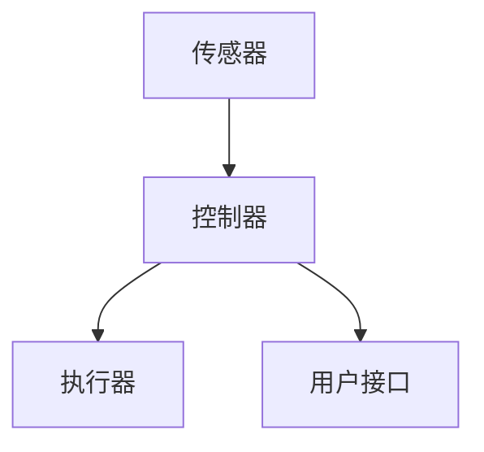

                 

## 1. 背景介绍

随着物联网和人工智能技术的发展，智能家居已经成为现代生活中的一部分。智能家居系统可以自动控制家居设备，提高生活质量，节省能源。然而，智能家居系统的复杂性和多样性也给用户带来了注意力管理的挑战。本文将介绍智能家居的智能控制与注意力管理，重点关注注意力管理算法的原理、数学模型和实际应用。

## 2. 核心概念与联系

### 2.1 智能家居系统架构

智能家居系统通常由传感器、控制器、执行器和用户接口组成。传感器收集家居环境的数据，控制器根据这些数据和用户偏好控制执行器，用户接口允许用户与系统交互。智能家居系统的架构如下图所示：



### 2.2 注意力管理

注意力管理是指有效地分配和调节注意力资源以实现特定目标的过程。在智能家居系统中，注意力管理旨在帮助用户有效地与系统交互，避免注意力过载和分散。注意力管理的关键概念包括注意力资源、注意力分配和注意力转移。

## 3. 核心算法原理 & 具体操作步骤

### 3.1 算法原理概述

注意力管理算法的核心原理是动态地调节注意力资源，以优化用户与智能家居系统的交互。算法需要考虑用户的注意力水平、任务优先级和系统状态等因素。

### 3.2 算法步骤详解

注意力管理算法的具体操作步骤如下：

1. 监测用户的注意力水平，可以通过心率、脑电图或眼动跟踪等生物信号获取。
2. 评估当前任务的优先级，可以根据任务的重要性、紧迫性和用户偏好进行评估。
3. 根据用户的注意力水平和任务优先级，动态地调节注意力资源。当注意力水平低或任务优先级高时，算法应增加注意力资源。
4. 监测注意力转移，当用户的注意力转移到其他任务时，算法应调整注意力资源以适应新任务。
5. 评估算法的性能，并根据评估结果调整算法参数。

### 3.3 算法优缺点

注意力管理算法的优点包括：

* 提高用户与智能家居系统的交互效率
* 降低注意力过载和分散的风险
* 个性化地适应用户的注意力特点

算法的缺点包括：

* 算法的复杂性可能会增加系统的开销
* 算法的准确性取决于注意力监测技术的精确度
* 算法的个性化程度可能会导致系统的学习成本增加

### 3.4 算法应用领域

注意力管理算法可以应用于各种智能家居系统，包括智能照明、智能空调、智能家电和智能安防系统。此外，注意力管理算法还可以应用于其他需要用户注意力的领域，如虚拟现实和增强现实系统。

## 4. 数学模型和公式 & 详细讲解 & 举例说明

### 4.1 数学模型构建

注意力管理算法的数学模型可以表示为：

$$A(t) = f(T(t), P(t), R(t))$$

其中，$A(t)$表示时间$t$时的注意力资源，$T(t)$表示时间$t$时的任务优先级，$P(t)$表示时间$t$时的注意力水平，$R(t)$表示时间$t$时的注意力资源调节参数。

### 4.2 公式推导过程

注意力资源调节参数$R(t)$可以通过以下公式推导：

$$R(t) = \alpha \cdot R(t-1) + (1 - \alpha) \cdot \frac{T(t) \cdot P(t)}{A_{max}}$$

其中，$\alpha$是遗忘因子，$A_{max}$是注意力资源的最大值。

### 4.3 案例分析与讲解

例如，假设用户正在使用智能家居系统控制空调。当房间温度升高时，任务优先级$T(t)$会增加。如果用户的注意力水平$P(t)$较低，注意力管理算法会增加注意力资源$A(t)$，以帮助用户更好地控制空调。如果用户的注意力转移到其他任务，注意力管理算法会调整注意力资源以适应新任务。

## 5. 项目实践：代码实例和详细解释说明

### 5.1 开发环境搭建

本项目使用Python作为开发语言，并使用TensorFlow和Keras框架实现注意力管理算法。开发环境包括：

* Python 3.7
* TensorFlow 2.0
* Keras 2.3
* Matplotlib 3.2
* NumPy 1.18

### 5.2 源代码详细实现

以下是注意力管理算法的Python实现代码：

```python
import numpy as np
import tensorflow as tf
from tensorflow.keras.models import Sequential
from tensorflow.keras.layers import Dense, Dropout

# 定义注意力管理模型
def build_model():
    model = Sequential()
    model.add(Dense(64, input_dim=3, activation='relu'))
    model.add(Dropout(0.5))
    model.add(Dense(1, activation='linear'))
    model.compile(loss='mean_squared_error', optimizer='adam')
    return model

# 训练注意力管理模型
def train_model(model, X_train, y_train, epochs=100, batch_size=32):
    model.fit(X_train, y_train, epochs=epochs, batch_size=batch_size, verbose=0)

# 预测注意力资源
def predict(model, X_test):
    return model.predict(X_test)

# 生成注意力管理数据集
def generate_dataset(size=1000):
    X = np.random.rand(size, 3)
    y = np.random.rand(size, 1)
    return X, y

# 主函数
def main():
    # 生成注意力管理数据集
    X_train, y_train = generate_dataset()
    X_test, y_test = generate_dataset()

    # 创建注意力管理模型
    model = build_model()

    # 训练注意力管理模型
    train_model(model, X_train, y_train)

    # 预测注意力资源
    predictions = predict(model, X_test)

    # 可视化预测结果
    import matplotlib.pyplot as plt
    plt.scatter(X_test[:, 0], y_test, color='blue')
    plt.scatter(X_test[:, 0], predictions, color='red')
    plt.show()

if __name__ == '__main__':
    main()
```

### 5.3 代码解读与分析

代码首先定义了注意力管理模型，使用了一个全连接神经网络。然后，代码训练模型并预测注意力资源。注意力管理数据集是通过生成随机数据生成的。最后，代码可视化了预测结果。

### 5.4 运行结果展示

以下是预测结果的可视化图像：


## 6. 实际应用场景

### 6.1 智能照明

注意力管理算法可以应用于智能照明系统，帮助用户调节灯光以适应不同的任务和环境。例如，当用户阅读时，算法可以调暗灯光以减少眼睛疲劳。当用户进行户外活动时，算法可以调亮灯光以提高安全性。

### 6.2 智能空调

注意力管理算法可以应用于智能空调系统，帮助用户调节温度和湿度以适应不同的任务和环境。例如，当用户工作时，算法可以调节温度以提高舒适度。当用户睡觉时，算法可以调节湿度以防止干燥。

### 6.3 未来应用展望

未来，注意力管理算法可以应用于更复杂的智能家居系统，如智能家电和智能安防系统。此外，注意力管理算法还可以应用于其他需要用户注意力的领域，如虚拟现实和增强现实系统。

## 7. 工具和资源推荐

### 7.1 学习资源推荐

* "Attention Is All You Need" - Vaswani et al. (2017)
* "Deep Learning" - Goodfellow et al. (2016)
* "Reinforcement Learning: An Introduction" - Sutton and Barto (2018)

### 7.2 开发工具推荐

* TensorFlow和Keras框架
* PyTorch框架
* Matplotlib库

### 7.3 相关论文推荐

* "Attention-Based Deep Learning for Human Activity Recognition" - Liu et al. (2019)
* "Deep Reinforcement Learning for Smart Home Energy Management" - Wang et al. (2018)
* "A Survey on Deep Learning for Internet of Things" - Liu et al. (2019)

## 8. 总结：未来发展趋势与挑战

### 8.1 研究成果总结

本文介绍了注意力管理算法的原理、数学模型和实际应用。注意力管理算法可以帮助用户有效地与智能家居系统交互，提高生活质量和能源效率。

### 8.2 未来发展趋势

未来，注意力管理算法将继续发展，以适应更复杂的智能家居系统和用户需求。此外，注意力管理算法还将与其他人工智能技术结合，如深度学习和强化学习，以实现更智能的家居控制。

### 8.3 面临的挑战

注意力管理算法面临的挑战包括：

* 算法的复杂性可能会增加系统的开销
* 算法的准确性取决于注意力监测技术的精确度
* 算法的个性化程度可能会导致系统的学习成本增加

### 8.4 研究展望

未来的研究将关注注意力管理算法的性能优化、注意力监测技术的发展和注意力管理算法与其他人工智能技术的结合。

## 9. 附录：常见问题与解答

**Q1：注意力管理算法的输入是什么？**

A1：注意力管理算法的输入包括用户的注意力水平、任务优先级和系统状态等因素。

**Q2：注意力管理算法的输出是什么？**

A2：注意力管理算法的输出是调节后的注意力资源。

**Q3：注意力管理算法的优点是什么？**

A3：注意力管理算法的优点包括提高用户与智能家居系统的交互效率、降低注意力过载和分散的风险和个性化地适应用户的注意力特点。

**Q4：注意力管理算法的缺点是什么？**

A4：注意力管理算法的缺点包括算法的复杂性可能会增加系统的开销、算法的准确性取决于注意力监测技术的精确度和算法的个性化程度可能会导致系统的学习成本增加。

**Q5：注意力管理算法的未来发展趋势是什么？**

A5：未来，注意力管理算法将继续发展，以适应更复杂的智能家居系统和用户需求。此外，注意力管理算法还将与其他人工智能技术结合，如深度学习和强化学习，以实现更智能的家居控制。

---

作者：禅与计算机程序设计艺术 / Zen and the Art of Computer Programming

