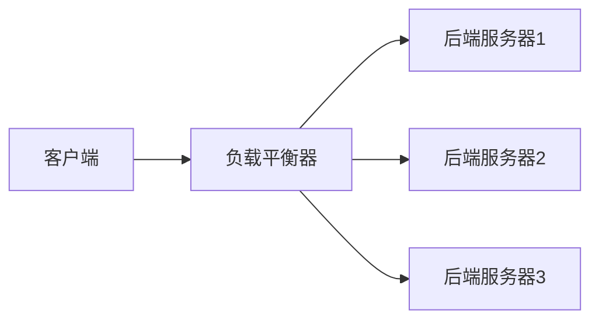

                 

## 1. 背景介绍

在分布式系统中，服务注册和负载平衡是两个至关重要的概念。随着微服务架构的兴起，这些概念变得更加关键。本文将深入探讨服务注册和负载平衡器的作用，并提供实践指南。

## 2. 核心概念与联系

### 2.1 服务注册

服务注册是分布式系统中一种关键的发现机制。它允许服务在运行时动态地发现和位置透明地访问其他服务。服务注册通常涉及以下组件：

- **服务提供者**：提供服务的应用程序。
- **服务消费者**：使用服务的应用程序。
- **服务注册表**：存储服务提供者信息的数据结构。
- **服务发现协议**：服务提供者和消费者之间通信的协议。

服务注册的过程如下：


### 2.2 负载平衡

负载平衡是分布式系统中另一种关键机制，它旨在分布网络或应用程序的流量，以提高系统的可用性、可靠性和性能。负载平衡器通常位于客户端和服务器之间，并使用以下算法之一将请求分发给后端服务器：

- 轮询（Round Robin）
- IP哈希（IP Hash）
- 最小连接数（Least Connections）
-Fair Queueing

负载平衡的过程如下：



## 3. 核心算法原理 & 具体操作步骤

### 3.1 算法原理概述

服务注册和负载平衡器通常使用软件实现，如Eureka、Consul、Nginx等。这些软件使用客户端-服务器架构，其中客户端是服务消费者，服务器是服务注册表或负载平衡器。

### 3.2 算法步骤详解

#### 3.2.1 服务注册

1. 服务提供者启动时，连接到服务注册表。
2. 服务提供者注册其服务信息（如IP地址、端口号、服务名称等）。
3. 服务注册表存储服务信息。
4. 服务消费者连接到服务注册表，获取服务信息。
5. 服务消费者使用服务信息连接到服务提供者。

#### 3.2.2 负载平衡

1. 客户端连接到负载平衡器。
2. 负载平衡器选择后端服务器。
3. 负载平衡器将请求转发给后端服务器。
4. 后端服务器处理请求。
5. 后端服务器返回响应给客户端。

### 3.3 算法优缺点

**服务注册的优点**包括：

- 位置透明：服务消费者不需要知道服务提供者的位置。
- 动态发现：服务消费者可以动态地发现新的服务提供者。

**服务注册的缺点**包括：

- 单点故障：如果服务注册表失败，则所有服务都无法注册或发现。
- 网络开销：服务提供者和消费者需要与服务注册表通信。

**负载平衡的优点**包括：

- 提高可用性：如果一个后端服务器失败，负载平衡器可以将请求转发给其他服务器。
- 提高性能：负载平衡器可以将请求分布到多个后端服务器，提高系统的吞吐量。

**负载平衡的缺点**包括：

- 复杂性：设计和实现负载平衡算法需要考虑多种因素。
- 网络开销：负载平衡器需要处理额外的网络流量。

### 3.4 算法应用领域

服务注册和负载平衡器广泛应用于云计算、分布式系统、微服务架构等领域。它们有助于提高系统的可用性、可靠性和性能。

## 4. 数学模型和公式 & 详细讲解 & 举例说明

### 4.1 数学模型构建

服务注册和负载平衡器的数学模型可以使用图论和概率论来描述。服务注册表可以表示为图G=(V,E)，其中V是服务提供者的集合，E是服务提供者之间的连接集合。负载平衡器可以表示为图G'=(V',E')，其中V'是后端服务器的集合，E'是后端服务器之间的连接集合。

### 4.2 公式推导过程

假设有n个后端服务器，使用轮询算法进行负载平衡。那么每个后端服务器接收请求的概率为1/n。如果请求的到达遵循泊松分布，那么后端服务器的利用率可以使用以下公式计算：

$$U = \frac{\lambda}{n\mu}$$

其中λ是请求到达率，μ是服务器的服务率。

### 4.3 案例分析与讲解

假设有5个后端服务器，请求到达率为100个请求/秒，服务器的服务率为100个请求/秒。那么每个后端服务器的利用率为：

$$U = \frac{100}{5 \times 100} = 0.2$$

这意味着每个后端服务器的利用率为20%。如果增加后端服务器的数量，利用率将会降低，从而提高系统的吞吐量。

## 5. 项目实践：代码实例和详细解释说明

### 5.1 开发环境搭建

本节将使用Spring Cloud Netflix的Eureka和Ribbon实现服务注册和负载平衡。首先，需要安装JDK、Maven和Spring Tool Suite。

### 5.2 源代码详细实现

#### 5.2.1 服务提供者

创建一个Spring Boot项目，添加Eureka客户端依赖：

```xml
<dependencies>
    <dependency>
        <groupId>org.springframework.cloud</groupId>
        <artifactId>spring-cloud-starter-netflix-eureka-client</artifactId>
    </dependency>
</dependencies>
```

在application.properties中配置服务信息：

```
spring.application.name=service-provider
server.port=8081
eureka.client.serviceUrl.defaultZone=http://localhost:8761/eureka/
```

#### 5.2.2 服务注册表

创建一个Spring Boot项目，添加Eureka服务器依赖：

```xml
<dependencies>
    <dependency>
        <groupId>org.springframework.cloud</groupId>
        <artifactId>spring-cloud-starter-netflix-eureka-server</artifactId>
    </dependency>
</dependencies>
```

在application.properties中配置服务注册表信息：

```
server.port=8761
eureka.instance.hostname=localhost
```

#### 5.2.3 服务消费者

创建一个Spring Boot项目，添加Ribbon客户端依赖：

```xml
<dependencies>
    <dependency>
        <groupId>org.springframework.cloud</groupId>
        <artifactId>spring-cloud-starter-netflix-ribbon</artifactId>
    </dependency>
</dependencies>
```

在application.properties中配置服务消费者信息：

```
spring.application.name=service-consumer
server.port=8082
eureka.client.serviceUrl.defaultZone=http://localhost:8761/eureka/
```

### 5.3 代码解读与分析

服务提供者和消费者都需要添加Eureka客户端依赖，并配置服务信息。服务注册表需要添加Eureka服务器依赖，并配置服务注册表信息。服务消费者需要添加Ribbon客户端依赖，并配置服务消费者信息。

### 5.4 运行结果展示

运行服务注册表，服务提供者和服务消费者。服务消费者将自动发现服务提供者，并使用Ribbon进行负载平衡。

## 6. 实际应用场景

服务注册和负载平衡器广泛应用于云计算、分布式系统、微服务架构等领域。例如，Netflix使用Eureka和Ribbon实现服务注册和负载平衡，Amazon使用ELB（Elastic Load Balancing）实现负载平衡。

### 6.1 云计算

在云计算中，服务注册和负载平衡器有助于提高系统的可用性、可靠性和性能。云服务提供商（如Amazon、Microsoft、Google）都提供了服务注册和负载平衡服务。

### 6.2 分布式系统

在分布式系统中，服务注册和负载平衡器有助于实现位置透明和动态发现。分布式系统中的服务可以动态地注册和发现其他服务，从而提高系统的灵活性和可扩展性。

### 6.3 微服务架构

在微服务架构中，服务注册和负载平衡器有助于实现服务的松耦合和高可用。微服务可以动态地注册和发现其他服务，并使用负载平衡器分布请求，从而提高系统的可用性和性能。

### 6.4 未来应用展望

未来，服务注册和负载平衡器将继续发展，以适应分布式系统的需求。例如，边缘计算和物联网等领域将需要更高效的服务注册和负载平衡机制。

## 7. 工具和资源推荐

### 7.1 学习资源推荐

- [Spring Cloud Netflix](https://spring.io/projects/spring-cloud-netflix)
- [Eureka](https://github.com/Netflix/eureka)
- [Ribbon](https://github.com/Netflix/ribbon)
- [分布式系统原理与模式](https://book.douban.com/subject/26389265/)

### 7.2 开发工具推荐

- [Spring Tool Suite](https://spring.io/tools)
- [Postman](https://www.postman.com/)
- [JMeter](https://jmeter.apache.org/)

### 7.3 相关论文推荐

- [A Survey of Load Balancing Techniques in Cloud Computing](https://ieeexplore.ieee.org/document/7041324)
- [Service Discovery and Load Balancing in Distributed Systems](https://www.usenix.org/system/files/login/articles/login_summer16_07_roberts.pdf)

## 8. 总结：未来发展趋势与挑战

### 8.1 研究成果总结

本文介绍了服务注册和负载平衡器的作用，并提供了实践指南。我们讨论了服务注册和负载平衡的核心概念、算法原理、数学模型和公式，并提供了代码实例和实际应用场景。

### 8.2 未来发展趋势

未来，服务注册和负载平衡器将继续发展，以适应分布式系统的需求。例如，边缘计算和物联网等领域将需要更高效的服务注册和负载平衡机制。此外，服务注册和负载平衡器将与其他分布式系统技术（如服务网格和事件驱动架构）集成，以提供更完整的解决方案。

### 8.3 面临的挑战

服务注册和负载平衡器面临的挑战包括：

- **单点故障**：服务注册表和负载平衡器本身可能成为单点故障，需要设计冗余机制。
- **网络开销**：服务注册和负载平衡需要额外的网络流量，需要优化网络开销。
- **复杂性**：设计和实现服务注册和负载平衡算法需要考虑多种因素，需要简化复杂性。

### 8.4 研究展望

未来的研究方向包括：

- **自适应负载平衡**：开发能够自适应地调整负载平衡策略的算法。
- **服务网格**：将服务注册和负载平衡与服务网格集成，提供更完整的分布式系统解决方案。
- **边缘计算**：开发适合边缘计算环境的服务注册和负载平衡机制。

## 9. 附录：常见问题与解答

**Q：服务注册和负载平衡器有什么区别？**

A：服务注册器负责管理服务提供者的注册和发现，而负载平衡器负责将请求分发给后端服务器。

**Q：什么是服务网格？**

A：服务网格是一种分布式系统架构，它将服务注册和负载平衡与其他分布式系统技术（如安全性和观察性）集成，提供更完整的解决方案。

**Q：什么是边缘计算？**

A：边缘计算是一种分布式系统架构，它将计算和存储资源部署到网络边缘，以减少延迟和提高性能。

**作者：禅与计算机程序设计艺术 / Zen and the Art of Computer Programming**

