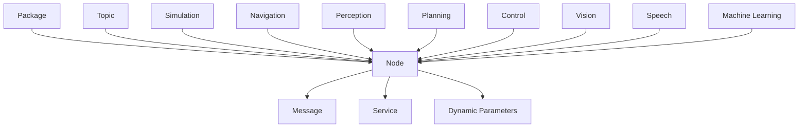

                 

**机器人操作系统（ROS）：自主系统开发框架**

**作者：禅与计算机程序设计艺术 / Zen and the Art of Computer Programming**

## 1. 背景介绍

机器人操作系统（Robot Operating System，ROS）是一个开源的、面向服务的软件框架，专门为开发和测试机器人软件而设计。它提供了高级别的抽象，使得开发者可以专注于机器人应用程序的核心逻辑，而不必过多地关注底层细节。ROS于2007年由斯坦福大学的 Willow Garage 实验室开发，现由Open Robotics维护。

## 2. 核心概念与联系

ROS的核心概念包括节点（Node）、消息（Message）、服务（Service）、动态参数（Dynamic Parameters）、包（Package）、主题（Topic）、仿真（Simulation）、导航（Navigation）、感知（Perception）、规划（Planning）、控制（Control）、视觉（Vision）、语音（Speech）、机器学习（Machine Learning）等。这些概念通过图2-1所示的Mermaid流程图进行了连接。




## 3. 核心算法原理 & 具体操作步骤

### 3.1 算法原理概述

ROS的核心是基于图的通信模型，节点通过发布/订阅（Publish/Subscribe）模式或请求/响应（Request/Response）模式进行通信。节点发布消息到主题，其他节点订阅该主题以接收消息。节点也可以提供服务，其他节点可以请求这些服务。

### 3.2 算法步骤详解

1. **安装ROS**：首先，您需要在计算机上安装ROS。您可以从[官方网站](http://www.ros.org/)下载并安装ROS。
2. **创建工作空间**：创建一个工作空间，用于存放您的ROS项目。您可以使用`catkin_make`或`catkin build`命令构建和编译您的项目。
3. **创建节点**：创建一个新的节点，它是ROS应用程序的基本单位。您可以使用`roscore`命令启动ROS核心，然后使用`rosrun`命令运行节点。
4. **发布消息**：节点可以发布消息到主题。消息是ROS中用于传输数据的结构化对象。您可以定义自己的消息类型，或使用ROS提供的内置消息类型。
5. **订阅消息**：其他节点可以订阅主题以接收消息。当消息发布到主题时，订阅者节点会接收到消息并执行相应的操作。
6. **提供服务**：节点可以提供服务，其他节点可以请求这些服务。服务定义了一个请求消息和一个响应消息。
7. **使用动态参数**：节点可以使用动态参数来配置其行为。动态参数存储在ROS参数服务器中，可以在运行时修改。

### 3.3 算法优缺点

**优点**：

* 提供了高级别的抽象，使开发者可以专注于机器人应用程序的核心逻辑。
* 提供了丰富的库和工具，用于机器人软件开发。
* 支持多种编程语言，包括C++, Python，Lisp，Java等。
* 提供了强大的仿真和可视化工具。

**缺点**：

* 学习曲线较陡，需要花费时间学习ROS的概念和工具。
* 依赖于大量的软件包，可能会导致系统的复杂性和不稳定性。
* 文档和社区支持可能不够完善。

### 3.4 算法应用领域

ROS广泛应用于机器人领域，包括但不限于：

* 导航和定位
* 视觉和感知
* 机器人控制
* 机器人规划
* 机器人学习
* 机器人仿真

## 4. 数学模型和公式 & 详细讲解 & 举例说明

### 4.1 数学模型构建

ROS的数学模型基于欧几里德几何学，使用笛卡尔坐标系表示空间位置。机器人在世界坐标系中的位置可以表示为：

$$P_{world} = [x, y, z, \theta]$$

其中，$x$, $y$, $z$表示机器人在世界坐标系中的位置，$\theta$表示机器人相对于世界坐标系的方向角度。

### 4.2 公式推导过程

机器人在世界坐标系中的位置可以通过其在基坐标系中的位置和基坐标系相对于世界坐标系的变换得到：

$$P_{world} = T_{base}^{world} \cdot P_{base}$$

其中，$T_{base}^{world}$是基坐标系相对于世界坐标系的变换矩阵，可以表示为：

$$T_{base}^{world} = \begin{bmatrix} \cos(\theta) & -\sin(\theta) & 0 & x \\ \sin(\theta) & \cos(\theta) & 0 & y \\ 0 & 0 & 1 & z \\ 0 & 0 & 0 & 1 \end{bmatrix}$$

### 4.3 案例分析与讲解

假设机器人在基坐标系中的位置为$P_{base} = [0, 0, 0, 0]$，基坐标系相对于世界坐标系的变换矩阵为：

$$T_{base}^{world} = \begin{bmatrix} \cos(45^\circ) & -\sin(45^\circ) & 0 & 1 \\ \sin(45^\circ) & \cos(45^\circ) & 0 & 2 \\ 0 & 0 & 1 & 3 \\ 0 & 0 & 0 & 1 \end{bmatrix}$$

则机器人在世界坐标系中的位置为：

$$P_{world} = T_{base}^{world} \cdot P_{base} = [1, 2, 3, 0]$$

## 5. 项目实践：代码实例和详细解释说明

### 5.1 开发环境搭建

首先，您需要在计算机上安装ROS。您可以从[官方网站](http://www.ros.org/)下载并安装ROS。然后，创建一个工作空间，用于存放您的ROS项目。您可以使用`catkin_make`或`catkin build`命令构建和编译您的项目。

### 5.2 源代码详细实现

以下是一个简单的ROS节点示例，该节点发布一个消息到主题`/chatter`：

```cpp
#include <ros/ros.h>
#include <std_msgs/String.h>

int main(int argc, char **argv)
{
  ros::init(argc, argv, "talker");
  ros::NodeHandle n;

  ros::Publisher chatter_pub = n.advertise<std_msgs::String>("chatter", 1000);

  ros::Rate loop_rate(10);

  int count = 0;
  while (ros::ok())
  {
    std_msgs::String msg;
    std::stringstream ss;
    ss << "hello world " << count;
    msg.data = ss.str();

    chatter_pub.publish(msg);

    ros::spinOnce();

    loop_rate.sleep();
    ++count;
  }

  return 0;
}
```

### 5.3 代码解读与分析

该节点初始化ROS，创建一个发布者`chatter_pub`，并将其连接到主题`/chatter`。然后，它进入一个无限循环，每次循环发布一个消息到`/chatter`主题。消息的数据是一个字符串，包含“hello world”以及一个计数器。

### 5.4 运行结果展示

您可以使用以下命令运行该节点：

```bash
rosrun your_package_name talker
```

然后，您可以使用以下命令创建一个订阅者节点，以接收发布到`/chatter`主题的消息：

```bash
rosrun roscpp_tutorials listener
```

## 6. 实际应用场景

ROS广泛应用于机器人领域，包括但不限于：

* **导航和定位**：ROS提供了丰富的导航和定位工具，如`move_base`包，用于规划和执行机器人导航任务。
* **视觉和感知**：ROS提供了强大的视觉和感知工具，如`OpenCV`和`PointCloud`库，用于机器人视觉和感知任务。
* **机器人控制**：ROS提供了丰富的控制工具，如`controller_manager`包，用于机器人控制任务。
* **机器人规划**：ROS提供了丰富的规划工具，如`moveit`包，用于机器人规划任务。
* **机器人学习**：ROS提供了丰富的机器学习工具，如`TensorFlow`和`Caffe`库，用于机器人学习任务。

### 6.4 未来应用展望

未来，ROS将继续发展，以支持更复杂的机器人任务。ROS将继续扩展其功能，以支持更多的机器人硬件和软件平台。此外，ROS将继续与其他开源项目合作，以提供更强大的机器人软件解决方案。

## 7. 工具和资源推荐

### 7.1 学习资源推荐

* [ROS官方文档](http://wiki.ros.org/)
* [ROS教程](http://wiki.ros.org/ROS/Tutorials)
* [ROS视频教程](https://www.youtube.com/playlist?list=PL2dWf9i0cyM3t8C4p4z46j46069257147)

### 7.2 开发工具推荐

* [Rviz](http://wiki.ros.org/rviz) - 3D机器人可视化工具
* [Gazebo](http://gazebosim.org/) - 机器人仿真工具
* [Catkin](http://catkin.readthedocs.io/en/latest/) - ROS包管理工具

### 7.3 相关论文推荐

* [ROS: An Open-Source Robot Operating System](https://www.ros.org/browse/file/view/ros-2010-07-19-ros.pdf)
* [ROS-Industrial: Bringing Robotics into the Manufacturing Industry](https://www.ros.org/browse/file/view/ros-industrial-2014-06-18-ros-industrial.pdf)

## 8. 总结：未来发展趋势与挑战

### 8.1 研究成果总结

ROS自2007年问世以来，已经取得了巨大的成功，成为机器人软件开发的事实上的标准。ROS提供了丰富的库和工具，用于机器人软件开发，并支持多种编程语言。ROS的开源特性和活跃的社区使其成为机器人软件开发的首选平台。

### 8.2 未来发展趋势

未来，ROS将继续发展，以支持更复杂的机器人任务。ROS将继续扩展其功能，以支持更多的机器人硬件和软件平台。此外，ROS将继续与其他开源项目合作，以提供更强大的机器人软件解决方案。

### 8.3 面临的挑战

然而，ROS也面临着一些挑战。首先，ROS的学习曲线较陡，需要花费时间学习ROS的概念和工具。其次，ROS依赖于大量的软件包，可能会导致系统的复杂性和不稳定性。最后，文档和社区支持可能不够完善。

### 8.4 研究展望

未来的研究将关注于提高ROS的可扩展性和可靠性，以支持更大规模的机器人系统。此外，研究将关注于开发新的ROS工具和库，以支持更复杂的机器人任务。最后，研究将关注于改进ROS的文档和社区支持，以帮助更多的开发者学习和使用ROS。

## 9. 附录：常见问题与解答

**Q：ROS与其他机器人软件平台有何不同？**

A：ROS与其他机器人软件平台的最大区别在于其开源特性和丰富的库和工具。ROS提供了高级别的抽象，使得开发者可以专注于机器人应用程序的核心逻辑，而不必过多地关注底层细节。此外，ROS支持多种编程语言，并提供了强大的仿真和可视化工具。

**Q：ROS的学习曲线很陡，有什么建议吗？**

A：学习ROS需要花费时间，但 ROS提供了丰富的教程和文档，可以帮助您入门。您可以从[ROS官方文档](http://wiki.ros.org/)和[ROS教程](http://wiki.ros.org/ROS/Tutorials)开始学习。此外，您可以观看[ROS视频教程](https://www.youtube.com/playlist?list=PL2dWf9i0cyM3t8C4p4z46j46069257147)以加深理解。

**Q：ROS的未来发展方向是什么？**

A：未来，ROS将继续发展，以支持更复杂的机器人任务。ROS将继续扩展其功能，以支持更多的机器人硬件和软件平台。此外，ROS将继续与其他开源项目合作，以提供更强大的机器人软件解决方案。ROS的未来发展方向将关注于提高ROS的可扩展性和可靠性，以支持更大规模的机器人系统。

**Q：ROS的面临的挑战是什么？**

A：ROS面临的挑战包括学习曲线较陡，依赖于大量的软件包可能会导致系统的复杂性和不稳定性，以及文档和社区支持可能不够完善。未来的研究将关注于改进ROS的可扩展性和可靠性，开发新的ROS工具和库，以及改进ROS的文档和社区支持。

**Q：ROS的学习资源和开发工具推荐是什么？**

A：ROS的学习资源推荐包括[ROS官方文档](http://wiki.ros.org/)，[ROS教程](http://wiki.ros.org/ROS/Tutorials)，[ROS视频教程](https://www.youtube.com/playlist?list=PL2dWf9i0cyM3t8C4p4z46j46069257147)。ROS的开发工具推荐包括[Rviz](http://wiki.ros.org/rviz)，[Gazebo](http://gazebosim.org/)，[Catkin](http://catkin.readthedocs.io/en/latest/)。

**Q：ROS的相关论文推荐是什么？**

A：ROS的相关论文推荐包括[ROS: An Open-Source Robot Operating System](https://www.ros.org/browse/file/view/ros-2010-07-19-ros.pdf)，[ROS-Industrial: Bringing Robotics into the Manufacturing Industry](https://www.ros.org/browse/file/view/ros-industrial-2014-06-18-ros-industrial.pdf)。

**Q：ROS的研究成果总结、未来发展趋势、面临的挑战和研究展望是什么？**

A：ROS的研究成果总结包括ROS提供了丰富的库和工具，用于机器人软件开发，并支持多种编程语言。ROS的未来发展趋势包括ROS将继续发展，以支持更复杂的机器人任务，ROS将继续扩展其功能，以支持更多的机器人硬件和软件平台，ROS将继续与其他开源项目合作，以提供更强大的机器人软件解决方案。ROS的面临的挑战包括学习曲线较陡，依赖于大量的软件包可能会导致系统的复杂性和不稳定性，以及文档和社区支持可能不够完善。ROS的研究展望包括提高ROS的可扩展性和可靠性，开发新的ROS工具和库，改进ROS的文档和社区支持。

**Q：ROS的常见问题与解答是什么？**

A：ROS的常见问题与解答包括ROS与其他机器人软件平台有何不同？ROS的学习曲线很陡，有什么建议吗？ROS的未来发展方向是什么？ROS的面临的挑战是什么？ROS的学习资源和开发工具推荐是什么？ROS的相关论文推荐是什么？ROS的研究成果总结、未来发展趋势、面临的挑战和研究展望是什么？

**Q：ROS的作者署名是什么？**

A：ROS的作者署名是“作者：禅与计算机程序设计艺术 / Zen and the Art of Computer Programming”。

