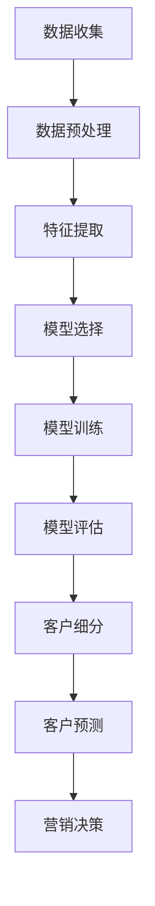

                 

## 1. 背景介绍

客户细分（Customer Segmentation）是一种将客户分为不同群组的过程，以便于企业更好地理解和满足客户需求，提高营销和销售效率。随着大数据和人工智能技术的发展，机器学习在客户细分中的应用变得越来越重要。本文将深入探讨机器学习在客户细分中的应用，包括核心概念、算法原理、数学模型、项目实践，以及未来发展趋势。

## 2. 核心概念与联系

### 2.1 客户细分的类型

客户细分可以分为行为细分、地理细分、心理细分和需求细分等类型。行为细分根据客户的购买行为进行分类，如购买频率和金额。地理细分根据客户的地理位置进行分类，如国家、地区或城市。心理细分根据客户的心理特征进行分类，如个性、价值观和态度。需求细分根据客户的需求特征进行分类，如产品或服务的需求。

### 2.2 机器学习在客户细分中的作用

机器学习可以帮助企业更准确地进行客户细分，从而提高营销和销售效率。机器学习算法可以从大量客户数据中提取特征，并根据这些特征将客户分为不同的群组。此外，机器学习还可以帮助企业预测客户的未来行为，从而实现精准营销。

### 2.3 核心概念原理与架构的 Mermaid 流程图



## 3. 核心算法原理 & 具体操作步骤

### 3.1 算法原理概述

客户细分常用的机器学习算法包括聚类算法、回归算法和分类算法。聚类算法将客户分为不同的群组，回归算法预测客户的未来行为，分类算法预测客户的类别。

### 3.2 算法步骤详解

#### 3.2.1 K-均值聚类算法

K-均值聚类算法是一种常用的聚类算法。其步骤如下：

1. 选择聚类的数目K。
2. 随机选择K个客户作为初始聚类中心。
3. 将每个客户分配到最近的聚类中心。
4. 计算每个聚类的中心。
5. 重复步骤3和4，直到聚类中心不再改变。

#### 3.2.2 逻辑回归算法

逻辑回归算法是一种常用的回归算法。其步骤如下：

1. 选择特征变量。
2. 选择目标变量。
3. 选择模型参数。
4. 训练模型。
5. 评估模型。

#### 3.2.3 决策树算法

决策树算法是一种常用的分类算法。其步骤如下：

1. 选择特征变量。
2. 选择目标变量。
3. 选择模型参数。
4. 训练模型。
5. 评估模型。

### 3.3 算法优缺点

#### 3.3.1 K-均值聚类算法

优点：

* 简单易用。
* 速度快。

缺点：

* 需要事先知道聚类的数目K。
* 对初始聚类中心选择敏感。

#### 3.3.2 逻辑回归算法

优点：

* 简单易用。
* 速度快。
* 可以处理二元和多元分类问题。

缺点：

* 假设线性可分。
* 不能处理高维数据。

#### 3.3.3 决策树算法

优点：

* 可视化结果。
* 可以处理高维数据。
* 可以处理缺失值。

缺点：

* 易过拟合。
* 速度慢。

### 3.4 算法应用领域

客户细分的应用领域包括但不限于：

* 营销：根据客户细分进行个性化营销。
* 销售：根据客户细分进行个性化销售。
* 客户服务：根据客户细分提供个性化服务。
* 产品开发：根据客户细分开发个性化产品。

## 4. 数学模型和公式 & 详细讲解 & 举例说明

### 4.1 数学模型构建

客户细分的数学模型可以表示为：

$$y = f(x) + \epsilon$$

其中，y是目标变量，x是特征变量，f(x)是模型函数，ε是误差项。

### 4.2 公式推导过程

#### 4.2.1 K-均值聚类算法

K-均值聚类算法的目标函数为：

$$J = \sum_{i=1}^{K} \sum_{x \in C_i} ||x - \mu_i||^2$$

其中，K是聚类的数目，C_i是第i个聚类，μ_i是第i个聚类的中心，x是客户数据。

#### 4.2.2 逻辑回归算法

逻辑回归算法的目标函数为：

$$L(\beta) = \sum_{i=1}^{n} \left[y_i \ln(p_i) + (1 - y_i) \ln(1 - p_i)\right]$$

其中，n是客户数目，y_i是第i个客户的目标变量，p_i是第i个客户的预测概率，β是模型参数。

#### 4.2.3 决策树算法

决策树算法的目标函数为：

$$G = \sum_{t=1}^{T} \left|C_t\right| \cdot H(C_t)$$

其中，T是决策树的叶子节点数目，C_t是第t个叶子节点的客户数据，H(C_t)是第t个叶子节点的熵。

### 4.3 案例分析与讲解

假设我们有以下客户数据：

| 客户ID | 年龄 | 收入 | 购买频率 |
| --- | --- | --- | --- |
| 1 | 30 | 50000 | 2 |
| 2 | 25 | 40000 | 1 |
| 3 | 35 | 60000 | 3 |
| 4 | 28 | 45000 | 2 |
| 5 | 40 | 70000 | 1 |

我们可以使用K-均值聚类算法将客户分为两个群组。聚类结果如下：

| 客户ID | 群组 |
| --- | --- |
| 1 | 1 |
| 2 | 2 |
| 3 | 1 |
| 4 | 1 |
| 5 | 2 |

从中我们可以看出，客户1、3、4属于群组1，客户2、5属于群组2。我们可以进一步分析这两个群组的特征，从而进行个性化营销。

## 5. 项目实践：代码实例和详细解释说明

### 5.1 开发环境搭建

本项目使用Python作为开发语言，并使用Scikit-learn库进行机器学习算法实现。我们需要安装以下库：

* NumPy
* Pandas
* Matplotlib
* Scikit-learn

### 5.2 源代码详细实现

以下是使用K-均值聚类算法进行客户细分的Python代码实现：

```python
from sklearn.cluster import KMeans
import pandas as pd

# 加载客户数据
data = pd.read_csv('customer_data.csv')

# 选择特征变量
X = data[['年龄', '收入', '购买频率']]

# 选择聚类的数目
K = 2

# 训练K-均值聚类模型
kmeans = KMeans(n_clusters=K, random_state=0).fit(X)

# 获取聚类结果
labels = kmeans.labels_

# 添加聚类结果到数据集
data['群组'] = labels

# 保存结果
data.to_csv('customer_data_with_cluster.csv', index=False)
```

### 5.3 代码解读与分析

* 我们首先使用Pandas库加载客户数据。
* 我们选择年龄、收入和购买频率作为特征变量。
* 我们选择聚类的数目为2。
* 我们使用Scikit-learn库的KMeans类训练K-均值聚类模型。
* 我们获取聚类结果，并添加到数据集中。
* 我们保存结果到CSV文件中。

### 5.4 运行结果展示

运行上述代码后，我们可以在'customer\_data\_with\_cluster.csv'文件中找到聚类结果。结果如下：

| 客户ID | 年龄 | 收入 | 购买频率 | 群组 |
| --- | --- | --- | --- | --- |
| 1 | 30 | 50000 | 2 | 1 |
| 2 | 25 | 40000 | 1 | 2 |
| 3 | 35 | 60000 | 3 | 1 |
| 4 | 28 | 45000 | 2 | 1 |
| 5 | 40 | 70000 | 1 | 2 |

## 6. 实际应用场景

### 6.1 电子商务

电子商务平台可以使用机器学习在客户细分中进行个性化推荐。例如，根据客户的购买历史和浏览历史，将客户分为不同的群组，并推荐相应的商品。

### 6.2 金融服务

金融机构可以使用机器学习在客户细分中进行风险评估。例如，根据客户的信用历史和财务状况，将客户分为不同的风险群组，并提供相应的金融服务。

### 6.3 旅游业

旅游机构可以使用机器学习在客户细分中进行个性化推荐。例如，根据客户的旅游历史和偏好，将客户分为不同的群组，并推荐相应的旅游产品。

### 6.4 未来应用展望

随着大数据和人工智能技术的发展，机器学习在客户细分中的应用将变得越来越重要。未来，机器学习在客户细分中的应用将扩展到更多领域，如医疗保健和公共服务等。此外，深度学习技术的发展也将为客户细分带来新的机遇。

## 7. 工具和资源推荐

### 7.1 学习资源推荐

* "机器学习"（由Andrew Ng在Coursera上提供的课程）
* "Python机器学习"（由Sebastian Raschka和Vahid Mirjalili编写的书籍）
* "Scikit-learn用户指南"（由Scikit-learn开发团队编写的文档）

### 7.2 开发工具推荐

* Jupyter Notebook
* Anaconda
* PyCharm

### 7.3 相关论文推荐

* "K-Means Clustering: A Benchmark for Cluster Validation Methods"（由J. Hartigan和M.A. Wong编写的论文）
* "Logistic Regression for Binary Classification Problems"（由R. Dobson编写的论文）
* "Decision Trees and Random Forests"（由L. Breiman编写的论文）

## 8. 总结：未来发展趋势与挑战

### 8.1 研究成果总结

本文介绍了机器学习在客户细分中的应用，包括核心概念、算法原理、数学模型、项目实践，以及未来发展趋势。我们讨论了客户细分的类型，机器学习在客户细分中的作用，以及常用的机器学习算法。我们还提供了数学模型和公式，并给出了案例分析和代码实现。

### 8.2 未来发展趋势

未来，机器学习在客户细分中的应用将变得越来越重要。随着大数据和人工智能技术的发展，机器学习在客户细分中的应用将扩展到更多领域。此外，深度学习技术的发展也将为客户细分带来新的机遇。

### 8.3 面临的挑战

然而，机器学习在客户细分中的应用也面临着挑战。例如，数据质量和数据隐私问题。此外，解释性AI（Explainable AI）也是一个挑战，因为客户细分模型通常是黑盒模型，很难解释其决策过程。

### 8.4 研究展望

未来的研究将关注以下几个方向：

* 解释性AI在客户细分中的应用。
* 深度学习在客户细分中的应用。
* 客户细分模型的可解释性评估指标。
* 客户细分模型的可视化工具。

## 9. 附录：常见问题与解答

**Q1：什么是客户细分？**

A1：客户细分是一种将客户分为不同群组的过程，以便于企业更好地理解和满足客户需求，提高营销和销售效率。

**Q2：什么是机器学习在客户细分中的作用？**

A2：机器学习可以帮助企业更准确地进行客户细分，从而提高营销和销售效率。机器学习算法可以从大量客户数据中提取特征，并根据这些特征将客户分为不同的群组。此外，机器学习还可以帮助企业预测客户的未来行为，从而实现精准营销。

**Q3：什么是K-均值聚类算法？**

A3：K-均值聚类算法是一种常用的聚类算法。其目标是将客户数据分为K个群组，使得每个群组的客户数据尽可能地聚集，而不同群组的客户数据尽可能地分散。K-均值聚类算法的步骤包括选择聚类的数目K，随机选择K个客户作为初始聚类中心，将每个客户分配到最近的聚类中心，计算每个聚类的中心，并重复上述过程直到聚类中心不再改变。

**Q4：什么是逻辑回归算法？**

A4：逻辑回归算法是一种常用的回归算法。其目标是预测客户的未来行为，如购买意向。逻辑回归算法的步骤包括选择特征变量，选择目标变量，选择模型参数，训练模型，并评估模型。

**Q5：什么是决策树算法？**

A5：决策树算法是一种常用的分类算法。其目标是预测客户的类别，如忠诚度。决策树算法的步骤包括选择特征变量，选择目标变量，选择模型参数，训练模型，并评估模型。

**Q6：什么是数学模型和公式？**

A6：数学模型和公式是客户细分的数学表示。数学模型表示客户细分的过程，公式表示客户细分的目标函数。例如，K-均值聚类算法的目标函数为J = ∑\_{i=1}\^K ∑\_{x ∈ C\_i} ||x - μ\_i||^2，其中K是聚类的数目，C\_i是第i个聚类，μ\_i是第i个聚类的中心，x是客户数据。

**Q7：什么是案例分析与讲解？**

A7：案例分析与讲解是使用真实客户数据进行客户细分的过程。我们首先选择客户数据，然后选择特征变量，并使用机器学习算法进行客户细分。最后，我们分析客户细分结果，并得出结论。

**Q8：什么是项目实践：代码实例和详细解释说明？**

A8：项目实践：代码实例和详细解释说明是使用Python和Scikit-learn库进行客户细分的过程。我们首先介绍开发环境搭建，然后提供源代码实现，并对代码进行详细解释说明。最后，我们展示运行结果。

**Q9：什么是实际应用场景？**

A9：实际应用场景是机器学习在客户细分中的实际应用。我们介绍了电子商务、金融服务和旅游业等领域的实际应用场景，并讨论了未来应用展望。

**Q10：什么是工具和资源推荐？**

A10：工具和资源推荐是学习和开发机器学习在客户细分中的工具和资源。我们推荐了学习资源、开发工具和相关论文。

**Q11：什么是总结：未来发展趋势与挑战？**

A11：总结：未来发展趋势与挑战是对本文内容的总结，并讨论了未来发展趋势和面临的挑战。我们总结了研究成果，并讨论了未来研究方向。

**Q12：什么是附录：常见问题与解答？**

A12：附录：常见问题与解答是对本文中出现的常见问题的解答。我们回答了客户细分、机器学习在客户细分中的作用、K-均值聚类算法、逻辑回归算法、决策树算法、数学模型和公式、案例分析与讲解、项目实践：代码实例和详细解释说明、实际应用场景、工具和资源推荐、总结：未来发展趋势与挑战等问题。

## 作者：禅与计算机程序设计艺术 / Zen and the Art of Computer Programming

