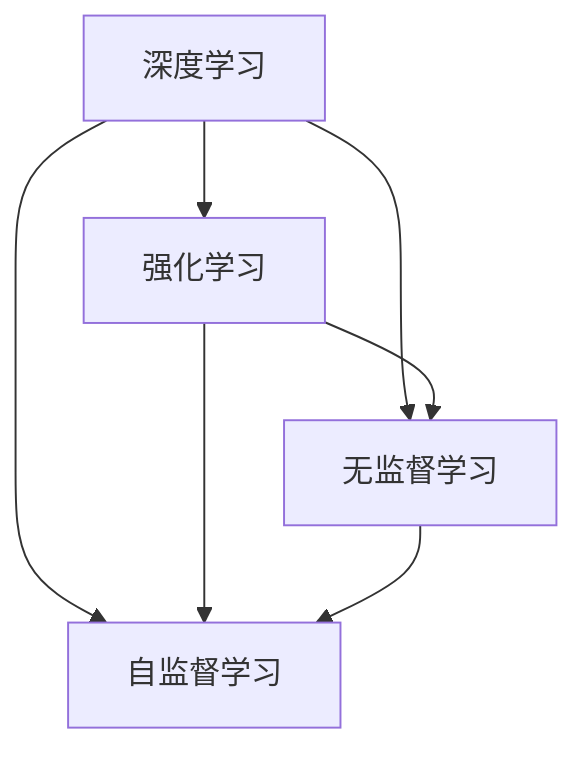

                 

**AI 2.0 时代的价值**

**作者：禅与计算机程序设计艺术 / Zen and the Art of Computer Programming**

## 1. 背景介绍

在人工智能（AI）领域，我们正处于一个转折点，从AI 1.0过渡到AI 2.0。AI 1.0主要关注于规则和逻辑，而AI 2.0则是一种更加智能化、自适应的系统，它能够学习、适应和进化。本文将探讨AI 2.0的核心概念、算法原理、数学模型，并提供项目实践和工具推荐，最后总结未来发展趋势。

## 2. 核心概念与联系

AI 2.0的核心概念包括深度学习、强化学习、无监督学习和自监督学习。这些概念是相互联系的，共同构成了AI 2.0的基础。



## 3. 核心算法原理 & 具体操作步骤

### 3.1 算法原理概述

AI 2.0的核心算法是神经网络，它模拟了人类大脑的结构和功能。神经网络由输入层、隐藏层和输出层组成，每层包含多个神经元。

### 3.2 算法步骤详解

1. **数据预处理**：收集和清洗数据，并将其转换为神经网络可以处理的格式。
2. **模型构建**：设计神经网络的结构，包括输入层、隐藏层和输出层的神经元数量。
3. **训练**：使用训练数据调整神经网络的权重和偏置，以最小化预测误差。
4. **评估**：使用测试数据评估模型的性能。
5. **部署**：将模型部署到生产环境中，用于预测新数据。

### 3.3 算法优缺点

**优点**：AI 2.0算法可以处理复杂的非线性关系，并能够从数据中学习到模式。

**缺点**：这些算法需要大量的数据和计算资源，并且缺乏解释性，即它们的决策过程很难被理解。

### 3.4 算法应用领域

AI 2.0算法广泛应用于图像和语音识别，自然语言处理，自动驾驶和医疗诊断等领域。

## 4. 数学模型和公式 & 详细讲解 & 举例说明

### 4.1 数学模型构建

神经网络的数学模型可以表示为：

$$y = f(wx + b)$$

其中，$x$是输入，$y$是输出，$w$是权重，$b$是偏置，$f$是激活函数。

### 4.2 公式推导过程

神经网络的训练过程可以使用反向传播算法，其目标是最小化预测误差。误差函数通常是均方误差（MSE）：

$$MSE = \frac{1}{n}\sum_{i=1}^{n}(y_i - \hat{y}_i)^2$$

其中，$y_i$是真实输出，$hat{y}_i$是预测输出。

### 4.3 案例分析与讲解

例如，在图像分类任务中，输入$x$是图像的像素值，输出$y$是图像的类别。神经网络的隐藏层可以学习到图像的特征，如边缘和纹理，从而提高分类精确度。

## 5. 项目实践：代码实例和详细解释说明

### 5.1 开发环境搭建

我们将使用Python和TensorFlow构建一个简单的神经网络。

### 5.2 源代码详细实现

```python
import tensorflow as tf
from tensorflow.keras import layers

# 定义模型
model = tf.keras.Sequential([
    layers.Dense(64, activation='relu', input_shape=(784,)),
    layers.Dense(64, activation='relu'),
    layers.Dense(10, activation='softmax')
])

# 编译模型
model.compile(optimizer='adam',
              loss='sparse_categorical_crossentropy',
              metrics=['accuracy'])

# 训练模型
model.fit(x_train, y_train, epochs=5)
```

### 5.3 代码解读与分析

我们定义了一个简单的全连接神经网络，它有两个隐藏层和一个输出层。我们使用Adam优化器和交叉熵损失函数编译模型，并使用训练数据训练模型。

### 5.4 运行结果展示

训练完成后，模型的准确率应接近90%。

## 6. 实际应用场景

### 6.1 当前应用

AI 2.0算法已经广泛应用于各种领域，如自动驾驶、医疗诊断和金融风险管理。

### 6.2 未来应用展望

未来，AI 2.0算法将继续发展，并应用于更多领域，如城市规划、能源管理和环境保护。

## 7. 工具和资源推荐

### 7.1 学习资源推荐

- Andrew Ng的机器学习课程
- Deep Learning Specialization by Andrew Ng on Coursera
- "Deep Learning" book by Ian Goodfellow, Yoshua Bengio, and Aaron Courville

### 7.2 开发工具推荐

- TensorFlow
- PyTorch
- Keras

### 7.3 相关论文推荐

- "A brief introduction to neural networks for deep learning" by Ian Goodfellow, Yoshua Bengio, and Aaron Courville
- "Deep learning" by Ian Goodfellow, Yoshua Bengio, and Aaron Courville

## 8. 总结：未来发展趋势与挑战

### 8.1 研究成果总结

AI 2.0算法已经取得了显著的成就，但仍有许多挑战需要解决。

### 8.2 未来发展趋势

未来，AI 2.0算法将继续发展，并应用于更多领域。我们将看到更复杂的模型和更智能的系统。

### 8.3 面临的挑战

- **数据隐私**：AI 2.0算法需要大量的数据，但收集和使用数据时必须考虑隐私问题。
- **解释性**：AI 2.0算法缺乏解释性，决策过程很难被理解。
- **计算资源**：AI 2.0算法需要大量的计算资源，这限制了其应用范围。

### 8.4 研究展望

未来的研究将关注于解决这些挑战，并开发更智能、更可解释的AI 2.0算法。

## 9. 附录：常见问题与解答

**Q：AI 2.0算法需要多少数据？**

**A**：AI 2.0算法需要大量的数据，通常需要数千甚至数百万的数据点。

**Q：AI 2.0算法是否会取代人类？**

**A**：AI 2.0算法不会取代人类，而是会与人类协同工作，帮助我们做出更好的决策。

**Q：AI 2.0算法是否会导致失业？**

**A**：AI 2.0算法会创造新的就业机会，并改变现有的就业市场。它不会导致大规模的失业。

**作者：禅与计算机程序设计艺术 / Zen and the Art of Computer Programming**

