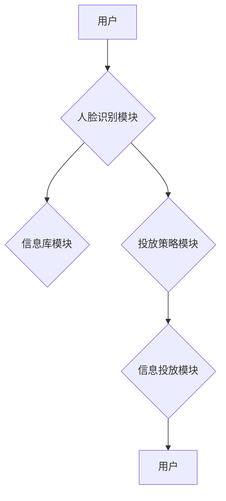

> 人脸识别, 多场景信息投放, 深度学习, 计算机视觉, 信息投放系统, 人机交互

## 1. 背景介绍

随着人工智能技术的飞速发展，人脸识别技术已成为一个炙手可热的领域，其应用场景也日益广泛。从安防监控到智能门禁，从个性化营销到医疗诊断，人脸识别技术正在深刻地改变着我们的生活。

信息投放系统作为一种重要的信息传播手段，其精准性和效率一直是人们关注的焦点。传统的广告投放方式往往缺乏针对性，难以精准地触达目标用户。而基于人脸识别的多场景信息投放系统，则能够通过识别用户的身份信息和行为特征，实现个性化、精准的信息投放，从而提升信息投放的效率和效果。

## 2. 核心概念与联系

### 2.1 人脸识别技术

人脸识别技术是指通过分析人脸图像或视频，识别和验证个体身份的技术。它主要包括以下几个步骤：

1. **人脸检测:** 首先需要从图像或视频中检测出人脸区域。
2. **人脸特征提取:** 从检测出的脸部区域中提取关键特征，例如眼睛、鼻子、嘴巴等位置和形状。
3. **特征匹配:** 将提取的特征与数据库中的特征进行比对，判断是否匹配。

### 2.2 多场景信息投放

多场景信息投放是指在不同的场景下，根据用户的身份信息、行为特征和环境信息，投放个性化的信息内容。例如，在商场购物时，可以根据用户的购物记录和偏好，推荐相关的商品信息；在公共场所，可以根据用户的年龄、性别等信息，投放相应的广告信息。

### 2.3 系统架构

基于人脸识别的多场景信息投放系统通常由以下几个模块组成：

1. **人脸识别模块:** 负责人脸检测、特征提取和匹配。
2. **信息库模块:** 存储各种信息内容，例如商品信息、广告信息、新闻信息等。
3. **投放策略模块:** 根据用户的身份信息、行为特征和环境信息，制定相应的投放策略。
4. **信息投放模块:** 将个性化的信息内容投放给用户。



## 3. 核心算法原理 & 具体操作步骤

### 3.1 算法原理概述

人脸识别算法主要分为两大类：传统算法和深度学习算法。

* **传统算法:** 传统的算法通常基于手工提取的人脸特征，例如PCA、LDA等。这些算法虽然简单易实现，但对人脸图像的质量要求较高，并且难以应对复杂的光照条件和姿态变化。

* **深度学习算法:** 深度学习算法利用深度神经网络自动学习人脸特征，能够更好地应对复杂的人脸图像变化。常见的深度学习算法包括CNN、ResNet、FaceNet等。

### 3.2 算法步骤详解

以深度学习算法为例，人脸识别算法的具体步骤如下：

1. **数据预处理:** 对人脸图像进行预处理，例如裁剪、缩放、归一化等。
2. **特征提取:** 使用深度神经网络提取人脸特征。
3. **特征匹配:** 将提取的特征与数据库中的特征进行比对，计算相似度。
4. **身份识别:** 根据相似度阈值，判断是否匹配，从而识别用户的身份。

### 3.3 算法优缺点

**优点:**

* 识别精度高，能够应对复杂的人脸图像变化。
* 自动学习特征，无需人工设计特征。

**缺点:**

* 训练数据量大，需要大量的标注数据。
* 计算量大，需要强大的计算资源。

### 3.4 算法应用领域

人脸识别算法广泛应用于以下领域：

* **安防监控:** 人脸识别可以用于识别嫌疑人、监控人员进出情况。
* **智能门禁:** 人脸识别可以用于代替密码或卡片，实现无钥匙门禁。
* **个性化营销:** 人脸识别可以用于识别用户的身份信息，进行精准的广告投放。
* **医疗诊断:** 人脸识别可以用于识别患者的病情，辅助医生诊断。

## 4. 数学模型和公式 & 详细讲解 & 举例说明

### 4.1 数学模型构建

人脸识别算法通常使用深度神经网络作为数学模型。深度神经网络由多个神经层组成，每层神经元之间通过权重连接。

### 4.2 公式推导过程

深度神经网络的训练过程是通过反向传播算法来实现的。反向传播算法的核心思想是通过计算误差，调整神经网络的权重，使得网络的输出与实际输出之间的误差最小化。

### 4.3 案例分析与讲解

以FaceNet算法为例，其目标是学习一个嵌入空间，使得同一个人的脸部图像在该空间中的距离较近，而不同人的脸部图像在该空间中的距离较远。FaceNet算法使用 triplet loss 函数来训练网络，该函数定义了三个样本之间的距离关系：

$$
L_{triplet} = \max(d(a, p) - d(a, n) + \alpha, 0)
$$

其中：

* $a$ 是锚点样本，
* $p$ 是正样本，
* $n$ 是负样本，
* $d(x, y)$ 表示样本 $x$ 和 $y$ 在嵌入空间中的距离，
* $\alpha$ 是一个margin参数。

通过最小化 triplet loss 函数，FaceNet算法可以学习到一个有效的嵌入空间，从而实现人脸识别。

## 5. 项目实践：代码实例和详细解释说明

### 5.1 开发环境搭建

本项目使用 Python 语言开发，需要安装以下软件包：

* OpenCV: 用于人脸检测和特征提取。
* TensorFlow: 用于深度学习模型训练和推理。
* Flask: 用于构建Web服务器。

### 5.2 源代码详细实现

```python
# 人脸识别模块
import cv2
import tensorflow as tf

# 加载人脸识别模型
model = tf.keras.models.load_model('face_recognition_model.h5')

# 人脸检测器
face_cascade = cv2.CascadeClassifier('haarcascade_frontalface_default.xml')

# 人脸特征提取函数
def extract_face_features(image):
    # ...

# 人脸识别函数
def recognize_face(image):
    # ...

# 信息投放模块
from flask import Flask, render_template

app = Flask(__name__)

@app.route('/')
def index():
    return render_template('index.html')

# ...

if __name__ == '__main__':
    app.run(debug=True)
```

### 5.3 代码解读与分析

* 人脸识别模块负责人脸检测和特征提取。
* 信息投放模块使用 Flask 框架构建 Web 服务器，提供用户界面和信息投放功能。

### 5.4 运行结果展示

运行项目后，用户可以上传人脸图像，系统会识别用户的身份并根据预设的投放策略，投放相应的个性化信息。

## 6. 实际应用场景

### 6.1 商场营销

在商场购物时，可以通过人脸识别技术识别用户的身份信息和购物偏好，精准地推送商品推荐和优惠券信息，提升购物体验和转化率。

### 6.2 公共场所信息投放

在公共场所，例如车站、机场、地铁站等，可以通过人脸识别技术识别用户的年龄、性别等信息，投放相应的广告信息和服务信息，提高信息投放的精准性和效率。

### 6.3 个性化教育

在教育领域，可以通过人脸识别技术识别学生的身份信息和学习状态，提供个性化的学习内容和辅导建议，提升学生的学习效率和兴趣。

### 6.4 未来应用展望

随着人工智能技术的不断发展，基于人脸识别的多场景信息投放系统将有更广泛的应用场景，例如：

* **医疗诊断:** 通过人脸识别技术识别患者的情绪状态和身体特征，辅助医生进行诊断和治疗。
* **金融服务:** 通过人脸识别技术验证用户的身份，提高金融服务的安全性。
* **智能家居:** 通过人脸识别技术控制智能家居设备，实现个性化的家居体验。

## 7. 工具和资源推荐

### 7.1 学习资源推荐

* **书籍:**
    * 《深度学习》
    * 《计算机视觉》
* **在线课程:**
    * Coursera 人工智能课程
    * Udacity 深度学习课程

### 7.2 开发工具推荐

* **Python:** 人工智能开发的常用语言。
* **OpenCV:** 图像处理和计算机视觉库。
* **TensorFlow:** 深度学习框架。
* **PyTorch:** 深度学习框架。

### 7.3 相关论文推荐

* 《FaceNet: A Unified Embedding for Face Recognition and Clustering》
* 《DeepFace: Closing the Gap to Human-Level Performance in Face Verification》

## 8. 总结：未来发展趋势与挑战

### 8.1 研究成果总结

基于人脸识别的多场景信息投放系统是一个具有巨大潜力的技术，其应用场景广泛，能够提升信息投放的精准性和效率。

### 8.2 未来发展趋势

未来，基于人脸识别的多场景信息投放系统将朝着以下方向发展：

* **更精准的识别:** 利用更先进的人脸识别算法，提高识别精度，并能够识别更复杂的人脸图像，例如遮挡、表情变化等。
* **更个性化的投放:** 通过更深入地分析用户的身份信息、行为特征和环境信息，实现更个性化的信息投放，满足用户的个性化需求。
* **更安全的保护:** 加强用户隐私保护，确保人脸识别技术安全可靠地应用。

### 8.3 面临的挑战

基于人脸识别的多场景信息投放系统也面临一些挑战：

* **数据安全:** 人脸识别技术涉及到用户的敏感信息，需要加强数据安全保护，防止信息泄露。
* **伦理问题:** 人脸识别技术可能被用于监控和跟踪用户，需要关注其伦理问题，确保其合法合规地应用。
* **技术瓶颈:** 人脸识别技术还存在一些技术瓶颈，例如识别速度、识别精度等，需要进一步的研究和突破。

### 8.4 研究展望

未来，我们将继续致力于基于人脸识别的多场景信息投放系统的研究，探索其更广泛的应用场景，并解决其面临的挑战，推动其健康发展。

## 9. 附录：常见问题与解答

### 9.1 人脸识别技术是否安全可靠？

人脸识别技术本身是安全的，但其安全性取决于具体的应用场景和技术实现。需要采取相应的安全措施，例如数据加密、身份验证等，确保人脸识别技术安全可靠地应用。

### 9.2 人脸识别技术是否会侵犯用户隐私？

人脸识别技术确实可能涉及到用户的敏感信息，因此需要关注其隐私保护问题。需要明确收集和使用人脸数据的目的，并采取相应的措施，例如匿名化处理、数据加密等，保护用户的隐私权。

### 9.3 人脸识别技术是否能够识别所有人的脸部？

目前的人脸识别技术还存在一些局限性，例如识别速度、识别精度等，并且对不同种族、年龄、性别的人脸识别效果可能存在差异。

### 9.4 人脸识别技术有哪些应用场景？

人脸识别技术应用场景广泛，例如安防监控、智能门禁、个性化营销、医疗诊断等。

### 9.5 如何学习人脸识别技术？

可以通过阅读相关书籍、参加在线课程、学习开源项目等方式学习人脸识别技术。

作者：禅与计算机程序设计艺术 / Zen and the Art of Computer Programming


<end_of_turn>