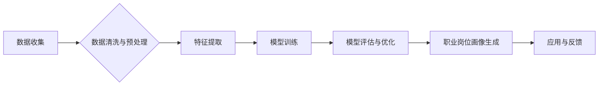

> 大数据、职业画像、机器学习、数据挖掘、人工智能、数据分析、人才培养

## 1. 背景介绍

随着大数据时代的到来，海量数据涌现，蕴藏着丰富的职业信息和人才趋势。传统的职业规划和人才培养模式面临着新的挑战，需要借助大数据技术挖掘职业画像，精准匹配人才与岗位，实现人才资源的优化配置。

基于大数据技术的职业岗位画像设计与实现，是指利用大数据技术手段，从海量职业数据中挖掘和分析职业特征、技能需求、发展趋势等信息，构建职业岗位画像模型，为职业规划、人才培养、招聘筛选等提供数据支撑。

## 2. 核心概念与联系

**2.1 职业画像**

职业画像是指对特定职业的综合描述，包括职业概况、技能要求、工作环境、职业发展路径等方面的信息。

**2.2 大数据**

大数据是指规模庞大、结构复杂、更新速度快、类型多样化的数据。

**2.3 数据挖掘**

数据挖掘是指从大数据中发现隐藏的模式、规律和知识的过程。

**2.4 机器学习**

机器学习是指利用算法训练模型，使模型能够从数据中学习，并对新数据进行预测或分类的过程。

**2.5 人工智能**

人工智能是指模拟人类智能行为的计算机系统。

**2.6 职业岗位画像设计与实现流程**



## 3. 核心算法原理 & 具体操作步骤

**3.1 算法原理概述**

基于大数据技术的职业岗位画像设计与实现主要采用以下算法：

* **数据挖掘算法:** 用于从海量职业数据中挖掘职业特征、技能需求、发展趋势等信息。常见的算法包括关联规则挖掘、聚类分析、分类算法等。
* **机器学习算法:** 用于构建职业岗位画像模型，并对新数据进行预测或分类。常见的算法包括支持向量机、决策树、神经网络等。

**3.2 算法步骤详解**

1. **数据收集:** 收集来自各种渠道的职业数据，例如招聘网站、职业测评平台、行业报告、社会调查等。
2. **数据清洗与预处理:** 对收集到的数据进行清洗、格式化、标准化等处理，去除噪声数据、缺失值等，确保数据质量。
3. **特征提取:** 从职业数据中提取关键特征，例如职业名称、技能要求、工作经验、学历要求、薪资水平等。
4. **模型训练:** 利用机器学习算法对提取的特征进行训练，构建职业岗位画像模型。
5. **模型评估与优化:** 对训练好的模型进行评估，并根据评估结果进行优化，提高模型的准确性和可靠性。
6. **职业岗位画像生成:** 利用训练好的模型对新数据进行预测或分类，生成职业岗位画像。

**3.3 算法优缺点**

* **优点:**

    * 可以从海量数据中挖掘出隐藏的职业信息和人才趋势。
    * 可以构建精准的职业岗位画像模型，为职业规划、人才培养、招聘筛选等提供数据支撑。
    * 可以帮助企业更好地了解人才需求，制定更有效的招聘策略。

* **缺点:**

    * 需要大量的职业数据作为训练样本，数据质量直接影响模型的准确性。
    * 模型训练需要消耗大量的计算资源和时间。
    * 模型的解释性较差，难以理解模型的决策过程。

**3.4 算法应用领域**

* **职业规划:** 为个人提供个性化的职业建议，帮助他们选择适合自己的职业发展路径。
* **人才培养:** 为教育机构和企业提供人才培养方案，培养符合市场需求的专业人才。
* **招聘筛选:** 为企业提供精准的人才筛选工具，提高招聘效率。
* **职业发展:** 为职业者提供职业发展建议，帮助他们提升职业竞争力。

## 4. 数学模型和公式 & 详细讲解 & 举例说明

**4.1 数学模型构建**

职业岗位画像模型可以采用多种数学模型构建，例如：

* **向量空间模型:** 将职业和人才表示为向量，通过向量之间的相似度计算职业匹配度。
* **聚类模型:** 将职业按照相似性进行聚类，形成不同的职业类别。
* **神经网络模型:** 利用神经网络学习职业特征和人才特征之间的关系，构建更复杂的职业岗位画像模型。

**4.2 公式推导过程**

例如，使用向量空间模型构建职业岗位画像模型，可以采用余弦相似度公式计算职业匹配度：

$$
\text{相似度} = \frac{\mathbf{p} \cdot \mathbf{q}}{\|\mathbf{p}\| \|\mathbf{q}\|}
$$

其中：

* $\mathbf{p}$ 表示职业向量
* $\mathbf{q}$ 表示人才向量
* $\cdot$ 表示向量点积
* $\|\mathbf{p}\|$ 和 $\|\mathbf{q}\|$ 分别表示向量 $\mathbf{p}$ 和 $\mathbf{q}$ 的模长

**4.3 案例分析与讲解**

假设我们有一个职业向量 $\mathbf{p} = [0.8, 0.5, 0.2]$，代表软件工程师职业，另一个人才向量 $\mathbf{q} = [0.7, 0.6, 0.3]$，代表一位软件开发人员。

使用余弦相似度公式计算职业匹配度：

$$
\text{相似度} = \frac{[0.8, 0.5, 0.2] \cdot [0.7, 0.6, 0.3]}{\sqrt{0.8^2 + 0.5^2 + 0.2^2} \sqrt{0.7^2 + 0.6^2 + 0.3^2}} \approx 0.85
$$

结果表明，软件工程师职业与软件开发人员的匹配度较高。

## 5. 项目实践：代码实例和详细解释说明

**5.1 开发环境搭建**

* 操作系统: Ubuntu 20.04
* Python 版本: 3.8
* 必要的库: pandas, numpy, scikit-learn, matplotlib

**5.2 源代码详细实现**

```python
import pandas as pd
from sklearn.feature_extraction.text import TfidfVectorizer
from sklearn.metrics.pairwise import cosine_similarity

# 加载职业数据
data = pd.read_csv('job_data.csv')

# 数据预处理
# ...

# 特征提取
vectorizer = TfidfVectorizer()
tfidf_matrix = vectorizer.fit_transform(data['job_description'])

# 计算职业相似度
cosine_similarities = cosine_similarity(tfidf_matrix, tfidf_matrix)

# 打印相似度矩阵
print(cosine_similarities)

# 根据相似度进行职业匹配
# ...
```

**5.3 代码解读与分析**

* 使用 pandas 库加载职业数据。
* 使用 TfidfVectorizer 将职业描述文本转换为 TF-IDF 向量，用于计算职业相似度。
* 使用 cosine_similarity 函数计算职业之间的余弦相似度。
* 打印相似度矩阵，可以直观地看到不同职业之间的相似度。
* 根据相似度进行职业匹配，例如，可以将相似度最高的职业推荐给用户。

**5.4 运行结果展示**

运行代码后，会输出一个相似度矩阵，其中每个元素代表两个职业之间的相似度。

## 6. 实际应用场景

**6.1 职业规划平台**

基于大数据技术的职业岗位画像设计与实现可以为职业规划平台提供数据支撑，帮助用户进行个性化的职业规划。

**6.2 人才招聘平台**

招聘平台可以利用职业岗位画像模型，精准匹配人才与岗位，提高招聘效率。

**6.3 教育机构**

教育机构可以利用职业岗位画像模型，了解市场对不同专业人才的需求，制定更有效的教学计划和人才培养方案。

**6.4 企业人力资源管理**

企业可以利用职业岗位画像模型，进行人才储备、职业发展规划、薪酬管理等方面的工作。

**6.5 未来应用展望**

随着大数据技术的不断发展，基于大数据技术的职业岗位画像设计与实现将会有更广泛的应用场景，例如：

* **个性化学习推荐:** 根据用户的职业画像，推荐个性化的学习资源和课程。
* **职业生涯规划:** 为用户提供全面的职业生涯规划建议，帮助他们实现职业目标。
* **人才市场预测:** 利用大数据分析预测未来人才市场需求，为企业和个人提供决策参考。

## 7. 工具和资源推荐

**7.1 学习资源推荐**

* **书籍:**
    * 《大数据挖掘》
    * 《机器学习》
    * 《数据科学》
* **在线课程:**
    * Coursera: 数据科学、机器学习
    * edX: 数据分析、大数据

**7.2 开发工具推荐**

* **Python:** 数据分析、机器学习
* **R:** 数据可视化、统计分析
* **Hadoop:** 大数据处理平台
* **Spark:** 大数据计算框架

**7.3 相关论文推荐**

* **基于大数据技术的职业画像构建研究**
* **机器学习在职业规划中的应用**
* **大数据分析在人才市场预测中的应用**

## 8. 总结：未来发展趋势与挑战

**8.1 研究成果总结**

基于大数据技术的职业岗位画像设计与实现取得了显著成果，为职业规划、人才培养、招聘筛选等领域提供了新的思路和方法。

**8.2 未来发展趋势**

* **模型更加精准:** 利用更先进的机器学习算法和深度学习技术，构建更加精准的职业岗位画像模型。
* **应用场景更加广泛:** 将职业岗位画像技术应用到更多领域，例如个性化学习推荐、职业生涯规划等。
* **数据更加丰富:** 收集更加丰富的数据，例如社交网络数据、行为数据等，构建更加全面的职业画像。

**8.3 面临的挑战**

* **数据质量问题:** 大数据中的数据质量参差不齐，需要进行有效的清洗和预处理。
* **模型解释性问题:** 许多机器学习模型的决策过程难以解释，需要研究更可解释的模型。
* **伦理问题:** 职业岗位画像技术可能会带来一些伦理问题，例如数据隐私、算法偏见等，需要进行充分的伦理思考和规范。

**8.4 研究展望**

未来，我们将继续致力于基于大数据技术的职业岗位画像设计与实现的研究，探索更精准、更智能、更可解释的职业画像模型，为职业规划、人才培养、招聘筛选等领域提供更有效的解决方案。

## 9. 附录：常见问题与解答

**9.1 如何收集职业数据？**

可以从以下渠道收集职业数据：

* 招聘网站
* 职业测评平台
* 行业报告
* 社会调查

**9.2 如何处理职业数据中的缺失值？**

可以采用以下方法处理职业数据中的缺失值：

* 删除含有缺失值的样本
* 使用均值、中位数等方法填充缺失值
* 使用机器学习算法进行缺失值预测

**9.3 如何评估职业岗位画像模型的准确性？**

可以使用以下指标评估职业岗位画像模型的准确性：

* 准确率
* 召回率
* F1-score
* AUC

**9.4 如何解决职业岗位画像模型的算法偏见问题？**

可以采用以下方法解决职业岗位画像模型的算法偏见问题：

* 使用更加公平的数据集进行训练
* 使用算法公平性评估指标
* 对模型进行调优，减少偏见


作者：禅与计算机程序设计艺术 / Zen and the Art of Computer Programming 
<end_of_turn>