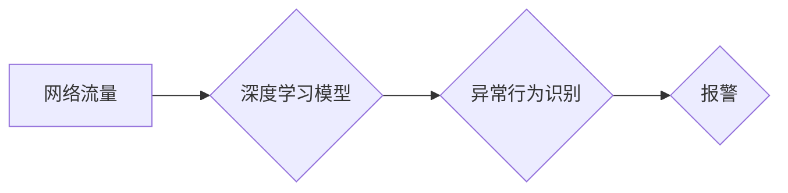

> 深度学习，入侵检测系统，网络安全，卷积神经网络，循环神经网络，异常检测

## 1. 背景介绍

随着互联网的快速发展和数字化转型进程的加速，网络安全问题日益突出。网络攻击手段日益复杂，传统的入侵检测系统（IDS）难以有效应对新兴的攻击威胁。深度学习作为一种强大的机器学习技术，凭借其强大的特征提取能力和自学习能力，在网络安全领域展现出巨大的应用潜力。基于深度学习的入侵检测系统能够更有效地识别和防御各种类型的网络攻击。

传统的入侵检测系统主要依赖于规则匹配和特征工程，需要人工定义大量的规则和特征，且难以适应新的攻击模式。而深度学习模型能够自动学习网络流量中的特征，并识别出异常行为，从而实现更智能、更灵活的入侵检测。

## 2. 核心概念与联系

### 2.1 深度学习

深度学习是一种机器学习的子领域，它利用多层神经网络来模拟人类大脑的学习过程。深度学习模型能够从海量数据中自动学习复杂的特征，并进行精准的分类、识别和预测。

### 2.2 入侵检测系统

入侵检测系统（IDS）是一种用于检测网络攻击的系统。它可以监控网络流量，识别出异常行为，并发出警报。IDS可以分为以下两种类型：

* **基于规则的IDS:** 这种IDS基于预先定义的规则来检测攻击。
* **基于机器学习的IDS:** 这种IDS利用机器学习算法来识别攻击。

### 2.3 深度学习与入侵检测系统的结合

深度学习技术为入侵检测系统带来了新的发展机遇。深度学习模型能够自动学习网络流量中的特征，并识别出异常行为，从而实现更智能、更灵活的入侵检测。

**Mermaid 流程图**



## 3. 核心算法原理 & 具体操作步骤

### 3.1 算法原理概述

基于深度学习的入侵检测系统通常采用以下几种算法：

* **卷积神经网络（CNN）:** CNN擅长于提取图像和序列数据中的特征，可以有效地识别网络流量中的模式和异常行为。
* **循环神经网络（RNN）:** RNN能够处理序列数据，可以学习网络流量的时间依赖关系，识别出攻击行为的演变趋势。
* **长短期记忆网络（LSTM）:** LSTM是一种改进的RNN，能够更好地处理长序列数据，更有效地识别复杂的攻击行为。

### 3.2 算法步骤详解

**以CNN为例，详细说明其在入侵检测系统中的应用步骤：**

1. **数据预处理:** 将网络流量数据转换为适合CNN输入的格式，例如将流量数据转换为特征向量或图像。
2. **模型构建:** 设计CNN模型结构，包括卷积层、池化层、全连接层等。
3. **模型训练:** 使用训练数据训练CNN模型，调整模型参数，使模型能够准确识别攻击行为。
4. **模型评估:** 使用测试数据评估模型的性能，例如准确率、召回率、F1-score等。
5. **模型部署:** 将训练好的模型部署到生产环境中，用于实时检测网络攻击。

### 3.3 算法优缺点

**CNN的优点:**

* 能够自动学习网络流量中的特征，无需人工特征工程。
* 能够识别出复杂的攻击模式。
* 具有较高的识别准确率。

**CNN的缺点:**

* 训练数据量较大，需要大量的网络流量数据进行训练。
* 计算复杂度较高，需要强大的计算资源。

### 3.4 算法应用领域

深度学习算法在网络安全领域有着广泛的应用，例如：

* **入侵检测:** 识别网络攻击行为，例如DDoS攻击、SQL注入攻击等。
* **恶意软件检测:** 识别恶意软件，例如病毒、木马等。
* **网络钓鱼攻击检测:** 识别网络钓鱼攻击，例如伪造网站、钓鱼邮件等。
* **数据泄露检测:** 检测数据泄露行为，例如敏感信息泄露、数据窃取等。

## 4. 数学模型和公式 & 详细讲解 & 举例说明

### 4.1 数学模型构建

深度学习模型的数学模型通常基于神经网络的结构和激活函数。

**神经网络结构:**

神经网络由多个层组成，每层包含多个神经元。神经元之间通过权重连接，权重决定了神经元之间的传递强度。

**激活函数:**

激活函数用于将神经元的输入转换为输出，并引入非线性特性。常见的激活函数包括ReLU、Sigmoid、Tanh等。

**损失函数:**

损失函数用于衡量模型预测结果与真实结果之间的差异。常见的损失函数包括交叉熵损失、均方误差损失等。

**优化算法:**

优化算法用于更新模型参数，使模型的损失函数最小化。常见的优化算法包括梯度下降、Adam等。

### 4.2 公式推导过程

**举例说明：**

**ReLU激活函数的公式:**

$$
f(x) = max(0, x)
$$

**交叉熵损失函数的公式:**

$$
L = - \sum_{i=1}^{N} y_i \log(\hat{y}_i)
$$

其中：

* $y_i$ 是真实标签
* $\hat{y}_i$ 是模型预测的概率

### 4.3 案例分析与讲解

**举例说明：**

**使用CNN进行网络流量入侵检测:**

1. 将网络流量数据转换为图像格式，例如将流量特征转换为像素值。
2. 使用CNN模型提取图像特征，例如使用卷积层和池化层提取特征。
3. 使用全连接层进行分类，将特征映射到不同的攻击类别。
4. 使用交叉熵损失函数和Adam优化算法训练模型。
5. 使用测试数据评估模型的性能。

## 5. 项目实践：代码实例和详细解释说明

### 5.1 开发环境搭建

* 操作系统：Ubuntu 20.04
* Python版本：3.8
* 深度学习框架：TensorFlow 2.0

### 5.2 源代码详细实现

```python
import tensorflow as tf

# 定义CNN模型
model = tf.keras.models.Sequential([
    tf.keras.layers.Conv1D(filters=32, kernel_size=3, activation='relu', input_shape=(100, 1)),
    tf.keras.layers.MaxPooling1D(pool_size=2),
    tf.keras.layers.Conv1D(filters=64, kernel_size=3, activation='relu'),
    tf.keras.layers.MaxPooling1D(pool_size=2),
    tf.keras.layers.Flatten(),
    tf.keras.layers.Dense(10, activation='softmax')
])

# 编译模型
model.compile(optimizer='adam',
              loss='sparse_categorical_crossentropy',
              metrics=['accuracy'])

# 训练模型
model.fit(x_train, y_train, epochs=10)

# 评估模型
loss, accuracy = model.evaluate(x_test, y_test)
print('Loss:', loss)
print('Accuracy:', accuracy)
```

### 5.3 代码解读与分析

* **模型定义:** 使用`tf.keras.models.Sequential`定义一个顺序模型，包含卷积层、池化层、全连接层等。
* **模型编译:** 使用`model.compile`编译模型，指定优化器、损失函数和评价指标。
* **模型训练:** 使用`model.fit`训练模型，传入训练数据和训练轮数。
* **模型评估:** 使用`model.evaluate`评估模型，传入测试数据和真实标签。

### 5.4 运行结果展示

训练完成后，可以查看模型的训练损失和准确率曲线，以及测试集的损失和准确率。

## 6. 实际应用场景

### 6.1 军事领域

* **网络安全防护:** 识别敌方网络攻击，保护军事网络和信息系统安全。
* **战场态势感知:** 分析网络流量数据，识别敌方行动和部署情况，辅助战场态势判断。

### 6.2 金融领域

* **欺诈检测:** 识别信用卡欺诈、网络银行欺诈等金融犯罪行为。
* **风险控制:** 分析客户交易行为，识别潜在的风险，进行风险控制和预警。

### 6.3 医疗领域

* **医疗数据安全:** 保护患者隐私信息，防止医疗数据泄露。
* **疾病诊断:** 分析患者医疗数据，辅助医生进行疾病诊断。

### 6.4 未来应用展望

随着深度学习技术的不断发展，基于深度学习的入侵检测系统将有更广泛的应用场景，例如：

* **工业控制系统安全:** 保护工业控制系统免受网络攻击，防止工业事故发生。
* **物联网安全:** 保护物联网设备免受网络攻击，确保物联网系统的安全可靠运行。
* **自动驾驶安全:** 检测自动驾驶车辆周围的潜在威胁，保障自动驾驶系统的安全。

## 7. 工具和资源推荐

### 7.1 学习资源推荐

* **书籍:**
    * 深度学习
    * 深度学习实战
* **在线课程:**
    * Coursera 深度学习课程
    * Udacity 深度学习工程师 Nanodegree

### 7.2 开发工具推荐

* **深度学习框架:** TensorFlow, PyTorch, Keras
* **数据处理工具:** Pandas, NumPy
* **可视化工具:** Matplotlib, Seaborn

### 7.3 相关论文推荐

* **深度学习在网络安全中的应用:**
    * Deep Learning for Intrusion Detection: A Survey
    * A Survey on Deep Learning for Network Intrusion Detection

## 8. 总结：未来发展趋势与挑战

### 8.1 研究成果总结

基于深度学习的入侵检测系统取得了显著的成果，在识别网络攻击方面表现出优异的性能。

### 8.2 未来发展趋势

* **模型的自动化设计和优化:** 利用自动化机器学习技术，自动设计和优化深度学习模型，提高模型的性能和效率。
* **多模态数据融合:** 将网络流量数据与其他数据类型（例如日志数据、系统监控数据）进行融合，提高入侵检测的准确率和鲁棒性。
* **联邦学习:** 利用联邦学习技术，在不泄露敏感数据的情况下，训练共享的入侵检测模型，提高模型的泛化能力。

### 8.3 面临的挑战

* **数据标注问题:** 深度学习模型需要大量的标注数据进行训练，数据标注成本高，且标注质量难以保证。
* **模型解释性问题:** 深度学习模型的决策过程难以解释，难以理解模型的决策依据，这不利于模型的信任和应用。
* **模型的安全性问题:** 深度学习模型可能存在攻击漏洞，攻击者可以利用这些漏洞，攻击模型，导致模型的性能下降甚至失效。

### 8.4 研究展望

未来，基于深度学习的入侵检测系统将继续朝着更智能、更安全、更可靠的方向发展。研究者将继续探索新的算法、新的模型架构、新的数据融合方法，以应对网络安全不断变化的挑战。

## 9. 附录：常见问题与解答

**常见问题:**

* **深度学习模型需要多少数据才能训练？**

**解答:** 深度学习模型需要大量的训练数据，数据量通常以百万甚至亿级别计。

* **如何评估深度学习模型的性能？**

**解答:** 深度学习模型的性能通常使用准确率、召回率、F1-score等指标进行评估。

* **如何解决深度学习模型的过拟合问题？**

**解答:** 可以使用正则化技术、数据增强、交叉验证等方法来解决深度学习模型的过拟合问题。

作者：禅与计算机程序设计艺术 / Zen and the Art of Computer Programming


<end_of_turn>