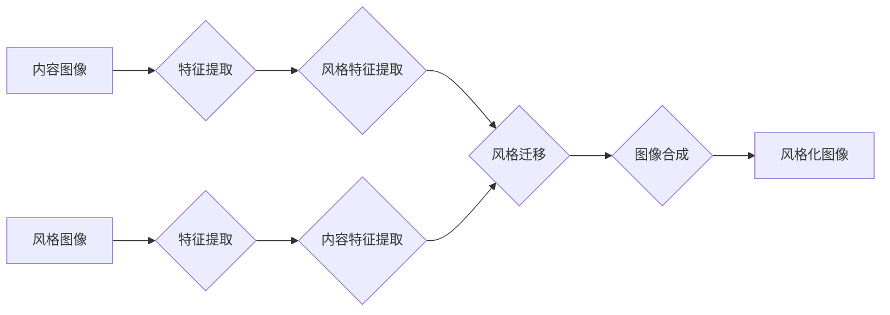

> 深度学习，图片风格转化，卷积神经网络，生成对抗网络，VGG网络，神经风格化

## 1. 背景介绍

图片风格转化技术近年来备受关注，它能够将一张图片的内容与另一张图片的风格融合在一起，生成具有独特艺术感的图像。这种技术在艺术创作、图像编辑、电影特效等领域有着广泛的应用前景。传统的图片风格转化方法主要依赖于手工设计的特征提取和风格迁移算法，效率较低，效果也难以令人满意。

随着深度学习技术的快速发展，基于深度学习的图片风格转化方法取得了显著的进展。这些方法利用深度神经网络强大的特征学习能力，能够自动提取图像的语义信息和风格特征，并进行有效的风格迁移。

## 2. 核心概念与联系

图片风格转化本质上是将一张图片的内容与另一张图片的风格进行融合。

**核心概念：**

* **内容图像:** 需要保留其内容信息的图像。
* **风格图像:** 提供风格信息的图像，例如绘画风格、摄影风格等。
* **风格特征:**  图像的艺术风格特征，例如颜色、纹理、构图等。
* **内容特征:**  图像的语义信息特征，例如物体、场景等。

**架构流程:**



## 3. 核心算法原理 & 具体操作步骤

### 3.1  算法原理概述

基于深度学习的图片风格转化算法主要基于生成对抗网络 (GAN) 和卷积神经网络 (CNN) 的原理。

* **生成对抗网络 (GAN):** GAN 由两个网络组成：生成器 (Generator) 和鉴别器 (Discriminator)。生成器试图生成逼真的图像，而鉴别器试图区分真实图像和生成图像。两者在对抗博弈中相互学习，最终生成器能够生成逼真的图像。
* **卷积神经网络 (CNN):** CNN 擅长提取图像的特征，可以学习到图像的语义信息和风格特征。

### 3.2  算法步骤详解

1. **特征提取:** 使用预训练的 CNN 模型 (例如 VGG 网络) 对内容图像和风格图像进行特征提取，得到不同层级的特征图。
2. **风格特征提取:** 从风格图像的特征图中提取风格特征，例如颜色分布、纹理特征等。
3. **内容特征提取:** 从内容图像的特征图中提取内容特征，例如物体、场景等。
4. **风格迁移:** 将风格特征与内容特征进行融合，生成风格化的特征图。
5. **图像合成:** 将风格化的特征图输入到解码器中，生成最终的风格化图像。

### 3.3  算法优缺点

**优点:**

* 效果逼真: 基于深度学习的图片风格转化算法能够生成更加逼真的风格化图像。
* 自动学习: 算法能够自动学习图像的风格特征和内容特征，无需人工设计特征。
* 可定制性强: 可以通过调整算法参数来控制风格化的程度。

**缺点:**

* 计算量大: 训练和运行深度学习模型需要大量的计算资源。
* 训练复杂: 训练深度学习模型需要专业的知识和经验。

### 3.4  算法应用领域

* **艺术创作:** 生成具有独特艺术风格的图像。
* **图像编辑:** 将照片风格化，例如将照片转换为油画风格。
* **电影特效:** 生成具有特定风格的场景和人物。
* **游戏开发:** 为游戏角色和场景添加风格化的效果。

## 4. 数学模型和公式 & 详细讲解 & 举例说明

### 4.1  数学模型构建

图片风格转化算法的核心是将风格特征与内容特征进行融合。常用的融合方法包括：

* **Gram矩阵:** Gram矩阵可以用来衡量特征图的协方差，从而提取图像的风格特征。

* **损失函数:** 损失函数用于衡量风格化图像与目标图像之间的差异。常用的损失函数包括：

    * **内容损失函数:** 衡量风格化图像与内容图像的特征图之间的差异。
    * **风格损失函数:** 衡量风格化图像与风格图像的特征图之间的差异。

### 4.2  公式推导过程

**Gram矩阵:**

对于特征图 $F$，其 Gram矩阵 $G$ 定义为：

$$G = F^T F$$

其中 $F^T$ 表示 $F$ 的转置。

**内容损失函数:**

$$L_{content} = \frac{1}{N} \sum_{i=1}^{N} ||F_{content,i} - F_{generated,i}||^2$$

其中 $F_{content,i}$ 和 $F_{generated,i}$ 分别表示内容图像和风格化图像的第 $i$ 层特征图。

**风格损失函数:**

$$L_{style} = \frac{1}{N} \sum_{i=1}^{N} ||G_{style,i} - G_{generated,i}||^2$$

其中 $G_{style,i}$ 和 $G_{generated,i}$ 分别表示风格图像和风格化图像的第 $i$ 层 Gram矩阵。

### 4.3  案例分析与讲解

假设我们想要将一张风景照片风格化为梵高的绘画风格。

1. 我们选择一张风景照片作为内容图像，一张梵高的绘画作品作为风格图像。
2. 使用预训练的 VGG 网络提取两张图像的特征图。
3. 从风格图像的特征图中提取风格特征，例如颜色分布、笔触等。
4. 将风格特征与内容图像的特征图进行融合，生成风格化的特征图。
5. 将风格化的特征图输入到解码器中，生成最终的风格化图像。

## 5. 项目实践：代码实例和详细解释说明

### 5.1  开发环境搭建

* Python 3.6+
* TensorFlow 或 PyTorch
* CUDA 和 cuDNN (可选)

### 5.2  源代码详细实现

```python
import tensorflow as tf

# 定义生成器网络
def generator(input_tensor):
    # ...

# 定义鉴别器网络
def discriminator(input_tensor):
    # ...

# 定义损失函数
def loss_function(generated_image, real_image, style_image):
    # ...

# 训练循环
for epoch in range(num_epochs):
    # ...

```

### 5.3  代码解读与分析

* **生成器网络:** 生成器网络负责生成风格化的图像。
* **鉴别器网络:** 鉴别器网络负责区分真实图像和生成图像。
* **损失函数:** 损失函数用于衡量生成图像与真实图像和风格图像之间的差异。
* **训练循环:** 训练循环中，生成器和鉴别器网络在对抗博弈中相互学习，最终生成器能够生成逼真的风格化图像。

### 5.4  运行结果展示

运行代码后，可以生成具有特定风格的图像。

## 6. 实际应用场景

### 6.1  艺术创作

* 生成具有独特艺术风格的图像。
* 为艺术作品添加新的风格元素。

### 6.2  图像编辑

* 将照片风格化，例如将照片转换为油画风格。
* 为图像添加艺术滤镜。

### 6.3  电影特效

* 生成具有特定风格的场景和人物。
* 为电影添加视觉效果。

### 6.4  未来应用展望

* **个性化风格化:** 根据用户的喜好生成个性化的风格化图像。
* **跨媒体风格化:** 将风格从图像迁移到其他媒体，例如音频、视频等。
* **风格迁移控制:** 更加精细地控制风格迁移的程度和方向。

## 7. 工具和资源推荐

### 7.1  学习资源推荐

* **论文:**

    * Gatys et al. (2015). Image Style Transfer Using Convolutional Neural Networks.
    * Johnson et al. (2016). Perceptual Losses for Real-Time Style Transfer and Super-Resolution.

* **博客:**

    * https://blog.paperspace.com/neural-style-transfer-tutorial/
    * https://towardsdatascience.com/neural-style-transfer-with-tensorflow-and-keras-a-practical-guide-59979991979c

### 7.2  开发工具推荐

* **TensorFlow:** https://www.tensorflow.org/
* **PyTorch:** https://pytorch.org/

### 7.3  相关论文推荐

* **Deep Neural Networks for Image Style Transfer**
* **Neural Style Transfer**
* **Perceptual Losses for Real-Time Style Transfer and Super-Resolution**

## 8. 总结：未来发展趋势与挑战

### 8.1  研究成果总结

基于深度学习的图片风格转化技术取得了显著的进展，能够生成逼真的风格化图像，并应用于多个领域。

### 8.2  未来发展趋势

* **更精细的风格控制:** 能够更加精细地控制风格迁移的程度和方向。
* **跨媒体风格化:** 将风格从图像迁移到其他媒体，例如音频、视频等。
* **个性化风格化:** 根据用户的喜好生成个性化的风格化图像。

### 8.3  面临的挑战

* **计算资源:** 训练和运行深度学习模型需要大量的计算资源。
* **训练复杂度:** 训练深度学习模型需要专业的知识和经验。
* **风格迁移质量:** 某些情况下，风格化图像可能存在失真或不自然的情况。

### 8.4  研究展望

未来，我们将继续研究更有效、更灵活的图片风格转化算法，并将其应用于更多领域。

## 9. 附录：常见问题与解答

* **Q: 如何选择合适的风格图像？**

* **A:** 选择与内容图像风格相似的风格图像，可以获得更好的风格化效果。

* **Q: 如何控制风格迁移的程度？**

* **A:** 可以通过调整风格损失函数的权重来控制风格迁移的程度。

* **Q: 如何解决风格化图像失真或不自然的问题？**

* **A:** 可以尝试使用更先进的算法，或者调整训练参数。


作者：禅与计算机程序设计艺术 / Zen and the Art of Computer Programming 
<end_of_turn>