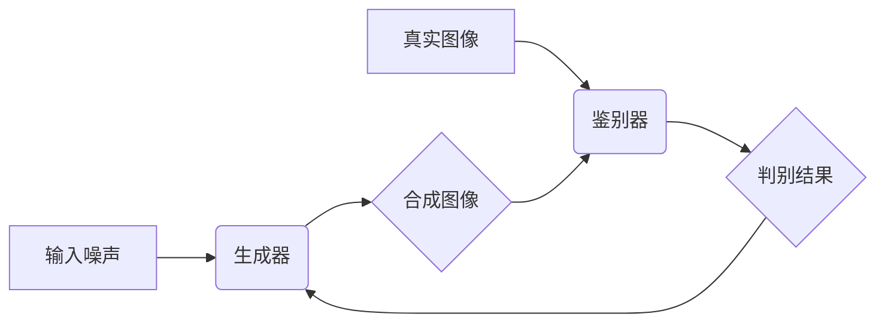

> 生成对抗网络(GAN)，艺术品仿真，风格迁移，深度学习，图像生成

## 1. 背景介绍

艺术创作一直是人类文明的重要组成部分，它承载着人们对美的追求和对世界的理解。随着人工智能技术的快速发展，深度学习算法在图像生成领域取得了突破性进展，为艺术创作带来了新的可能性。其中，生成对抗网络（Generative Adversarial Networks，GAN）作为一种强大的生成模型，在艺术品仿真和风格迁移方面展现出巨大的潜力。

传统的艺术品仿真方法主要依赖于规则和经验，难以捕捉到艺术作品的复杂性和多样性。而GAN通过对抗机制，使得生成器能够学习到真实艺术作品的特征，并生成逼真的艺术作品。风格迁移技术则可以将一种艺术风格迁移到另一幅图像上，创造出具有独特风格的艺术作品。

## 2. 核心概念与联系

### 2.1 生成对抗网络 (GAN)

GAN由两个神经网络组成：生成器 (Generator) 和鉴别器 (Discriminator)。生成器负责生成新的数据样本，而鉴别器负责判断样本的真实性。两者在对抗游戏中相互博弈，生成器不断改进生成样本的质量，而鉴别器则不断提高识别真实样本的能力。

**GAN 架构流程图:**



### 2.2 艺术品仿真与风格迁移

**艺术品仿真**是指利用GAN生成与真实艺术作品风格相似的图像。

**风格迁移**是指将一种艺术风格迁移到另一幅图像上，例如将梵高的风格迁移到一张风景照片上。

GAN在艺术品仿真和风格迁移方面具有以下优势：

* **生成逼真的图像:** GAN能够学习到真实艺术作品的特征，生成逼真的艺术作品。
* **灵活的风格控制:** 通过调整生成器的输入参数，可以控制生成的艺术作品的风格。
* **创意的艺术创作:** GAN为艺术家提供了新的创作工具，可以帮助他们探索新的艺术风格和表达方式。

## 3. 核心算法原理 & 具体操作步骤

### 3.1 算法原理概述

GAN的训练过程是一个迭代的过程，其中生成器和鉴别器不断相互博弈，最终达到一个平衡状态。

1. **生成器训练:** 生成器从随机噪声中生成图像样本，并将其输入到鉴别器中。
2. **鉴别器训练:** 鉴别器接收来自生成器和真实图像的样本，并判断样本的真实性。
3. **损失函数:** 生成器和鉴别器的训练目标是分别最小化和最大化损失函数。
4. **参数更新:** 根据损失函数的梯度，更新生成器和鉴别器的参数。

### 3.2 算法步骤详解

1. **初始化:** 初始化生成器和鉴别器的参数。
2. **生成样本:** 生成器从随机噪声中生成图像样本。
3. **判别样本:** 鉴别器接收来自生成器和真实图像的样本，并判断样本的真实性。
4. **计算损失:** 计算生成器和鉴别器的损失函数值。
5. **更新参数:** 根据损失函数的梯度，更新生成器和鉴别器的参数。
6. **重复步骤2-5:** 重复上述步骤，直到生成器生成的图像样本与真实图像样本难以区分。

### 3.3 算法优缺点

**优点:**

* 生成逼真的图像
* 灵活的风格控制
* 创意的艺术创作

**缺点:**

* 训练过程复杂
* 容易出现模式崩溃问题
* 难以控制生成的图像内容

### 3.4 算法应用领域

* **艺术品仿真:** 生成逼真的艺术作品，例如绘画、雕塑、音乐等。
* **风格迁移:** 将一种艺术风格迁移到另一幅图像上，例如将梵高的风格迁移到一张风景照片上。
* **图像增强:** 提高图像的清晰度、分辨率和色彩饱和度。
* **图像合成:** 合成新的图像，例如将多个图像合成一张新的图像。

## 4. 数学模型和公式 & 详细讲解 & 举例说明

### 4.1 数学模型构建

GAN的数学模型主要包括生成器和鉴别器的损失函数。

**生成器损失函数:**

$$
L_G(G, D) = E_{z \sim p_z(z)}[log(D(G(z)))]
$$

**鉴别器损失函数:**

$$
L_D(D, G) = E_{x \sim p_{data}(x)}[log(D(x))] + E_{z \sim p_z(z)}[log(1 - D(G(z)))]
$$

其中:

* $G$ 是生成器
* $D$ 是鉴别器
* $z$ 是随机噪声
* $x$ 是真实图像
* $p_z(z)$ 是随机噪声的分布
* $p_{data}(x)$ 是真实图像的分布

### 4.2 公式推导过程

生成器损失函数的目标是最大化鉴别器对生成图像的判别概率。鉴别器损失函数的目标是最大化对真实图像的判别概率，同时最小化对生成图像的判别概率。

### 4.3 案例分析与讲解

假设我们使用GAN生成一张猫的图像。

1. 生成器从随机噪声中生成一张猫的图像。
2. 鉴别器接收来自生成器和真实猫图像的样本，并判断样本的真实性。
3. 如果鉴别器认为生成的图像是真实的，则生成器损失函数的值会降低。
4. 如果鉴别器认为生成的图像不是真实的，则生成器损失函数的值会增加。
5. 生成器根据损失函数的梯度更新参数，生成更逼真的猫图像。
6. 这一过程重复进行，直到生成器生成的猫图像与真实猫图像难以区分。

## 5. 项目实践：代码实例和详细解释说明

### 5.1 开发环境搭建

* Python 3.6+
* TensorFlow/PyTorch
* CUDA (可选)

### 5.2 源代码详细实现

```python
# 生成器网络结构
class Generator(nn.Module):
    def __init__(self):
        super(Generator, self).__init__()
        # ...

    def forward(self, z):
        # ...

# 鉴别器网络结构
class Discriminator(nn.Module):
    def __init__(self):
        super(Discriminator, self).__init__()
        # ...

    def forward(self, x):
        # ...

# 训练GAN模型
def train(generator, discriminator, dataloader, epochs):
    # ...

# 生成图像
def generate_image(generator, noise):
    # ...
```

### 5.3 代码解读与分析

* 生成器网络结构负责从随机噪声中生成图像样本。
* 鉴别器网络结构负责判断图像样本的真实性。
* 训练函数负责训练生成器和鉴别器模型。
* 生成图像函数负责使用训练好的生成器模型生成图像样本。

### 5.4 运行结果展示

运行代码后，可以生成逼真的艺术作品或将一种艺术风格迁移到另一幅图像上。

## 6. 实际应用场景

### 6.1 艺术品仿真

* **博物馆展览:** 使用GAN生成古代艺术品的复制品，方便公众参观和研究。
* **艺术品拍卖:** 使用GAN生成艺术品的仿制品，用于拍卖前的展示和宣传。
* **艺术创作:** 为艺术家提供新的创作工具，帮助他们探索新的艺术风格和表达方式。

### 6.2 风格迁移

* **照片编辑:** 将照片的风格迁移到其他艺术风格，例如将照片转换为梵高的风格。
* **电影特效:** 使用风格迁移技术生成具有特定艺术风格的场景和人物。
* **游戏设计:** 为游戏角色和场景添加独特的艺术风格。

### 6.4 未来应用展望

* **个性化艺术创作:** 根据用户的喜好生成个性化的艺术作品。
* **跨文化艺术交流:** 将不同文化艺术风格进行融合和创作。
* **艺术教育:** 使用GAN辅助艺术教育，帮助学生学习和理解艺术作品。

## 7. 工具和资源推荐

### 7.1 学习资源推荐

* **书籍:**
    * 《Deep Learning》 by Ian Goodfellow, Yoshua Bengio, and Aaron Courville
    * 《Generative Deep Learning》 by David Foster
* **在线课程:**
    * Coursera: Deep Learning Specialization
    * Udacity: Deep Learning Nanodegree

### 7.2 开发工具推荐

* **TensorFlow:** https://www.tensorflow.org/
* **PyTorch:** https://pytorch.org/
* **Keras:** https://keras.io/

### 7.3 相关论文推荐

* **Generative Adversarial Networks** by Ian Goodfellow et al. (2014)
* **Style Transfer Using Convolutional Neural Networks** by Leon A. Gatys et al. (2015)
* **Progressive Growing of GANs for Improved Quality, Stability, and Variation** by Tero Karras et al. (2017)

## 8. 总结：未来发展趋势与挑战

### 8.1 研究成果总结

GAN在艺术品仿真和风格迁移方面取得了显著的成果，能够生成逼真的艺术作品和实现灵活的风格控制。

### 8.2 未来发展趋势

* **更高质量的图像生成:** 研究更强大的GAN模型，生成更高质量、更逼真的图像。
* **更灵活的风格控制:** 研究更精细的风格控制方法，能够更精确地控制生成的图像风格。
* **更广泛的应用场景:** 将GAN应用到更多领域，例如虚拟现实、增强现实和游戏开发。

### 8.3 面临的挑战

* **模式崩溃问题:** GAN训练过程中容易出现模式崩溃问题，导致生成的图像缺乏多样性。
* **训练过程复杂:** GAN的训练过程复杂，需要大量的计算资源和时间。
* **伦理问题:** GAN生成的图像可能被用于恶意目的，例如生成虚假信息或进行身份盗窃。

### 8.4 研究展望

未来研究将集中在解决GAN的现有挑战，例如开发更稳定的训练算法、提高图像生成质量和多样性，以及探索GAN在更多领域的应用。

## 9. 附录：常见问题与解答

* **什么是GAN？**

GAN是一种生成模型，由生成器和鉴别器两个神经网络组成。

* **GAN的训练过程是如何进行的？**

GAN的训练过程是一个迭代的过程，其中生成器和鉴别器相互博弈，最终达到一个平衡状态。

* **GAN有哪些应用场景？**

GAN在艺术品仿真、风格迁移、图像增强、图像合成等领域都有广泛的应用。


作者：禅与计算机程序设计艺术 / Zen and the Art of Computer Programming 
<end_of_turn>