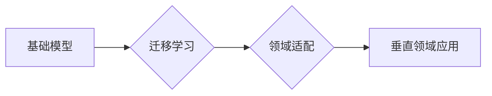

> 基础模型、垂直领域、迁移学习、领域适配、应用场景、案例分析

## 1. 背景介绍

近年来，大规模基础模型（Foundation Models）在自然语言处理、计算机视觉、语音识别等领域取得了突破性进展。这些模型通常在海量公共数据集上进行预训练，并能够泛化到各种下游任务。然而，基础模型在部署到特定垂直领域时，往往需要进行额外的适配和 fine-tuning，以提高其在该领域的表现。

垂直领域应用是指将基础模型应用于特定行业或领域的场景。例如，在医疗领域，可以利用基础模型进行疾病诊断、药物研发等；在金融领域，可以用于风险评估、欺诈检测等。垂直领域应用对模型的准确性、效率和安全性要求更高，因此需要针对特定领域的特点进行定制化开发。

## 2. 核心概念与联系

**2.1 基础模型**

基础模型是指在海量公共数据集上进行预训练的大规模模型，具有强大的泛化能力和可迁移性。常见的基础模型包括：

* **语言模型:** GPT-3、BERT、LaMDA 等
* **图像模型:** DALL-E 2、Stable Diffusion、Imagen 等
* **多模态模型:** CLIP、FLAN 等

**2.2 垂直领域**

垂直领域是指特定行业或领域的应用场景，例如医疗、金融、教育、制造等。每个领域都有其独特的业务需求、数据特点和应用场景。

**2.3 迁移学习**

迁移学习是指利用预训练模型在源任务上的知识迁移到目标任务，以提高目标任务的性能。在垂直领域应用中，迁移学习可以有效地减少领域适配所需的训练数据和时间。

**2.4 领域适配**

领域适配是指将基础模型调整到特定垂直领域的应用场景，使其能够更好地理解和处理该领域的数据和任务。领域适配的方法包括：

* **数据增强:** 通过对源数据进行变换和合成，增加数据的多样性和代表性。
* **领域特定特征提取:** 利用领域知识提取领域特定特征，并将其融入模型中。
* **微调:** 在目标领域的数据上对预训练模型进行微调，使其适应该领域的语义和结构。

**2.5 流程图**



## 3. 核心算法原理 & 具体操作步骤

### 3.1 算法原理概述

基础模型的垂直领域应用主要基于迁移学习和领域适配的原理。

* **迁移学习:** 利用预训练模型在源任务上的知识迁移到目标任务，减少目标任务的训练数据和时间。
* **领域适配:** 通过数据增强、领域特定特征提取和微调等方法，将基础模型调整到特定垂直领域的应用场景。

### 3.2 算法步骤详解

1. **选择合适的预训练模型:** 根据目标任务和领域特点，选择合适的预训练模型作为基础模型。
2. **数据预处理:** 对目标领域的数据进行预处理，包括清洗、格式化、标注等。
3. **迁移学习:** 利用预训练模型在源任务上的知识迁移到目标任务，可以采用特征提取、微调等方法。
4. **领域适配:** 对模型进行领域适配，可以采用数据增强、领域特定特征提取、微调等方法。
5. **模型评估:** 对适配后的模型进行评估，并根据评估结果进行调整和优化。

### 3.3 算法优缺点

**优点:**

* **提高效率:** 利用预训练模型可以减少训练数据和时间。
* **提升性能:** 迁移学习和领域适配可以提高模型在目标领域的性能。
* **降低成本:** 利用现有的预训练模型可以降低模型开发成本。

**缺点:**

* **数据依赖:** 迁移学习和领域适配需要目标领域的数据进行训练和适配。
* **模型复杂度:** 适配后的模型可能更加复杂，需要更多的计算资源。
* **领域特定性:** 适配后的模型可能只适用于特定的领域，难以泛化到其他领域。

### 3.4 算法应用领域

基础模型的垂直领域应用广泛，包括：

* **医疗:** 疾病诊断、药物研发、医疗影像分析
* **金融:** 风险评估、欺诈检测、客户服务
* **教育:** 个性化学习、智能辅导、自动批改
* **制造:** 质量控制、设备维护、生产优化
* **零售:** 商品推荐、客户服务、库存管理

## 4. 数学模型和公式 & 详细讲解 & 举例说明

### 4.1 数学模型构建

在迁移学习中，通常使用以下数学模型来表示模型的知识迁移过程：

* **源任务损失函数:** $L_s(θ_s, X_s, Y_s)$，其中 $θ_s$ 是源任务模型的参数， $X_s$ 是源任务数据， $Y_s$ 是源任务标签。
* **目标任务损失函数:** $L_t(θ_t, X_t, Y_t)$，其中 $θ_t$ 是目标任务模型的参数， $X_t$ 是目标任务数据， $Y_t$ 是目标任务标签。
* **知识迁移损失函数:** $L_k(θ_s, θ_t)$，用于衡量源任务模型和目标任务模型之间的知识差距。

### 4.2 公式推导过程

目标是找到最优的目标任务模型参数 $θ_t^*$，使得目标任务损失函数最小化，同时保持源任务模型的知识。

$$
θ_t^* = argmin_{θ_t} L_t(θ_t, X_t, Y_t) + λL_k(θ_s, θ_t)
$$

其中 $λ$ 是权重参数，用于平衡目标任务损失和知识迁移损失。

### 4.3 案例分析与讲解

例如，在医疗领域，可以使用预训练的语言模型进行疾病诊断。

* **源任务:** 使用公开的医疗文本数据进行预训练，训练一个语言模型。
* **目标任务:** 使用医院的病历数据进行微调，训练一个疾病诊断模型。
* **知识迁移损失函数:** 可以使用KL散度来衡量源任务模型和目标任务模型之间的知识差距。

## 5. 项目实践：代码实例和详细解释说明

### 5.1 开发环境搭建

* Python 3.7+
* PyTorch 1.7+
* CUDA 10.2+

### 5.2 源代码详细实现

```python
import torch
import torch.nn as nn

# 定义基础模型
class BaseModel(nn.Module):
    def __init__(self):
        super(BaseModel, self).__init__()
        # ... 模型结构定义 ...

    def forward(self, x):
        # ... 模型前向传播过程 ...

# 定义目标任务模型
class TargetModel(BaseModel):
    def __init__(self):
        super(TargetModel, self).__init__()
        # ... 目标任务模型结构定义 ...

# 加载预训练模型
pretrained_model = BaseModel.load_state_dict(torch.load("pretrained_model.pth"))

# 创建目标任务模型
target_model = TargetModel()
target_model.load_state_dict(pretrained_model)

# 微调目标任务模型
optimizer = torch.optim.Adam(target_model.parameters(), lr=0.001)
for epoch in range(num_epochs):
    # ... 训练循环 ...
    loss = ...
    optimizer.zero_grad()
    loss.backward()
    optimizer.step()

# 保存微调后的模型
torch.save(target_model.state_dict(), "fine_tuned_model.pth")
```

### 5.3 代码解读与分析

* 代码首先定义了基础模型和目标任务模型，并加载预训练模型的权重。
* 然后，创建目标任务模型，并使用预训练模型的权重进行初始化。
* 最后，使用微调方法训练目标任务模型，并保存微调后的模型。

### 5.4 运行结果展示

通过微调后的模型，可以实现更高的目标任务性能。

## 6. 实际应用场景

### 6.1 医疗领域

* **疾病诊断:** 利用预训练的语言模型，可以对患者的病历进行分析，辅助医生进行疾病诊断。
* **药物研发:** 利用预训练的分子结构模型，可以预测药物的活性，加速药物研发过程。
* **医疗影像分析:** 利用预训练的图像模型，可以对医疗影像进行分析，辅助医生进行诊断和治疗。

### 6.2 金融领域

* **风险评估:** 利用预训练的文本模型，可以分析客户的信用报告和交易记录，评估客户的风险等级。
* **欺诈检测:** 利用预训练的文本模型，可以识别欺诈交易，防止金融损失。
* **客户服务:** 利用预训练的对话模型，可以提供智能化的客户服务，提高客户体验。

### 6.3 教育领域

* **个性化学习:** 利用预训练的语言模型，可以根据学生的学习情况，提供个性化的学习内容和建议。
* **智能辅导:** 利用预训练的对话模型，可以提供智能化的学习辅导，帮助学生解决学习问题。
* **自动批改:** 利用预训练的文本模型，可以自动批改学生的作业，提高教师的工作效率。

### 6.4 未来应用展望

随着基础模型的不断发展和完善，其在垂直领域应用的场景将会更加广泛。例如，在未来，基础模型可以应用于：

* **智能制造:** 自动化生产流程、预测设备故障、优化生产效率。
* **智慧城市:** 智能交通管理、环境监测、公共安全保障。
* **个性化推荐:** 基于用户的兴趣和行为，提供个性化的商品、服务和内容推荐。

## 7. 工具和资源推荐

### 7.1 学习资源推荐

* **书籍:**
    * 《深度学习》
    * 《自然语言处理》
    * 《计算机视觉》
* **在线课程:**
    * Coursera
    * edX
    * Udacity

### 7.2 开发工具推荐

* **框架:** PyTorch、TensorFlow
* **库:** Hugging Face Transformers、OpenAI API
* **平台:** Google Colab、Kaggle

### 7.3 相关论文推荐

* **迁移学习:**
    * "Transfer Learning" by Pan and Yang (2010)
    * "Domain Adaptation" by Ben-David et al. (2010)
* **基础模型:**
    * "BERT: Pre-training of Deep Bidirectional Transformers for Language Understanding" by Devlin et al. (2018)
    * "GPT-3: Language Models are Few-Shot Learners" by Brown et al. (2020)

## 8. 总结：未来发展趋势与挑战

### 8.1 研究成果总结

基础模型的垂直领域应用取得了显著进展，在医疗、金融、教育等领域展现出巨大的潜力。迁移学习和领域适配技术为基础模型的应用提供了有效的方法。

### 8.2 未来发展趋势

* **模型规模和能力的提升:** 未来基础模型的规模和能力将会进一步提升，能够处理更复杂的任务和数据。
* **多模态模型的应用:** 多模态模型将更加广泛地应用于垂直领域，例如结合文本、图像、音频等多种数据进行分析和理解。
* **个性化模型的定制:** 基于用户需求，将定制化开发个性化的基础模型，提高模型的针对性和效率。

### 8.3 面临的挑战

* **数据隐私和安全:** 垂直领域数据通常包含敏感信息，需要解决数据隐私和安全问题。
* **模型解释性和可信度:** 基础模型的决策过程通常难以解释，需要提高模型的解释性和可信度。
* **模型公平性和偏见:** 基础模型可能存在公平性和偏见问题，需要进行公平性评估和缓解措施。

### 8.4 研究展望

未来研究将重点关注以下方面:

* **高效的领域适配方法:** 开发更有效、更鲁棒的领域适配方法，降低模型适配成本。
* **可解释性和可信度提升:** 研究基础模型的决策机制，提高模型的解释性和可信