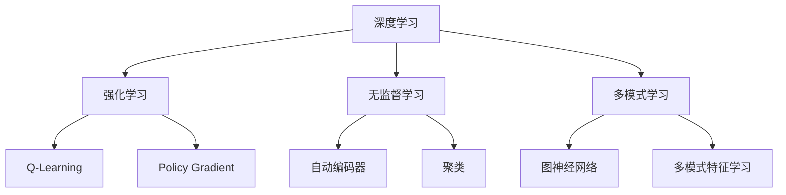

                 

**AI 2.0 时代的科技价值**

**作者：禅与计算机程序设计艺术 / Zen and the Art of Computer Programming**

## 1. 背景介绍

在人工智能（AI）领域，我们正处于一个转折点，从AI 1.0过渡到AI 2.0。AI 1.0主要关注于规则和逻辑，而AI 2.0则是一种更加智能化、自适应的系统，它能够学习、适应和进化。本文将探讨AI 2.0的核心概念、算法原理、数学模型，并提供项目实践和工具推荐，最后总结未来发展趋势和挑战。

## 2. 核心概念与联系

AI 2.0的核心概念包括深度学习、强化学习、无监督学习和多模式学习。这些概念是相互关联的，共同构成了AI 2.0的基础。



## 3. 核心算法原理 & 具体操作步骤

### 3.1 算法原理概述

AI 2.0的核心算法原理是学习。学习是指系统从数据中提取信息，并利用这些信息改进其性能的过程。学习算法可以分为三类：监督学习、无监督学习和强化学习。

### 3.2 算法步骤详解

1. **监督学习**：系统学习输入-输出映射，并预测新输入的输出。
2. **无监督学习**：系统学习输入数据的内在结构，无需输出标签。
3. **强化学习**：系统学习通过尝试和错误来改进其性能，并最大化一个回报函数。

### 3.3 算法优缺点

**优点**：AI 2.0算法能够适应新数据，自动学习特征，并提高预测精确度。

**缺点**：学习过程需要大量数据，计算复杂度高，且易受过拟合和数据偏差影响。

### 3.4 算法应用领域

AI 2.0算法广泛应用于图像识别、自然语言处理、自动驾驶、医疗诊断等领域。

## 4. 数学模型和公式 & 详细讲解 & 举例说明

### 4.1 数学模型构建

数学模型是学习算法的基础。例如，线性回归模型可以表示为：

$$y = wx + b$$

其中，$y$是输出，$x$是输入，$w$和$b$是模型参数。

### 4.2 公式推导过程

学习算法的目标是最小化误差函数。例如，在线性回归中，误差函数可以表示为：

$$E = \frac{1}{2}(y - wx - b)^2$$

学习过程就是寻找最小化误差函数的参数值。

### 4.3 案例分析与讲解

例如，在图像识别任务中，输入是图像特征向量，$y$是图像类别。学习算法从大量图像数据中学习参数$w$和$b$，并预测新图像的类别。

## 5. 项目实践：代码实例和详细解释说明

### 5.1 开发环境搭建

本项目使用Python和TensorFlow框架。请安装Python（3.6或更高版本）、TensorFlow（2.0或更高版本）和其他必要的库。

### 5.2 源代码详细实现

以下是一个简单的线性回归示例：

```python
import tensorflow as tf
import numpy as np

# 创建数据
x_train = np.linspace(-1, 1, 101)
y_train = 2 * x_train + np.random.randn(*x_train.shape) * 0.33

# 定义模型
W = tf.Variable(tf.random.normal([1]))
b = tf.Variable(tf.zeros([1]))
y = W * x_train + b

# 定义损失函数和优化器
loss = tf.reduce_mean(tf.square(y_train - y))
optimizer = tf.train.GradientDescentOptimizer(0.5)
train = optimizer.minimize(loss)

# 训练模型
for i in range(100):
    with tf.GradientTape() as tape:
        y = W * x_train + b
        loss = tf.reduce_mean(tf.square(y_train - y))
    gradients = tape.gradient(loss, [W, b])
    W.assign_sub(gradients[0] * 0.5)
    b.assign_sub(gradients[1] * 0.5)
```

### 5.3 代码解读与分析

代码首先创建输入数据$x\_train$和输出数据$y\_train$. 然后，它定义模型参数$W$和$b$, 并计算预测输出$y$. 接下来，它定义损失函数（均方误差）和优化器（梯度下降）。最后，它使用梯度下降优化模型参数。

### 5.4 运行结果展示

运行代码后，模型参数$W$和$b$将接近真实值$2$和$0$. 你可以绘制预测输出和真实输出，观察模型的拟合情况。

## 6. 实际应用场景

AI 2.0算法在各种领域都有实际应用。例如，在医疗领域，AI 2.0算法可以帮助医生诊断疾病，预测病情发展，并提供个性化治疗方案。在自动驾驶领域，AI 2.0算法可以帮助汽车感知环境，规划路径，并做出决策。

### 6.4 未来应用展望

未来，AI 2.0算法将继续发展，并应用于更多领域。例如，AI 2.0算法可以帮助解决复杂的工程问题，如设计最优结构或预测机器故障。此外，AI 2.0算法也将帮助我们理解和解决复杂的社会问题，如预测犯罪率或优化交通网络。

## 7. 工具和资源推荐

### 7.1 学习资源推荐

- **书籍**："Pattern Recognition and Machine Learning" by Christopher M. Bishop
- **在线课程**：Coursera的"Machine Learning"课程

### 7.2 开发工具推荐

- **编程语言**：Python
- **框架**：TensorFlow, PyTorch, Keras
- **开发环境**：Jupyter Notebook, Google Colab

### 7.3 相关论文推荐

- "Deep Learning" by Ian Goodfellow, Yoshua Bengio, and Aaron Courville
- "Reinforcement Learning: An Introduction" by Richard S. Sutton and Andrew G. Barto

## 8. 总结：未来发展趋势与挑战

### 8.1 研究成果总结

AI 2.0算法已经取得了显著的成果，在各种领域都有实际应用。然而，仍然有许多挑战需要解决。

### 8.2 未来发展趋势

未来，AI 2.0算法将继续发展，并应用于更多领域。此外，AI 2.0算法也将帮助我们理解和解决复杂的社会问题。

### 8.3 面临的挑战

**挑战1**：数据量和质量。AI 2.0算法需要大量高质量的数据，但获取这样的数据往往很困难。

**挑战2**：计算资源。AI 2.0算法往往需要大量计算资源，这限制了其应用范围。

**挑战3**：解释性。AI 2.0算法往往是黑箱，很难解释其决策过程。这限制了其在某些领域的应用，如医疗和司法。

### 8.4 研究展望

未来的研究将关注于提高AI 2.0算法的数据效率、计算效率和解释性。此外，研究也将关注于开发新的AI 2.0算法，并将其应用于新的领域。

## 9. 附录：常见问题与解答

**Q1**：AI 2.0算法需要大量数据吗？

**A1**：是的，AI 2.0算法需要大量数据来学习。然而，新的技术，如生成对抗网络（GAN），可以帮助我们生成新数据，并提高数据效率。

**Q2**：AI 2.0算法是否会取代人类？

**A2**：AI 2.0算法可以帮助我们完成许多任务，但它们不会取代人类。相反，它们将帮助我们提高效率，并解决复杂的问题。

**Q3**：AI 2.0算法是否安全？

**A3**：AI 2.0算法可能会面临安全挑战，如数据泄露和决策偏差。然而，新的技术，如联邦学习和差异隐私，可以帮助我们解决这些挑战。

**作者：禅与计算机程序设计艺术 / Zen and the Art of Computer Programming**

