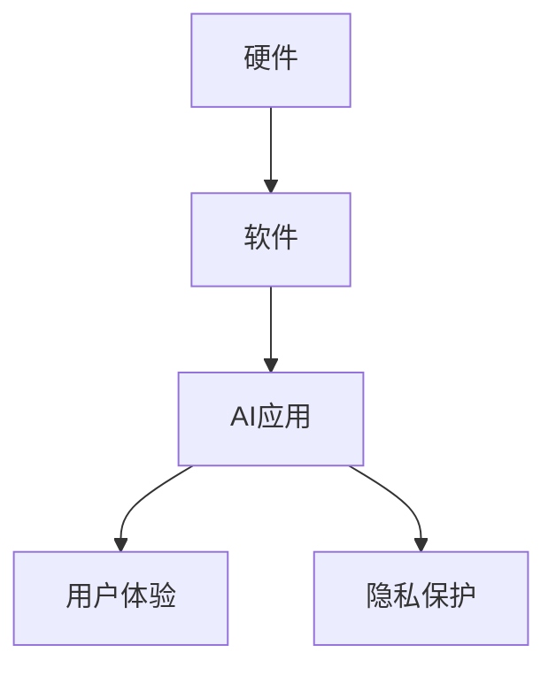

                 

**关键词：人工智能、AI应用、苹果、产业发展、算法、数据处理、隐私保护、未来趋势**

## 1. 背景介绍

在当今数字化转型的浪潮中，人工智能（AI）已然成为各行各业的关键驱动力。作为科技行业的领导者，苹果公司于2021年发布了其最新的AI应用，引发了产业的广泛关注。本文将深入探讨苹果AI应用的产业影响，分析其核心概念、算法原理，并提供实践指南和未来展望。

## 2. 核心概念与联系

### 2.1 AI在苹果生态系统中的作用

在苹果生态系统中，AI无处不在。从Siri到Face ID，再到照片应用中的智能排序，AI为用户提供了更个性化、更便捷的体验。苹果的AI应用建立在其硬件和软件的深度集成之上，确保了高性能和隐私保护。



### 2.2 AI芯片：苹果的核心竞争力

苹果的AI芯片Neural Engine是其AI应用的核心。Neural Engine专门设计用于高效执行神经网络计算，为AI应用提供了强大的性能和低功耗优势。这使得苹果能够在设备上直接运行AI模型，而无需将数据传输到云端，从而保护用户的隐私。

## 3. 核心算法原理 & 具体操作步骤

### 3.1 算法原理概述

苹果的AI应用广泛使用深度学习算法，包括卷积神经网络（CNN）和循环神经网络（RNN）。这些算法在图像、语音和自然语言处理等领域表现出色。

### 3.2 算法步骤详解

1. **数据收集与预处理**：收集相关数据，并对其进行清洗、标记和预处理，以便于模型训练。
2. **模型选择与训练**：选择适合任务的模型架构，并使用收集的数据训练模型。
3. **模型评估与优化**：评估模型的性能，并使用技术如正则化和调参来优化模型。
4. **模型部署与更新**：将模型部署到设备上，并定期更新模型以保持其准确性。

### 3.3 算法优缺点

**优点**：深度学习算法在复杂任务上表现出色，且可以自动学习特征，无需人工特征工程。

**缺点**：深度学习模型需要大量数据和计算资源，且模型的可解释性较差。

### 3.4 算法应用领域

苹果的AI应用涉及多个领域，包括图像和视频分析、语音识别、自然语言处理、推荐系统等。

## 4. 数学模型和公式 & 详细讲解 & 举例说明

### 4.1 数学模型构建

在构建深度学习模型时，我们通常使用反向传播算法来优化模型权重。模型的目标函数通常是交叉熵损失函数。

### 4.2 公式推导过程

给定标签向量$y$和模型预测向量$\hat{y}$，交叉熵损失函数可以表示为：

$$
L(y, \hat{y}) = -\sum_{c=1}^{C}y_{c}\log(\hat{y}_{c})
$$

其中$C$是类别数。

### 4.3 案例分析与讲解

例如，在图像分类任务中，我们可以使用CNN模型来预测图像中的物体。模型的输出是一个类别概率向量，我们可以使用softmax函数来计算：

$$
\hat{y}_{c} = \frac{e^{z_{c}}}{\sum_{k=1}^{C}e^{z_{k}}}
$$

其中$z_{c}$是模型的原始输出。

## 5. 项目实践：代码实例和详细解释说明

### 5.1 开发环境搭建

要开发AI应用，您需要设置开发环境，包括安装Python、TensorFlow或PyTorch等深度学习框架，以及设置集成开发环境（IDE）如PyCharm或Jupyter Notebook。

### 5.2 源代码详细实现

以下是一个简单的CNN模型的实现示例：

```python
import tensorflow as tf
from tensorflow.keras import layers

model = tf.keras.Sequential([
    layers.Conv2D(32, (3, 3), activation='relu', input_shape=(32, 32, 3)),
    layers.MaxPooling2D((2, 2)),
    layers.Conv2D(64, (3, 3), activation='relu'),
    layers.MaxPooling2D((2, 2)),
    layers.Conv2D(64, (3, 3), activation='relu'),
    layers.Flatten(),
    layers.Dense(64, activation='relu'),
    layers.Dense(10)
])
```

### 5.3 代码解读与分析

此代码定义了一个简单的CNN模型，用于图像分类任务。模型由多个卷积层、池化层和全连接层组成。

### 5.4 运行结果展示

在训练和评估模型后，您可以查看模型的准确性和损失函数值。

## 6. 实际应用场景

### 6.1 当前应用

苹果的AI应用已广泛应用于其设备和服务中，包括Siri、Face ID、照片应用等。

### 6.2 未来应用展望

未来，AI应用将继续渗透到更多领域，如自动驾驶、医疗保健和工业自动化。苹果也将继续扩展其AI应用，以提供更智能和个性化的用户体验。

## 7. 工具和资源推荐

### 7.1 学习资源推荐

- 深度学习课程：[Stanford CS231n](https://www.coursera.org/learn/convolutional-neural-networks)
- 书籍：《深度学习》作者：Ian Goodfellow、Yoshua Bengio、Aaron Courville

### 7.2 开发工具推荐

- TensorFlow：<https://www.tensorflow.org/>
- PyTorch：<https://pytorch.org/>

### 7.3 相关论文推荐

- [ImageNet Classification with Deep Convolutional Neural Networks](https://www.cv-foundation.org/openaccess/content_iccv_2012/papers/Krizhevsky_Imagenet_Classification_2012_ICCV_paper.pdf)

## 8. 总结：未来发展趋势与挑战

### 8.1 研究成果总结

苹果的AI应用已取得了显著的成就，为用户提供了更智能和便捷的体验。

### 8.2 未来发展趋势

未来，AI应用将继续朝着更高的性能、更低的功耗和更强的隐私保护方向发展。

### 8.3 面临的挑战

AI应用面临的挑战包括模型的可解释性、隐私保护和算法偏见等。

### 8.4 研究展望

未来的研究将关注于开发更先进的AI算法，改善模型的可解释性，并保护用户的隐私。

## 9. 附录：常见问题与解答

**Q：苹果的AI应用是否会影响用户隐私？**

**A：**苹果的AI应用大多在设备上运行，而不是在云端，这有助于保护用户的隐私。此外，苹果还采取了其他措施，如差分隐私，来进一步保护用户数据。

**作者：禅与计算机程序设计艺术 / Zen and the Art of Computer Programming**

