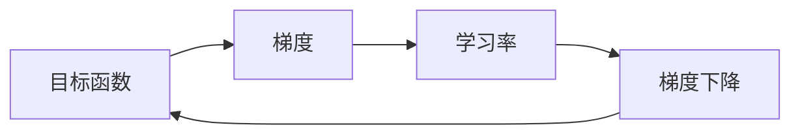

                 

## 1. 背景介绍

梯度下降（Gradient Descent）是一种广泛应用于机器学习和深度学习领域的优化算法。它的目标是找到一条路径，使得目标函数的值最小化。梯度下降算法在训练神经网络、回归分析、支持向量机等机器学习模型时发挥着至关重要的作用。

## 2. 核心概念与联系

### 2.1 核心概念

- **目标函数（Objective Function）**：梯度下降的目标是最小化目标函数。在机器学习中，目标函数通常是数据集的损失函数（如均方误差、交叉熵等）。
- **梯度（Gradient）**：梯度是目标函数在某点处的方向导数。它指示目标函数值变化最快的方向。
- **学习率（Learning Rate）**：学习率控制着梯度下降每次迭代的步长。它是一个超参数，需要通过经验或调参技术（如学习率调度）来选择。

### 2.2 核心概念联系

梯度下降算法的核心是利用梯度信息，沿着目标函数值变化最快的方向（梯度的反方向）进行搜索，以最小化目标函数。学习率控制着每次搜索的步长，从而影响收敛速度和稳定性。



## 3. 核心算法原理 & 具体操作步骤

### 3.1 算法原理概述

梯度下降的基本原理是沿着梯度的反方向，以学习率为步长进行迭代，直到收敛于目标函数的最小值点。梯度下降有两种主要形式：批量梯度下降（Batch Gradient Descent）和随机梯度下降（Stochastic Gradient Descent）。

### 3.2 算法步骤详解

1. 初始化模型参数 $\theta$ 和学习率 $\alpha$.
2. 计算目标函数 $J(\theta)$ 的梯度 $\nabla J(\theta)$.
3. 更新模型参数：$\theta := \theta - \alpha \nabla J(\theta)$.
4. 重复步骤2和3，直到收敛（目标函数值变化小于阈值或达到最大迭代次数）。

### 3.3 算法优缺点

**优点：**

- 简单易懂，易于实现。
- 广泛应用于机器学习和深度学习领域。
- 可以找到目标函数的局部最小值（如果目标函数是凸函数，则可以找到全局最小值）。

**缺点：**

- 容易陷入局部最小值。
- 学习率的选择对收敛速度和稳定性有很大影响。
- 批量梯度下降对大数据集计算开销大，随机梯度下降收敛速度快但有噪声。

### 3.4 算法应用领域

梯度下降在机器学习和深度学习领域广泛应用，如：

- 线性回归、逻辑回归、支持向量机等模型的训练。
- 深度神经网络的训练，如卷积神经网络（CNN）、循环神经网络（RNN）和长短期记忆网络（LSTM）。
- 优化问题、控制问题和数值计算等领域。

## 4. 数学模型和公式 & 详细讲解 & 举例说明

### 4.1 数学模型构建

设目标函数为 $J(\theta)$，其中 $\theta = [\theta_1, \theta_2, \ldots, \theta_n]^T$ 是模型参数向量。梯度下降的目标是最小化目标函数 $J(\theta)$，即：

$$\min_{\theta} J(\theta)$$

### 4.2 公式推导过程

梯度下降的更新规则是：

$$\theta_{t+1} = \theta_t - \alpha \nabla J(\theta_t)$$

其中 $\alpha$ 是学习率， $\nabla J(\theta_t)$ 是目标函数在 $\theta_t$ 处的梯度。梯度可以通过链式法则计算：

$$\nabla J(\theta) = \left[ \frac{\partial J}{\partial \theta_1}, \frac{\partial J}{\partial \theta_2}, \ldots, \frac{\partial J}{\partial \theta_n} \right]^T$$

### 4.3 案例分析与讲解

例如，考虑线性回归问题，目标函数为均方误差：

$$J(\theta) = \frac{1}{2m} \sum_{i=1}^{m} (h_{\theta}(x^{(i)}) - y^{(i)})^2$$

其中 $h_{\theta}(x^{(i)}) = \theta^T x^{(i)}$ 是模型的预测输出， $x^{(i)}$ 是输入特征向量，$y^{(i)}$ 是标签，$m$ 是数据集大小。梯度为：

$$\nabla J(\theta) = \frac{1}{m} \sum_{i=1}^{m} (h_{\theta}(x^{(i)}) - y^{(i)}) x^{(i)}$$

## 5. 项目实践：代码实例和详细解释说明

### 5.1 开发环境搭建

本项目使用 Python 和 NumPy 实现梯度下降算法。首先，安装 NumPy：

```bash
pip install numpy
```

### 5.2 源代码详细实现

以下是批量梯度下降算法的 Python 实现：

```python
import numpy as np

def batch_gradient_descent(X, y, theta, alpha, num_iterations):
    m, n = X.shape
    for _ in range(num_iterations):
        predictions = X @ theta
        errors = predictions - y
        theta -= (alpha / m) * (X.T @ errors)
    return theta
```

### 5.3 代码解读与分析

- `X` 是输入特征向量组成的矩阵， `y` 是标签向量。
- `theta` 是模型参数向量。
- `alpha` 是学习率， `num_iterations` 是最大迭代次数。
- 算法在每次迭代中计算预测值、误差、梯度，然后更新模型参数。

### 5.4 运行结果展示

使用批量梯度下降训练线性回归模型，并绘制决策边界：

```python
import matplotlib.pyplot as plt

# 示例数据
X = 2 * np.random.rand(100, 1) - 1
y = 0.5 * X**2 + X + 2 + np.random.randn(100, 1)

# 初始化模型参数
theta = np.zeros((2, 1))

# 训练模型
theta = batch_gradient_descent(X, y, theta, alpha=0.1, num_iterations=1000)

# 绘制决策边界
plt.scatter(X, y)
x = np.linspace(-1, 1, 100)
y = theta[0] + theta[1] * x
plt.plot(x, y, color='red')
plt.show()
```

## 6. 实际应用场景

### 6.1 当前应用

梯度下降在机器学习和深度学习领域广泛应用，如图像分类、语音识别、自然语言处理等。

### 6.2 未来应用展望

随着大数据和云计算技术的发展，梯度下降及其变种（如分布式梯度下降、异步梯度下降）将在大规模机器学习任务中发挥更重要的作用。此外，研究人员正在探索更先进的优化算法，以提高梯度下降的收敛速度和稳定性。

## 7. 工具和资源推荐

### 7.1 学习资源推荐

- Andrew Ng 的机器学习课程（Coursera）：<https://www.coursera.org/learn/machine-learning>
- 好文《梯度下降：原理、实现和应用》：<https://zhuanlan.zhihu.com/p/25847373>

### 7.2 开发工具推荐

- Python：<https://www.python.org/>
- NumPy：<https://numpy.org/>
- TensorFlow：<https://www.tensorflow.org/>
- PyTorch：<https://pytorch.org/>

### 7.3 相关论文推荐

- Rumelhart, D. E., Hinton, G. E., & Williams, R. J. (1986). Learning representations by back-propagating errors. Nature, 323(6088), 533-536.
- LeCun, Y., Bengio, Y., & Hinton, G. (2015). Deep learning. Nature, 521(7553), 436-444.

## 8. 总结：未来发展趋势与挑战

### 8.1 研究成果总结

梯度下降是机器学习和深度学习领域的基础算法，它的成功应用推动了这些领域的发展。

### 8.2 未来发展趋势

未来，研究人员将继续探索更先进的优化算法，以提高梯度下降的收敛速度和稳定性。此外，分布式和异步梯度下降将在大规模机器学习任务中发挥更重要的作用。

### 8.3 面临的挑战

梯度下降面临的挑战包括学习率选择、陷入局部最小值、收敛速度慢等问题。此外，在大规模数据集上训练模型时，梯度下降的计算开销也成为一个挑战。

### 8.4 研究展望

未来的研究方向包括开发更先进的学习率调度策略、设计新的优化算法、研究梯度下降在大规模机器学习任务中的应用等。

## 9. 附录：常见问题与解答

**Q：梯度下降容易陷入局部最小值吗？**

**A：**是的，梯度下降可能会陷入局部最小值。为了缓解这个问题，可以使用随机初始化参数、使用更复杂的模型、使用正则化等技术。

**Q：学习率选择对梯度下降有什么影响？**

**A：**学习率选择对梯度下降的收敛速度和稳定性有很大影响。学习率太小，收敛速度慢；学习率太大，可能导致收敛失败或发散。

**Q：梯度下降可以用于非凸函数吗？**

**A：**梯度下降可以用于非凸函数，但它只能找到局部最小值。如果目标函数是凸函数，梯度下降可以找到全局最小值。

## 作者：禅与计算机程序设计艺术 / Zen and the Art of Computer Programming

