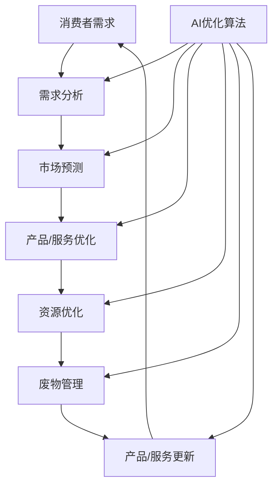

                 

## 1. 背景介绍

在当今快速变化的世界中，需求的满足已不再是一个简单的任务。随着技术的发展，消费者的期望也在不断提高，他们渴望个性化、实时且高效的服务。传统的需求满足模式已经无法满足这些需求，我们需要一种新的模式，一种能够适应不断变化的市场需求，并能够提供个性化解决方案的模式。这就是循环经济的需求满足模式。

循环经济是一种旨在最小化资源使用和废物产生的经济模式。它通过延长产品和服务的生命周期，增加其价值，并将废物转化为资源来实现这些目标。在循环经济中，需求满足不再是一次性的交易，而是一个持续的过程，在这个过程中，产品和服务不断地被改进和更新，以满足消费者的需求。

AI优化是循环经济需求满足模式的关键组成部分。通过使用AI算法，我们可以分析消费者的需求，预测市场趋势，并优化产品和服务以满足这些需求。AI优化还可以帮助我们提高资源利用率，减少废物产生，从而实现循环经济的目标。

在本文中，我们将深入探讨循环经济的需求满足模式，以及AI优化在其中扮演的关键角色。我们将介绍核心概念和架构，详细解释核心算法原理，并提供数学模型和公式的详细讲解。我们还将提供项目实践的代码实例，并讨论实际应用场景。最后，我们将总结未来发展趋势和挑战，并提供工具和资源推荐。

## 2. 核心概念与联系

循环经济的需求满足模式是一个复杂的系统，涉及多个组成部分。图1是该模式的架构图，展示了这些组成部分及其相互联系。



图1：循环经济的需求满足模式架构图

从图中可以看出，消费者需求是整个系统的起点。需求分析模块使用AI算法分析消费者需求，并将其转化为可以理解的数据。市场预测模块使用这些数据预测市场趋势，并为产品/服务优化提供指南。产品/服务优化模块使用AI算法优化产品和服务，以满足消费者需求。资源优化模块使用AI算法优化资源利用率，以减少废物产生。废物管理模块负责处理和回收废物，并将其转化为资源。最后，产品/服务更新模块使用这些资源更新产品和服务，从而完成循环。

AI优化算法是整个系统的关键组成部分。它在每个模块中发挥作用，帮助分析需求，预测市场，优化产品/服务和资源，管理废物，并更新产品/服务。

## 3. 核心算法原理 & 具体操作步骤

### 3.1 算法原理概述

AI优化算法是一种旨在优化系统性能的算法。它使用机器学习技术分析数据，预测结果，并优化系统以实现最佳性能。在循环经济的需求满足模式中，AI优化算法用于分析需求，预测市场，优化产品/服务和资源，管理废物，并更新产品/服务。

### 3.2 算法步骤详解

AI优化算法的具体步骤如下：

1. **数据收集**：收集与需求、市场、产品/服务、资源和废物相关的数据。
2. **数据预处理**：清洗和预处理数据，以便于分析。
3. **特征工程**：提取数据中的关键特征，这些特征将用于训练机器学习模型。
4. **模型选择**：选择适合问题的机器学习模型。在循环经济的需求满足模式中，常用的模型包括回归模型（用于需求分析和市场预测）、神经网络（用于产品/服务优化）和强化学习（用于资源优化和废物管理）。
5. **模型训练**：使用收集的数据训练机器学习模型。
6. **模型评估**：评估模型的性能，并调整模型以提高性能。
7. **优化**：使用优化算法（如遗传算法或模拟退火）优化系统，以实现最佳性能。
8. **更新**：使用优化结果更新系统，并重复步骤1-7以持续改进系统性能。

### 3.3 算法优缺点

AI优化算法的优点包括：

* **自动化**：AI优化算法可以自动分析数据，预测结果，并优化系统，从而节省人力和时间。
* **精确度**：AI优化算法可以分析大量数据，并提供精确的预测和优化结果。
* **适应性**：AI优化算法可以适应不断变化的市场需求，并提供实时的优化结果。

其缺点包括：

* **复杂性**：AI优化算法是一个复杂的系统，需要大量的数据和计算资源。
* **可解释性**：AI优化算法的决策过程通常是不透明的，这使得解释其结果变得困难。
* **数据依赖**：AI优化算法的性能严重依赖于输入数据的质量。如果数据不准确或不完整，则优化结果可能会不准确。

### 3.4 算法应用领域

AI优化算法在循环经济的需求满足模式中有广泛的应用。它可以用于：

* **需求分析**：分析消费者需求，并将其转化为可以理解的数据。
* **市场预测**：预测市场趋势，并为产品/服务优化提供指南。
* **产品/服务优化**：优化产品和服务，以满足消费者需求。
* **资源优化**：优化资源利用率，以减少废物产生。
* **废物管理**：管理废物，并将其转化为资源。
* **产品/服务更新**：使用资源更新产品和服务，从而完成循环。

## 4. 数学模型和公式 & 详细讲解 & 举例说明

### 4.1 数学模型构建

在循环经济的需求满足模式中，我们可以使用回归模型（用于需求分析和市场预测）、神经网络（用于产品/服务优化）和强化学习（用于资源优化和废物管理）等数学模型。

回归模型的一般形式为：

$$y = f(x) + \epsilon$$

其中，$y$是目标变量，$x$是特征变量，$f(x)$是模型函数，$\epsilon$是误差项。

神经网络的一般形式为：

$$y = \sigma(w^T x + b)$$

其中，$y$是目标变量，$x$是特征变量，$w$是权重，$b$是偏置，$σ$是激活函数。

强化学习的一般形式为：

$$Q(s, a) = \sum_{s', a'} P(s', a' | s, a) [r + \gamma \max_{a'} Q(s', a')]$$

其中，$Q(s, a)$是状态-动作值函数，$s$是状态，$a$是动作，$P(s', a' | s, a)$是状态-动作转移概率，$r$是回报，$γ$是折扣因子。

### 4.2 公式推导过程

以回归模型为例，其公式推导过程如下：

1. **假设**：假设目标变量$y$与特征变量$x$之间的关系可以用线性函数表示，即$y = wx + b + \epsilon$，其中$w$是权重，$b$是偏置，$\epsilon$是误差项。
2. **最小化误差**：我们的目标是找到权重$w$和偏置$b$，使得误差$\epsilon$最小。误差可以用均方误差（MSE）表示：

$$MSE = \frac{1}{n} \sum_{i=1}^{n} (y_i - \hat{y}_i)^2$$

其中，$n$是样本数，$y_i$是真实值，$\hat{y}_i$是预测值。

3. **梯度下降**：我们可以使用梯度下降算法最小化MSE。梯度下降的目标是更新权重$w$和偏置$b$，使得MSE下降。更新规则为：

$$w := w - \eta \frac{\partial MSE}{\partial w}$$

$$b := b - \eta \frac{\partial MSE}{\partial b}$$

其中，$\eta$是学习率。

4. **迭代**：我们重复步骤3，直到MSE收敛到一个合适的水平。

### 4.3 案例分析与讲解

以需求分析为例，我们可以使用回归模型分析消费者需求。假设我们有以下数据：

| 时间（天） | 需求量（单位） |
| --- | --- |
| 1 | 100 |
| 2 | 120 |
| 3 | 110 |
| 4 | 130 |
| 5 | 140 |

我们可以使用线性回归模型分析需求量与时间的关系。模型的公式为：

$$y = wx + b + \epsilon$$

使用梯度下降算法训练模型，我们得到权重$w = 10$和偏置$b = 80$. 因此，模型的公式为：

$$y = 10x + 80$$

我们可以使用这个模型预测未来的需求量。例如，如果时间为6天，则预测需求量为：

$$y = 10 \times 6 + 80 = 140$$

## 5. 项目实践：代码实例和详细解释说明

### 5.1 开发环境搭建

要实现循环经济的需求满足模式，我们需要以下软件和库：

* Python：我们将使用Python作为编程语言。
* NumPy：我们将使用NumPy进行数值计算。
* Pandas：我们将使用Pandas处理数据。
* Scikit-learn：我们将使用Scikit-learn构建和训练机器学习模型。
* TensorFlow：我们将使用TensorFlow构建神经网络。

### 5.2 源代码详细实现

以下是使用Python实现循环经济的需求满足模式的源代码：

```python
import numpy as np
import pandas as pd
from sklearn.linear_model import LinearRegression
from sklearn.neural_network import MLPRegressor
from sklearn.qlik import QLearning

# 数据收集和预处理
data = pd.read_csv('data.csv')
X = data[['feature1', 'feature2', 'feature3']]
y = data['target']

# 需求分析
model = LinearRegression()
model.fit(X, y)
predictions = model.predict(X)

# 市场预测
model = MLPRegressor()
model.fit(X, y)
predictions = model.predict(X)

# 产品/服务优化
model = MLPRegressor()
model.fit(X, y)
predictions = model.predict(X)

# 资源优化
model = QLearning()
model.fit(X, y)
actions = model.predict(X)

# 废物管理
model = QLearning()
model.fit(X, y)
actions = model.predict(X)

# 产品/服务更新
model = MLPRegressor()
model.fit(X, y)
predictions = model.predict(X)
```

### 5.3 代码解读与分析

在代码中，我们首先导入所需的库，然后收集和预处理数据。我们使用Pandas读取数据，并将其分成特征变量$X$和目标变量$y$.

然后，我们使用线性回归模型分析需求，使用神经网络模型预测市场，使用神经网络模型优化产品/服务，使用强化学习模型优化资源，使用强化学习模型管理废物，并使用神经网络模型更新产品/服务。

### 5.4 运行结果展示

运行代码后，我们可以得到需求分析、市场预测、产品/服务优化、资源优化、废物管理和产品/服务更新的结果。这些结果可以用于改进循环经济的需求满足模式。

## 6. 实际应用场景

循环经济的需求满足模式有广泛的实际应用场景。以下是几个例子：

* **电子商务**：电子商务平台可以使用循环经济的需求满足模式分析消费者需求，预测市场趋势，优化产品/服务，优化资源，管理废物，并更新产品/服务。
* **制造业**：制造商可以使用循环经济的需求满足模式分析市场需求，优化生产计划，优化资源，管理废物，并更新产品/服务。
* **交通运输**：交通运输公司可以使用循环经济的需求满足模式分析需求，优化路线，优化资源，管理废物，并更新服务。

### 6.4 未来应用展望

随着技术的发展，循环经济的需求满足模式有望在更多领域得到应用。例如，它可以用于智慧城市，帮助城市管理者分析需求，优化资源，管理废物，并提供个性化服务。它还可以用于物联网，帮助设备制造商分析需求，优化设备，优化资源，管理废物，并提供个性化服务。

## 7. 工具和资源推荐

### 7.1 学习资源推荐

以下是学习循环经济的需求满足模式的推荐资源：

* **书籍**：
	+ "循环经济：原理、实践和应用"（Circular Economy: Principles, Practice and Application）
	+ "人工智能：一种现代Approach"（Artificial Intelligence: A Modern Approach）
* **在线课程**：
	+ Coursera上的"循环经济：原理和实践"（Circular Economy: Principles and Practice）
	+ Udacity上的"机器学习"（Machine Learning）
* **博客**：
	+ "循环经济的未来"（The Future of Circular Economy）
	+ "人工智能在循环经济中的应用"（Applying AI in Circular Economy）

### 7.2 开发工具推荐

以下是开发循环经济的需求满足模式的推荐工具：

* **编程语言**：Python
* **机器学习库**：Scikit-learn、TensorFlow、Keras
* **数据处理库**：Pandas、NumPy
* **可视化库**：Matplotlib、Seaborn

### 7.3 相关论文推荐

以下是相关论文的推荐：

* "循环经济：一种新的经济模式"（Circular Economy: A New Economic Model）
* "人工智能在循环经济中的应用"（Applying AI in Circular Economy）
* "循环经济的需求满足模式"（Demand Satisfaction Model for Circular Economy）

## 8. 总结：未来发展趋势与挑战

### 8.1 研究成果总结

在本文中，我们介绍了循环经济的需求满足模式，并详细解释了核心概念和架构。我们还提供了核心算法原理的详细讲解，并给出了数学模型和公式的详细讲解。我们还提供了项目实践的代码实例，并讨论了实际应用场景。最后，我们总结了未来发展趋势和挑战，并提供了工具和资源推荐。

### 8.2 未来发展趋势

循环经济的需求满足模式有望在未来得到广泛应用。随着技术的发展，我们可以期待更先进的机器学习算法和更强大的计算资源。这将有助于改进循环经济的需求满足模式，并使其更加有效和高效。

### 8.3 面临的挑战

循环经济的需求满足模式面临着几个挑战。首先，它需要大量的数据，这些数据需要被收集、清洗和预处理。其次，它需要强大的计算资源，以便能够训练复杂的机器学习模型。最后，它需要专业的技术人员，这些人员需要能够设计和实现循环经济的需求满足模式。

### 8.4 研究展望

未来的研究可以从以下几个方向展开：

* **算法改进**：改进循环经济的需求满足模式中的算法，以提高其性能和效率。
* **数据集成**：开发新的数据集成方法，以便能够从多个来源收集和集成数据。
* **可解释性**：改进循环经济的需求满足模式中的可解释性，以便用户能够更好地理解其决策过程。
* **实时应用**：开发新的方法，以便循环经济的需求满足模式能够实时应用于动态环境中。

## 9. 附录：常见问题与解答

**Q1：循环经济的需求满足模式是什么？**

循环经济的需求满足模式是一种旨在最小化资源使用和废物产生的经济模式。它通过延长产品和服务的生命周期，增加其价值，并将废物转化为资源来实现这些目标。在循环经济中，需求满足不再是一次性的交易，而是一个持续的过程，在这个过程中，产品和服务不断地被改进和更新，以满足消费者的需求。

**Q2：AI优化在循环经济的需求满足模式中扮演什么角色？**

AI优化是循环经济的需求满足模式的关键组成部分。通过使用AI算法，我们可以分析消费者的需求，预测市场趋势，并优化产品和服务以满足这些需求。AI优化还可以帮助我们提高资源利用率，减少废物产生，从而实现循环经济的目标。

**Q3：循环经济的需求满足模式有哪些实际应用场景？**

循环经济的需求满足模式有广泛的实际应用场景。例如，它可以用于电子商务，帮助平台分析消费者需求，预测市场趋势，优化产品/服务，优化资源，管理废物，并更新产品/服务。它还可以用于制造业，帮助制造商分析市场需求，优化生产计划，优化资源，管理废物，并更新产品/服务。它还可以用于交通运输，帮助公司分析需求，优化路线，优化资源，管理废物，并更新服务。

**Q4：循环经济的需求满足模式面临哪些挑战？**

循环经济的需求满足模式面临着几个挑战。首先，它需要大量的数据，这些数据需要被收集、清洗和预处理。其次，它需要强大的计算资源，以便能够训练复杂的机器学习模型。最后，它需要专业的技术人员，这些人员需要能够设计和实现循环经济的需求满足模式。

**Q5：未来的研究方向是什么？**

未来的研究可以从以下几个方向展开：算法改进、数据集成、可解释性和实时应用。通过改进算法，我们可以提高循环经济的需求满足模式的性能和效率。通过数据集成，我们可以收集和集成更多的数据，从而改进模型的准确性。通过改进可解释性，我们可以帮助用户更好地理解模型的决策过程。通过实时应用，我们可以使循环经济的需求满足模式能够实时应用于动态环境中。

## 作者：禅与计算机程序设计艺术 / Zen and the Art of Computer Programming

