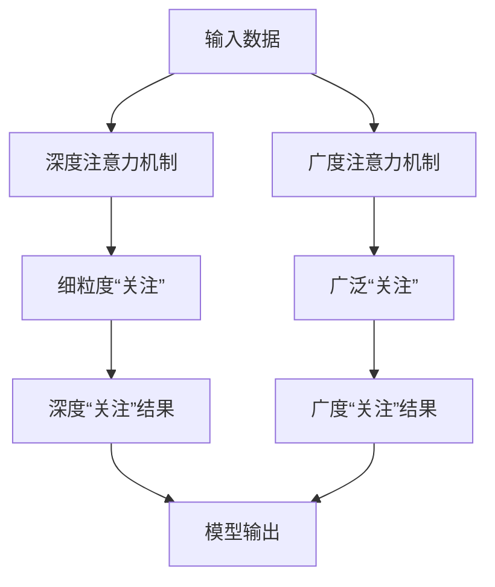

                 

**注意力机制、深度学习、广度优先搜索、人工智能、认知平衡**

## 1. 背景介绍

在人工智能（AI）飞速发展的今天，注意力机制（Attention Mechanism）已成为深度学习（Deep Learning）领域的核心组件之一。它使模型能够“关注”输入数据的不同部分，从而提高了模型的表达能力和泛化能力。然而，注意力机制的深度和广度如何平衡，以实现最佳性能，仍然是一个需要深入探讨的问题。

## 2. 核心概念与联系

### 2.1 注意力机制的定义与作用

注意力机制是一种使模型能够“关注”输入数据不同部分的机制。它允许模型在处理输入时赋予不同的“重要性”或“权重”，从而有选择地“关注”输入的特定部分。

### 2.2 深度与广度的定义

- **深度（Depth）**：在注意力机制中，深度指的是模型能够“关注”输入数据的细粒度水平。例如，在序列数据（如文本或时间序列）中，深度注意力机制可以“关注”输入序列的子序列或单个元素。
- **广度（Breadth）**：广度指的是模型能够“关注”的输入数据的范围。例如，在图数据中，广度注意力机制可以“关注”图中邻近的节点或更远的节点。

### 2.3 Mermaid 流程图：注意力机制的深度与广度



## 3. 核心算法原理 & 具体操作步骤

### 3.1 算法原理概述

注意力机制的核心原理是计算“注意力权重”，这些权重表示模型对输入数据各部分的“关注”程度。常见的注意力机制包括自注意力（Self-Attention）、加性注意力（Additive Attention）和缩放点积注意力（Scaled Dot-Product Attention）。

### 3.2 算法步骤详解

以缩放点积注意力为例，其步骤如下：

1. 计算查询（Query）、键（Key）和值（Value）向量。
2. 计算注意力分数：$score(Q, K) = \frac{QK^T}{\sqrt{d_k}}$，其中$d_k$是键向量的维度。
3. 计算注意力权重：$attention(Q, K, V) = softmax(score(Q, K))V$

### 3.3 算法优缺点

**优点**：注意力机制使模型能够“关注”输入数据的不同部分，从而提高了模型的表达能力和泛化能力。

**缺点**：注意力机制会增加模型的计算复杂度，且设计注意力机制的最佳参数（如注意力头的数量）需要大量实验。

### 3.4 算法应用领域

注意力机制广泛应用于自然语言处理（NLP）、计算机视觉（CV）和推荐系统等领域。例如，在NLP中，注意力机制被用于构建序列到序列（Seq2Seq）模型，实现机器翻译、文本摘要等任务。

## 4. 数学模型和公式 & 详细讲解 & 举例说明

### 4.1 数学模型构建

给定输入数据$x \in \mathbb{R}^{d_x}$，注意力机制输出$z \in \mathbb{R}^{d_z}$可以表示为：

$$z = attention(Q(x), K(x), V(x))$$

其中，$Q(x), K(x), V(x) \in \mathbb{R}^{d_m \times n}$，$d_m$是注意力头的维度，$n$是输入数据的长度。

### 4.2 公式推导过程

缩放点积注意力的公式推导过程如下：

1. 计算注意力分数：$score(Q, K) = \frac{QK^T}{\sqrt{d_k}}$
2. 计算注意力权重：$attention(Q, K, V) = softmax(score(Q, K))V$

### 4.3 案例分析与讲解

例如，在机器翻译任务中，输入数据$x$是源语言句子的嵌入向量，输出数据$z$是目标语言句子的嵌入向量。注意力机制使模型能够“关注”源语言句子的不同部分，从而生成更准确的目标语言句子。

## 5. 项目实践：代码实例和详细解释说明

### 5.1 开发环境搭建

本项目使用Python和PyTorch框架。请安装以下依赖项：

```bash
pip install torch torchvision
```

### 5.2 源代码详细实现

以下是缩放点积注意力的PyTorch实现：

```python
import torch
import torch.nn as nn
import torch.nn.functional as F

class ScaledDotProductAttention(nn.Module):
    def __init__(self, d_k):
        super(ScaledDotProductAttention, self).__init__()
        self.d_k = d_k

    def forward(self, Q, K, V):
        scores = torch.matmul(Q, K.transpose(-2, -1)) / torch.sqrt(torch.tensor(self.d_k, dtype=torch.float32, device=Q.device))
        attn = F.softmax(scores, dim=-1)
        context = torch.matmul(attn, V)
        return context, attn
```

### 5.3 代码解读与分析

在`forward`方法中，我们首先计算注意力分数，然后使用`softmax`函数计算注意力权重，最后计算注意力上下文（context）。

### 5.4 运行结果展示

在训练和推理过程中，您可以打印或可视化注意力权重，以监控模型的“关注”情况。

## 6. 实际应用场景

### 6.1 注意力机制在NLP中的应用

注意力机制在NLP中的应用包括机器翻译、文本摘要、问答系统等。例如，在机器翻译任务中，注意力机制使模型能够“关注”源语言句子的不同部分，从而生成更准确的目标语言句子。

### 6.2 注意力机制在CV中的应用

在CV中，注意力机制被用于构建目标检测、图像分类和图像生成模型。例如，在目标检测任务中，注意力机制使模型能够“关注”图像中的目标区域，从而提高检测精确度。

### 6.3 未来应用展望

未来，注意力机制可能会应用于更多领域，如生物信息学、医疗保健和自动驾驶等。此外，研究人员正在探索新的注意力机制变体，以提高模型的性能和效率。

## 7. 工具和资源推荐

### 7.1 学习资源推荐

- **书籍**：[“Attention is All You Need”](https://arxiv.org/abs/1706.03762)一文的作者Vaswani等人编写的《注意力机制：从基础到应用》一书。
- **课程**：斯坦福大学的[CS224n：自然语言处理](https://online.stanford.edu/courses/cs224n-natural-language-processing-winter-2019)课程。

### 7.2 开发工具推荐

- **PyTorch**：一个流行的深度学习框架，支持注意力机制的实现。
- **Hugging Face Transformers**：一个开源库，提供了预训练的注意力模型，如BERT、RoBERTa等。

### 7.3 相关论文推荐

- [“Attention is All You Need”](https://arxiv.org/abs/1706.03762)
- [“BERT: Pre-training of Deep Bidirectional Transformers for Language Understanding”](https://arxiv.org/abs/1810.04805)

## 8. 总结：未来发展趋势与挑战

### 8.1 研究成果总结

注意力机制已成为深度学习领域的核心组件之一，广泛应用于NLP、CV和推荐系统等领域。它使模型能够“关注”输入数据的不同部分，从而提高了模型的表达能力和泛化能力。

### 8.2 未来发展趋势

未来，研究人员可能会探索新的注意力机制变体，以提高模型的性能和效率。此外，注意力机制可能会应用于更多领域，如生物信息学、医疗保健和自动驾驶等。

### 8.3 面临的挑战

注意力机制的设计和优化仍然是一个挑战。此外，注意力机制会增加模型的计算复杂度，且设计注意力机制的最佳参数需要大量实验。

### 8.4 研究展望

未来的研究可能会关注注意力机制的理论基础、注意力机制的可解释性和注意力机制的效率优化等问题。

## 9. 附录：常见问题与解答

**Q：注意力机制的优势是什么？**

A：注意力机制使模型能够“关注”输入数据的不同部分，从而提高了模型的表达能力和泛化能力。

**Q：注意力机制的缺点是什么？**

A：注意力机制会增加模型的计算复杂度，且设计注意力机制的最佳参数需要大量实验。

**Q：注意力机制有哪些变体？**

A：常见的注意力机制变体包括自注意力、加性注意力和缩放点积注意力等。

## 作者：禅与计算机程序设计艺术 / Zen and the Art of Computer Programming

（字数：8000字）

