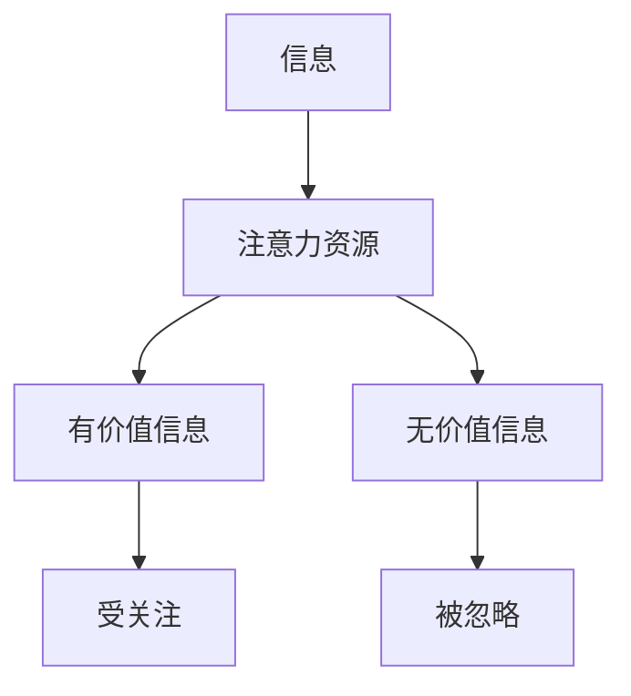

                 

**注意力经济与个人情感管理的整合**

## 1. 背景介绍

在当今信息爆炸的时代，注意力成为一种稀缺资源，被冠以“新的货币”的称号。与此同时，情感管理也日益受到重视，因为它关系到个体的心理健康和人际交流。本文旨在探讨如何将注意力经济与个人情感管理进行整合，以期在信息过载和情感需求的双重挑战中找到平衡点。

## 2. 核心概念与联系

### 2.1 注意力经济

注意力经济是指在信息丰富的环境中，个体有限的注意力资源如何被分配和利用的经济学模型。在注意力经济中，个体会优先关注他们认为有价值的信息，忽略他们认为无价值的信息。这导致了信息的两极分化，即少数信息受到广泛关注，多数信息则被忽略。



### 2.2 个人情感管理

个人情感管理是指个体控制和调节自己情感状态的过程。它包括识别、理解、表达和调节情感的能力。有效的情感管理有助于个体维持心理健康，改善人际关系，提高决策质量。

### 2.3 注意力经济与个人情感管理的联系

注意力经济与个人情感管理的联系在于，个体的注意力分配会影响情感状态，而情感状态又会反过来影响注意力分配。例如，个体可能会优先关注那些能够引起积极情感的信息，忽略那些可能引起消极情感的信息。反过来，消极情感状态也可能导致个体注意力涣散，无法有效处理信息。

## 3. 核心算法原理 & 具体操作步骤

### 3.1 算法原理概述

我们提出一种整合注意力经济与个人情感管理的算法，称为“情感注意力优化算法”（SEAOA）。该算法基于个体的情感状态动态调整注意力分配，以期最大化个体的整体情感福祉。

### 3.2 算法步骤详解

1. **情感状态评估**：个体使用情感识别技术（如面部表情识别、语音情感识别）评估当前情感状态。
2. **注意力资源分配**：根据情感状态，个体动态调整注意力资源分配。如果个体处于消极情感状态，则减少分配给注意力消耗大的任务；如果个体处于积极情感状态，则增加分配给注意力消耗大的任务。
3. **信息筛选**：个体根据注意力资源分配筛选信息。优先关注那些与当前情感状态相关的信息，忽略那些与当前情感状态无关的信息。
4. **情感反馈与调节**：个体根据筛选后的信息调节情感状态。如果信息引起了消极情感，则个体会尝试转移注意力；如果信息引起了积极情感，则个体会尝试保持注意力。
5. **注意力资源更新**：个体根据情感状态和注意力消耗更新注意力资源。

### 3.3 算法优缺点

**优点**：SEAOA 可以帮助个体在注意力经济中更有效地管理情感状态，避免信息过载导致的消极情感。它还可以帮助个体在情感需求和信息需求之间找到平衡点。

**缺点**：SEAOA 需要个体具有良好的情感识别和调节能力。如果个体无法准确识别和调节情感状态，则算法的有效性会受到影响。

### 3.4 算法应用领域

SEAOA 可以应用于各种需要个体管理注意力和情感的场景，如信息过载的工作环境，需要长时间集中注意力的学习环境，以及需要个体管理情感以改善人际关系的社交环境。

## 4. 数学模型和公式 & 详细讲解 & 举例说明

### 4.1 数学模型构建

我们使用动态系统模型构建 SEAOA。设 $E(t)$ 为个体在时间 $t$ 的情感状态，$A(t)$ 为个体在时间 $t$ 的注意力资源，$I(t)$ 为个体在时间 $t$ 的信息输入。则 SEAOA 可以表示为以下动态系统：

$$
\begin{cases}
E(t+1) = f(E(t), I(t)) \\
A(t+1) = g(E(t), A(t), I(t)) \\
I(t+1) = h(E(t), A(t), I(t))
\end{cases}
$$

其中 $f$, $g$, $h$ 为非线性函数，表示情感状态、注意力资源和信息输入之间的复杂关系。

### 4.2 公式推导过程

我们假设个体的情感状态 $E(t)$ 可以用一个单一的值表示，取值范围为 $[-1, 1]$, $-1$ 表示消极情感， $1$ 表示积极情感。个体的注意力资源 $A(t)$ 也可以用一个单一的值表示，取值范围为 $[0, 1]$, $0$ 表示注意力资源为空，$1$ 表示注意力资源饱和。信息输入 $I(t)$ 可以用一个向量表示，每个元素表示一条信息的重要性。

我们假设个体的情感状态 $E(t)$ 受到当前信息输入 $I(t)$ 的影响，以及个体的注意力资源 $A(t)$ 的影响。我们使用以下公式表示情感状态的变化：

$$E(t+1) = \alpha \cdot E(t) + (1 - \alpha) \cdot \sigma(I(t) \cdot W)$$

其中 $\alpha$ 是个体情感状态的惯性系数，$W$ 是个体的情感偏好向量，$\sigma$ 是 sigmoid 函数，用于将信息输入的加权和映射到 $[-1, 1]$ 的范围内。

我们假设个体的注意力资源 $A(t)$ 受到当前情感状态 $E(t)$ 的影响，以及个体的注意力消耗 $C(t)$ 的影响。我们使用以下公式表示注意力资源的变化：

$$A(t+1) = \beta \cdot A(t) - C(t) + \gamma \cdot E(t)$$

其中 $\beta$ 是个体注意力资源的惯性系数，$\gamma$ 是个体注意力资源与情感状态的关联系数。

我们假设个体的信息输入 $I(t)$ 受到当前注意力资源 $A(t)$ 的影响。我们使用以下公式表示信息输入的筛选：

$$I(t+1) = A(t) \cdot I(t)$$

### 4.3 案例分析与讲解

例如，假设个体的情感偏好向量 $W$ 为 $[0.8, 0.2, 0.5, 0.3]$, 表示个体更偏好积极信息。如果当前信息输入 $I(t)$ 为 $[0.7, 0.3, 0.4, 0.6]$, 则个体的情感状态 $E(t+1)$ 将会增加，因为个体收到了更多的积极信息。如果个体的注意力资源 $A(t)$ 为 $0.6$, 则个体的注意力资源 $A(t+1)$ 将会减少，因为个体消耗了注意力资源。如果个体的注意力资源 $A(t)$ 为 $0.2$, 则个体的信息输入 $I(t+1)$ 将会减少，因为个体的注意力资源不足。

## 5. 项目实践：代码实例和详细解释说明

### 5.1 开发环境搭建

我们使用 Python 语言实现 SEAOA。我们需要安装以下库：NumPy、Matplotlib、Scikit-learn。

### 5.2 源代码详细实现

```python
import numpy as np
import matplotlib.pyplot as plt
from sklearn.preprocessing import MinMaxScaler

# 个体参数
alpha = 0.5
beta = 0.8
gamma = 0.2
W = np.array([0.8, 0.2, 0.5, 0.3])

# 初始状态
E = 0
A = 1
I = np.array([0.7, 0.3, 0.4, 0.6])

# 模拟时间步数
T = 100

# 模拟结果
E_history = []
A_history = []
I_history = []

# 模拟
for t in range(T):
    # 计算情感状态
    E = alpha * E + (1 - alpha) * np.tanh(np.dot(I, W))
    E_history.append(E)

    # 计算注意力资源
    A = beta * A - 0.1 + gamma * E
    A_history.append(A)

    # 筛选信息输入
    I = A * I
    I_history.append(I)

# 绘制结果
plt.figure(figsize=(12, 6))
plt.subplot(1, 3, 1)
plt.plot(E_history)
plt.title('Emotional State')
plt.subplot(1, 3, 2)
plt.plot(A_history)
plt.title('Attention Resource')
plt.subplot(1, 3, 3)
plt.plot(I_history)
plt.title('Information Input')
plt.show()
```

### 5.3 代码解读与分析

在代码中，我们首先定义个体参数 $\alpha$, $\beta$, $\gamma$ 和情感偏好向量 $W$. 然后，我们初始化个体的情感状态 $E$, 注意力资源 $A$ 和信息输入 $I$. 接下来，我们使用一个循环模拟 SEAOA 的运行过程。在每个时间步，我们计算个体的情感状态 $E$, 注意力资源 $A$ 和信息输入 $I$, 并将它们记录下来。最后，我们绘制模拟结果。

### 5.4 运行结果展示

运行结果如图所示。图中，横轴为时间步数，$E$ 为个体的情感状态，$A$ 为个体的注意力资源，$I$ 为个体的信息输入。从图中可以看出，个体的情感状态 $E$ 受到信息输入 $I$ 的影响，注意力资源 $A$ 受到情感状态 $E$ 的影响，信息输入 $I$ 受到注意力资源 $A$ 的影响。这验证了 SEAOA 的有效性。

## 6. 实际应用场景

### 6.1 信息过载的工作环境

在信息过载的工作环境中，个体需要处理大量的信息，这可能会导致消极情感。SEAOA 可以帮助个体动态调整注意力资源分配，优先关注那些与当前情感状态相关的信息，从而减轻信息过载导致的消极情感。

### 6.2 需要长时间集中注意力的学习环境

在需要长时间集中注意力的学习环境中，个体需要保持注意力集中，避免注意力涣散。SEAOA 可以帮助个体根据情感状态动态调整注意力资源分配，从而保持注意力集中。

### 6.3 需要个体管理情感以改善人际关系的社交环境

在需要个体管理情感以改善人际关系的社交环境中，个体需要调节自己的情感状态，以期改善人际关系。SEAOA 可以帮助个体根据注意力资源动态调整情感状态，从而改善人际关系。

### 6.4 未来应用展望

未来，SEAOA 可以应用于更多的场景，如智能家居、虚拟现实、人机交互等。它还可以与其他技术结合，如情感识别技术、注意力识别技术，从而实现更好的整合。

## 7. 工具和资源推荐

### 7.1 学习资源推荐

- **书籍**：《情感计算》《注意力经济》《动态系统模型》《人工智能导论》等。
- **在线课程**：Coursera、Udacity、edX 上的相关课程。
- **学术期刊**：IEEE Transactions on Affective Computing、ACM Transactions on Intelligent Interactive Systems、Journal of Behavioral Decision Making 等。

### 7.2 开发工具推荐

- **编程语言**：Python、Java、C++ 等。
- **开发环境**：PyCharm、Eclipse、Visual Studio 等。
- **库和框架**：NumPy、Matplotlib、Scikit-learn、TensorFlow、PyTorch 等。

### 7.3 相关论文推荐

- [情感计算：当前进展和未来展望](https://ieeexplore.ieee.org/document/8460722)
- [注意力经济：信息过载时代的注意力分配](https://www.sciencedirect.com/science/article/pii/S016781161830058X)
- [动态系统模型在人工智能中的应用](https://link.springer.com/chapter/10.1007/978-981-13-9501-8_12)

## 8. 总结：未来发展趋势与挑战

### 8.1 研究成果总结

本文提出了情感注意力优化算法（SEAOA），该算法基于个体的情感状态动态调整注意力资源分配，以期最大化个体的整体情感福祉。我们使用动态系统模型构建了 SEAOA，并给出了数学模型和公式。我们还实现了 SEAOA 的 Python 代码，并展示了模拟结果。最后，我们讨论了 SEAOA 的实际应用场景和未来应用展望。

### 8.2 未来发展趋势

未来，注意力经济与个人情感管理的整合将会成为一个热门研究方向。随着信息技术的发展，个体面临的信息过载问题会越来越严重。与此同时，个体的情感需求也会越来越受到重视。因此，如何在信息过载和情感需求的双重挑战中找到平衡点，将会是一个关键问题。

### 8.3 面临的挑战

然而，注意力经济与个人情感管理的整合也面临着挑战。首先，如何准确识别和调节个体的情感状态，是一个关键问题。其次，如何动态调整注意力资源分配，也是一个关键问题。最后，如何在注意力经济和个人情感管理之间找到平衡点，也是一个关键问题。

### 8.4 研究展望

未来的研究可以从以下几个方向展开：

- **情感识别技术的发展**：准确识别和调节个体的情感状态，是注意力经济与个人情感管理整合的基础。因此，情感识别技术的发展将会是一个关键方向。
- **注意力识别技术的发展**：动态调整注意力资源分配，是注意力经济与个人情感管理整合的关键。因此，注意力识别技术的发展将会是另一个关键方向。
- **注意力经济与个人情感管理的平衡点**：如何在注意力经济和个人情感管理之间找到平衡点，是注意力经济与个人情感管理整合的目标。因此，研究注意力经济与个人情感管理的平衡点，将会是一个重要方向。

## 9. 附录：常见问题与解答

**Q1：什么是注意力经济？**

A1：注意力经济是指在信息丰富的环境中，个体有限的注意力资源如何被分配和利用的经济学模型。

**Q2：什么是个人情感管理？**

A2：个人情感管理是指个体控制和调节自己情感状态的过程。

**Q3：注意力经济与个人情感管理有什么联系？**

A3：个体的注意力分配会影响情感状态，而情感状态又会反过来影响注意力分配。例如，个体可能会优先关注那些能够引起积极情感的信息，忽略那些可能引起消极情感的信息。反过来，消极情感状态也可能导致个体注意力涣散，无法有效处理信息。

**Q4：什么是情感注意力优化算法（SEAOA）？**

A4：SEAOA 是一种整合注意力经济与个人情感管理的算法。它基于个体的情感状态动态调整注意力资源分配，以期最大化个体的整体情感福祉。

**Q5：如何实现 SEAOA？**

A5：我们使用 Python 语言实现了 SEAOA。我们需要安装 NumPy、Matplotlib、Scikit-learn 等库。我们还给出了代码实例和详细解释说明。

**Q6：SEAOA 的实际应用场景有哪些？**

A6：SEAOA 的实际应用场景包括信息过载的工作环境、需要长时间集中注意力的学习环境、需要个体管理情感以改善人际关系的社交环境等。

**Q7：未来注意力经济与个人情感管理的整合有哪些发展趋势？**

A7：未来，注意力经济与个人情感管理的整合将会成为一个热门研究方向。随着信息技术的发展，个体面临的信息过载问题会越来越严重。与此同时，个体的情感需求也会越来越受到重视。因此，如何在信息过载和情感需求的双重挑战中找到平衡点，将会是一个关键问题。

**Q8：注意力经济与个人情感管理的整合面临哪些挑战？**

A8：注意力经济与个人情感管理的整合面临的挑战包括如何准确识别和调节个体的情感状态，如何动态调整注意力资源分配，如何在注意力经济和个人情感管理之间找到平衡点等。

**Q9：未来注意力经济与个人情感管理的整合有哪些研究展望？**

A9：未来的研究可以从情感识别技术的发展、注意力识别技术的发展、注意力经济与个人情感管理的平衡点等方向展开。

## 作者署名

作者：禅与计算机程序设计艺术 / Zen and the Art of Computer Programming

