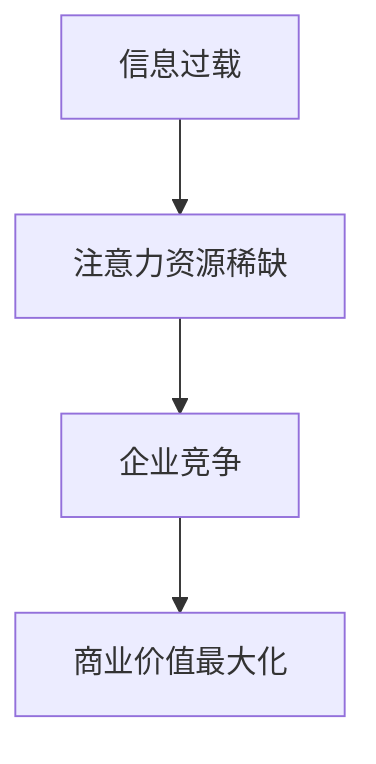
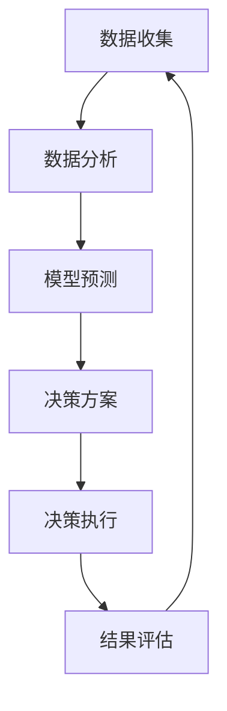

                 

**注意力经济**, **数据驱动**, **决策制定**, **市场洞察**, **机器学习**, **人工智能**, **数据分析**

## 1. 背景介绍

在当今信息爆炸的时代，数据已然成为企业最宝贵的资产之一。如何有效地利用数据，提高决策的准确性和效率，是企业面临的重大挑战。本文将探讨如何通过数据驱动的决策制定，利用注意力经济原理增强市场洞察力，从而帮助企业提高竞争力。

## 2. 核心概念与联系

### 2.1 注意力经济

注意力经济是指在信息过载的情况下，个体或组织为获取有限的注意力资源而展开的竞争。在数字时代，注意力资源的稀缺性日益凸显，企业需要通过创新的方式吸引和保持用户的注意力，从而实现商业价值的最大化。



### 2.2 数据驱动的决策制定

数据驱动的决策制定是指将数据分析和模型预测结果作为决策的依据，从而提高决策的准确性和效率。数据驱动决策的核心是利用机器学习算法从数据中提取有价值的信息，并将其转化为可行的决策方案。



## 3. 核心算法原理 & 具体操作步骤

### 3.1 算法原理概述

本文将重点介绍一种基于注意力机制的深度学习算法——**Transformer**，该算法已广泛应用于自然语言处理、图像识别等领域，并取得了显著的成绩。Transformer 通过自注意力机制（Self-Attention）和前向传播网络（Feed-Forward Network）构建，能够有效地处理序列数据，并捕捉到数据之间的长程依赖关系。

### 3.2 算法步骤详解

#### 3.2.1 自注意力机制

自注意力机制是 Transformer 的核心组成部分，其输入是一个序列的向量表示，输出也是一个序列的向量表示。自注意力机制的具体步骤如下：

1. 将输入序列的向量表示通过三个全连接层转换为三个向量矩阵：查询（Query）、键（Key）和值（Value）。
2. 计算注意力分数，即查询矩阵与键矩阵的点积，并通过 softmax 函数进行归一化。
3. 将注意力分数与值矩阵相乘，得到加权值矩阵。
4. 将加权值矩阵进行 concat 操作，并通过一个全连接层转换为输出序列的向量表示。

#### 3.2.2 前向传播网络

前向传播网络是 Transformer 中的另一个关键组成部分，其输入是自注意力机制的输出，输出是一个转换后的向量表示。前向传播网络由两个全连接层组成，中间添加了 ReLU 激活函数。

### 3.3 算法优缺点

**优点：**

* Transformer 可以有效地处理序列数据，并捕捉到数据之间的长程依赖关系。
* Transformer 的并行计算能力强，可以大大提高模型的训练速度。
* Transformer 在自然语言处理、图像识别等领域取得了显著的成绩。

**缺点：**

* Transformer 的参数量较大，模型复杂度高，需要大量的计算资源。
* Transformer 的训练数据要求高，需要大量的标注数据。
* Transformer 的解释性较差，模型的决策过程不易理解。

### 3.4 算法应用领域

Transformer 广泛应用于自然语言处理、图像识别、推荐系统等领域。在注意力经济的背景下，Transformer 可以帮助企业提高用户的注意力，从而实现商业价值的最大化。例如，在推荐系统中，Transformer 可以帮助企业根据用户的历史行为和偏好，精准地推荐个性化内容，从而吸引和保持用户的注意力。

## 4. 数学模型和公式 & 详细讲解 & 举例说明

### 4.1 数学模型构建

Transformer 的数学模型可以表示为：

$$h_t = \text{FFN}(x_t) + x_t$$

其中，$h_t$ 是时间步长 $t$ 的输出向量，$x_t$ 是时间步长 $t$ 的输入向量，FFN 表示前向传播网络。

### 4.2 公式推导过程

自注意力机制的数学模型可以表示为：

$$\text{Attention}(Q, K, V) = \text{softmax}\left(\frac{QK^T}{\sqrt{d_k}}\right)V$$

其中，$Q$, $K$, $V$ 分别是查询矩阵、键矩阵和值矩阵，$d_k$ 是键矩阵的维度。

### 4.3 案例分析与讲解

假设我们要构建一个基于 Transformer 的推荐系统，用于推荐个性化电影。我们首先需要收集用户的历史行为数据，如观看记录、评分等。然后，我们将这些数据转换为向量表示，并输入到 Transformer 中。通过 Transformer 的自注意力机制，我们可以捕捉到用户的偏好和兴趣，并根据这些信息推荐个性化电影。例如，如果用户喜欢悬疑电影，那么 Transformer 就会推荐相关的悬疑电影。

## 5. 项目实践：代码实例和详细解释说明

### 5.1 开发环境搭建

本项目的开发环境包括 Python 3.7、TensorFlow 2.0、NumPy 1.18、Pandas 1.0、Matplotlib 3.2 等常用库。我们将使用 Jupyter Notebook 进行开发。

### 5.2 源代码详细实现

以下是 Transformer 的 Python 实现代码：

```python
import numpy as np
import tensorflow as tf
from tensorflow.keras import layers

class Transformer(layers.Layer):
    def __init__(self, d_model, num_heads, ff_dim, rate=0.1):
        super(Transformer, self).__init__()
        self.att = layers.MultiHeadAttention(num_heads=num_heads, key_dim=d_model)
        self.ffn = tf.keras.Sequential([
            layers.Dense(ff_dim, activation="relu"),
            layers.Dense(d_model),
        ])
        self.layernorm1 = layers.LayerNormalization(epsilon=1e-6)
        self.layernorm2 = layers.LayerNormalization(epsilon=1e-6)
        self.dropout1 = layers.Dropout(rate)
        self.dropout2 = layers.Dropout(rate)

    def call(self, inputs, training, mask=None):
        attn_output = self.att(inputs, inputs, attention_mask=mask)
        attn_output = self.dropout1(attn_output, training=training)
        out1 = self.layernorm1(inputs + attn_output)
        ffn_output = self.ffn(out1)
        ffn_output = self.dropout2(ffn_output, training=training)
        return self.layernorm2(out1 + ffn_output)
```

### 5.3 代码解读与分析

在上述代码中，我们首先定义了 Transformer 类，并初始化了自注意力机制、前向传播网络、层标准化和 dropout 层。在 call 方法中，我们首先计算自注意力机制的输出，然后通过 dropout 和层标准化操作，得到第一个输出。接着，我们计算前向传播网络的输出，并通过 dropout 和层标准化操作，得到最终的输出。

### 5.4 运行结果展示

我们可以使用以下代码训练 Transformer 模型：

```python
model = Transformer(d_model=512, num_heads=8, ff_dim=2048)
model.compile(optimizer="adam", loss="categorical_crossentropy", metrics=["accuracy"])
model.fit(x_train, y_train, epochs=10, batch_size=32, validation_data=(x_val, y_val))
```

## 6. 实际应用场景

### 6.1 注意力经济与数据驱动的决策制定

在注意力经济的背景下，企业需要通过数据驱动的决策制定，提高用户的注意力，从而实现商业价值的最大化。例如，在电商平台中，企业可以利用 Transformer 算法分析用户的历史行为和偏好，精准地推荐个性化商品，从而吸引和保持用户的注意力。

### 6.2 数据驱动的市场洞察

数据驱动的市场洞察是指利用数据分析和模型预测，挖掘市场趋势和用户需求，从而帮助企业提高竞争力。例如，在金融领域，企业可以利用 Transformer 算法分析市场数据，预测股票价格走势，从而实现盈利最大化。

### 6.3 未来应用展望

随着注意力经济的不断发展，企业需要不断地创新，以吸引和保持用户的注意力。数据驱动的决策制定将成为企业竞争的关键因素之一。未来，Transformer 等注意力机制算法将广泛应用于各个领域，帮助企业提高用户的注意力，从而实现商业价值的最大化。

## 7. 工具和资源推荐

### 7.1 学习资源推荐

* "Attention is All You Need" 论文：<https://arxiv.org/abs/1706.03762>
* "Transformer-XL: Attentive Language Models Beyond a Fixed-Length Context" 论文：<https://arxiv.org/abs/1901.02860>
* "The Illustrated Transformer" 博客：<https://jalammar.github.io/illustrated-transformer/>

### 7.2 开发工具推荐

* TensorFlow：<https://www.tensorflow.org/>
* PyTorch：<https://pytorch.org/>
* Hugging Face Transformers：<https://huggingface.co/transformers/>

### 7.3 相关论文推荐

* "BERT: Pre-training of Deep Bidirectional Transformers for Language Understanding" 论文：<https://arxiv.org/abs/1810.04805>
* "XLNet: Generalized Autoregressive Pretraining for Natural Language Processing" 论文：<https://arxiv.org/abs/1906.08237>
* "Long Short-Term Memory" 论文：<https://ieeexplore.ieee.org/document/760692>

## 8. 总结：未来发展趋势与挑战

### 8.1 研究成果总结

本文介绍了注意力经济与数据驱动的决策制定，并重点介绍了 Transformer 算法的原理、步骤、优缺点和应用领域。此外，本文还提供了 Transformer 的 Python 实现代码，并展示了其在推荐系统中的应用。

### 8.2 未来发展趋势

未来，注意力经济将不断发展，企业需要不断地创新，以吸引和保持用户的注意力。数据驱动的决策制定将成为企业竞争的关键因素之一。Transformer 等注意力机制算法将广泛应用于各个领域，帮助企业提高用户的注意力，从而实现商业价值的最大化。

### 8.3 面临的挑战

然而，注意力经济和数据驱动决策面临着诸多挑战。首先，数据的收集和标注是一项繁重的任务，需要大量的时间和资源。其次，模型的解释性较差，决策过程不易理解。最后，注意力经济的发展可能会导致信息过载和注意力资源的进一步稀缺。

### 8.4 研究展望

未来的研究方向包括但不限于以下几个方面：

* 研究更加高效的数据收集和标注方法。
* 研究模型解释性的提高方法。
* 研究注意力经济和数据驱动决策的伦理和道德问题。
* 研究注意力经济和数据驱动决策在其他领域的应用，如医疗保健、城市规划等。

## 9. 附录：常见问题与解答

**Q1：Transformer 与 RNN 的区别是什么？**

A1：Transformer 与 RNN 的主要区别在于处理序列数据的方式。RNN 通过循环神经元处理序列数据，而 Transformer 通过自注意力机制处理序列数据。此外，Transformer 的并行计算能力强，可以大大提高模型的训练速度。

**Q2：Transformer 的参数量较大，如何解决模型复杂度高的问题？**

A2：为了解决模型复杂度高的问题，我们可以采取以下措施：

* 使用预训练模型，如 BERT、XLNet 等，并 fine-tune 到特定的任务上。
* 使用 knowledge distillation 方法，将大模型的知识传递给小模型。
* 使用模型压缩技术，如 pruning、quantization 等，减小模型的参数量。

**Q3：Transformer 的解释性较差，如何提高模型的解释性？**

A3：为了提高 Transformer 的解释性，我们可以采取以下措施：

* 使用 attention weight 可视化工具，如 Grad-CAM、SHAP 等，展示模型的注意力机制。
* 使用 LIME、SHAP 等方法，解释模型的局部决策过程。
* 使用 counterfactual explanation 方法，展示模型决策的因果关系。

**Q4：注意力经济的发展会导致信息过载和注意力资源的进一步稀缺，如何解决这个问题？**

A4：为了解决信息过载和注意力资源稀缺的问题，我们需要从多个角度进行研究：

* 研究信息过滤和推荐算法，帮助用户筛选有用的信息。
* 研究注意力机制的负面影响，如信息茧房等，并提出相应的解决方案。
* 研究注意力经济的伦理和道德问题，并提出相应的指导原则。

## 作者：禅与计算机程序设计艺术 / Zen and the Art of Computer Programming

