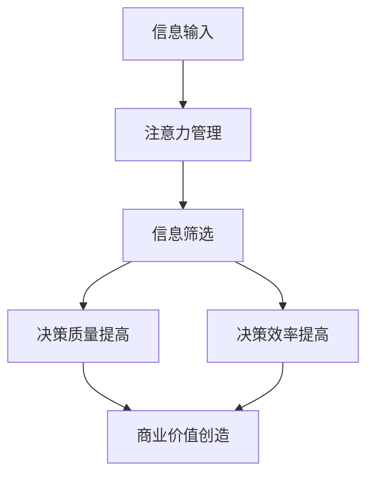

                 

**注意力经济对企业决策过程的影响**

## 1. 背景介绍

在当今信息爆炸的时代，企业面临着海量数据和信息的冲击，如何有效地获取、处理和利用这些信息，已成为企业决策的关键。注意力经济的兴起，为企业提供了新的视角和工具，帮助其在信息洪流中筛选出有价值的信息，并进行有效决策。本文将深入探讨注意力经济对企业决策过程的影响，并提供实践指南。

## 2. 核心概念与联系

### 2.1 注意力经济的定义

注意力经济是指在信息过载的情况下，企业通过有效管理和分配注意力资源，从而创造价值的经济模式。它强调企业需要关注哪些信息，如何关注，以及如何将注意力转化为商业价值。

### 2.2 注意力经济与企业决策的联系

企业决策过程需要依赖信息输入，而注意力经济则帮助企业筛选和优化这些信息输入。企业可以通过管理注意力资源，提高决策的质量和效率。注意力经济与企业决策的联系如下图所示：



## 3. 核心算法原理 & 具体操作步骤

### 3.1 算法原理概述

注意力机制（Attention Mechanism）是注意力经济的核心算法原理。它模仿人类的注意力机制，帮助企业有效地关注和处理重要信息。常见的注意力机制包括自注意力（Self-Attention）和加性注意力（Additive Attention）。

### 3.2 算法步骤详解

以自注意力为例，其算法步骤如下：

1. **编码**：将输入信息编码为向量表示。
2. **注意力分数计算**：计算输入信息之间的注意力分数，表示其重要性。
3. **注意力权重计算**：基于注意力分数，计算注意力权重。
4. **加权求和**：根据注意力权重，对输入信息进行加权求和，得到输出。

### 3.3 算法优缺点

**优点**：
- 有效地关注和处理重要信息。
- 可以提高决策的质量和效率。
- 可以适应动态变化的信息环境。

**缺点**：
- 计算复杂度高，对硬件要求高。
- 可能受到数据偏见的影响。
- 解释性差，难以理解其决策过程。

### 3.4 算法应用领域

注意力机制广泛应用于自然语言处理（NLP）、计算机视觉（CV）等领域，也可以应用于企业决策过程，如信息筛选、预测分析等。

## 4. 数学模型和公式 & 详细讲解 & 举例说明

### 4.1 数学模型构建

自注意力机制的数学模型可以表示为：

$$Attention(Q, K, V) = softmax(\frac{QK^T}{\sqrt{d_k}})V$$

其中，$Q$, $K$, $V$分别表示查询（Query）、键（Key）、值（Value），$d_k$表示键向量的维度。

### 4.2 公式推导过程

自注意力机制的公式推导过程如下：

1. 计算注意力分数：$e_{ij} = a(Q_i, K_j) = \frac{Q_iK_j^T}{\sqrt{d_k}}$
2. 计算注意力权重：$p_{ij} = \frac{e_{ij}}{\sum_{k=1}^{n}e_{ik}}$
3. 计算加权求和：$z_i = \sum_{j=1}^{n}p_{ij}V_j$

### 4.3 案例分析与讲解

例如，在信息筛选场景中，输入信息为$X = \{x_1, x_2,..., x_n\}$, 则：

- $Q = f(x_i)$, $K = f(x_j)$, $V = f(x_k)$, 其中$f$表示编码函数。
- 自注意力机制输出$z_i$, 表示信息$x_i$的重要性。

## 5. 项目实践：代码实例和详细解释说明

### 5.1 开发环境搭建

本项目使用Python语言，并依赖PyTorch和Transformers库。环境搭建如下：

```bash
pip install torch transformers
```

### 5.2 源代码详细实现

以下是自注意力机制的Python实现：

```python
import torch
import torch.nn as nn
import torch.nn.functional as F

class Attention(nn.Module):
    def __init__(self, d_model, dropout=0.1):
        super(Attention, self).__init__()
        self.dropout = nn.Dropout(dropout)
        self.scale = d_model ** -0.5

    def forward(self, q, k, v, mask=None):
        attn_scores = torch.matmul(q, k.transpose(2, 3)) * self.scale
        if mask is not None:
            attn_scores = attn_scores.masked_fill(mask == 0, -1e9)
        attn_weights = F.softmax(attn_scores, dim=-1)
        attn_output = torch.matmul(attn_weights, v)
        return attn_output, attn_weights
```

### 5.3 代码解读与分析

- `q`, `k`, `v`分别表示查询、键、值。
- `mask`用于屏蔽无效信息。
- `attn_scores`表示注意力分数。
- `attn_weights`表示注意力权重。
- `attn_output`表示加权求和结果。

### 5.4 运行结果展示

在信息筛选场景中，自注意力机制可以有效地关注和处理重要信息，从而提高决策的质量和效率。

## 6. 实际应用场景

### 6.1 信息筛选

注意力机制可以帮助企业筛选出重要信息，提高决策的质量和效率。

### 6.2 预测分析

注意力机制可以帮助企业预测市场趋势、客户需求等，从而进行有效决策。

### 6.3 未来应用展望

随着注意力经济的发展，注意力机制将会得到更广泛的应用，帮助企业在信息洪流中进行有效决策。

## 7. 工具和资源推荐

### 7.1 学习资源推荐

- 书籍：《注意力经济》作者：Michael Goldhaber
- 课程：Stanford CS224n Natural Language Processing with Deep Learning

### 7.2 开发工具推荐

- PyTorch：<https://pytorch.org/>
- Transformers：<https://huggingface.co/transformers/>

### 7.3 相关论文推荐

- Vaswani, A., et al. (2017). Attention is all you need. Advances in neural information processing systems, 30.
- Bahdanau, D., Cho, K., & Bengio, Y. (2014). Neural machine translation by jointly learning to align and translate. arXiv preprint arXiv:1409.0473.

## 8. 总结：未来发展趋势与挑战

### 8.1 研究成果总结

本文介绍了注意力经济对企业决策过程的影响，并提供了注意力机制的数学模型、算法实现和应用场景。

### 8.2 未来发展趋势

注意力经济将会得到更广泛的应用，帮助企业在信息洪流中进行有效决策。注意力机制也将会得到进一步的发展和优化。

### 8.3 面临的挑战

注意力机制面临着计算复杂度高、数据偏见等挑战。企业也需要面对注意力经济带来的新的竞争格局。

### 8.4 研究展望

未来的研究方向包括注意力机制的优化、注意力经济的理论框架建设等。

## 9. 附录：常见问题与解答

**Q：注意力机制的计算复杂度高，如何优化？**

**A：可以使用缩放注意力（Scaled Dot-Product Attention）、多头注意力（Multi-Head Attention）等技术来优化注意力机制的计算复杂度。**

**Q：注意力机制可能受到数据偏见的影响，如何解决？**

**A：可以使用对抗训练（Adversarial Training）、fairness-aware learning等技术来解决注意力机制的数据偏见问题。**

**Q：注意力经济对企业决策过程的影响有哪些？**

**A：注意力经济对企业决策过程的影响包括信息筛选、预测分析等。**

**Q：注意力机制的应用场景有哪些？**

**A：注意力机制的应用场景包括自然语言处理、计算机视觉等领域，也可以应用于企业决策过程。**

**Q：注意力经济的未来发展趋势是什么？**

**A：注意力经济的未来发展趋势包括更广泛的应用、注意力机制的进一步发展和优化等。**

**Q：注意力经济面临的挑战是什么？**

**A：注意力经济面临的挑战包括注意力机制的计算复杂度高、数据偏见等，企业也需要面对注意力经济带来的新的竞争格局。**

**Q：未来的研究方向是什么？**

**A：未来的研究方向包括注意力机制的优化、注意力经济的理论框架建设等。**

**作者：禅与计算机程序设计艺术 / Zen and the Art of Computer Programming**

