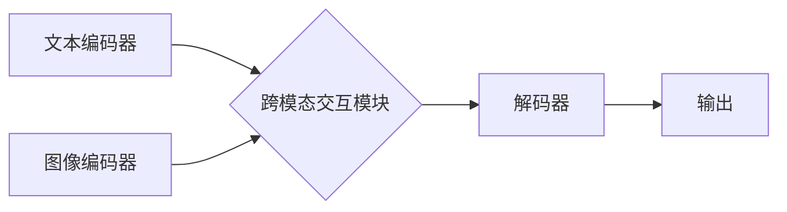

> 多模态大模型、自然语言处理、计算机视觉、音频处理、多模态融合、Transformer、BERT、GPT、DALL-E、CLIP

## 1. 背景介绍

近年来，人工智能领域取得了令人瞩目的进展，其中多模态大模型 (Multimodal Large Language Models, MLLMs) 作为一种新兴技术，展现出巨大的潜力。与传统的单模态大模型相比，多模态大模型能够处理多种类型的数据，例如文本、图像、音频等，并从中学习更丰富的知识和表示。

传统的单模态大模型，例如 BERT 和 GPT，主要专注于处理文本数据，而多模态大模型则能够跨越模态边界，理解和生成多种形式的信息。这使得多模态大模型在许多应用场景中具有独特的优势，例如：

* **图像字幕生成:**  根据图像内容自动生成文本描述。
* **视频理解:**  理解视频内容，例如动作识别、事件检测和情感分析。
* **跨模态检索:**  根据文本查询找到相关的图像或视频。
* **文本到图像生成:**  根据文本描述生成相应的图像。
* **多模态对话系统:**  构建能够理解和生成多种模态信息的对话系统。

## 2. 核心概念与联系

多模态大模型的核心概念是将不同模态的数据融合在一起，学习一种统一的表示，从而实现跨模态理解和生成。

**2.1 多模态融合策略**

多模态融合策略是指将不同模态的数据组合在一起的方法。常见的融合策略包括：

* **早期融合:** 将不同模态的数据在低层特征提取阶段进行融合。
* **晚期融合:** 将不同模态的数据在高层特征提取阶段进行融合。
* **层次融合:** 将不同模态的数据在多个层次进行融合。

**2.2 多模态模型架构**

多模态模型的架构通常由以下几个部分组成：

* **模态编码器:**  负责将不同模态的数据编码成特征向量。
* **跨模态交互模块:**  负责融合不同模态的特征向量。
* **解码器:**  负责根据融合后的特征向量生成最终的输出。

**2.3 Mermaid 流程图**



## 3. 核心算法原理 & 具体操作步骤

### 3.1  算法原理概述

多模态大模型的训练通常基于监督学习，需要大量的标注数据。训练目标是让模型能够准确地预测不同模态之间的关系，例如图像和文本之间的对应关系。

常用的训练方法包括：

* **对比学习:**  通过对比不同模态之间的相似性和差异性来学习特征表示。
* **自监督学习:**  通过设计一些自监督任务，例如图像字幕生成或文本到图像生成，来训练模型。

### 3.2  算法步骤详解

1. **数据预处理:**  将不同模态的数据进行预处理，例如文本分词、图像裁剪和音频降噪。
2. **特征提取:**  使用预训练的模型或自定义模型提取不同模态的数据特征。
3. **跨模态融合:**  使用跨模态交互模块将不同模态的特征融合在一起。
4. **模型训练:**  使用监督学习方法训练模型，优化模型参数。
5. **模型评估:**  使用测试集评估模型的性能，例如准确率、召回率和F1-score。

### 3.3  算法优缺点

**优点:**

* 能够处理多种类型的数据，学习更丰富的知识和表示。
* 在许多应用场景中具有独特的优势，例如图像字幕生成和视频理解。

**缺点:**

* 需要大量的标注数据进行训练。
* 模型训练复杂度高，需要强大的计算资源。

### 3.4  算法应用领域

多模态大模型在许多领域都有广泛的应用，例如：

* **计算机视觉:**  图像识别、目标检测、图像分割、图像生成。
* **自然语言处理:**  文本分类、情感分析、机器翻译、对话系统。
* **语音识别:**  语音转文本、语音合成。
* **医疗保健:**  疾病诊断、医学图像分析。
* **教育:**  个性化学习、智能辅导。

## 4. 数学模型和公式 & 详细讲解 & 举例说明

### 4.1  数学模型构建

多模态大模型的数学模型通常基于深度学习框架，例如 TensorFlow 或 PyTorch。模型的结构通常由多个层组成，例如卷积层、全连接层和注意力层。

### 4.2  公式推导过程

多模态大模型的训练目标通常是最大化似然函数，即预测正确的输出概率。

假设我们有一个包含文本和图像的训练样本，文本为 $t$，图像为 $v$，对应的标签为 $y$。模型的输出为 $p(y|t,v)$，则似然函数为：

$$
L = \prod_{i=1}^{N} p(y_i|t_i,v_i)
$$

其中 $N$ 为训练样本的数量。

模型的训练目标是最大化似然函数，可以使用梯度下降算法进行优化。

### 4.3  案例分析与讲解

例如，在图像字幕生成任务中，模型的输入是图像 $v$，输出是文本 $t$。模型的训练目标是最大化文本 $t$ 在给定图像 $v$ 的条件下的概率，即 $p(t|v)$。

可以使用对比学习方法训练模型。将图像 $v$ 和文本 $t$ 作为正样本对，将图像 $v$ 和随机生成的文本 $t'$ 作为负样本对。训练目标是让模型将正样本对的相似度最大化，负样本对的相似度最小化。

## 5. 项目实践：代码实例和详细解释说明

### 5.1  开发环境搭建

* Python 3.7+
* TensorFlow 2.0+ 或 PyTorch 1.0+
* CUDA 和 cuDNN (可选，用于GPU加速)

### 5.2  源代码详细实现

```python
import tensorflow as tf

# 定义图像编码器
image_encoder = tf.keras.Sequential([
    tf.keras.layers.Conv2D(32, (3, 3), activation='relu'),
    tf.keras.layers.MaxPooling2D((2, 2)),
    tf.keras.layers.Conv2D(64, (3, 3), activation='relu'),
    tf.keras.layers.MaxPooling2D((2, 2)),
    tf.keras.layers.Flatten(),
    tf.keras.layers.Dense(128, activation='relu')
])

# 定义文本编码器
text_encoder = tf.keras.Sequential([
    tf.keras.layers.Embedding(vocab_size, embedding_dim),
    tf.keras.layers.LSTM(128)
])

# 定义跨模态交互模块
cross_modal_interaction = tf.keras.layers.Dot(axes=1)

# 定义解码器
decoder = tf.keras.Sequential([
    tf.keras.layers.Dense(vocab_size, activation='softmax')
])

# 定义多模态模型
model = tf.keras.Model(inputs=[image_input, text_input], outputs=decoder(cross_modal_interaction([image_encoder(image_input), text_encoder(text_input)])))

# 编译模型
model.compile(optimizer='adam', loss='sparse_categorical_crossentropy', metrics=['accuracy'])
```

### 5.3  代码解读与分析

* 代码首先定义了图像编码器、文本编码器和跨模态交互模块。
* 然后定义了解码器，用于生成文本输出。
* 最后将所有模块组合成多模态模型，并使用 Adam 优化器、交叉熵损失函数和准确率作为评估指标进行训练。

### 5.4  运行结果展示

训练完成后，可以使用模型对新的图像和文本进行预测，例如生成图像的字幕。

## 6. 实际应用场景

### 6.1  图像字幕生成

多模态大模型可以根据图像内容自动生成文本描述，例如为图片添加标题、生成产品描述或为视频添加字幕。

### 6.2  视频理解

多模态大模型可以理解视频内容，例如识别动作、检测事件和分析情感。

### 6.3  跨模态检索

多模态大模型可以根据文本查询找到相关的图像或视频，例如搜索“猫”图片时，可以找到与“猫”相关的图像和视频。

### 6.4  未来应用展望

多模态大模型在未来将有更广泛的应用，例如：

* **虚拟助手:**  构建能够理解和响应多种模态信息的虚拟助手。
* **增强现实:**  为增强现实应用提供更丰富的交互体验。
* **个性化教育:**  根据学生的学习风格和需求提供个性化的学习内容。

## 7. 工具和资源推荐

### 7.1  学习资源推荐

* **书籍:**
    * 《深度学习》 by Ian Goodfellow, Yoshua Bengio, and Aaron Courville
    * 《自然语言处理》 by Dan Jurafsky and James H. Martin
* **在线课程:**
    * Coursera: Deep Learning Specialization
    * Udacity: Artificial Intelligence Nanodegree

### 7.2  开发工具推荐

* **TensorFlow:**  开源深度学习框架
* **PyTorch:**  开源深度学习框架
* **Hugging Face Transformers:**  预训练多模态模型库

### 7.3  相关论文推荐

* **BERT: Pre-training of Deep Bidirectional Transformers for Language Understanding**
* **GPT-3: Language Models are Few-Shot Learners**
* **DALL-E: Creating Images from Text**
* **CLIP: Contrastive Language-Image Pre-training**

## 8. 总结：未来发展趋势与挑战

### 8.1  研究成果总结

多模态大模型在过去几年取得了显著进展，能够处理多种类型的数据，并展现出强大的能力。

### 8.2  未来发展趋势

* **模型规模和能力的提升:**  未来将会有更大规模、更强大的多模态大模型出现。
* **跨模态理解和生成能力的增强:**  模型将能够更好地理解和生成不同模态之间的关系。
* **应用场景的拓展:**  多模态大模型将应用于更多领域，例如医疗保健、教育和娱乐。

### 8.3  面临的挑战

* **数据获取和标注:**  多模态大模型需要大量的标注数据，获取和标注这些数据成本高昂。
* **模型训练和推理效率:**  训练和推理大型多模态模型需要强大的计算资源。
* **模型解释性和可解释性:**  多模态大模型的决策过程复杂，难以解释和理解。

### 8.4  研究展望

未来研究将集中在解决上述挑战，例如：

* 开发新的数据获取和标注方法。
* 设计更有效的模型训练和推理算法。
* 研究多模态大模型的解释性和可解释性。


## 9. 附录：常见问题与解答

**Q1: 多模态大模型与单模态大模型有什么区别？**

**A1:** 单模态大模型只能处理一种类型的输入数据，例如文本或图像。而多模态大模型能够处理多种类型的数据，例如文本、图像、音频等，并学习不同模态之间的关系。

**Q2: 多模态大模型的训练需要哪些数据？**

**A2:** 多模态大模型的训练需要大量的标注数据，例如图像和文本的配对数据。

**Q3: 多模态大模型有哪些应用场景？**

**A3:** 多模态大模型的应用场景非常广泛，例如图像字幕生成、视频理解、跨模态检索、文本到图像生成等。

**Q4: 如何评估多模态大模型的性能？**

**A4