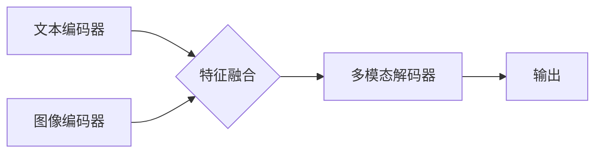

> 多模态大模型，文本多模态，深度学习，Transformer，视觉语言理解，图像生成，自然语言处理

## 1. 背景介绍

近年来，人工智能领域取得了令人瞩目的进展，其中深度学习技术扮演着至关重要的角色。传统的深度学习模型主要专注于单一模态数据，例如文本或图像。然而，现实世界中信息往往以多模态形式存在，例如文本、图像、音频、视频等。因此，如何有效地融合多模态信息，构建能够理解和生成跨模态内容的大模型，成为人工智能研究的热点和挑战。

多模态大模型 (Multimodal Large Models, MMLMs) 旨在学习和理解不同模态之间的关系，从而实现跨模态的感知、理解和生成。与单模态模型相比，MMLMs具有更强的表达能力和泛化能力，能够更好地模拟人类的认知方式。

## 2. 核心概念与联系

**2.1 多模态数据**

多模态数据是指包含多种不同类型信息的集合。例如，一张图片可以包含视觉信息、文本信息（例如图片标题、描述）、音频信息（例如图片中的人物说话声）等。

**2.2 多模态融合**

多模态融合是指将不同模态的数据进行有效地结合，提取其潜在的关联性和语义信息。

**2.3 多模态大模型架构**

MMLMs通常采用以下几种架构：

* **共享表示学习:** 不同的模态数据分别经过各自的编码器，然后将编码后的特征进行融合，学习共享的表示。
* **跨模态注意力机制:** 利用注意力机制学习不同模态之间的关系，赋予不同模态不同的权重，从而更好地融合信息。
* **多任务学习:** 将多个多模态任务联合训练，例如图像字幕生成、视觉问答、文本到图像生成等，通过共享参数和知识，提升模型的性能。

**2.4 Mermaid 流程图**



## 3. 核心算法原理 & 具体操作步骤

### 3.1  算法原理概述

多模态大模型的训练主要基于深度学习的原理，利用大量的多模态数据进行监督学习。模型的目标是学习到不同模态之间的关系，并能够根据输入的多模态信息生成相应的输出。

### 3.2  算法步骤详解

1. **数据预处理:** 将多模态数据进行清洗、格式化和转换，例如将图像进行裁剪、缩放、增强，将文本进行分词、词嵌入等。
2. **模型构建:** 根据选择的架构，构建多模态大模型，包括文本编码器、图像编码器、特征融合模块和解码器等。
3. **模型训练:** 利用训练数据，通过反向传播算法，优化模型参数，使得模型能够准确地预测输出。
4. **模型评估:** 使用测试数据评估模型的性能，例如准确率、召回率、F1-score等。
5. **模型部署:** 将训练好的模型部署到实际应用场景中，例如图像字幕生成、视觉问答、文本到图像生成等。

### 3.3  算法优缺点

**优点:**

* 能够学习到不同模态之间的关系，提升模型的理解能力和泛化能力。
* 能够处理更复杂、更丰富的多模态数据。
* 在跨模态任务中表现优异，例如图像字幕生成、视觉问答等。

**缺点:**

* 训练数据量大，计算资源消耗高。
* 模型结构复杂，训练难度大。
* 跨模态融合的算法设计仍然存在挑战。

### 3.4  算法应用领域

* **计算机视觉:** 图像字幕生成、视觉问答、目标检测、图像分类等。
* **自然语言处理:** 文本摘要、机器翻译、情感分析、对话系统等。
* **人机交互:** 语音识别、语音合成、手势识别等。
* **医疗保健:** 病理图像分析、疾病诊断、药物研发等。
* **教育:** 智能辅导、个性化学习等。

## 4. 数学模型和公式 & 详细讲解 & 举例说明

### 4.1  数学模型构建

多模态大模型的数学模型通常基于深度学习框架，例如TensorFlow或PyTorch。模型的结构由多个层组成，例如卷积层、全连接层、注意力层等。

### 4.2  公式推导过程

例如，在图像字幕生成任务中，模型的输出是一个文本序列，可以采用循环神经网络 (RNN) 或Transformer来生成。

**Transformer** 的注意力机制可以学习图像和文本之间的关系，并生成更准确的字幕。

**注意力机制公式:**

$$
Attention(Q, K, V) = \frac{exp(Q \cdot K^T / \sqrt{d_k})}{exp(Q \cdot K^T / \sqrt{d_k})} \cdot V
$$

其中，Q、K、V分别代表查询矩阵、键矩阵和值矩阵，$d_k$ 是键向量的维度。

### 4.3  案例分析与讲解

例如，在图像字幕生成任务中，模型可以将图像编码为一个特征向量，然后将该特征向量与文本编码器输入，生成相应的字幕。

## 5. 项目实践：代码实例和详细解释说明

### 5.1  开发环境搭建

使用Python语言，并安装必要的深度学习库，例如TensorFlow或PyTorch。

### 5.2  源代码详细实现

```python
# 使用TensorFlow构建多模态大模型
import tensorflow as tf

# 定义文本编码器
text_encoder = tf.keras.Sequential([
    tf.keras.layers.Embedding(vocab_size, embedding_dim),
    tf.keras.layers.LSTM(units)
])

# 定义图像编码器
image_encoder = tf.keras.Sequential([
    tf.keras.layers.Conv2D(filters, kernel_size),
    tf.keras.layers.MaxPooling2D(),
    tf.keras.layers.Flatten()
])

# 定义特征融合模块
fusion_module = tf.keras.layers.Concatenate()

# 定义多模态解码器
decoder = tf.keras.Sequential([
    # ...
])

# 定义模型
model = tf.keras.Model(inputs=[text_input, image_input], outputs=decoder(fusion_module([text_encoder(text_input), image_encoder(image_input)])))

# 编译模型
model.compile(optimizer='adam', loss='categorical_crossentropy', metrics=['accuracy'])

# 训练模型
model.fit(train_data, epochs=10)
```

### 5.3  代码解读与分析

代码示例展示了使用TensorFlow构建多模态大模型的基本流程。

* 文本编码器和图像编码器分别负责对文本和图像进行编码。
* 特征融合模块将编码后的文本和图像特征进行融合。
* 多模态解码器根据融合后的特征生成输出。

### 5.4  运行结果展示

训练完成后，可以使用测试数据评估模型的性能，例如准确率、召回率、F1-score等。

## 6. 实际应用场景

### 6.1  图像字幕生成

MMLMs可以将图像转换为文本描述，例如生成图片的标题、说明或故事。

### 6.2  视觉问答

MMLMs可以理解图像中的内容，并回答与图像相关的问答。

### 6.3  文本到图像生成

MMLMs可以根据文本描述生成相应的图像。

### 6.4  未来应用展望

* **更智能的搜索引擎:** 基于多模态信息的搜索引擎能够更准确地理解用户意图，并提供更相关的搜索结果。
* **增强现实 (AR) 和虚拟现实 (VR):** MMLMs可以为AR和VR应用提供更丰富的交互体验，例如识别物体、理解场景、生成虚拟内容等。
* **个性化教育:** MMLMs可以根据学生的学习风格和需求，提供个性化的学习内容和辅导。

## 7. 工具和资源推荐

### 7.1  学习资源推荐

* **书籍:**
    * 《深度学习》
    * 《自然语言处理》
    * 《计算机视觉》
* **在线课程:**
    * Coursera
    * edX
    * Udacity

### 7.2  开发工具推荐

* **TensorFlow:** 开源深度学习框架
* **PyTorch:** 开源深度学习框架
* **Hugging Face:** 多模态模型库

### 7.3  相关论文推荐

* **BERT:** Devlin et al. (2018)
* **GPT-3:** Brown et al. (2020)
* **DALL-E:** Radford et al. (2021)

## 8. 总结：未来发展趋势与挑战

### 8.1  研究成果总结

近年来，多模态大模型取得了显著进展，在跨模态任务中展现出强大的能力。

### 8.2  未来发展趋势

* **模型规模和能力的提升:** 未来，MMLMs的规模和能力将进一步提升，能够处理更复杂、更丰富的多模态数据。
* **跨模态理解和生成能力的增强:** MMLMs将能够更好地理解和生成跨模态内容，例如将图像转换为视频、将文本转换为音频等。
* **个性化和可解释性:** MMLMs将更加个性化，能够根据用户的需求和偏好提供定制化的服务。同时，MMLMs的决策过程也将更加透明可解释。

### 8.3  面临的挑战

* **数据获取和标注:** 多模态数据的获取和标注成本高，需要大量的标注数据才能训练出高质量的MMLMs。
* **模型训练和推理效率:** MMLMs的训练和推理效率仍然是一个挑战，需要开发更有效的算法和硬件架构。
* **伦理和安全问题:** MMLMs的应用可能带来伦理和安全问题，例如数据隐私、算法偏见、虚假信息生成等，需要制定相应的规范和政策。

### 8.4  研究展望

未来，多模态大模型将成为人工智能领域的重要研究方向，并将在各个领域发挥越来越重要的作用。

## 9. 附录：常见问题与解答

**Q1: 多模态大模型与传统深度学习模型有什么区别？**

**A1:** 多模态大模型能够处理多种不同类型的模态数据，而传统深度学习模型通常只处理单一模态数据。

**Q2: 如何训练多模态大模型？**

**A2:** 多模态大模型的训练需要大量的多模态数据，并使用深度学习算法进行监督学习。

**Q3: 多模态大模型有哪些应用场景？**

**A3:** 多模态大模型的应用场景非常广泛，例如图像字幕生成、视觉问答、文本到图像生成、智能搜索引擎、增强现实等。

作者：禅与计算机程序设计艺术 / Zen and the Art of Computer Programming


<end_of_turn>