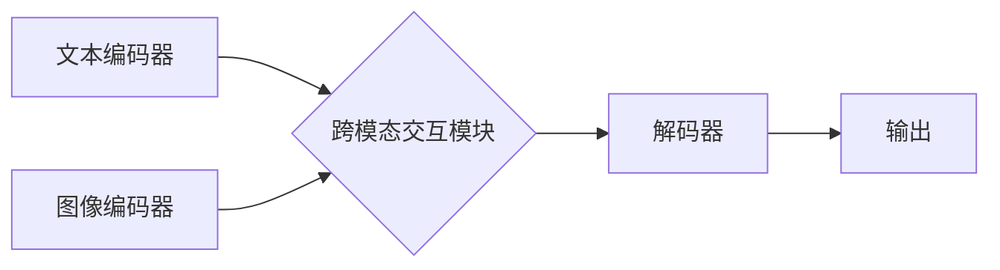

> 多模态大模型、自然语言处理、计算机视觉、语音识别、Transformer、BERT、GPT、DALL-E、图像生成、文本生成、机器学习、深度学习

## 1. 背景介绍

近年来，人工智能（AI）技术取得了飞速发展，其中，大模型在自然语言处理（NLP）、计算机视觉（CV）、语音识别等领域展现出强大的应用潜力。多模态大模型作为一种融合多种模态信息的大型AI模型，其能力超越了单模态模型，能够理解和生成多种形式的数据，例如文本、图像、音频等。

传统的单模态模型只能处理一种类型的输入数据，例如只能处理文本或图像。而多模态大模型则能够同时处理多种类型的输入数据，并学习不同模态之间的关系，从而获得更丰富的知识和更深刻的理解。

多模态大模型的出现，标志着人工智能迈向更智能、更全面的发展阶段。它为我们提供了更强大的工具，可以用于解决更复杂的问题，并创造出更智能的应用场景。

## 2. 核心概念与联系

多模态大模型的核心概念是融合不同模态的信息，并学习不同模态之间的关系。

**2.1 多模态信息融合**

多模态信息融合是指将来自不同模态的数据进行整合，形成一个综合的表示。常用的多模态信息融合方法包括：

* **早期融合:** 将不同模态的数据在特征提取阶段进行融合，例如将文本和图像的特征进行拼接。
* **晚期融合:** 将不同模态的数据在决策阶段进行融合，例如将文本和图像的分类结果进行投票。
* **跨模态注意力机制:** 学习不同模态之间的关系，并根据关系的重要性赋予不同的权重。

**2.2 多模态关系学习**

多模态关系学习是指学习不同模态之间存在的语义关系。例如，学习图像和文本之间的对应关系，或者学习音频和文本之间的情感关系。

**2.3 多模态大模型架构**

多模态大模型的架构通常由以下几个部分组成：

* **模态编码器:** 负责将不同模态的数据编码成特征向量。
* **跨模态交互模块:** 负责学习不同模态之间的关系。
* **解码器:** 负责根据编码后的特征向量生成最终的输出。

**Mermaid 流程图**



## 3. 核心算法原理 & 具体操作步骤

### 3.1  算法原理概述

多模态大模型的训练主要基于深度学习算法，例如Transformer。Transformer是一种基于注意力机制的神经网络架构，能够有效地学习长距离依赖关系。

多模态大模型的训练目标是学习不同模态之间的关系，并能够根据输入的多模态数据生成相应的输出。例如，训练一个图像和文本对齐模型，目标是学习图像和文本之间的对应关系，能够将图像与相应的文本进行匹配。

### 3.2  算法步骤详解

1. **数据预处理:** 将多模态数据进行预处理，例如文本分词、图像裁剪、音频降噪等。
2. **特征提取:** 使用不同的编码器提取不同模态的数据特征。例如，使用BERT模型提取文本特征，使用ResNet模型提取图像特征。
3. **跨模态交互:** 使用跨模态交互模块学习不同模态之间的关系。例如，使用注意力机制学习图像和文本之间的对应关系。
4. **解码:** 使用解码器根据编码后的特征向量生成最终的输出。例如，生成图像和文本的匹配结果。
5. **损失函数:** 使用损失函数衡量模型的预测结果与真实结果之间的差异。例如，使用交叉熵损失函数衡量图像和文本匹配结果的准确率。
6. **模型训练:** 使用梯度下降算法优化模型参数，降低损失函数的值。

### 3.3  算法优缺点

**优点:**

* 能够处理多种类型的输入数据，并学习不同模态之间的关系。
* 能够获得更丰富的知识和更深刻的理解。
* 能够解决更复杂的问题，并创造出更智能的应用场景。

**缺点:**

* 训练成本高，需要大量的计算资源和数据。
* 模型复杂度高，难以理解和调试。
* 存在数据偏差和公平性问题。

### 3.4  算法应用领域

多模态大模型在以下领域具有广泛的应用前景：

* **图像识别和理解:** 结合文本信息进行图像识别和理解，例如识别图像中的物体和场景，并理解图像的语义内容。
* **视频分析:** 结合文本信息进行视频分析，例如识别视频中的事件和人物，并理解视频的剧情和情感。
* **机器翻译:** 结合图像信息进行机器翻译，例如翻译包含图像的文本。
* **聊天机器人:** 结合图像和语音信息进行聊天机器人对话，例如能够理解用户发来的图像和语音信息，并进行相应的回复。

## 4. 数学模型和公式 & 详细讲解 & 举例说明

### 4.1  数学模型构建

多模态大模型的数学模型通常基于深度学习框架，例如TensorFlow或PyTorch。模型的结构由多个层组成，每个层都有特定的计算公式。

例如，Transformer模型的注意力机制使用以下公式计算注意力权重：

$$
\text{Attention}(Q, K, V) = \text{softmax}\left(\frac{QK^T}{\sqrt{d_k}}\right)V
$$

其中，Q、K、V分别代表查询矩阵、键矩阵和值矩阵，$d_k$代表键向量的维度。

### 4.2  公式推导过程

注意力机制的公式推导过程可以参考相关文献，例如Vaswani et al. (2017)的论文《Attention Is All You Need》。

### 4.3  案例分析与讲解

例如，在图像和文本对齐任务中，可以使用注意力机制学习图像和文本之间的对应关系。

假设我们有一个图像和一个文本，我们需要找到图像中与文本内容相对应的区域。可以使用注意力机制计算图像和文本之间的注意力权重，权重高的区域表示图像中与文本内容更相关的区域。

## 5. 项目实践：代码实例和详细解释说明

### 5.1  开发环境搭建

需要安装Python、TensorFlow或PyTorch等深度学习框架，以及相关的库，例如OpenCV、PIL等。

### 5.2  源代码详细实现

以下是一个简单的多模态大模型代码示例，使用TensorFlow框架实现图像和文本对齐任务：

```python
import tensorflow as tf

# 定义图像和文本编码器
image_encoder = tf.keras.Sequential([
    tf.keras.layers.Conv2D(32, (3, 3), activation='relu'),
    tf.keras.layers.MaxPooling2D((2, 2)),
    tf.keras.layers.Flatten(),
    tf.keras.layers.Dense(128, activation='relu')
])

text_encoder = tf.keras.Sequential([
    tf.keras.layers.Embedding(vocab_size, embedding_dim),
    tf.keras.layers.LSTM(128)
])

# 定义跨模态交互模块
cross_modal_interaction = tf.keras.layers.Dot(axes=1)

# 定义解码器
decoder = tf.keras.Sequential([
    tf.keras.layers.Dense(128, activation='relu'),
    tf.keras.layers.Dense(vocab_size, activation='softmax')
])

# 定义模型
model = tf.keras.Model(inputs=[image_input, text_input], outputs=decoder(cross_modal_interaction([image_encoder(image_input), text_encoder(text_input)])))

# 编译模型
model.compile(optimizer='adam', loss='sparse_categorical_crossentropy', metrics=['accuracy'])

# 训练模型
model.fit(train_data, epochs=10)
```

### 5.3  代码解读与分析

代码示例展示了使用TensorFlow框架构建一个简单的多模态大模型的基本流程。

* 首先定义了图像和文本编码器，分别提取图像和文本的特征。
* 然后定义了跨模态交互模块，学习图像和文本之间的关系。
* 最后定义了解码器，根据编码后的特征向量生成最终的输出。

### 5.4  运行结果展示

训练完成后，可以使用模型对新的图像和文本进行预测，例如预测图像中与文本内容相对应的区域。

## 6. 实际应用场景

### 6.1  图像字幕生成

多模态大模型可以结合图像和文本信息，生成图像的字幕。例如，可以将一张图片输入到模型中，模型会根据图片内容生成相应的文字描述。

### 6.2  视频问答

多模态大模型可以结合视频和文本信息，回答关于视频的问题。例如，可以将一段视频输入到模型中，并输入一个关于视频的问题，模型会根据视频内容和问题进行分析，并给出相应的答案。

### 6.3  多模态搜索

多模态大模型可以结合图像、文本和语音信息，进行多模态搜索。例如，用户可以输入一张图片或一段语音，模型会根据输入信息搜索相关的文本和图像结果。

### 6.4  未来应用展望

多模态大模型在未来将有更广泛的应用场景，例如：

* **增强现实 (AR) 和虚拟现实 (VR):** 多模态大模型可以增强 AR 和 VR 体验，例如可以理解用户在虚拟环境中的动作和意图，并提供更个性化的交互体验。
* **医疗保健:** 多模态大模型可以辅助医生诊断疾病，例如可以分析患者的医学影像和病历信息，并提供诊断建议。
* **教育:** 多模态大模型可以提供更生动的学习体验，例如可以结合文本、图像和视频内容，进行个性化的教学。

## 7. 工具和资源推荐

### 7.1  学习资源推荐

* **书籍:**
    * 《深度学习》 by Ian Goodfellow, Yoshua Bengio, and Aaron Courville
    * 《自然语言处理》 by Dan Jurafsky and James H. Martin
* **在线课程:**
    * Coursera: Deep Learning Specialization
    * Stanford CS224N: Natural Language Processing with Deep Learning

### 7.2  开发工具推荐

* **TensorFlow:** https://www.tensorflow.org/
* **PyTorch:** https://pytorch.org/
* **Hugging Face Transformers:** https://huggingface.co/transformers/

### 7.3  相关论文推荐

* **Attention Is All You Need:** https://arxiv.org/abs/1706.03762
* **BERT: Pre-training of Deep Bidirectional Transformers for Language Understanding:** https://arxiv.org/abs/1810.04805
* **GPT-3: Language Models are Few-Shot Learners:** https://arxiv.org/abs/2005.14165

## 8. 总结：未来发展趋势与挑战

### 8.1  研究成果总结

多模态大模型在自然语言处理、计算机视觉、语音识别等领域取得了显著的成果，能够处理多种类型的输入数据，并学习不同模态之间的关系。

### 8.2  未来发展趋势

* **模型规模和能力的提升:** 未来多模态大模型的规模和能力将进一步提升，能够处理更复杂的任务，并获得更深刻的理解。
* **跨模态知识的融合:** 未来多模态大模型将更加注重跨模态知识的融合，能够更好地理解和生成多模态数据。
* **个性化和可解释性:** 未来多模态大模型将更加注重个性化和可解释性，能够根据用户的需求提供个性化的服务，并解释模型的决策过程。

### 8.3  面临的挑战

* **数据获取和标注:** 多模态数据的获取和标注成本较高，需要大量的标注数据才能训练出高质量的