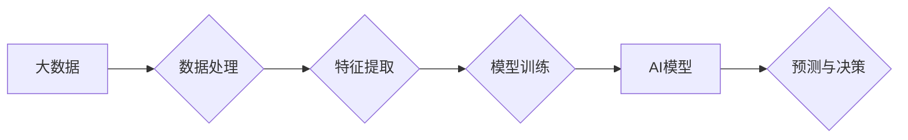

> 大数据，人工智能，机器学习，深度学习，数据挖掘，算法训练，模型性能

## 1. 背景介绍

人工智能（AI）近年来发展迅速，已渗透到各个领域，从自动驾驶到医疗诊断，从个性化推荐到金融风险控制，AI技术的应用正在改变着我们的生活。而支撑AI发展的关键因素之一就是大数据。

大数据是指海量、高速、多样化的数据，其规模、速度和复杂性远远超过传统数据处理能力。大数据蕴含着丰富的知识和价值，为AI算法的训练和优化提供了充足的燃料。

## 2. 核心概念与联系

**2.1 大数据与人工智能的关系**

大数据为人工智能提供了训练数据，而人工智能则通过对大数据的分析和学习，挖掘出其中的价值和规律。两者之间存在着相互依存、相互促进的关系。

**2.2 数据驱动型AI**

现代人工智能的发展趋势是数据驱动型AI，即通过大量的训练数据来训练和优化AI模型。

**2.3 数据质量与模型性能**

大数据的质量直接影响着AI模型的性能。高质量的数据能够帮助AI模型更准确地学习和预测，而低质量的数据则会导致模型性能下降甚至失效。

**2.4 数据处理与AI算法**

大数据处理技术，例如分布式存储、并行计算和数据挖掘，为AI算法的训练和应用提供了必要的技术支撑。

**Mermaid 流程图**



## 3. 核心算法原理 & 具体操作步骤

**3.1 算法原理概述**

机器学习算法是人工智能的核心，它通过学习数据中的模式和规律，来预测未来事件或做出决策。常见的机器学习算法包括：

* **监督学习:** 利用标记数据训练模型，例如分类和回归。
* **无监督学习:** 从未标记数据中发现模式和结构，例如聚类和降维。
* **强化学习:** 通过试错学习，在环境中获得最大奖励。

**3.2 算法步骤详解**

以监督学习为例，其基本步骤如下：

1. **数据收集和预处理:** 收集相关数据，并进行清洗、转换和特征工程等预处理操作。
2. **模型选择:** 根据任务需求选择合适的机器学习算法。
3. **模型训练:** 利用训练数据训练模型，调整模型参数，使其能够准确地预测目标变量。
4. **模型评估:** 使用测试数据评估模型的性能，例如准确率、召回率和F1-score等指标。
5. **模型部署:** 将训练好的模型部署到实际应用场景中，用于预测和决策。

**3.3 算法优缺点**

不同的机器学习算法具有不同的优缺点，需要根据具体任务选择合适的算法。例如，决策树算法易于理解和解释，但泛化能力较弱；支持向量机算法具有较好的泛化能力，但训练时间较长。

**3.4 算法应用领域**

机器学习算法广泛应用于各个领域，例如：

* **图像识别:** 人脸识别、物体检测、图像分类等。
* **自然语言处理:** 文本分类、情感分析、机器翻译等。
* **推荐系统:** 商品推荐、内容推荐、用户画像等。
* **金融风险控制:** 欺诈检测、信用评分、风险评估等。

## 4. 数学模型和公式 & 详细讲解 & 举例说明

**4.1 数学模型构建**

机器学习算法通常基于数学模型，例如线性回归、逻辑回归、支持向量机等。这些模型通过数学公式来描述数据之间的关系，并利用这些关系进行预测和决策。

**4.2 公式推导过程**

例如，线性回归模型的目标是找到一条直线，使得这条直线与数据点之间的误差最小。其数学公式如下：

$$
y = w_0 + w_1x
$$

其中，$y$ 是预测值，$x$ 是输入特征，$w_0$ 和 $w_1$ 是模型参数。

通过最小化误差函数，可以求解出最佳的模型参数。

**4.3 案例分析与讲解**

假设我们有一个数据集，包含房屋面积和房屋价格的信息。我们可以使用线性回归模型来预测房屋价格。

通过训练模型，我们可以得到最佳的模型参数，例如 $w_0 = 10000$ 和 $w_1 = 500$。

这意味着，对于面积为 $x$ 平方米的房屋，其价格可以预测为 $10000 + 500x$ 元。

## 5. 项目实践：代码实例和详细解释说明

**5.1 开发环境搭建**

可以使用 Python 语言和相关的机器学习库，例如 scikit-learn，来实现机器学习项目。

**5.2 源代码详细实现**

```python
from sklearn.linear_model import LinearRegression
from sklearn.model_selection import train_test_split
import pandas as pd

# 加载数据
data = pd.read_csv('house_data.csv')

# 分割数据
X = data[['area']]
y = data['price']
X_train, X_test, y_train, y_test = train_test_split(X, y, test_size=0.2, random_state=42)

# 创建模型
model = LinearRegression()

# 训练模型
model.fit(X_train, y_train)

# 预测结果
y_pred = model.predict(X_test)

# 评估模型性能
from sklearn.metrics import mean_squared_error
mse = mean_squared_error(y_test, y_pred)
print(f'Mean Squared Error: {mse}')
```

**5.3 代码解读与分析**

这段代码首先加载数据，然后将数据分割成训练集和测试集。接着，创建线性回归模型，并使用训练集训练模型。最后，使用测试集预测结果，并评估模型性能。

**5.4 运行结果展示**

运行代码后，会输出模型的均方误差（MSE）值，该值越小，模型的性能越好。

## 6. 实际应用场景

**6.1 医疗诊断**

利用大数据和机器学习算法，可以分析患者的病历、影像数据等信息，辅助医生进行诊断和治疗方案制定。

**6.2 金融风险控制**

通过分析客户的交易记录、信用评分等数据，可以识别潜在的欺诈行为和风险，帮助金融机构进行风险控制。

**6.3 个性化推荐**

根据用户的浏览历史、购买记录等数据，可以推荐个性化的商品、内容和服务，提升用户体验。

**6.4 未来应用展望**

随着大数据的不断积累和人工智能技术的不断发展，大数据对AI学习的重要性将更加凸显。未来，大数据将推动人工智能技术在更多领域得到应用，并带来更深远的影响。

## 7. 工具和资源推荐

**7.1 学习资源推荐**

* **书籍:**
    * 《深入理解机器学习》
    * 《Python机器学习实战》
    * 《人工智能：一种现代方法》
* **在线课程:**
    * Coursera: 机器学习
    * edX: 人工智能
    * Udacity: 深度学习

**7.2 开发工具推荐**

* **Python:** 
    * scikit-learn
    * TensorFlow
    * PyTorch
* **数据处理工具:**
    * Hadoop
    * Spark
    * Hive

**7.3 相关论文推荐**

* **《机器学习》**
* **《深度学习》**
* **《大数据分析》**

## 8. 总结：未来发展趋势与挑战

**8.1 研究成果总结**

大数据对AI学习的重要性已经得到广泛认可，大数据和人工智能技术的结合正在推动人工智能的发展，并带来新的应用场景和商业价值。

**8.2 未来发展趋势**

* **数据规模和多样性:** 未来，大数据的规模和多样性将进一步增加，这将为AI算法的训练和应用提供更多可能性。
* **算法创新:** 随着算法的不断创新，AI模型将更加智能化和自动化，能够解决更复杂的问题。
* **边缘计算:** AI算法将部署到边缘设备，实现更实时和高效的处理。

**8.3 面临的挑战**

* **数据质量:** 大数据的质量问题仍然是一个挑战，需要开发更有效的技术来保证数据质量。
* **隐私保护:** 大数据处理过程中需要关注数据隐私保护问题，确保数据的安全和合法使用。
* **算法可解释性:** 许多AI算法的决策过程难以解释，这可能会导致信任问题。

**8.4 研究展望**

未来，需要继续加强大数据和人工智能技术的融合研究，开发更智能、更安全、更可解释的AI算法，并将其应用于更多领域，为人类社会带来更多福祉。

## 9. 附录：常见问题与解答

**9.1 如何处理大数据？**

大数据处理技术包括分布式存储、并行计算和数据挖掘等。

**9.2 如何选择合适的机器学习算法？**

需要根据具体任务需求和数据特点选择合适的机器学习算法。

**9.3 如何评估机器学习模型的性能？**

可以使用准确率、召回率、F1-score等指标来评估机器学习模型的性能。


作者：禅与计算机程序设计艺术 / Zen and the Art of Computer Programming 
<end_of_turn>